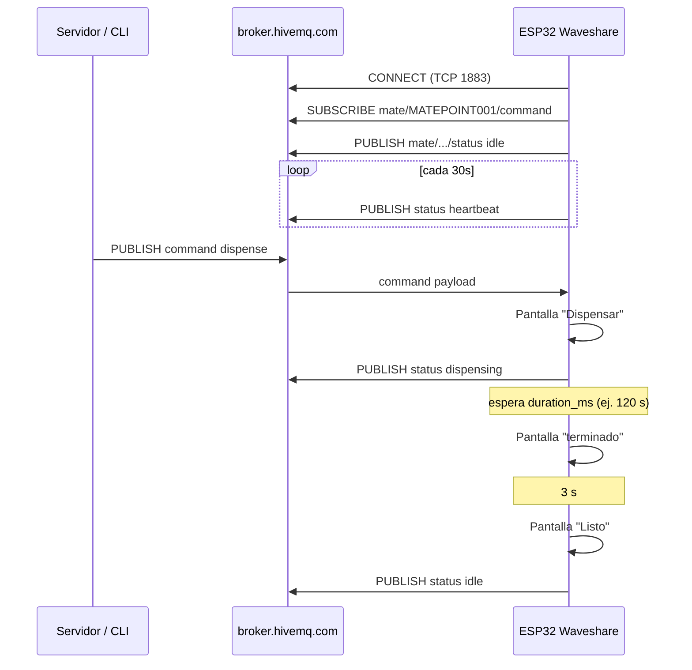

# Plan de implementación — Fase 4 (pasos 4.1, 4.2, 4.3)

**Documento temporal** — borrar o fusionar en `plan-de-implementacion.md` cuando se cierre la fase.  
**Alcance:** broker MQTT + contrato de topics + firmware Waveshare (Wi-Fi + MQTT + pantalla simulada, **sin UART Nobana**).  
**Fecha:** 2026-05-27  
**Device ID de referencia:** `MATEPOINT001`  
**Última actualización decisiones:** 2026-05-29  
**Estado POC 4.1–4.3:** **Completado** (2026-05-29) — firmware [`mate_point_v0-1/`](../mate_point_firmware/mate_point_v0-1/)  
**E2E Railway (4.3.1):** **Completado** (2026-05-29)  
**Próximo:** POC completa **v0.2** — ver [`plan-de-implementacion.md` § POC completa v0.2](../plan-de-implementacion.md#poc-completa-v02--comprar--qr--pago)

---

## Estado del POC (2026-05-29)

| Paso | Entregable | Estado |
|------|------------|--------|
| **4.1** | HiveMQ público (servidor + ESP32) | **Completado** |
| **4.2** | Topics `mate/MATEPOINT001/{command,status}` | **Completado** |
| **4.3** | Firmware `mate_point_v0-1` | **Completado** |
| **4.3.1** | E2E Railway (pago → pantalla) | **Completado** |
| **4.3.2** | POC completa v0.2 (Comprar → QR → pago/timeout) | **Próximo** |

**Implementación:** [`mate_point_firmware/mate_point_v0-1/`](../mate_point_firmware/mate_point_v0-1/) · spec [`mate_point_firmware/PLAN-IMPLEMENTACION.md`](../mate_point_firmware/PLAN-IMPLEMENTACION.md)

**Validado en hardware:**

- Demos Waveshare 06, 08, 13 + firmware Mate Point flasheable
- Wi‑Fi + MQTT HiveMQ; flujo pantalla Dispensar → terminado → Listo
- `status` MQTT (heartbeat 30 s, `dispensing` / `idle`)
- `command` vía CLI, backend y **E2E Railway** (pago sandbox → pantalla)

**Fuera del POC v0.1 (decisión equipo / no implementado):**

- UART Nobana (4.4+)
- Segundo `dispense` en curso → error en pantalla (tarea 4.3.15)

**Known issue (cosmético):** artefacto intermitente en labels footer WiFi/MQTT al primer connect (partial refresh LVGL RGB); label central siempre OK. Ver [`mate_point_firmware/PLAN-IMPLEMENTACION.md` §11](../mate_point_firmware/PLAN-IMPLEMENTACION.md).

**Siguiente hito:** **POC completa v0.2** (4.3.2) — [`plan-de-implementacion.md`](../plan-de-implementacion.md#poc-completa-v02--comprar--qr--pago). Luego UART 4.4+.

---

## Decisiones cerradas (equipo)

| # | Tema | Decisión |
|---|------|----------|
| 1 | Broker | **HiveMQ público** — `broker.hivemq.com:1883` (ESP32), WSS :8884 (servidor). Sin Mosquitto en 4.1. |
| 2 | Duración dispensado simulado | Usar **`duration_ms` del payload MQTT** (servidor: `DISPENSE_DURATION_MS`, default **120000** = 2 min). |
| 3 | Wi-Fi | Placeholders `TU_RED_AQUI` / `TU_CLAVE_AQUI` en `config.h`; el operador los completa antes de flashear. |
| 4 | Toolchain | **Arduino IDE** + paquete ESP32 + ejemplo oficial Waveshare 7B. |
| 5 | Segundo `dispense` en curso | **Fuera de alcance POC** (ignorar silenciosamente; ver [`PLAN-IMPLEMENTACION.md`](../mate_point_firmware/PLAN-IMPLEMENTACION.md)) |
| 6 | Heartbeat `status` | Cada **30 s** — último estado conocido |
| 7 | Post-“terminado” | Pantalla **“terminado”** → **3 s** → **“Listo”** → entonces **`status: idle`** |
| 8 | LVGL | **Completado** — base demo 13 + `mate_point_v0-1` |

---

## Resumen ejecutivo

| Paso | Objetivo en esta iteración | Entregable |
|------|---------------------------|------------|
| **4.1** | Broker accesible desde servidor y ESP32 | **Completado** — HiveMQ |
| **4.2** | Contrato `mate/{device_id}/command` y `…/status` | **Completado** |
| **4.3** | Firmware: LVGL + Wi‑Fi/MQTT + UI simulada | **Completado** — `mate_point_v0-1` |

Los pasos **4.4–4.10** (UART, dispensado real, watchdog) quedan **fuera** de este plan; el prototipo 4.3 **simula** el dispensado solo en pantalla y en MQTT.

---

## Contexto del repo (estado actual)

| Componente | Estado |
|------------|--------|
| Backend Railway + `mqtt.js` | Publica en `mate/MATEPOINT001/command` vía **WSS** `broker.hivemq.com:8884` |
| Broker en Fase 3 | **HiveMQ público** (no Mosquitto en el servidor) |
| Firmware en repo | **[`mate_point_firmware/mate_point_v0-1/`](../mate_point_firmware/mate_point_v0-1/)** |
| Topics canónicos | Prefijo **`mate/`** — ver `servidor-mate-point.md` §9 |
| `arquitectura-mate-point.md` §4.1 | Topics `matepoint/…` — **legacy Fase 5**; POC usa `mate/` |

**Decisión de alineación:** usar prefijo **`mate/`** (igual que `servidor/src/services/mqtt.js` y `servidor-mate-point.md` §9).

---

## Alcance funcional acordado (4.3)

1. Al recibir `mate/{device_id}/command` con `cmd: "dispense"`:
   - Pantalla: **"Dispensar"**
   - Timer = **`duration_ms`** del JSON (ej. 120000 ms desde servidor)
   - Al vencer: **"terminado"** → 3 s → **"Listo"**
   - *(Sin UART Nobana en esta iteración.)*
2. Si llega otro `dispense` mientras ya está dispensando: pantalla **error** (ej. *"Ocupado"* / *"Error"*).
3. Publicar `mate/{device_id}/status` cada **30 s** y en transiciones (`idle` / `dispensing` / `error`).
4. Footer en pantalla: `Wifi: Conectado` / `MQTT: conectado` (o variantes de fallo).
5. Wi-Fi: SSID/clave en **`config.h`** con placeholders hasta que el operador los reemplace.

---

## Paso 4.1 — Broker MQTT

### 4.1.1 Qué significa “4.1” hoy

El `plan-de-implementacion.md` original menciona **Mosquitto en el servidor backend**. En la práctica la **Fase 3 ya eligió HiveMQ público**:

| Cliente | URL / host | Puerto | Protocolo |
|---------|------------|--------|-----------|
| Servidor (Node, Railway) | `wss://broker.hivemq.com:8884/mqtt` | 8884 | MQTT sobre WebSocket |
| ESP32-S3 (Waveshare) | `broker.hivemq.com` | **1883** | MQTT TCP sin TLS |

**Decisión equipo:** mantener **HiveMQ público**; no instalar Mosquitto en 4.1. Validar conectividad TCP 1883 y documentar. Mosquitto / HiveMQ Cloud queda para producción (TLS + credenciales).

### 4.1.2 Tareas paso a paso

| # | Tarea | Cómo verificar |
|---|--------|----------------|
| 1 | Confirmar en Railway: `MQTT_BROKER_URL`, `MQTT_DEVICE_ID=MATEPOINT001` | `GET /health` → `"mqtt": "connected"` |
| 2 | Desde laptop, probar **TCP 1883** al mismo broker | `mosquitto_sub -h broker.hivemq.com -p 1883 -t 'mate/MATEPOINT001/#' -v` |
| 3 | Publicar un `command` de prueba por TCP | Ver §4.2 — payload de prueba |
| 4 | Documentar en README del firmware: host `broker.hivemq.com`, puerto `1883`, sin user/pass en POC | — |
| 5 | *(Opcional)* Actualizar `plan-de-implementacion.md` fila 4.1: “HiveMQ público (POC)” en lugar de solo Mosquitto | Evita confusión futura |

### 4.1.3 Criterio de aceptación 4.1

- [x] `mosquitto_sub` en la misma red que el ESP32 recibe mensajes publicados por el servidor (o por CLI).
- [x] El ESP32 conecta por TCP 1883 al mismo host (ver 4.3).
- [x] Documentado broker POC (HiveMQ) vs producción futura.

### 4.1.4 Mosquitto (solo si más adelante lo piden)

Si en algún momento se requiere broker propio:

1. Instalar Mosquitto en VPS o contenedor Docker.
2. Abrir puerto 1883 (o 8883 con certificado).
3. Cambiar `MQTT_BROKER_URL` en Railway y `MQTT_BROKER_HOST` en firmware.
4. El ESP32 seguiría en TCP; el servidor podría usar `mqtt://` en lugar de WSS.

---

## Paso 4.2 — Definición de topics y payloads

### 4.2.1 Topics canónicos

| Topic | Dirección | QoS sugerido | Retain |
|-------|-----------|--------------|--------|
| `mate/{device_id}/command` | Servidor → ESP32 | **1** | `false` |
| `mate/{device_id}/status` | ESP32 → Servidor | **0** o **1** | `false` |

Con `device_id = MATEPOINT001`:

- Subscribe (ESP32): `mate/MATEPOINT001/command`
- Publish (ESP32): `mate/MATEPOINT001/status`

> **Nota:** el servidor **no** se suscribe a `status` en el POC actual; los mensajes igual sirven para depuración con `mosquitto_sub` y para Fase 6 (logging).

### 4.2.2 Payload `command` (servidor → ESP32)

Ya implementado en `servidor/src/services/mqtt.js`:

```json
{
  "cmd": "dispense",
  "duration_ms": 120000,
  "order_id": "ORDTST01...",
  "ts": 1748369220000
}
```

| Campo | Tipo | Obligatorio | Uso en 4.3 |
|-------|------|-------------|------------|
| `cmd` | string | sí | Solo procesar si `cmd == "dispense"` |
| `duration_ms` | number | sí (default servidor 120000) | Timer de pantalla “Dispensar” → “terminado” |
| `order_id` | string | no | Log en Serial; opcional en pantalla |
| `ts` | number | no | Ignorar o usar para log |

### 4.2.3 Payload `status` (ESP32 → servidor / monitoreo)

**Mínimo para 4.3** (alineado con `servidor-mate-point.md`):

```json
{
  "device_id": "MATEPOINT001",
  "state": "idle",
  "ts": 1748368961000
}
```

**Estados `state` en esta iteración:**

| `state` | Cuándo publicar |
|---------|-----------------|
| `idle` | Boot, tras “terminado”, entre ciclos |
| `dispensing` | Al entrar en “Dispensar” (recibido `command`) |
| `error` | Wi-Fi o MQTT caído tras timeout (opcional en 4.3) |

**Campos recomendados** (no bloquean el POC):

```json
{
  "device_id": "MATEPOINT001",
  "state": "dispensing",
  "ts": 1748368961000,
  "uptime_ms": 123456,
  "wifi_rssi": -58,
  "mqtt_connected": true,
  "order_id": "ORDTST01..."
}
```

### 4.2.4 Periodicidad de `status` (heartbeat)

Propuesta por defecto (ajustable):

| Evento | Acción |
|--------|--------|
| Cada **30 s** en `loop` si MQTT conectado | `publish` `state: idle` (o último estado conocido) |
| Al conectar MQTT | `publish` `idle` + log Serial |
| Al recibir `dispense` | `publish` `dispensing` |
| Al terminar `duration_ms` | `publish` `idle` tras mostrar “terminado” y volver a “Listo” |
| Segundo `dispense` en curso | `publish` `error` (recomendado) + pantalla mensaje de error |

### 4.2.5 Tareas paso a paso 4.2

| # | Tarea |
|---|--------|
| 1 | Fijar en un único doc (este + `servidor-mate-point.md`) el prefijo `mate/` |
| 2 | Marcar `arquitectura-mate-point.md` §4.1 como pendiente de actualizar `matepoint/` → `mate/` |
| 3 | Escribir payloads de prueba en un snippet (abajo) |
| 4 | Probar round-trip **sin ESP32**: CLI publish `command` → otro terminal no aplica; con ESP32: sub + pantalla |
| 5 | Definir si el servidor en el futuro hará `subscribe` a `status` (Fase 6) — fuera de 4.2 |

### 4.2.6 Comandos de prueba (CLI)

Terminal A — escuchar todo el dispositivo:

```bash
mosquitto_sub -h broker.hivemq.com -p 1883 -t 'mate/MATEPOINT001/#' -v
```

Terminal B — simular webhook (dispense):

```bash
mosquitto_pub -h broker.hivemq.com -p 1883 \
  -t 'mate/MATEPOINT001/command' \
  -m '{"cmd":"dispense","duration_ms":120000,"order_id":"TEST-CLI","ts":1748369220000}'
```

Prueba rápida (10 s en pantalla):

```bash
mosquitto_pub -h broker.hivemq.com -p 1883 \
  -t 'mate/MATEPOINT001/command' \
  -m '{"cmd":"dispense","duration_ms":10000,"order_id":"TEST-QUICK"}'
```

Esperado con ESP32 online: `status` con `dispensing` → tras `duration_ms` → `idle`; pantalla Dispensar → terminado → (3 s) Listo. Segundo `dispense` durante ciclo → error en pantalla.

---

## Paso 4.3 — Firmware Waveshare (MQTT + pantalla simulada)

### 4.3.0 Fase previa obligatoria — ejemplo LVGL (Arduino IDE)

Como **aún no hay ejemplo LVGL compilando**, este bloque va **antes** de Wi-Fi/MQTT:

| # | Tarea | Detalle |
|---|--------|---------|
| 0.1 | Instalar **Arduino IDE** 2.x | — |
| 0.2 | Board Manager: **esp32** by Espressif (≥ 3.0.0) | Placa: **ESP32S3 Dev Module** — Flash 16 MB, PSRAM OPI según wiki 7B |
| 0.3 | Descargar ejemplos Waveshare 7B | [Wiki ESP32-S3-Touch-LCD-7B](https://www.waveshare.com/wiki/ESP32-S3-Touch-LCD-7B) → ejemplo **LVGL** (p. ej. `07_lvgl_port` o el indicado en la wiki actual) |
| 0.4 | Instalar librerías del ejemplo | `ESP32_Display_Panel`, `ESP32_IO_Expander`, `lvgl` 8.3.x — versiones que indique el ZIP de Waveshare |
| 0.5 | Copiar `lv_conf.h` / `ESP_Panel_Conf.h` del ejemplo | Sin esto la pantalla no arranca |
| 0.6 | Compilar y flashear | USB-C, puerto serial correcto, **115200** en monitor |
| 0.7 | Criterio de salida | Pantalla 1024×600 encendida con demo LVGL; touch opcional pero deseable |

Solo cuando 0.7 pase → crear sketch **MatePoint** (fork del ejemplo, no proyecto vacío).

### 4.3.1 Stack acordado

| Pieza | Elección | Motivo |
|-------|----------|--------|
| Toolchain | **Arduino IDE** | Decisión equipo |
| Base | Sketch derivado del **ejemplo LVGL Waveshare 7B** | Evita reconfigurar panel RGB desde cero |
| Display | **ESP32_Display_Panel** + **LVGL 8.3** | Igual que Fase 5 |
| Wi-Fi | `WiFi.h` | Placeholders en `config.h` |
| MQTT | **PubSubClient** | TCP 1883 → HiveMQ público |
| JSON | **ArduinoJson** v7 | `command` + `status` |
| Timer dispensado | `lv_timer` + `duration_ms` del payload | No bloquear `loop` / MQTT |

### 4.3.2 Estructura de proyecto (carpeta en repo)

```
mate_point_firmware/          ← sketch Arduino (o subcarpeta del ejemplo clonado)
├── mate_point_firmware.ino   ← setup/loop, orquestación
├── config.h                  ← WIFI_*, MQTT_*, DEVICE_ID, STATUS_INTERVAL_MS
├── wifi_connect.h / .cpp   ← opcional: separar en .cpp si el .ino crece
├── mqtt_client.h / .cpp
├── display_ui.h / .cpp       ← labels Wifi / MQTT / mensaje central
└── dispense_sim.h / .cpp     ← estados + duration_ms + error si ocupado
```

Librerías LVGL/panel: gestionadas por **Library Manager** / ZIP Waveshare (como el ejemplo 0.x).

### 4.3.3 `config.h` (placeholders — completar antes de flashear)

```c
#pragma once

#define DEVICE_ID           "MATEPOINT001"

#define WIFI_SSID           "TU_RED_AQUI"
#define WIFI_PASSWORD       "TU_CLAVE_AQUI"

#define MQTT_HOST           "broker.hivemq.com"
#define MQTT_PORT           1883
// #define MQTT_USER        ""   // vacío en HiveMQ público
// #define MQTT_PASS        ""

#define TOPIC_COMMAND       "mate/" DEVICE_ID "/command"
#define TOPIC_STATUS        "mate/" DEVICE_ID "/status"

#define STATUS_INTERVAL_MS      30000
#define TERMINADO_TO_LISTO_MS   3000    // tras "terminado" → "Listo"

// duration_ms viene del payload MQTT (no constante fija)
// Servidor: DISPENSE_DURATION_MS=120000 por defecto

#define MQTT_CLIENT_ID      "mate-" DEVICE_ID "-esp32"
```

### 4.3.4 Flujo de arranque

```
power-on
  → init display (LVGL + panel Waveshare)
  → pantalla: "Iniciando..."
  → WiFi.begin(SSID, PASS) — hardcoded
       ├─ OK  → label "Wifi: Conectado" + IP en Serial
       └─ FAIL → "Wifi: Error" + reintento cada 5 s
  → MQTT connect + subscribe TOPIC_COMMAND
       ├─ OK  → "MQTT: conectado"
       └─ FAIL → "MQTT: error" + reintento
  → publish status { state: "idle" }
  → pantalla reposo: mensaje neutro (ej. "Listo") + barra Wifi/MQTT
```

### 4.3.5 Flujo al recibir `command`

```
MQTT callback (topic command, payload JSON)
  → parse cmd, duration_ms, order_id
  → if cmd != "dispense" → ignorar
  → if ya dispensing:
       → UI: mensaje error (ej. "Ocupado")
       → publish status { state: "error" }  (recomendado)
       → return (no reiniciar timer)
  → UI: "Dispensar"
  → publish status { state: "dispensing", order_id }
  → iniciar timer duration_ms (del JSON; si falta, usar 120000)
  → [NO UART en 4.3]

timer expired (duration_ms)
  → UI: "terminado"
  → publish status { state: "idle" }
  → iniciar timer 3 s (TERMINADO_TO_LISTO_MS)
  → UI: "Listo"
```

**Máquina de estados UI (simplificada):**

| Estado interno | Pantalla central | `status.state` |
|----------------|------------------|----------------|
| `UI_LISTO` | Listo | `idle` |
| `UI_DISPENSING` | Dispensar | `dispensing` |
| `UI_ERROR` | Ocupado / Error | `error` |
| `UI_TERMINADO` | terminado | `idle` (o transitorio) |

### 4.3.6 Layout de pantalla (mínimo viable)

Resolución **1024×600**. Propuesta simple (sin QR aún):

```
┌────────────────────────────────────────────┐
│  Mate Point — POC Fase 4                   │  ← título opcional
│                                            │
│           [  Dispensar  ]                  │  ← label grande centrado
│              (o "terminado" / "Listo")     │
│                                            │
│  Wifi: Conectado                           │  ← inferior izquierda
│  MQTT: conectado                           │
└────────────────────────────────────────────┘
```

Implementación LVGL: dos `lv_label` fijos abajo + un `lv_label` central grande; funciones `ui_set_wifi_status()`, `ui_set_mqtt_status()`, `ui_set_main_message(const char*)`.

### 4.3.7 Loop principal (pseudo-código)

```cpp
void loop() {
  wifi_loop();           // reconectar si cayó
  if (wifi_ok) {
    if (!mqtt.connected()) mqtt_reconnect();
    mqtt.loop();
  }
  if (millis() - last_status > STATUS_INTERVAL_MS) {
    publish_status(current_state);
    last_status = millis();
  }
  dispense_sim_tick();   // duration_ms, terminado→Listo 3s, error timeout
  lv_timer_handler();    // LVGL
  delay(5);
}
```

### 4.3.8 Tareas paso a paso 4.3 (orden recomendado)

| Fase | # | Tarea | Verificación |
|------|---|--------|--------------|
| **0** | 1–7 | §4.3.0 — ejemplo LVGL Waveshare en Arduino IDE | **Completado** |
| A | 8 | Sketch `mate_point_v0-1` + `config.h` | **Completado** |
| A | 9 | UI mínima: labels Wifi / MQTT / mensaje central | **Completado** |
| B | 10 | Wi‑Fi + reconexión | **Completado** |
| B | 11 | MQTT PubSubClient + subscribe | **Completado** |
| C | 12 | `publish_status()` heartbeat + transiciones | **Completado** |
| C | 13 | Callback parse `dispense` + dedup | **Completado** |
| D | 14 | `dispense_sim`: ciclo completo | **Completado** |
| D | 15 | Segundo `dispense` → error | **Fuera de alcance POC** |
| E | 16 | E2E Railway | **Completado** |
| E | 17 | Reconexión Wi‑Fi | **Completado** |

### 4.3.9 Criterios de aceptación 4.3

- [x] Ejemplo LVGL Waveshare compila y corre (Fase 0).
- [x] `Wifi: Conectado` y `MQTT: conectado` con HiveMQ público.
- [x] `mosquitto_sub` recibe `status` cada **30 s** y en transiciones.
- [x] `command` con `dispense` muestra **Dispensar** durante **`duration_ms`** del payload.
- [x] Al vencer el timer: **terminado** → 3 s → **Listo**; `state: idle` publicado tras los 3 s.
- [x] Dedup por `order_id`.
- [x] Serial **115200**: trazas de Wi-Fi, MQTT, payload y estados.
- [x] **E2E Railway** (4.3.1): pago sandbox → webhook → MQTT → pantalla.
- [ ] Segundo `dispense` en curso → error en pantalla — **fuera de alcance POC v0.1**.

### 4.3.10 Librerías Arduino IDE (además del ejemplo Waveshare)

Instalar vía **Library Manager** o ZIP:

| Librería | Uso |
|----------|-----|
| `PubSubClient` | MQTT TCP 1883 |
| `ArduinoJson` | Parse/publicación JSON |
| *(del ejemplo)* `ESP32_Display_Panel`, `lvgl`, `ESP32_IO_Expander` | Pantalla 7B |

En el `.ino`, antes de `#include <PubSubClient.h>`:

```cpp
#define MQTT_MAX_PACKET_SIZE 512
```

### 4.3.11 Riesgos conocidos

| Riesgo | Mitigación |
|--------|------------|
| LVGL + Wi-Fi + MQTT en un solo core → flicker | Buffers LVGL en SRAM; `lv_timer_handler` frecuente; ver `modulo-waveshare-esp32s3-touch-7b.md` §4 |
| PubSubClient buffer pequeño | `#define MQTT_MAX_PACKET_SIZE 512` antes de incluir PubSubClient |
| Payload `command` > 256 B | Aumentar buffer o acortar campos en pruebas |
| Prueba E2E larga (120 s default) | Para desarrollo, `mosquitto_pub` con `"duration_ms":10000` |
| Sin ejemplo LVGL previo | Bloquear MQTT hasta completar §4.3.0 |

---

## Pruebas de integración (4.1 + 4.2 + 4.3)

### Escenario 1 — Solo CLI (sin backend)

1. Flashear ESP32 con firmware 4.3.
2. `mosquitto_sub -t 'mate/MATEPOINT001/#' -v`
3. `mosquitto_pub` → `command` con `dispense`.
4. Observar pantalla + mensajes `status`.

### Escenario 2 — Backend Railway

1. ESP32 en la misma red Wi-Fi que permita salida a Internet (puerto 1883).
2. Pago sandbox Mercado Pago → webhook → servidor publica `command`.
3. Confirmar misma secuencia que Escenario 1.

### Escenario 3 — Health del servidor (sin ESP32)

```bash
curl https://<tu-app>.up.railway.app/health
# mqtt: connected
```

---

## Diagrama de secuencia (POC 4.3)



---

## Consultas — resueltas (2026-05-27)

Ver tabla **Decisiones cerradas** al inicio del documento. No quedan preguntas bloqueantes para empezar **Fase 0 (LVGL)**.

---

## Después de 4.3 (referencia)

| Paso | Contenido | Estado |
|------|-----------|--------|
| **4.3.2** | POC completa v0.2: Comprar → QR → pago / timeout 2 min | **Próximo** — [`plan-de-implementacion.md`](../plan-de-implementacion.md#poc-completa-v02--comprar--qr--pago) |
| 4.4 | UART2 → TXS0108E → Nobana | Pendiente |
| 4.5–4.6 | `dispense` real con `duration_ms` y STOP UART | Pendiente |
| 4.7 | Alinear `status` con máquina de estados completa | Pendiente |
| 4.8–4.9 | Watchdog UART + temperatura | Pendiente |
| 5.x | UX completa (5 pantallas), NVS Wi-Fi | Post v0.2 |

---

## Checklist rápido antes de codificar

- [x] Decisiones de broker, duration_ms, toolchain, UI, heartbeat  
- [x] Arduino IDE + board ESP32-S3 instalados  
- [x] Ejemplo LVGL Waveshare 7B compila (§4.3.0)  
- [x] `config.h`: Wi‑Fi configurado para entorno de prueba  
- [x] `mosquitto_sub` / visibilidad MQTT  
- [x] Cable USB-C al Waveshare + monitor serie 115200  
- [x] Topics: `mate/MATEPOINT001/{command,status}`  
- [x] Firmware `mate_point_v0-1` en repo

---

*Documento temporal — POC 4.1–4.3 + E2E Railway cerrados 2026-05-29. Próximo: POC v0.2 en `plan-de-implementacion.md`. Fusionar al cerrar UART (4.4+).*
