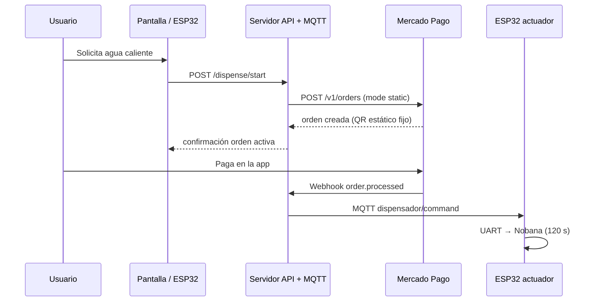

# Mate Point — Integración Mercado Pago (Código QR)

**Proyecto:** Dispensador de agua caliente (prototipo ESP32)  
**OT:** OT-00268 — Etapa 3  
**Aplicación MP:** Mate point  
**Repositorio:** [github.com/digifab-ar/Mate-Point-v1](https://github.com/digifab-ar/Mate-Point-v1)  
**Servidor:** `https://mate-point-v1-production.up.railway.app` — ver [`servidor-mate-point.md`](servidor-mate-point.md)  
**Última actualización:** 2026-05-27

---

## 0. Parámetros del servicio (Fase 0)

| Parámetro | Valor | Notas |
|-----------|-------|-------|
| **Precio de venta** | **$ 500,00 ARS** | `total_amount` y `unit_price` en órdenes MP |
| **Tiempo de dispensado** | **120 s (120 000 ms)** | `duration_ms` en payload MQTT `command` |
| **`device_id`** | **`MATEPOINT001`** | Variable `DEVICE_ID` en `.env`; topic MQTT y `external_store_id` |

> Parámetros definidos en Fase 0 — 2026-05-27. Ver criterios de aceptación en `plan-de-implementacion.md` §Fase 0.

### 0.1 Estado de implementación (2026-05-27)

| Componente | Estado | Detalle |
|------------|--------|---------|
| App MP + sucursal + caja | **Completado** | §3, §4 |
| Usuario comprador sandbox | **Completado** | `TESTUSER8425831211451822431` (id `3431137704`) |
| Órdenes QR `mode: static` (Postman) | **Completado** | Monto mínimo MP: $ 15 → precio POC **$ 500,00** |
| Pago + GET orden `processed/accredited` | **Completado** | Ej.: `ORDTST01KSNCYH61MNGYP5Q27G0Y5RJD`, ref. `mate-001-20260527-002` |
| Backend Railway | **Desplegado** | `mate-point-v1-production.up.railway.app` |
| Webhook MP (modo prueba) | **Recibiendo** | URL §7; evento **Order**; `action: order.processed`; respuesta **200** |
| Validación `x-signature` | **Pendiente** | Código esqueleto en `servidor/` |
| MQTT `dispense` al pagar | **Pendiente** | Broker definido; publicación en webhook pendiente |
| Firmware ESP32 / UART Nobana | **Pendiente** | Fases 4–5 |

**Próximo hito:** completar handler del webhook (firma → MQTT) y probar `mqtt_published` en logs Railway.

---

## 1. Objetivo

Integrar pagos presenciales con **Código QR** de Mercado Pago para autorizar el dispensado de agua caliente. El flujo objetivo:

1. El usuario solicita una porción en la máquina.
2. El backend crea una **order** QR en Mercado Pago.
3. El usuario paga escaneando el QR con la app de Mercado Pago.
4. Mercado Pago notifica al servidor (**webhook**).
5. El servidor publica un comando **MQTT** al **ESP32**, que activa válvula/calentador por un tiempo definido.

> El ESP32 **no** debe almacenar ni usar el Access Token de Mercado Pago.

---

## 2. Arquitectura



| Componente | Rol |
|------------|-----|
| App **Mate point** (MP Developers) | Credenciales, webhooks, integración QR |
| **Backend** | Crear órdenes, validar webhooks, MQTT |
| **Broker MQTT** | Mosquitto local/cloud, AWS IoT, etc. |
| **ESP32** | UI opcional, MQTT, GPIO → relay |

---

## 3. Configuración en Mercado Pago Developers

### 3.1 Aplicación creada

| Campo | Valor |
|-------|--------|
| Nombre | Mate point |
| Tipo de pago | Pagos offline (presenciales) |
| Producto | Código QR |
| Site | MLA (Argentina) |

Documentación: [Crear aplicación QR](https://www.mercadopago.com.ar/developers/es/docs/qr-code/create-application)

### 3.2 Credenciales

- **Pruebas:** Mate point → Pruebas → Credenciales de prueba → Access Token  
- **Producción:** activar cuando el flujo en sandbox esté validado  

| Campo | Valor |
|-------|-------|
| **N.° de aplicación** | `1272800408606917` |
| **User ID (vendedor sandbox)** | `3420512522` |
| **Usuario de prueba (vendedor)** | `TESTUSER3251233388494141920` |
| **Usuario de prueba (comprador)** | `TESTUSER8425831211451822431` (id: `3431137704`) |

> No commitear tokens. Usar variables de entorno (`.env` en `.gitignore`).  
> El usuario **vendedor** es el que posee la caja y recibe el pago. El usuario **comprador** es el que escanea el QR y paga — deben ser cuentas distintas.

---

## 4. Sucursal y caja (POS) — Alta completada

### 4.1 Sucursal (Store)

| Campo | Valor |
|-------|--------|
| **id** (MP) | `77230109` |
| **name** | Mate point - Casa |
| **external_id** | `MATEPOINT001` |
| **status** | `active` |
| **user_id** | `3420512522` |

**Domicilio registrado**

| Campo | Valor |
|-------|--------|
| Calle | Santamarina 1352 |
| Ciudad API (`city_name`) | `San Fernando` *(obligatorio: valor de lista MP; "Victoria" no es válido)* |
| Provincia | Buenos Aires |
| Referencia | Victoria - Santamarina 1352 - prototipo dispensador |
| Latitud | -34.4568 |
| Longitud | -58.5612 |
| ZIP (MP) | B1645DXY |

### 4.2 Caja (POS)

| Campo | Valor |
|-------|--------|
| **id** (MP) | `132339357` |
| **name** | Mate point - Dispensador 1 |
| **external_id** | `MATEPOINT001POS001` → usar como **`external_pos_id`** en órdenes |
| **external_store_id** | `MATEPOINT001` |
| **store_id** | `77230109` |
| **fixed_amount** | `true` |
| **category** | `621102` (gastronomía) |
| **status** | `active` |

**QR estático de la caja**

- Imagen: `https://www.mercadopago.com/instore/merchant/qr/132339357/5507995c943b40ea96c23d3b511b5bb3ad50efc5a5b940f39a305d7a5d413839.png`
- PDF plantilla: mismo path con `template_...pdf`
- **uuid:** `5507995c943b40ea96c23d3b511b5bb3ad50efc5a5b940f39a305d7a5d413839`

---

## 5. API — Referencia Postman

### 5.1 Crear sucursal

| | |
|--|--|
| **Método** | `POST` |
| **URL** | `https://api.mercadopago.com/users/3420512522/stores` |
| **Headers** | `Content-Type: application/json`, `Authorization: Bearer {ACCESS_TOKEN}` |

```json
{
  "name": "Mate point - Casa",
  "external_id": "MATEPOINT001",
  "location": {
    "street_number": "1352",
    "street_name": "Santamarina",
    "city_name": "San Fernando",
    "state_name": "Buenos Aires",
    "latitude": -34.4568,
    "longitude": -58.5612,
    "reference": "Victoria - Santamarina 1352 - prototipo dispensador"
  },
  "business_hours": {
    "monday": [{"open": "08:00", "close": "22:00"}],
    "tuesday": [{"open": "08:00", "close": "22:00"}],
    "wednesday": [{"open": "08:00", "close": "22:00"}],
    "thursday": [{"open": "08:00", "close": "22:00"}],
    "friday": [{"open": "08:00", "close": "22:00"}],
    "saturday": [{"open": "09:00", "close": "20:00"}],
    "sunday": [{"open": "10:00", "close": "18:00"}]
  }
}
```

**Nota:** `city_name` debe coincidir exactamente con la lista que devuelve MP en errores de validación (ej. `San Fernando`, no `Victoria`).

Doc: [Crear sucursal y caja](https://www.mercadopago.com.ar/developers/es/docs/qr-code/create-store-and-pos)

---

### 5.2 Crear caja (POS)

| | |
|--|--|
| **Método** | `POST` |
| **URL** | `https://api.mercadopago.com/pos` |
| **Headers** | Igual que sucursal |

```json
{
  "name": "Mate point - Dispensador 1",
  "fixed_amount": true,
  "store_id": 77230109,
  "external_store_id": "MATEPOINT001",
  "external_id": "MATEPOINT001POS001",
  "category": 621102
}
```

Reglas:

- `external_id` de la caja: solo alfanumérico, máx. 40 caracteres, sin guiones.
- `store_id` numérico, sin comillas en JSON.

---

### 5.3 Crear orden (cobro QR)

| | |
|--|--|
| **Método** | `POST` |
| **URL** | `https://api.mercadopago.com/v1/orders` |
| **Headers** | `Content-Type`, `Authorization`, **`X-Idempotency-Key`** (único por request) |

Usa el QR fijo impreso de la caja (`MATEPOINT001POS001`). Tras crear la orden, el cliente escanea ese mismo QR. El QR no cambia entre transacciones.

```json
{
  "type": "qr",
  "total_amount": "500.00",
  "description": "Agua caliente - 1 porcion",
  "external_reference": "mate-001-YYYYMMDD-NN",
  "expiration_time": "PT10M",
  "config": {
    "qr": {
      "external_pos_id": "MATEPOINT001POS001",
      "mode": "static"
    }
  },
  "transactions": {
    "payments": [{ "amount": "500.00" }]
  },
  "items": [
    {
      "title": "Agua caliente",
      "unit_price": "500.00",
      "quantity": 1,
      "unit_measure": "unit",
      "external_code": "AGUA001"
    }
  ]
}
```


Doc: [Procesamiento de pagos QR](https://www.mercadopago.com.ar/developers/es/docs/qr-code/payment-processing)

---

### 5.4 Postman — Request completo (Fase 2, QR estático)

#### Configuración del request

| Campo | Valor |
|-------|-------|
| **Método** | `POST` |
| **URL** | `https://api.mercadopago.com/v1/orders` |
| **Header** `Content-Type` | `application/json` |
| **Header** `Authorization` | `Bearer <ACCESS_TOKEN_SANDBOX>` |
| **Header** `X-Idempotency-Key` | `{{$guid}}` — Postman genera un UUID automático por request |

> **Dónde obtener el Access Token sandbox:** [mercadopago.com.ar/developers](https://www.mercadopago.com.ar/developers/panel/app) → App "Mate point" → Credenciales de prueba → Access Token.

#### Body (raw JSON)

```json
{
  "type": "qr",
  "total_amount": "500.00",
  "description": "Agua caliente - 1 porcion",
  "external_reference": "mate-001-20260527-001",
  "expiration_time": "PT10M",
  "config": {
    "qr": {
      "external_pos_id": "MATEPOINT001POS001",
      "mode": "static"
    }
  },
  "transactions": {
    "payments": [{ "amount": "500.00" }]
  },
  "items": [
    {
      "title": "Agua caliente",
      "unit_price": "500.00",
      "quantity": 1,
      "unit_measure": "unit",
      "external_code": "AGUA001"
    }
  ]
}
```

> **`external_reference`:** cambiar el sufijo (`-001`, `-002`, …) en cada prueba. Sirve para correlacionar la orden con el dispensado en el backend. Formato sugerido: `mate-001-YYYYMMDD-NNN`.

#### Respuesta esperada (HTTP 200 / 201)

```json
{
  "id": "<order_id>",
  "status": "created",
  "external_reference": "mate-001-YYYYMMDD-NNN",
  "total_amount": "500.00",
  "config": {
    "qr": {
      "external_pos_id": "MATEPOINT001POS001",
      "mode": "static"
    }
  }
}
```

> Guardar `id` (orden) — se usa para verificar el estado con `GET /v1/orders/{id}` y se recibe también en el payload del webhook.

**Orden de prueba creada — 2026-05-27:**

| Campo | Valor |
|-------|-------|
| `id` | `ORDTST01KSN8G14TKMBSTCF1G4TXJ355` |
| `status` inicial | `created` / `status_detail: created` |
| `payments[0].status` inicial | `created` / `status_detail: ready_to_process` |
| `status` tras pago | **`processed`** / `status_detail: accredited` ✅ |
| `payments[0].status` tras pago | **`processed`** / `status_detail: accredited` ✅ |
| `external_reference` | `mate-001-20260527-001` |
| `transactions.payments[0].id` | `PAY01KSN8G15GX0ANCWTFANVSTYXB` |
| `payments[0].reference_id` | `160458130233` (ID del pago en sistema MP) |
| `payments[0].payment_method` | `account_money` (saldo en cuenta MP) |
| `user_id` | `3420512522` |
| `application_id` | `1272800408606917` |

> **Nota v1/orders — estados reales (diferencia con docs antiguas):**
> - Status inicial: `"created"` (no `"open"`)
> - Status tras pago: `"processed"` / `"accredited"` (no `"approved"`)
> - En el webhook y en el `GET /v1/orders` buscar `status: "processed"` y `status_detail: "accredited"`

**Request de verificación (Paso 2.2):**

```
GET https://api.mercadopago.com/v1/orders/ORDTST01KSN8G14TKMBSTCF1G4TXJ355
Authorization: Bearer <ACCESS_TOKEN_SANDBOX>
```

#### Configurar `X-Idempotency-Key` automático en Postman

En la pestaña **Pre-request Script** del request, pegar:

```javascript
pm.request.headers.add({
    key: "X-Idempotency-Key",
    value: pm.variables.replaceIn("{{$guid}}")
});
```

Así Postman genera un UUID distinto en cada ejecución sin tener que cambiarlo a mano.

---

### 5.5 Cómo escanear el QR estático con la app de MercadoPago (sandbox)

El QR físico de la caja es fijo y no cambia entre transacciones. El flujo correcto es:

**Paso 1 — Crear cuenta de prueba compradora**

> ⚠️ **Token requerido: PRODUCCIÓN, no sandbox.** El endpoint `/users/test` exige el Access Token de tu cuenta real de desarrollador. Usar el token de sandbox devuelve `code: 40311 — the caller.id must be a productive user`.
>
> Obtenerlo en: Portal MP Developers → App "Mate point" → **Producción** → Credenciales de producción → Access Token.

En Postman:

| Campo | Valor |
|-------|-------|
| **Método** | `POST` |
| **URL** | `https://api.mercadopago.com/users/test` |
| **Header** `Authorization` | `Bearer <ACCESS_TOKEN_PRODUCCIÓN>` |
| **Header** `Content-Type` | `application/json` |
| **Body** | raw → **`JSON`** (no `Text`): `{ "site_id": "MLA", "description": "Comprador prototipo Mate Point" }` |
| ⚠️ **Quitar** `Content-Type` manual | Con body en modo `JSON`, Postman lo agrega automáticamente — tenerlos los dos genera conflicto |

La respuesta incluye `email` y `password` de la cuenta de prueba. Guardarlos — se usan para iniciar sesión en la app MP del celular.

**Cuenta compradora creada (2026-05-27):**

| Campo | Valor |
|-------|-------|
| `id` | `3431137704` |
| `nickname` | `TESTUSER8425831211451822431` |
| `email` (patrón MP) | `test_user_3431137704@testuser.com` *(verificar en respuesta completa)* |
| `password` | *(guardado localmente — no versionar)* |
| `site_status` | `active` |

> Si el campo `email` no apareció en la respuesta de Postman, el patrón estándar de MP es `test_user_{id}@testuser.com`.

**Paso 2 — Iniciar sesión en la app con la cuenta compradora**

> ⚠️ La app debe estar logueada con la cuenta de prueba **compradora**, **no** con la cuenta del desarrollador/vendedor.

1. Instalar la app de MercadoPago en el celular (iOS o Android).
2. Cerrar sesión de la cuenta real si estaba abierta.
3. Iniciar sesión con el `email` y `password` de la cuenta de prueba creada en el Paso 1.

**Paso 3 — Obtener el QR para escanear**

Dos opciones:

| Opción | Cómo |
|--------|------|
| **A — Desde pantalla** | Abrir en el navegador del PC: `https://www.mercadopago.com/instore/merchant/qr/132339357/5507995c943b40ea96c23d3b511b5bb3ad50efc5a5b940f39a305d7a5d413839.png` y escanear con el celular |
| **B — Impreso** | Descargar la imagen e imprimirla; escanear normalmente |

**Paso 4 — Orden primero, luego escanear**

> ⚠️ **Orden crítico:** la orden debe estar creada (Postman, Paso 2.1) **antes** de escanear el QR. MP vincula la orden pendiente al QR estático de la caja en el momento del escaneo. Si no hay orden `open`, MP muestra un error o no devuelve monto.

1. Ejecutar el request del §5.4 en Postman → verificar `"status": "created"` y `payments[0].status_detail: "ready_to_process"`.
2. Inmediatamente escanear el QR con la app (antes de que expire `PT10M`).

**Paso 5 — Pagar en la app**

1. La app mostrará: **"Agua caliente - $ 500,00"** con los datos de la orden.
2. Tocar **Pagar**.
3. La cuenta de prueba tiene saldo virtual — el pago se aprueba automáticamente.

**Paso 6 — Verificar el estado de la orden**

```
GET https://api.mercadopago.com/v1/orders/<order_id>
Authorization: Bearer <ACCESS_TOKEN_SANDBOX>
```

La orden debe pasar a `"status": "processed"`. Campos a registrar:

| Campo | Descripción |
|-------|-------------|
| `id` | ID de la orden (= `merchant_order_id` en webhook) |
| `status` | `processed` tras el pago aprobado |
| `external_reference` | El valor que enviamos (`mate-001-...`) |
| `transactions.payments[0].id` | ID del pago individual |
| `transactions.payments[0].status` | `processed` / `accredited` |

---

### 5.6 Consultar orden

| | |
|--|--|
| **Método** | `GET` |
| **URL** | `https://api.mercadopago.com/v1/orders/{order_id}` |
| **Header** | `Authorization: Bearer {ACCESS_TOKEN}` |

Guardar de la creación: `id` (orden) y `transactions.payments[0].id` (pago).

---

## 6. Variables de entorno sugeridas

```bash
# Mercado Pago — NO subir a repositorio
MP_ACCESS_TOKEN=
MP_USER_ID=3420512522
MP_EXTERNAL_STORE_ID=MATEPOINT001
MP_EXTERNAL_POS_ID=MATEPOINT001POS001
MP_STORE_ID=77230109
MP_POS_ID=132339357
MP_QR_STATIC_URL=https://www.mercadopago.com/instore/merchant/qr/132339357/5507995c943b40ea96c23d3b511b5bb3ad50efc5a5b940f39a305d7a5d413839.png

# MQTT — ver servidor-mate-point.md §3.2
MQTT_BROKER_URL=wss://broker.hivemq.com:8884/mqtt
MQTT_DEVICE_ID=MATEPOINT001
DISPENSE_DURATION_MS=120000
```

---

## 7. Webhooks

### 7.1 Configuración activa (modo prueba)

| Campo | Valor |
|-------|-------|
| **URL** | `https://mate-point-v1-production.up.railway.app/webhook/mp` |
| **Modo** | Prueba (sandbox) |
| **Evento** | **Order (Mercado Pago)** |
| **Clave secreta** | → variable `MP_WEBHOOK_SECRET` en Railway |

### 7.2 Payload recibido (validado 2026-05-27)

Ejemplo real tras pago de orden `ORDTST01KSNCYH61MNGYP5Q27G0Y5RJD`:

| Campo | Valor típico |
|-------|----------------|
| `action` | `order.processed` |
| `type` | `order` |
| `data.id` | ID de la orden (`ORDTST…`) |
| `data.external_reference` | `mate-001-YYYYMMDD-NNN` |
| `data.status` | `processed` |
| `data.status_detail` | `accredited` |
| `live_mode` | `false` (sandbox) |

MP también envía parámetros en query string (`data.id`, `type=order`) en el POST.

### 7.3 Implementado vs pendiente en el servidor

| Ítem | Estado |
|------|--------|
| Recibir POST y responder **200** | **Completado** |
| Log `webhook_received` en Railway | **Completado** |
| Validar `x-signature` | **Pendiente** |
| `GET /v1/orders/{id}` defensivo antes de dispensar | **Pendiente** |
| Publicar MQTT `dispense` | **Pendiente** |

Doc: [Notificaciones QR](https://www.mercadopago.com.ar/developers/es/docs/qr-code/notifications)

---

## 8. MQTT — Topics y broker (prototipo)

| Rol | Topic |
|-----|-------|
| Servidor → ESP32 | `mate/MATEPOINT001/command` |
| ESP32 → Servidor | `mate/MATEPOINT001/status` |

**Broker (POC):** [broker.hivemq.com](https://www.hivemq.com/mqtt/public-mqtt-broker/) — sin cuenta  
- Servidor (Railway / Node): `MQTT_BROKER_URL=wss://broker.hivemq.com:8884/mqtt`  
- ESP32: `mqtt://broker.hivemq.com:1883` (MQTT TCP)

**Ejemplo payload `command`:**

```json
{
  "cmd": "dispense",
  "duration_ms": 120000,
  "order_id": "ORDTST01KSNCYH61MNGYP5Q27G0Y5RJD",
  "ts": 1748368856000
}
```

| Ítem MQTT | Estado |
|-----------|--------|
| Broker y topics definidos | **Completado** |
| Cliente MQTT en servidor (conexión) | **En código** — verificar `mqtt: connected` en `/health` |
| Publicar al recibir webhook de pago | **Pendiente** |
| ESP32 suscrito y dispensando | **Pendiente** (Fase 4) |

---

## 9. Pruebas en sandbox

> Guía Postman: **§5.4** y **§5.5**. Plan detallado: `plan-de-implementacion.md`.

| Paso | Prueba | Estado |
|------|--------|--------|
| 1 | Usuario comprador sandbox | ✅ |
| 2 | `POST /v1/orders` (`mode: static`, $ 500) | ✅ |
| 3 | Pago con app MP (QR fijo) | ✅ |
| 4 | `GET /v1/orders/{id}` → `processed` / `accredited` | ✅ |
| 5 | Webhook en Railway (`order.processed`, HTTP 200) | ✅ |
| 6 | Log `mqtt_published` tras pago | ⏳ Pendiente |
| 7 | ESP32 recibe `dispense` y activa dispensador | ⏳ Fase 4 |

**Checklist rápido para repetir prueba webhook:**

1. Crear orden (Postman §5.4) con `external_reference` nuevo (`-003`, …).
2. Escanear QR estático y pagar con usuario test.
3. Revisar logs Railway: `webhook_received` con mismo `data.id` que la orden.
4. (Cuando esté implementado) Verificar `dispense_triggered` y `mqtt_published`.

---

## 10. Plan de implementación por fases

| Fase | Entregable | Estado |
|------|------------|--------|
| 0 | Definición precio, tiempo dispensado, `device_id` | **Completado** |
| 1 | App MP + sucursal + caja | **Completado** |
| 2 | Órdenes QR **estático** + pago sandbox (Postman) | **Completado** |
| 3 | Webhook + backend Railway + MQTT | **En curso** — webhook OK; firma + MQTT pendiente |
| 4 | ESP32 → UART Nobana + MQTT | Pendiente |
| 5 | Pantalla QR estático + UX | Pendiente |
| 6 | MP producción + webhook modo productivo | Pendiente |

Detalle de pasos y criterios: [`plan-de-implementacion.md`](plan-de-implementacion.md).

---

## 11. Errores frecuentes

| Error | Solución |
|-------|----------|
| `city_name was invalid` | Usar nombre exacto de lista MP (ej. `San Fernando`) |
| 401 Unauthorized | Token de prueba correcto; header `Bearer ` |
| `INVALID_EXTERNAL_ID` | Caja: solo letras y números en `external_id` |
| `point_of_sale_exists` | Cambiar `external_id` de caja (ej. `...POS002`) |
| `EXTERNAL_STORE_ID_NOT_MATCH` | `external_store_id` = `MATEPOINT001` |
| `40311 — caller.id must be a productive user` | Crear usuarios de prueba requiere **Access Token de producción**, no el de sandbox |
| `40003 — invalid site_id` | Body enviado como `Text` en lugar de `JSON` en Postman. Cambiar dropdown de body a **`JSON`** y quitar el header `Content-Type` manual |
| `Amount must be greater than or equal to 15.00` | MP exige monto mínimo **$ 15,00 ARS** en órdenes QR. Precio actualizado a **$ 500,00 ARS** en §0 y Fase 0 del plan |

---

## 12. Enlaces útiles

- [Documentación Código QR](https://www.mercadopago.com.ar/developers/es/docs/qr-code/landing)
- [Crear aplicación](https://www.mercadopago.com.ar/developers/es/docs/qr-code/create-application)
- [Crear sucursal y caja](https://www.mercadopago.com.ar/developers/es/docs/qr-code/create-store-and-pos)
- [Procesamiento de pagos](https://www.mercadopago.com.ar/developers/es/docs/qr-code/payment-processing)
- [Notificaciones](https://www.mercadopago.com.ar/developers/es/docs/qr-code/notifications)
- [Probar integración](https://www.mercadopago.com.ar/developers/es/docs/qr-code/test-integration)
- Panel: [Tus integraciones](https://www.mercadopago.com.ar/developers/panel/app)

---

## 13. Presentación del QR en ESP32 (pantalla Waveshare 7B)

Esta sección describe cómo el firmware del ESP32-S3 recibe y renderiza el QR de pago.  
Ver especificaciones del módulo en `modulo-waveshare-esp32s3-touch-7b.md`.

### 13.1 QR Estático — implementación en ESP32

El QR estático es la imagen PNG fija asociada a la caja POS (`MATEPOINT001POS001`).

**URL de la imagen:**
```
https://www.mercadopago.com/instore/merchant/qr/132339357/5507995c943b40ea96c23d3b511b5bb3ad50efc5a5b940f39a305d7a5d413839.png
```

**Opciones de implementación en el ESP32:**

| Opción | Descripción | Pros | Contras |
|--------|-------------|------|---------|
| A — Descargar al iniciar (HTTP) | `esp_http_client` descarga el PNG → `lv_img_set_src` | Siempre actualizada | Requiere Wi-Fi activo al boot |
| B — Hardcodear en firmware (PROGMEM) | Convertir PNG a array C con `lvgl image converter` | Sin dependencia de red | Re-flashear si cambia el QR |
| C — Guardar en TF Card | Archivo `qr_static.png` en SD | Fácil de reemplazar | Requiere tarjeta instalada |

**Recomendación para prueba inicial:** Opción A (descarga al boot, cachear en PSRAM).

---

## 14. Historial

| Fecha | Cambio |
|-------|--------|
| 2026-05-22 | Alta app Mate point, sucursal `77230109`, caja `132339357` / `MATEPOINT001POS001` |
| 2026-05-22 | Documento inicial Etapa 3 |
| 2026-05-27 | Fase 0 completada: precio $ 1,00 ARS, tiempo dispensado 120 000 ms, `device_id` = `MATEPOINT001`; actualizado §0, §5.3, §6, §8, §10 |
| 2026-05-27 | Fase 2: decisión de usar modo QR **estático** para el prototipo; actualizado §5.3, §10, §13 |
| 2026-05-27 | Agregado §5.4 (request Postman completo Fase 2) y §5.5 (guía escaneo QR sandbox con app MP) |
| 2026-05-27 | Fase 2 completada ✅: flujo QR estático validado en sandbox. Documentado status real `processed/accredited` (v1/orders). Orden `ORDTST01KSN8G14TKMBSTCF1G4TXJ355`. |
| 2026-05-27 | Precio de venta actualizado: $ 1,00 → **$ 500,00 ARS** (mínimo MP: $ 15,00); actualizado §0, §5.3, §5.4 |
| 2026-05-27 | Limpieza POC: eliminadas todas las referencias a QR dinámico (§5.3, §13.2, §13.3); doc queda solo con QR estático |
| 2026-05-27 | §0.1 estado implementación; §7 webhooks Railway; §8–§10 actualizados. Fase 3 parcial: webhook `order.processed` OK |
