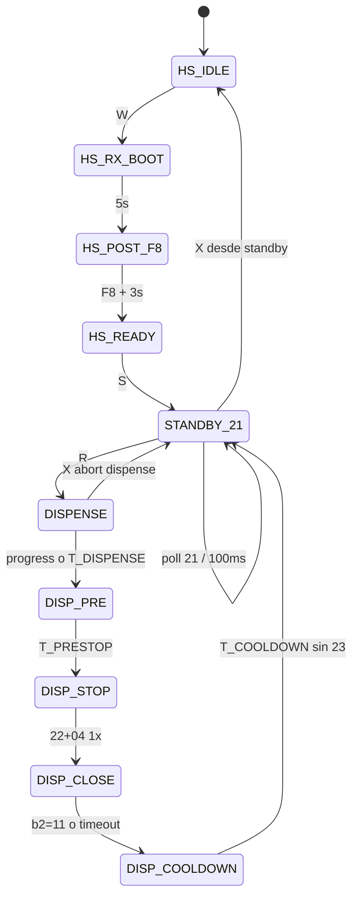

# Plan de implementación — Mate Point UART v0-2 (modo kiosco W/S/R)

**Proyecto:** Mate Point — OT-00268 Etapa 3  
**Base:** [`mate_point_UART_v0-1/`](mate_point_UART_v0-1/) (Etapa 1 cerrada 2026-06-04)  
**Objetivo:** firmware POC ESP32 **nuevo** con sesión **wake → standby desbloqueado → dispensado**, sin replay legacy ARMOR.  
**Última actualización:** 2026-06-04  
**Estado:** **Implementado** — validación banco pendiente (§7)

| Documento | Uso |
|-----------|-----|
| [`PROTOCOLO-UART-NOBANA.md`](PROTOCOLO-UART-NOBANA.md) | Tramas, tiempos, telemetría |
| [`PLAN-POC-NOBANA-UART.md`](PLAN-POC-NOBANA-UART.md) | Etapa 1 (replay ref. B→I en v0-1) — **no se modifica** |
| Capturas ARMOR | [`2026-06-03-inicio-dispense-coffee-fin.md`](../tools/nobana_uart_sniffer/capturas/2026-06-03-inicio-dispense-coffee-fin.md), [`…_manual.md`](../tools/nobana_uart_sniffer/capturas/2026-06-03-inicio-dispense-coffee-fin_manual.md) |
| Capturas ESP v0-1 | [`2026-06-04-…_Wake_manual.md`](../tools/nobana_uart_sniffer/capturas/2026-06-04-inicio-dispense-coffee-fin_ESP-UART_Wake_manual.md) |

**Carpeta objetivo:** [`mate_point_UART_v0-2/`](mate_point_UART_v0-2/) (fork de v0-1).

> **Nota de nombres:** `mate_point_UART_v0-2` es el POC UART en ESP32. No confundir con [`mate_point_v0-2/`](mate_point_v0-2/) (Waveshare + UI + MQTT), que integrará este driver más adelante.

---

## 1. Motivación

### 1.1 Qué hace v0-1 (referencia, sin tocar)

- **`W`:** `F8` + escucha RX → `[wake] LISTO`
- **`R`:** replay **B→I:** `21` → `23` → `E2` → … → **`23` lock**

### 1.2 Modelo objetivo v0-2 (kiosco)

| Comando | Proceso | UART | Cuándo |
|---------|---------|------|--------|
| **`W`** | Wake | `F8` (1×) + ventanas RX | **1× por sesión** (al prender Nobana / turno) |
| **`S`** | Standby | **`21` polling ~100 ms**, `seq=1` | Tras `[wake] LISTO`; hasta **`R`** o **`X`** |
| **`R`** | Dispensado Coffee 180 ml | **`E2` → pre-stop → `22` (F→G→H)** | Solo si **standby activo**; **sin** `23` al final |

Tras **`R`** OK: vuelve **automáticamente** a standby (`21` poll) — listo para otro pedido sin pulsar **`S`** de nuevo (el flag standby sigue activo).

**Comunicación UART:** TX poll + RX parse durante **`S`** y todo **`R`**.

---

## 2. Alcance

### 2.1 Incluido

- FSM: wake → `STANDBY_21` → dispensado D–H → **auto** `STANDBY_21`
- Comandos: `W`, `S`, `R`, `X`, `I`, `V`, `B9600`, `?`
- Reutilizar de v0-1: parser, telemetría, tiempos D–H
- Cooldown **completo** (~15 s); **sin** `LOCK_23`
- README + captura banco en `capturas/`

### 2.2 Fuera de alcance

| Tema | Notas |
|------|--------|
| Replay legacy B→I / comando `L` | **No** — regresión solo en v0-1 |
| Pantalla Waveshare / MQTT | `mate_point_v0-2` producto |
| Fin manual (`M`), otros ml | Etapa posterior |
| Tiempo máximo de standby en firmware | **No** — lo mide el operador en banco |
| Omitir `F8` | Prueba aparte |

---

## 3. Máquina de estados

### 3.1 Fases `R` (desde v0-1, sin I)

| Fase | `cmd` | `b5` | `d7` | Criterio |
|------|-------|------|------|----------|
| `DISPENSE` | `E2` | `00` | `55` | `progress ≥ 155` o 24 s |
| `PRE_STOP` | `E2` | `04` | `55` | ~3900 ms |
| `STOP_22_04` | `22` | `04` | `55` | 1 trama |
| `CLOSE_22_00` | `22` | `00` | `55` | `b2=0x11` o timeout |
| `COOLDOWN_22` | `22` | `00` | `55` | ~15 s completo |
| ~~`LOCK_23`~~ | — | — | — | **No implementar** |

### 3.2 `seq` (propuesta inicial)

| Fase | `seq` |
|------|-------|
| Standby `S` (`21`) | `1` |
| `E2` / pre-stop | `2` |
| `22` cierre / cooldown | `3` → `4` si banco lo pide |

### 3.3 Standby `21`

- Trama: `68 01 21 00 00 00 00 00 8A`
- Poll `NOBANA_POLL_MS` (100 ms) mientras `s_standby_active`
- **Riesgo documentado:** posible auto-lock Nobana tras inactividad prolongada (§6 PROTOCOLO). **Sin límite en firmware** — el operador prueba los tiempos de espera reales (QR, pago) y archiva capturas.

---

## 4. Comandos Monitor Serie

| Comando | Acción v0-2 |
|---------|-------------|
| **`W`** | Wake: `F8` + escucha → `[wake] LISTO` |
| **`S`** | Entra / mantiene **standby** (`21` poll). Requiere `[wake] LISTO`. Si ya en standby: `[standby] ya activo`. **Durante dispensado: ignorado** (solo `X`) |
| **`R`** | Inicia dispensado D→H. **Requiere standby activo**; si no: `[err] Standby no activo. Pulse S` |
| **`X`** | Aborta dispensado **o** sale de standby (`s_standby_active = false`) |
| **`I`**, **`V`**, **`B9600`**, **`?`** | Igual filosofía v0-1 |

### 4.1 Flujo banco

1. Flashear `mate_point_UART_v0-2` → Monitor **115200**
2. Nobana ON → **`W`** → `[wake] LISTO`
3. **`S`** → `[standby] ON` — polling `21`
4. (Espera la que quieras medir — sin tope en firmware)
5. **`R`** → ciclo completo → `[fin] ciclo_sin_lock` → **`[standby] ON` automático**
6. Segundo **`R`** (sin nuevo `S`, sin nuevo `W`) — validar segundo pedido
7. Archivar log: `capturas/YYYY-MM-DD-…_ESP-UART_v0-2_kiosco.md`

---

## 5. Estructura de código

Copiar `mate_point_UART_v0-1.ino` → `mate_point_UART_v0-2/mate_point_UART_v0-2.ino`:

| Elemento | Implementación |
|----------|----------------|
| `s_standby_active` | `true` tras `S`; permanece `true` tras fin `R` (auto standby) |
| `standby_tick()` | En `loop` si standby y no dispensando: poll `21` + `poll_rx` |
| `dispense_start()` | Solo si `s_standby_active`; fase `DISPENSE`, `seq=2` |
| Fin `COOLDOWN` | `dispense_finish("ciclo_sin_lock")` → reanudar `standby_tick` (no apagar flag) |
| `handle_serial_line` | `S` / `R` / `X` según §10 |
| Banner | `Mate Point UART v0-2 — W/S/R kiosco` |

---

## 6. Orden de implementación

| # | Tarea | Verificación |
|---|--------|--------------|
| 1 | Carpeta `mate_point_UART_v0-2/` desde v0-1 | Compila |
| 2 | Wake (`W`) sin cambios funcionales | `[wake] LISTO` |
| 3 | `STANDBY_21` + **`S`** | Log `68 01 21 …` ~100 ms |
| 4 | **`R`** con guard `s_standby_active` | Error si no hubo `S` |
| 5 | Fases D–H; sin `LOCK_23` | Sin `23`+`55` en log |
| 6 | Post-`R` → auto standby | Tras `FIN`, sigue poll `21` sin pulsar `S` |
| 7 | `S` ignorado en dispensado; **`X`** aborta | Serial |
| 8 | README + ayuda `?` | W→S→R documentado |
| 9 | Banco + captura (tiempos standby: operador) | `capturas/` |
| 10 | PROTOCOLO §7.8 (tras validar) | Modo kiosco v0-2 |

---

## 7. Criterios de aceptación

| ID | Criterio |
|----|----------|
| W1 | `W` → `F8`; `[wake] LISTO` |
| S1 | `S` → poll `21` estable; RX parseado |
| R1 | `R` sin `S` previo → **error** explícito |
| R2 | `R` con `S` → D→H completo; ~180 ml |
| R3 | `b2=0x11` en cierre; cooldown ~15 s |
| R4 | **No** `23`+`d7=55` tras ciclo |
| R5 | Tras `FIN` → **standby auto** (`21` poll sin nuevo `S`) |
| R6 | Segundo `R` tras fin (misma sesión `W`) — documentar OK/FAIL |
| X1 | Solo **`X`** aborta dispensado; **`S`** no corta dispensado |
| M1 | Captura archivada (standby largo: notas del operador, **sin umbral en código**) |

**Regresión ARMOR:** comparar con v0-1 solo si hace falta; criterio de cierre de v0-2 es la tabla anterior.

---

## 8. Riesgos

| Riesgo | Mitigación |
|--------|------------|
| Auto-lock en standby largo | Medición en banco; notas en captura; ajuste de producto si falla |
| Confusión `S` vs v0-1 (stop) | README + banner Serial |
| Homónimo `mate_point_v0-2` Waveshare | Nota al inicio de este plan y del README UART |

---

## 9. Documentación post-validación

- `PROTOCOLO-UART-NOBANA.md` §7.8 — modo kiosco ESP v0-2  
- `mate_point_firmware/README.md` — enlace a UART v0-2  
- `PLAN-POC-NOBANA-UART.md` — nota: Etapa 1 = v0-1; kiosco = UART v0-2  

---

## 10. Decisiones cerradas (2026-06-04)

| # | Decisión |
|---|----------|
| 1 | Tras `R` OK → **volver automáticamente a standby** (`21` poll; `s_standby_active` sigue true) |
| 2 | **`R` exige `S` previo** (standby activo); mensaje de error si no |
| 3 | Durante dispensado: **solo `X` aborta**; **`S` ignorado** |
| 4 | **Firmware nuevo**; **sin** replay legacy B→I en este binario |
| 5 | **Sin tiempo máximo** de standby en firmware — medición en banco por el operador |
| 6 | Carpeta y sketch: **`mate_point_UART_v0-2`** |

---

## 11. Integración futura (Waveshare)

Port del driver a [`mate_point_v0-2/`](mate_point_v0-2/) (producto): tras pago → equivalente a `S`; MQTT dispense → equivalente a `R`; fin → auto standby.

---

## 12. Changelog del plan

| Fecha | Cambio |
|-------|--------|
| 2026-06-04 | Borrador v0-3 → **v0-2**; decisiones §10 cerradas según equipo |
| 2026-06-04 | Implementación `mate_point_UART_v0-2.ino` + README |
