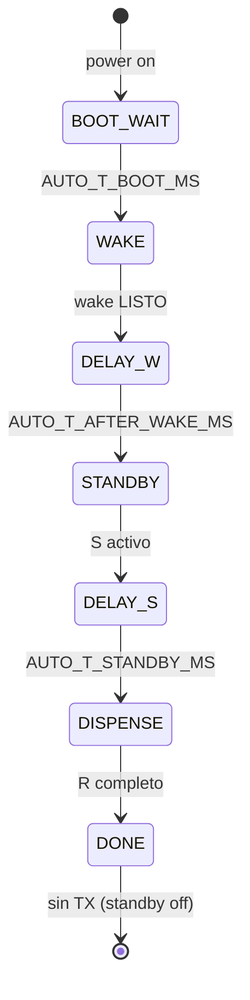
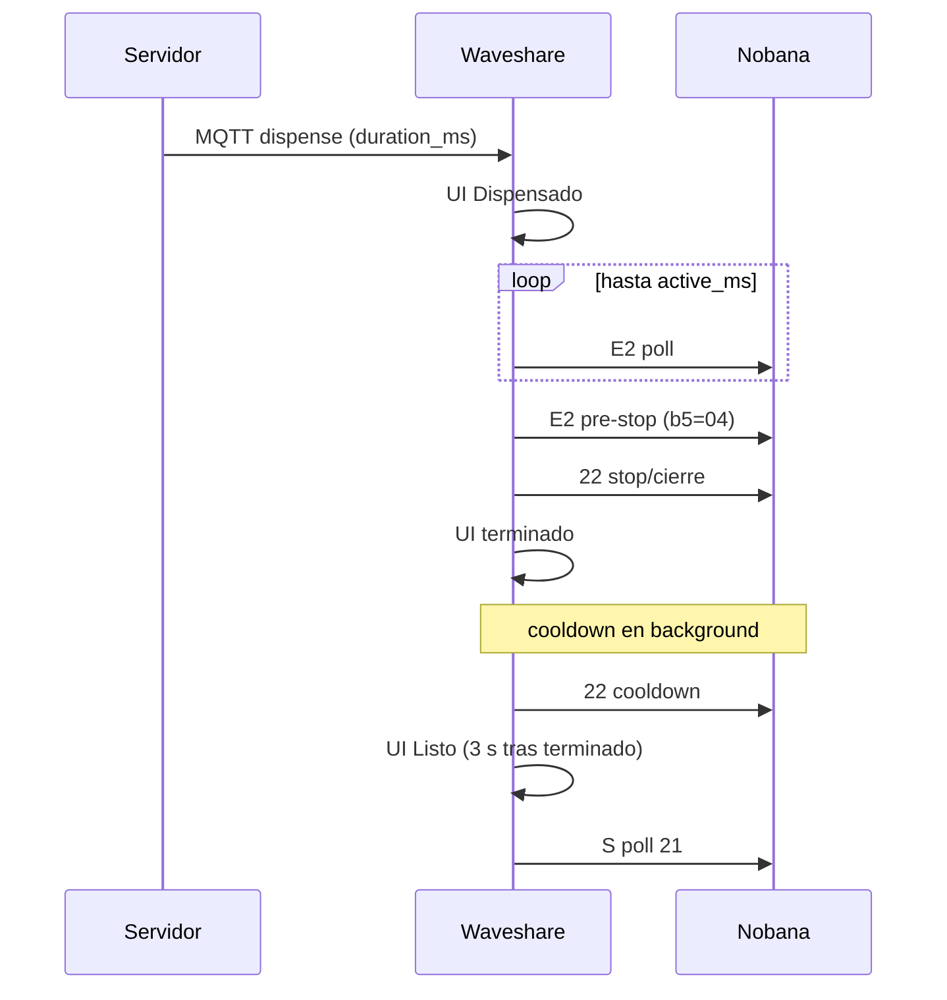

# Plan de implementación — Mate Point UART v0-3 (Waveshare, ciclo automático)

**Proyecto:** Mate Point — OT-00268 Etapa 3  
**Base:** [`mate_point_UART_v0-2/`](mate_point_UART_v0-2/) (kiosco ESP32, `W`/`S`/`R`)  
**Plataforma:** Waveshare ESP32-S3-Touch-LCD-7B + TXS0108E → PCB Nobana  
**Objetivo Etapa 2a-W:** validar el driver kiosco en el Waveshare con **un ciclo automático por encendido**, sin UI.  
**Última actualización:** 2026-06-05  
**Estado POC UART:** **Cerrado en banco** (2026-06-04) — §7 [x] · evidencia [`2026-06-04-Waveshare-UART-v0-3_banco-validacion-OK.md`](../tools/nobana_uart_sniffer/capturas/2026-06-04-Waveshare-UART-v0-3_banco-validacion-OK.md)  
**Estado producto:** [`mate_point_v0-3-1`](mate_point_v0-3-1/) **E2E OK** (Test1 2026-06-05) · [`2026-06-05-Waveshare-Mate_point-v0-3-1_Test1.md`](../tools/nobana_uart_sniffer/capturas/2026-06-05-Waveshare-Mate_point-v0-3-1_Test1.md)  
**Siguiente:** [`mate_point_v0-3-2`](mate_point_v0-3-2/) — UI dispensado + Parar (§12)

| Documento | Uso |
|-----------|-----|
| [`PROTOCOLO-UART-NOBANA.md`](PROTOCOLO-UART-NOBANA.md) | Tramas, telemetría, tiempos |
| [`PLAN-MATE-POINT-UART-v0-2.md`](PLAN-MATE-POINT-UART-v0-2.md) | Semántica `W`/`S`/`R` (referencia) |
| [`PLAN-POC-NOBANA-UART.md`](PLAN-POC-NOBANA-UART.md) | Etapa 1 + índice Etapa 2 |
| [`PLAN-MATE-POINT-v0-3.md`](PLAN-MATE-POINT-v0-3.md) | Producto UI+MQTT+Nobana (v0-3.0) |
| [`arquitectura-hardware.md`](../arquitectura-hardware.md) | Cableado TXS0108E |

**Carpeta:** [`mate_point_UART_v0-3/`](mate_point_UART_v0-3/)

> **Nombres:** `mate_point_UART_v0-3` = POC UART Waveshare auto (cerrado). `mate_point_v0-3` = producto UI+MQTT+Nobana (v0-3.0). `mate_point_v0-3-1` = producto con timer MQTT (§11). `mate_point_v0-3-2` = v0-3-1 + UI dispensado + Parar (§12).

---

## 1. Motivación

| Etapa | Plataforma | Modo |
|-------|------------|------|
| 1 | ESP32 Dev | Replay ARMOR (v0-1) — **cerrada** |
| 2a-ESP | ESP32 Dev | Kiosco manual `W`/`S`/`R` (v0-2) |
| **2a-WS** | **Waveshare** | **Ciclo auto** `W→S→R` **1× por encendido** (UART v0-3) — **cerrado banco 2026-06-04** |
| **2b** | Waveshare | [`mate_point_v0-3`](mate_point_v0-3/) — UI+MQTT+Nobana; replay receta Coffee 180 ml — **E2E parcial** Test1 |
| **2b-1** | Waveshare | [`mate_point_v0-3-1`](mate_point_v0-3-1/) — **`duration_ms` MQTT** — **cerrado banco 2026-06-05** Test1 |
| **2b-2** | Waveshare | [`mate_point_v0-3-2`](mate_point_v0-3-2/) — **UI dispensado** (T_viva, countdown, Parar) — **planificado** §12 |

Evitar depender del Monitor Serie con Nobana en el bus (DIP UART2): el firmware dispara el guion solo; la validación usa chimes, panel Nobana y/o sniffer.

---

## 2. Alcance

### 2.1 Incluido

- Sketch [`mate_point_UART_v0-3.ino`](mate_point_UART_v0-3/mate_point_UART_v0-3.ino)
- Pines **GPIO44 RX / GPIO43 TX** (UART2 PH2.0)
- Secuencia automática con tiempos configurables (§4)
- Misma lógica dispensado que v0-2 (D–H, **sin** `LOCK_23`)
- Bus Nobana **9600 desde reset** — sin logs ASCII en `Serial` (no DIP UART1 para debug)
- **Una pasada** por encendido; reset para repetir; **TX silencioso** tras fin de ciclo

### 2.2 Fuera de alcance (Fase siguiente)

| Tema | Destino |
|------|---------|
| LVGL / pantalla | Fase 2a-WS+UI o Etapa 2b |
| MQTT / Comprar / QR | `mate_point_v0-2` |
| CLI completo `W`/`S`/`R` | Permanece en v0-2 (ESP32 Dev) |
| Segundo ciclo auto sin reset | No — decisión §10 |

---

## 3. Hardware

| Cable Nobana | Waveshare UART2 |
|--------------|-----------------|
| Tx → | GPIO **44** (RX) |
| Rx ← | GPIO **43** (TX) |
| GND | GND |

- **DIP:** posición **UART2** para banco y operación con Nobana.
- Flashear según wiki Waveshare; tras programar, **UART2** para validación (sin monitor Serie en el bus Nobana).

Ver [`mate_point_UART_v0-3/README.md`](mate_point_UART_v0-3/README.md).

---

## 4. Máquina de estados — ciclo automático



| Fase auto | Acción UART | Tiempo default |
|-----------|-------------|----------------|
| `BOOT_WAIT` | — | 3000 ms |
| `WAKE` | `F8` + ventanas (igual v0-2 `W`) | ~8 s + timeout 12 s |
| `DELAY_POST_WAKE` | — | 2000 ms |
| `STANDBY` | poll `21` | — |
| `DELAY_PRE_DISPENSE` | — | 3000 ms |
| `DISPENSE` | `E2` → … → cooldown | ~24 s + pre-stop + cierre |
| `DONE` | — (sin poll `21`) | hasta reset |

Constantes en firmware: `AUTO_T_BOOT_MS`, `AUTO_T_AFTER_WAKE_MS`, `AUTO_T_STANDBY_MS`.

---

## 5. Validación

| Canal | Uso |
|-------|-----|
| Chimes / panel Nobana | **Criterio principal** — aceptación banco 2026-06-04 |
| Sniffer ESP32 en TX Waveshare | Opcional — confirmar solo `F8` + `0x68` (firmware bus limpio) |

Captura de cierre: [`2026-06-04-Waveshare-UART-v0-3_banco-validacion-OK.md`](../tools/nobana_uart_sniffer/capturas/2026-06-04-Waveshare-UART-v0-3_banco-validacion-OK.md).

---

## 6. Orden de implementación

| # | Tarea | Estado |
|---|--------|--------|
| 1 | Carpeta `mate_point_UART_v0-3/` desde v0-2 | [x] |
| 2 | Pines 44/43 + UART0 `Serial` @ 9600 | [x] |
| 3 | FSM `auto_tick` 1× por encendido | [x] |
| 4 | README + este plan | [x] |
| 5 | Actualizar `PLAN-IMPLEMENTACION.md`, `PLAN-POC`, `README.md` | [x] |
| 6 | Banco DIP UART2 + captura `capturas/` | [x] 2026-06-04 |
| 7 | UI LVGL mínima (Fase 2a-WS+1) | [ ] |

---

## 7. Criterios de aceptación (banco)

| ID | Criterio | 2026-06-04 |
|----|----------|------------|
| W1 | Tras boot: `F8` efectivo (Nobana entra en guion) | [x] |
| S1 | Poll `21` estable antes de `R` | [x] |
| R1 | Dispensado Coffee ~180 ml; T ~85 °C en Nobana | [x] |
| R2 | Fin sin `23` lock; chime fin | [x] |
| R3 | Evidencia banco (panel + chimes; sniffer opcional) | [x] |
| R4 | **Una** pasada; sin segundo ciclo hasta reset | [x] |
| R5 | Repetible en nuevo encendido | [x] |

---

## 8. Riesgos

| Riesgo | Mitigación |
|--------|------------|
| Sin monitor en bus Nobana | Validación por chimes/panel; sniffer opcional |
| Nobana ON después del ESP | `AUTO_T_BOOT_MS` 3 s |
| Wake timeout | `AUTO_WAKE_TIMEOUT_MS` 12 s → `[auto] ABORT` |

---

## 9. Integración producto (Etapa 2b) — `mate_point_v0-3`

Tras cerrar §7: producto [`mate_point_v0-3/`](mate_point_v0-3/) — ver [`PLAN-MATE-POINT-v0-3.md`](PLAN-MATE-POINT-v0-3.md).

| Ítem | v0-3.0 (implementado) |
|------|------------------------|
| Wake | `W` antes de LVGL |
| Standby | `S` en Comprar/QR |
| Dispensado | MQTT `dispense` → `R` |
| Timer físico | **Replay fijo** receta Coffee 180 ml (`DISPENSE_T_DISPENSE_MS` 24 s, `progress ≥ 155`) |
| `duration_ms` MQTT | Watchdog UI solamente (sin conexión a UART) |
| Fin UI | Atado a `nobana_dispense_done()` (incluye cooldown ~15 s) |

**Evidencia:** [`2026-06-05-Waveshare-Mate_point-v0-3_Test1.md`](../tools/nobana_uart_sniffer/capturas/2026-06-05-Waveshare-Mate_point-v0-3_Test1.md) — integración OK; **Error dispensado** por desalineación watchdog vs ciclo fijo Nobana.

**Límite v0-3.0:** el volumen dispensado no sigue el contrato MQTT; el servidor y el driver UART usan `duration_ms` con significados distintos. La corrección es **`mate_point_v0-3-1`** (§11).

---

## 11. Etapa 2b-1 — `mate_point_v0-3-1` (timer MQTT)

**Carpeta objetivo:** [`mate_point_v0-3-1/`](mate_point_v0-3-1/) — fork de [`mate_point_v0-3/`](mate_point_v0-3/).  
**Plan producto (espejo):** [`PLAN-MATE-POINT-v0-3.md`](PLAN-MATE-POINT-v0-3.md) §14.  
**Base driver:** misma secuencia UART validada en POC §7 y producto v0-3 (`E2` → pre-stop → `22` cierre).  
**Objetivo:** el **Waveshare es maestro** del ciclo; el **Nobana es slave**. El tiempo de dispensado lo define el servidor vía **`duration_ms`** en MQTT, no la receta fija 180 ml ni el campo `progress` de telemetría.

### 11.1 Modelo maestro / slave

| Rol | Responsabilidad |
|-----|-----------------|
| **Waveshare (maestro)** | Inicia `R`, mide tiempo, envía pre-stop y stop (`E2`+`b5=04` → `22`+`04` → `22`+`00`), ejecuta cooldown |
| **Nobana (slave)** | Responde a polls; telemetría (`T_viva`, `b2`) opcional para cierre — **no** define cuánto dispensar |
| **Servidor** | Publica `duration_ms` según producto pagado (tope de líquido expresado en tiempo calibrado) |

La receta Coffee 180 ml del POC aportó la **secuencia de tramas** y los overhead de pre-stop/cierre; no es el contrato de producto.

**Descartar como criterio de corte:** `progress ≥ 155` y `DISPENSE_T_DISPENSE_MS` fijo como disparador principal.

### 11.2 Contrato `duration_ms` (MQTT)

| Campo | Definición v0-3-1 |
|-------|-------------------|
| `duration_ms` | Tiempo **total de dispensado** contratado: fase activa (`E2`, flujo) + pre-stop + stop/cierre |
| **Fuera de `duration_ms`** | Cooldown post-cierre (~15 s) — recuperación interna del Nobana entre órdenes |
| Origen | Servidor (`DISPENSE_DURATION_MS` o por producto); el ESP **no** calcula ml |

**Presupuesto en firmware** (constantes de overhead calibradas en banco, heredadas del POC):

```
active_ms = duration_ms - PRESTOP_MS - CLOSE_BUDGET_MS
```

| Componente | Referencia POC 180 ml | Dentro de `duration_ms` |
|------------|----------------------|-------------------------|
| Fase activa `E2` | ~24 s (variable por producto) | Sí |
| Pre-stop `E2`+`b5=04` | ~3,9 s | Sí |
| Stop + cierre `22` | ~2–8 s | Sí |
| Cooldown `22` | ~15 s | **No** |

**Servidor:** recalibrar `DISPENSE_DURATION_MS` (ya no 120000 ms de pantalla simulada v0-2). Valor inicial de banco para Coffee ~180 ml: del orden de **~30000 ms** total (activo + pre-stop + stop), a confirmar con sniffer y volumen medido.

### 11.3 Fin de ciclo — UI y UART



| Evento | Momento |
|--------|---------|
| UI **Dispensado** | Al aceptar MQTT `dispense` |
| Corte UART (pre-stop → stop) | Al consumir presupuesto `duration_ms` |
| UI **terminado** | **Al fin del stop** (fase `DISPENSE_CLOSE_22_00` completa) — **no** al fin del cooldown |
| UI **Listo** | **3 s** después de **terminado** (`TERMINADO_TO_LISTO_MS`) |
| **`S`** (poll `21`) | Reactivar **solo** cuando cooldown Nobana termina (máquina lista para siguiente orden) |
| MQTT `state: idle` | Al volver a **Listo** / `COMPRAR` (igual v0-3) |

Si **Listo** ocurre antes de fin cooldown (~33 s vs ~45 s en receta 180 ml), la UI puede mostrar **Listo** mientras el Nobana aún enfría; **Comprar** / nuevo QR debe **bloquearse** hasta `nobana_dispense_done()` (cooldown completo).

### 11.4 Watchdog — eliminado como concepto de dispensado

En v0-3.0, `duration_ms` actuaba como watchdog UI paralelo al timer UART fijo — origen del **Error dispensado** en Test1.

**v0-3-1:** `duration_ms` **es** el setpoint del FSM; no hay watchdog duplicado con el mismo valor.

| Mecanismo | v0-3.0 | v0-3-1 |
|-----------|--------|--------|
| Timer de corte | Constantes 180 ml + `progress` | `duration_ms` MQTT |
| Watchdog `duration_ms` | UI error si Nobana busy | **Eliminado** |
| Timeout de seguridad | — | Opcional: `duration_ms + cooldown + margen` solo ante FSM colgado (fallo hardware); no en camino feliz |

### 11.5 Alcance `mate_point_v0-3-1`

**Incluido**

- Fork `mate_point_v0-3/` → `mate_point_v0-3-1/`
- Pasar `duration_ms` a `nobana_uart` (`nobana_dispense_start(duration_ms)` o equivalente)
- Reparto presupuesto: activo / pre-stop / cierre
- Quitar `progress ≥ 155` como disparador de corte
- Quitar watchdog en `dispense_controller`
- Nuevo evento UART: fin de stop → UI **terminado** (desacoplado de cooldown)
- Ajuste servidor: `DISPENSE_DURATION_MS` alineado al producto
- Banco: sniffer + payload MQTT archivado + volumen/tiempo medido

**Fuera de alcance v0-3-1**

- Campo `volume_ml` en MQTT (proxy vía `duration_ms` calibrado)
- Botón cancelar UI (P1 — hereda plan v0-3 §9)
- Lock `23`, múltiples presets ml (250/750), TLS broker

### 11.6 Tareas de implementación

| Fase | # | Tarea | Verificación |
|------|---|--------|--------------|
| Prep | 1 | Crear `mate_point_v0-3-1/` desde `mate_point_v0-3/` | [x] |
| UART | 2 | API `nobana_dispense_start(uint32_t duration_ms)` | [x] Test1 |
| UART | 3 | Presupuesto `active_ms` = `duration_ms` − overhead fijo | [x] Test1 |
| UART | 4 | Eliminar corte por `progress ≥ 155` | [x] |
| UART | 5 | Evento `nobana_dispense_stop_done()` vs `nobana_dispense_done()` | [x] Test1 |
| Ctrl | 6 | `dispense_controller`: sin watchdog; terminado en stop | [x] Test1 |
| Ctrl | 7 | Bloquear Comprar hasta cooldown completo | [x] Test1 |
| Srv | 8 | Servidor: `DISPENSE_DURATION_MS` calibrado (~30 s ref. 180 ml) | [x] 30000 |
| QA | 9 | E2E pago → Dispensado → **terminado** → Listo → Comprar | [x] [`Test1`](../tools/nobana_uart_sniffer/capturas/2026-06-05-Waveshare-Mate_point-v0-3-1_Test1.md) |
| QA | 10 | Sniffer TX: solo `F8` + `0x68` | [ ] pendiente |

### 11.7 Criterios de aceptación (banco v0-3-1) — Test1 2026-06-05

| ID | Criterio | Test1 |
|----|----------|-------|
| T1 | MQTT `duration_ms` controla cuándo entra pre-stop | [x] |
| T2 | Volumen físico coherente con `duration_ms` calibrado | [~] ml pendiente |
| T3 | UI **terminado** al fin del stop — antes del cooldown | [x] |
| T4 | UI **Listo** tras terminado; sin **Error dispensado** | [x] |
| T5 | Comprar tras cooldown; ciclo completo | [x] |
| T6 | Sniffer: secuencia `E2` → pre-stop → `22` cierre | [ ] |

### 11.8 Riesgos

| Riesgo | Mitigación |
|--------|------------|
| `duration_ms` servidor aún en 120000 | Tarea §11.6 #8 antes de E2E |
| Pre-stop corto si corte temprano (&lt; 24 s) | Validar en banco si 3,9 s fijos bastan o ruta manual §7.4 |
| UI Listo antes de cooldown | Bloquear Comprar hasta `nobana_dispense_done()` |
| Calibración tiempo ↔ ml | Tabla producto en servidor; iteración posterior si cambia caudal |

---

## 10. Decisiones cerradas (2026-06-04) — POC UART

| # | Decisión |
|---|----------|
| 1 | Carpeta **`mate_point_UART_v0-3`** en Waveshare |
| 2 | **Ciclo automático**; sin CLI `W`/`S`/`R` |
| 3 | **Una pasada** por encendido |
| 4 | Pines **GPIO44 RX / GPIO43 TX** |
| 5 | Fase UI simple **después** de validar §7 |

### Decisiones cerradas (2026-06-05) — producto `mate_point_v0-3-1`

| # | Decisión |
|---|----------|
| 1 | Carpeta **`mate_point_v0-3-1`** — fork de `mate_point_v0-3` |
| 2 | Waveshare **maestro**; Nobana **slave**; corte por **timer propio**, no `progress` |
| 3 | `duration_ms` MQTT = tiempo total dispensado (activo + pre-stop + stop); **sin** cooldown |
| 4 | **Sin watchdog** duplicado; `duration_ms` es setpoint del FSM UART |
| 5 | UI **terminado** al **fin del stop**; cooldown en background |
| 6 | **`S`** y nuevo ciclo Comprar solo tras cooldown completo |

---

## 12. Etapa 2b-2 — `mate_point_v0-3-2` (UI dispensado + Parar)

**Carpeta objetivo:** [`mate_point_v0-3-2/`](mate_point_v0-3-2/) — fork de [`mate_point_v0-3-1/`](mate_point_v0-3-1/).  
**Plan producto:** [`PLAN-MATE-POINT-v0-3.md`](PLAN-MATE-POINT-v0-3.md) §15.

### 12.1 Objetivo

Mientras dura el dispensado físico, la pantalla muestra **temperatura en vivo**, **countdown** según `duration_ms` MQTT y un botón **Parar** que ejecuta el stop manual Coffee (§7.4 PROTOCOLO). Referencia UART: [`2026-06-03-inicio-dispense-coffee-fin_manual.md`](../tools/nobana_uart_sniffer/capturas/2026-06-03-inicio-dispense-coffee-fin_manual.md).

### 12.2 UI (decisiones cerradas)

| Elemento | Decisión |
|----------|----------|
| Temperatura | `"83°"` — `lv_font_montserrat_44` (igual **Listo** / **terminado**) |
| Countdown | `M:SS` — fuente más chica (ej. Montserrat 28) |
| Botón Parar | **280×90**, rojo / blanco — igual **Comprar** |
| Tap Parar | Botón **disabled** de inmediato |
| Refresh pantalla | **1 Hz** |
| MQTT al Parar | **No** — sin publish adicional |

### 12.3 UART — abort manual

> **POC UART:** [`mate_point_UART_v0-3`](mate_point_UART_v0-3/) no expone comando **`X`** (solo ciclo auto). El **`X`** de [`mate_point_UART_v0-2`](mate_point_UART_v0-2/) hace `dispense_finish()` **sin tramas de cierre** — **no** es la referencia para **Parar**. Ver [`PLAN-MATE-POINT-v0-3.md`](PLAN-MATE-POINT-v0-3.md) §15.3.1.

| Fase | Timer v0-3-1 | Manual (Parar) |
|------|--------------|----------------|
| Pre-stop | `E2+b5=04`, ~3900 ms | `E2+b5=04`, ~**1800 ms** |
| Stop | `22+b5=04` → `22+00` | **`22+b5=00` directo** |

Secuencia observada en captura manual (17:38:15 → 17:38:17):

```
68 05 E2 00 00 04 00 55 A8   ← pre-stop
68 05 22 00 00 00 00 55 E4   ← stop (sin 22+04)
```

### 12.4 Alcance

**Incluye**

- Panel LVGL dispensado (reemplaza texto fijo **Dispensado**)
- Parseo T_viva (byte 3) + countdown desde `duration_ms`
- `nobana_dispense_abort()` con ruta §7.4
- Herencia completa v0-3-1 (timer MQTT, terminado → Listo, cooldown, bus limpio)

**Fuera de alcance**

- MQTT de abort / volumen parcial al servidor
- Tanque vacío, lock `23`, TLS

### 12.5 Tareas

| # | Tarea | Verificación |
|---|--------|--------------|
| 1 | Fork `mate_point_v0-3-2/` | [ ] |
| 2 | T_viva + remaining_ms en `nobana_uart` | [ ] |
| 3 | Panel UI + refresh 1 Hz | [ ] |
| 4 | Parar: UI disabled + `nobana_dispense_abort()` | [ ] |
| 5 | Sniffer: secuencia manual sin `22+04` | [ ] |
| 6 | E2E timer + E2E Parar + 2.ª compra | [ ] |

### 12.6 Criterios de aceptación

Ver [`PLAN-MATE-POINT-v0-3.md`](PLAN-MATE-POINT-v0-3.md) §15.7 (U1–U7).

---

## 13. Etapa 2b-3 — `mate_point_v0-3-3` (Parar rápido + UI contrato)

**Carpeta:** [`mate_point_v0-3-3/`](mate_point_v0-3-3/) — fork de v0-3-2.  
**Plan producto:** [`PLAN-MATE-POINT-v0-3.md`](PLAN-MATE-POINT-v0-3.md) §16.

### 13.1 UART

| Fase | v0-3-2 (ARMOR-like) | v0-3-3 |
|------|---------------------|--------|
| Pre-stop manual | `E2+04`, ~1800 ms | `E2+04`, **~200 ms** |
| Stop | `22+00` directo | igual |
| Fin timer natural | ~3900 ms pre-stop + `22+04`→`22+00` | sin cambio |

### 13.2 UI

| Tema | v0-3-3 |
|------|--------|
| Countdown | Contrato MQTT en `dispense_controller`; independiente de `dispense_finish()` |
| **terminado** | `remaining_ms == 0` |
| T_viva | Telemetría viva; poll `21` si ciclo hidráulico ya terminó |
| Comprar | Bloqueado mientras `dispense_cycle_active()` |

### 13.3 Validación banco

| # | Prueba | Test1 |
|---|--------|-------|
| 1 | Sniffer Parar: `E2+04` ~200 ms → `22+00` | [ ] pendiente |
| 2 | Parar ~10 s: flujo corta ~300–500 ms; UI countdown sin agua | [x] |
| 3 | Fin natural 30 s: terminado al 0:00 | [~] no probado |
| 4 | Segunda compra | [~] pendiente |

Captura: [`2026-06-05-Waveshare-Mate_point-v0-3-3_Test1.md`](../tools/nobana_uart_sniffer/capturas/2026-06-05-Waveshare-Mate_point-v0-3-3_Test1.md) — **banco OK** 2026-06-05.

---

## Changelog

| Fecha | Cambio |
|-------|--------|
| 2026-06-04 | Plan + implementación UART v0-3 |
| 2026-06-04 | **Banco OK** — captura [`2026-06-04-Waveshare-UART-v0-3_banco-validacion-OK.md`](../tools/nobana_uart_sniffer/capturas/2026-06-04-Waveshare-UART-v0-3_banco-validacion-OK.md); firmware bus limpio (solo protocolo en TX) |
| 2026-06-05 | §9 producto v0-3 (Test1 parcial); **§11 `mate_point_v0-3-1`**: timer MQTT, maestro/slave, fin UI en stop, sin watchdog |
| 2026-06-05 | **v0-3-1 Test1 OK** — E2E [`2026-06-05-Waveshare-Mate_point-v0-3-1_Test1.md`](../tools/nobana_uart_sniffer/capturas/2026-06-05-Waveshare-Mate_point-v0-3-1_Test1.md) |
| 2026-06-05 | **§12 `mate_point_v0-3-2`** — UI dispensado (T_viva, countdown, Parar); stop manual §7.4; ref. captura 2026-06-03 manual |
| 2026-06-05 | **§13 `mate_point_v0-3-3`** — pre-stop 200 ms; UI contrato desacoplado |
| 2026-06-05 | **v0-3-3 Test1 OK** — banco Nobana; corte Parar ~300–500 ms |
