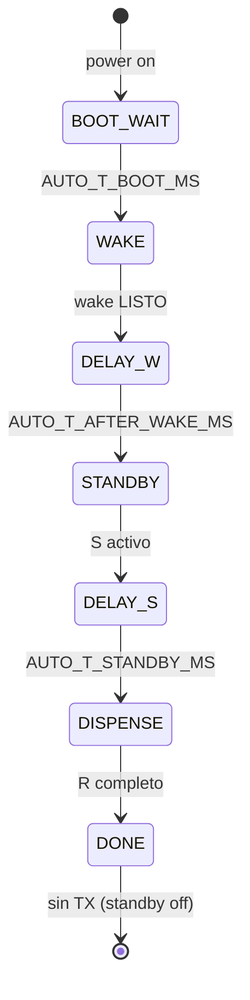

# Plan de implementación — Mate Point UART v0-3 (Waveshare, ciclo automático)

**Proyecto:** Mate Point — OT-00268 Etapa 3  
**Base:** [`mate_point_UART_v0-2/`](mate_point_UART_v0-2/) (kiosco ESP32, `W`/`S`/`R`)  
**Plataforma:** Waveshare ESP32-S3-Touch-LCD-7B + TXS0108E → PCB Nobana  
**Objetivo Etapa 2a-W:** validar el driver kiosco en el Waveshare con **un ciclo automático por encendido**, sin UI.  
**Última actualización:** 2026-06-04  
**Estado:** **Cerrado en banco** (2026-06-04) — §7 [x] · evidencia [`2026-06-04-Waveshare-UART-v0-3_banco-validacion-OK.md`](../tools/nobana_uart_sniffer/capturas/2026-06-04-Waveshare-UART-v0-3_banco-validacion-OK.md)

| Documento | Uso |
|-----------|-----|
| [`PROTOCOLO-UART-NOBANA.md`](PROTOCOLO-UART-NOBANA.md) | Tramas, telemetría, tiempos |
| [`PLAN-MATE-POINT-UART-v0-2.md`](PLAN-MATE-POINT-UART-v0-2.md) | Semántica `W`/`S`/`R` (referencia) |
| [`PLAN-POC-NOBANA-UART.md`](PLAN-POC-NOBANA-UART.md) | Etapa 1 + índice Etapa 2 |
| [`arquitectura-hardware.md`](../arquitectura-hardware.md) | Cableado TXS0108E |

**Carpeta:** [`mate_point_UART_v0-3/`](mate_point_UART_v0-3/)

> **Nombres:** `mate_point_UART_v0-3` = POC UART Waveshare auto. `mate_point_v0-2` = producto UI+MQTT (Etapa 2b).

---

## 1. Motivación

| Etapa | Plataforma | Modo |
|-------|------------|------|
| 1 | ESP32 Dev | Replay ARMOR (v0-1) — **cerrada** |
| 2a-ESP | ESP32 Dev | Kiosco manual `W`/`S`/`R` (v0-2) |
| **2a-WS** | **Waveshare** | **Ciclo auto** `W→S→R` **1× por encendido** (v0-3) — **cerrado banco 2026-06-04** |
| 2b | Waveshare | `mate_point_v0-2` + driver + UI Comprar/QR |

Evitar depender del Monitor Serie con Nobana en el bus (DIP UART2): el firmware dispara el guion solo; la validación usa chimes, panel Nobana y/o sniffer.

---

## 2. Alcance

### 2.1 Incluido

- Sketch [`mate_point_UART_v0-3.ino`](mate_point_UART_v0-3/mate_point_UART_v0-3.ino)
- Pines **GPIO44 RX / GPIO43 TX** (UART2 PH2.0)
- Secuencia automática con tiempos configurables (§4)
- Misma lógica dispensado que v0-2 (D–H, **sin** `LOCK_23`)
- Bus Nobana **9600 desde reset** — sin logs ASCII en `Serial` (no DIP UART1 para debug)
- **Una pasada** por encendido; reset para repetir; **TX silencioso** tras fin de ciclo

### 2.2 Fuera de alcance (Fase siguiente)

| Tema | Destino |
|------|---------|
| LVGL / pantalla | Fase 2a-WS+UI o Etapa 2b |
| MQTT / Comprar / QR | `mate_point_v0-2` |
| CLI completo `W`/`S`/`R` | Permanece en v0-2 (ESP32 Dev) |
| Segundo ciclo auto sin reset | No — decisión §10 |

---

## 3. Hardware

| Cable Nobana | Waveshare UART2 |
|--------------|-----------------|
| Tx → | GPIO **44** (RX) |
| Rx ← | GPIO **43** (TX) |
| GND | GND |

- **DIP:** posición **UART2** para banco y operación con Nobana.
- Flashear según wiki Waveshare; tras programar, **UART2** para validación (sin monitor Serie en el bus Nobana).

Ver [`mate_point_UART_v0-3/README.md`](mate_point_UART_v0-3/README.md).

---

## 4. Máquina de estados — ciclo automático

| Fase auto | Acción UART | Tiempo default |
|-----------|-------------|----------------|
| `BOOT_WAIT` | — | 3000 ms |
| `WAKE` | `F8` + ventanas (igual v0-2 `W`) | ~8 s + timeout 12 s |
| `DELAY_POST_WAKE` | — | 2000 ms |
| `STANDBY` | poll `21` | — |
| `DELAY_PRE_DISPENSE` | — | 3000 ms |
| `DISPENSE` | `E2` → … → cooldown | ~24 s + pre-stop + cierre |
| `DONE` | — (sin poll `21`) | hasta reset |

Constantes en firmware: `AUTO_T_BOOT_MS`, `AUTO_T_AFTER_WAKE_MS`, `AUTO_T_STANDBY_MS`.

---

## 5. Validación

| Canal | Uso |
|-------|-----|
| Chimes / panel Nobana | **Criterio principal** — aceptación banco 2026-06-04 |
| Sniffer ESP32 en TX Waveshare | Opcional — confirmar solo `F8` + `0x68` (firmware bus limpio) |

Captura de cierre: [`2026-06-04-Waveshare-UART-v0-3_banco-validacion-OK.md`](../tools/nobana_uart_sniffer/capturas/2026-06-04-Waveshare-UART-v0-3_banco-validacion-OK.md).

---

## 6. Orden de implementación

| # | Tarea | Estado |
|---|--------|--------|
| 1 | Carpeta `mate_point_UART_v0-3/` desde v0-2 | [x] |
| 2 | Pines 44/43 + UART0 `Serial` @ 9600 | [x] |
| 3 | FSM `auto_tick` 1× por encendido | [x] |
| 4 | README + este plan | [x] |
| 5 | Actualizar `PLAN-IMPLEMENTACION.md`, `PLAN-POC`, `README.md` | [x] |
| 6 | Banco DIP UART2 + captura `capturas/` | [x] 2026-06-04 |
| 7 | UI LVGL mínima (Fase 2a-WS+1) | [ ] |

---

## 7. Criterios de aceptación (banco)

| ID | Criterio | 2026-06-04 |
|----|----------|------------|
| W1 | Tras boot: `F8` efectivo (Nobana entra en guion) | [x] |
| S1 | Poll `21` estable antes de `R` | [x] |
| R1 | Dispensado Coffee ~180 ml; T ~85 °C en Nobana | [x] |
| R2 | Fin sin `23` lock; chime fin | [x] |
| R3 | Evidencia banco (panel + chimes; sniffer opcional) | [x] |
| R4 | **Una** pasada; sin segundo ciclo hasta reset | [x] |
| R5 | Repetible en nuevo encendido | [x] |

---

## 8. Riesgos

| Riesgo | Mitigación |
|--------|------------|
| Sin monitor en bus Nobana | Validación por chimes/panel; sniffer opcional |
| Nobana ON después del ESP | `AUTO_T_BOOT_MS` 3 s |
| Wake timeout | `AUTO_WAKE_TIMEOUT_MS` 12 s → `[auto] ABORT` |

---

## 9. Integración futura (Etapa 2b)

Tras cerrar §7: port del mismo driver a [`mate_point_v0-2/`](mate_point_v0-2/) — `W` en init, `S` en `QR_SHOW`, MQTT `dispense` → `R`.

---

## 10. Decisiones cerradas (2026-06-04)

| # | Decisión |
|---|----------|
| 1 | Carpeta **`mate_point_UART_v0-3`** en Waveshare |
| 2 | **Ciclo automático**; sin CLI `W`/`S`/`R` |
| 3 | **Una pasada** por encendido |
| 4 | Pines **GPIO44 RX / GPIO43 TX** |
| 5 | Fase UI simple **después** de validar §7 |

---

## Changelog

| Fecha | Cambio |
|-------|--------|
| 2026-06-04 | Plan + implementación v0-3 |
| 2026-06-04 | **Banco OK** — captura [`2026-06-04-Waveshare-UART-v0-3_banco-validacion-OK.md`](../tools/nobana_uart_sniffer/capturas/2026-06-04-Waveshare-UART-v0-3_banco-validacion-OK.md); firmware bus limpio (solo protocolo en TX) |
