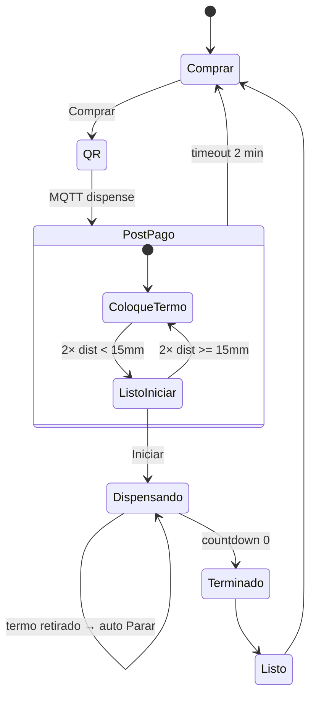
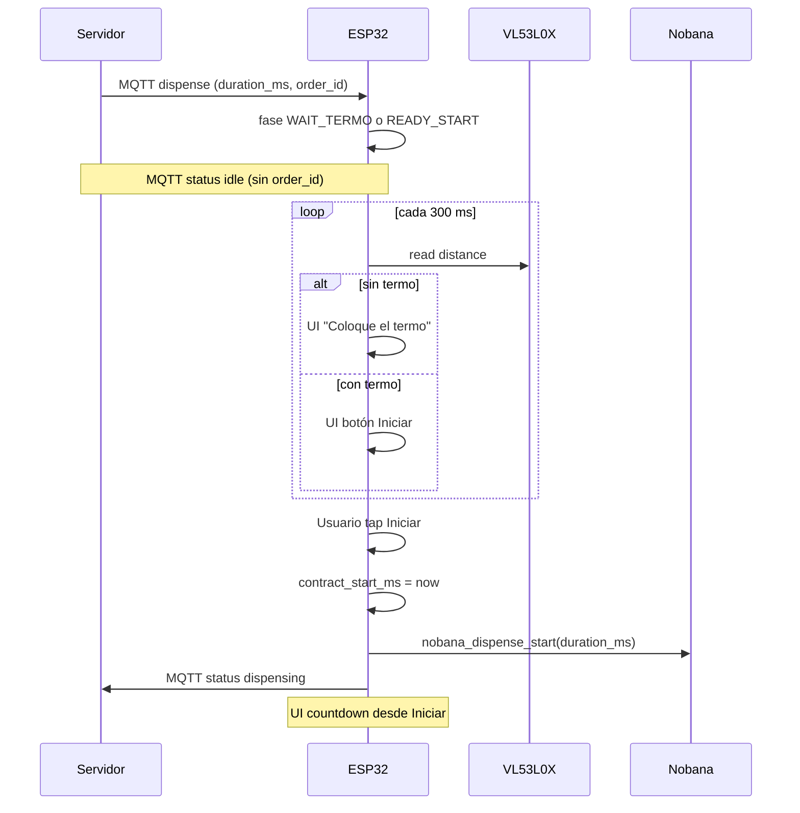

# Plan de implementación — Mate Point v0-3-4

**Proyecto:** Mate Point — OT-00268 Etapa 3  
**Carpeta:** [`mate_point_v0-3-4/`](mate_point_v0-3-4/) — fork de [`mate_point_v0-3-3/`](mate_point_v0-3-3/)  
**Base validada:** v0-3-3 (Parar rápido + UI contrato desacoplado — Test1 2026-06-05)  
**Plataforma:** Waveshare ESP32-S3-Touch-LCD-7B + Nobana UART + VL53L0X (I2C)  
**Última actualización:** 2026-06-17  
**Estado:** **E2E OK** — Test1 banco 2026-06-17 · [`2026-06-17-Waveshare-Mate_point-v0-3-4_Test1.md`](../tools/nobana_uart_sniffer/capturas/2026-06-17-Waveshare-Mate_point-v0-3-4_Test1.md)

| Documento | Uso |
|-----------|-----|
| [`PLAN-MATE-POINT-v0-3.md`](PLAN-MATE-POINT-v0-3.md) | Plan maestro producto v0-3 · §16 v0-3-3 |
| [`PLAN-IMPLEMENTACION.md`](PLAN-IMPLEMENTACION.md) | Índice Fase 4.3 |
| [`arquitectura-hardware.md`](../arquitectura-hardware.md) | VL53L0X @ 0x29, bus I2C PH2.0 |
| [`PROTOCOLO-UART-NOBANA.md`](PROTOCOLO-UART-NOBANA.md) | Stop manual §7.4, pre-stop 200 ms |

---

## 1. Objetivo

Agregar **detección de termo** con sensor **VL53L0X** y un **gate manual “Iniciar”** entre el pago QR y el dispensado físico, sin regresión del comportamiento v0-3-3 una vez iniciado el ciclo.

Al confirmar el pago (MQTT `dispense`):

1. **No** se dispensa automáticamente.
2. Se valida presencia del termo por proximidad I2C.
3. Sin termo → pantalla **“Coloque el termo”** (polling automático).
4. Con termo → botón azul **“Iniciar”** (sin countdown).
5. Al pulsar **Iniciar** → dispensado Nobana + UI v0-3-3 + MQTT `dispensing`.
6. Si el usuario retira el termo durante el dispensado → **auto-Parar** (misma ruta que botón rojo).

---

## 2. Decisiones cerradas (2026-06-17)

| # | Tema | Decisión |
|---|------|----------|
| D1 | Sensor | **VL53L0X** @ I2C **0x29** (PH2.0), mismo bus GT911 (0x5D) + CH422G (0x24) |
| D2 | Umbral termo presente | Distancia **corregida** **< 15 mm** (`TERMO_PRESENT_MAX_MM`; offset `TERMO_OFFSET_MM` = 85) |
| D3 | Pin XSHUT | **No cableado** — dirección por defecto 0x29 |
| D4 | Fallo sensor / I2C | Equivalente a **sin termo** → “Coloque el termo” |
| D5 | Detección | **Polling automático** continuo tras el pago |
| D6 | Debounce transiciones | **2 lecturas consecutivas** para cambiar estado UI o disparar auto-Parar |
| D7 | Intervalo poll | **300 ms** (propuesto; ajustable en `config.h`) |
| D8 | Texto sin termo | **“Coloque el termo”** |
| D9 | Pantalla Iniciar | Solo botón azul **“Iniciar”** — **sin** countdown ni temperatura |
| D10 | Termo retirado (pre-Iniciar) | Vuelve automáticamente a **“Coloque el termo”** |
| D11 | Termo retirado (dispensando) | **Auto-Parar** — `nobana_dispense_abort()` + contrato UI v0-3-3 |
| D12 | Timeout post-pago | **2 min** desde MQTT `dispense`; **sin** timer visible en UI |
| D13 | Acción timeout | `order_cancel` + vuelta **directa** a **Comprar** (sin mensaje intermedio) |
| D14 | MQTT `dispensing` | Solo desde tap **Iniciar** — **no** desde el pago QR |
| D15 | MQTT `idle` post-pago | Sin `order_id` en payload de status durante espera termo/Iniciar |
| D16 | Inicio contrato dispensado | **`duration_ms` MQTT + countdown UI + Nobana `R`** arrancan **solo al pulsar Iniciar** — **confirmado producto 2026-06-17** |
| D17 | Timeout post-pago vs dispensado | Son **dos timers distintos**: espera termo (2 min fijos) ≠ tiempo de dispensado (`duration_ms` del servidor, valor definido por servidor — hoy ~30 s) |
| D18 | Herencia v0-3-3 | Parar manual, pre-stop 200 ms, terminado al countdown 0, T_viva viva, sin MQTT al Parar |
| D19 | Calibración sensor | Offset **`TERMO_OFFSET_MM = 85`**; umbral **`TERMO_PRESENT_MAX_MM = 15`** sobre distancia corregida — validado banco Test1 |

> **Nota `duration_ms`:** el servidor publica hoy `DISPENSE_DURATION_MS=30000` (~30 s de dispensado). El firmware **no** fija 2 minutos de dispensado: usa el `duration_ms` recibido en MQTT, contando desde **Iniciar**. Si el producto requiere otro tiempo, se cambia en servidor; el firmware solo respeta el valor recibido.

---

## 3. Flujo de usuario

```
Comprar → QR → pago (MQTT dispense)
    → [MQTT idle, timer post-pago 2 min silencioso]
    → polling VL53L0X
        ├─ sin termo  → "Coloque el termo"
        └─ con termo  → botón azul "Iniciar"
            → tap Iniciar [MQTT dispensing, contract_start = now]
            → 83° + countdown + Parar
                ├─ Parar manual
                ├─ termo retirado → auto-Parar
                └─ countdown 0:00
            → terminado → Listo → Comprar

Timeout 2 min post-pago (sin Iniciar) → order_cancel → Comprar
```



---

## 4. Dos timers — no confundir

| Timer | Inicio | Duración | Visible UI | Al expirar |
|-------|--------|----------|------------|------------|
| **Post-pago** | MQTT `dispense` aceptado | **120 s** fijos (`POST_PAY_TIMEOUT_MS`) | **No** | `order_cancel` → Comprar |
| **Contrato dispensado** | Tap **Iniciar** | **`duration_ms`** MQTT (ej. 30 s servidor) | Countdown `M:SS` en dispensado | terminado → Listo |

El timer post-pago **se cancela** al entrar en dispensado (Iniciar). No se reinicia si el usuario alterna entre “Coloque el termo” e “Iniciar”.

---

## 5. Máquina de estados

### 5.1 `app_state` (cambio mínimo)

| Estado | Descripción |
|--------|-------------|
| `APP_COMPRAR` | Reposo |
| `APP_CREATING` / `APP_QR_SHOW` | Sin cambios |
| `APP_DISPENSE` | Desde MQTT `dispense` hasta fin de ciclo (espera termo + Iniciar + dispensado + terminado/Listo) |

Nuevos handlers:

- `app_state_on_iniciar_pressed()` → `dispense_on_iniciar_pressed()`
- En evento `DISPENSE_EVENT_POST_PAY_TIMEOUT` → `order_cancel(active_order_id)` + `enter_comprar()`

### 5.2 `dispense_controller` — fases

| Fase | UI | Nobana | MQTT `state` | Poll VL53L0X |
|------|-----|--------|--------------|--------------|
| `LISTO` | Comprar | `S` | `idle` | No |
| `WAIT_TERMO` | “Coloque el termo” | `S` | `idle` | Sí |
| `READY_START` | Botón “Iniciar” (azul) | `S` | `idle` | Sí |
| `DISPENSING` | 83° + countdown + Parar (rojo) | `R` | `dispensing` | Sí (auto-Parar) |
| `TERMINADO` | “terminado” | cooldown | `dispensing` | No |
| `LISTO_WAIT` | “Listo” | cooldown | `dispensing` | No |

**`dispense_cycle_active()`** = fase ≠ `LISTO` → bloquea **Comprar** durante toda la sesión post-pago.

### 5.3 Transiciones del sensor

| Evento | Condición |
|--------|-----------|
| `WAIT_TERMO` → `READY_START` | 2 lecturas consecutivas con dist **< 15 mm** |
| `READY_START` → `WAIT_TERMO` | 2 lecturas consecutivas con dist **≥ 15 mm** o lectura inválida / fallo I2C |
| `DISPENSING` → auto-Parar | 2 lecturas consecutivas sin termo → `dispense_on_parar_pressed()` |

Lectura inválida VL53L0X (out-of-range, error I2C): cuenta como **sin termo**.

### 5.4 Secuencia MQTT `dispense` → Iniciar



---

## 6. UI (`display_ui`)

| Pantalla | Elementos |
|----------|-----------|
| **Coloque el termo** | `label_main` centrado (Montserrat 44); ocultar QR, Comprar, botón acción |
| **Iniciar** | Botón 280×90, fondo azul (`0x1976D2`), texto blanco “Iniciar”; sin countdown ni temperatura |
| **Dispensando** | Igual v0-3-3: T_viva + countdown + **Parar** rojo |

Implementación sugerida: reutilizar el widget `btn_parar` como **botón de acción** con modo `INICIAR | PARAR` (color + texto + callback).

API nueva (borrador):

```c
void display_ui_show_await_termo(bool visible);
void display_ui_show_iniciar(bool visible);
void display_ui_set_iniciar_callback(display_ui_iniciar_cb_t cb);
// display_ui_show_dispensing() — sin cambios (Parar rojo)
```

---

## 7. Módulo VL53L0X

### 7.1 Hardware

| Item | Valor |
|------|--------|
| Bus | I2C PH2.0 — GPIO8 SDA, GPIO9 SCL (ya usado por GT911/CH422G) |
| Dirección | **0x29** |
| XSHUT | No cableado |
| Cable | Corto (< 30 cm); pull-ups del módulo Waveshare |

Ref: [`arquitectura-hardware.md`](../arquitectura-hardware.md) §3.2

### 7.2 Software

| Archivo | Responsabilidad |
|---------|-----------------|
| `vl53l0x_sensor.cpp` / `.h` | Init, lectura mm, `vl53l0x_termo_present()` |

- Reutilizar bus de `DEV_I2C_Init()` — **no** crear segundo bus.
- Init en `setup()` **después** de `touch_gt911_init()`.
- Driver sobre **`i2c_master`** (ESP-IDF), no Arduino `Wire`.
- Referencia de registros: librería Pololu/Adafruit (solo como guía, no como dependencia directa).

### 7.3 Constantes propuestas (`config.h`)

```c
#define VL53L0X_I2C_ADDR           0x29
#define TERMO_OFFSET_MM            85
#define TERMO_PRESENT_MAX_MM       15
#define TERMO_POLL_MS              300
#define TERMO_DEBOUNCE_COUNT       2
#define POST_PAY_TIMEOUT_MS        120000   // igual que QR_TIMEOUT_MS
```

---

## 8. Cambios por módulo

| Módulo | Cambio |
|--------|--------|
| `mate_point_v0-3-4.ino` | Fork; `vl53l0x_init()`; callback Iniciar |
| `config.h` | Constantes §7.3; `MQTT_CLIENT_ID` → `...-v03-4` |
| `vl53l0x_sensor.cpp/.h` | **Nuevo** |
| `dispense_controller.cpp/.h` | Fases `WAIT_TERMO`, `READY_START`; poll; timeout; auto-Parar; `dispense_on_iniciar_pressed()`; MQTT idle hasta Iniciar |
| `display_ui.cpp/.h` | Pantallas §6; botón Iniciar azul |
| `app_state.cpp/.h` | Handler Iniciar; timeout post-pago |
| `mate_network.cpp` | **No** publicar `dispensing` al recibir `dispense`; publicar al Iniciar |
| `nobana_uart` | **Sin cambios** |
| `order_client` | **Sin cambios** (reutilizar `order_cancel` en timeout) |

### 8.1 `dispense_on_command()` — nuevo comportamiento

**Antes (v0-3-3):** guarda orden → `nobana_dispense_start()` → UI dispensado.

**Ahora (v0-3-4):**

1. Guardar `order_id`, `duration_ms` (sin arrancar contrato).
2. Iniciar `post_pay_deadline_ms = millis() + POST_PAY_TIMEOUT_MS`.
3. Leer sensor → `WAIT_TERMO` o `READY_START`.
4. Mostrar UI correspondiente.
5. **No** llamar `nobana_dispense_start()`.
6. **No** publicar MQTT `dispensing`.

### 8.2 `dispense_on_iniciar_pressed()`

1. Revalidar termo (2 lecturas o lectura instantánea + debounce ya cumplido en `READY_START`).
2. Si sin termo → permanecer / volver a `WAIT_TERMO` (no iniciar).
3. `contract_start_ms = millis()`; `contract_duration_ms = duration_ms`.
4. `nobana_dispense_start(duration_ms)`.
5. Fase `DISPENSING`; UI dispensado; Parar habilitado.
6. Señal para `mate_network` → `publish_status_payload()` con `dispensing`.

### 8.3 Auto-Parar por retiro de termo

Misma ruta que **Parar** manual v0-3-3:

```
2× sin termo en DISPENSING
  → dispense_on_parar_pressed()
  → display_ui_set_parar_enabled(false)
  → nobana_dispense_abort()   // pre-stop 200 ms → 22+00
  → countdown UI sigue hasta 0:00 → terminado → Listo → Comprar
```

**No** volver a “Coloque el termo” durante la ventana post-abort / countdown.

---

## 9. MQTT

| Momento | `state` | `order_id` en status |
|---------|---------|----------------------|
| Comprar / QR | `idle` | — |
| Post-pago (espera termo / Iniciar) | **`idle`** | **omitir** |
| Tras Iniciar | **`dispensing`** | sí |
| terminado / Listo | `dispensing` | sí |
| Comprar (fin ciclo) | `idle` | — |

Cambio en `mate_network.cpp`:

- Al procesar `pending_command` / `app_state_on_dispense_command`: **no** llamar `publish_status_payload()` si solo entró en espera post-pago.
- Publicar `dispensing` cuando `dispense_on_iniciar_pressed()` confirma inicio (evento nuevo o flag).

---

## 10. Tareas de implementación

| # | Tarea | Verificación |
|---|--------|--------------|
| T1 | Fork `mate_point_v0-3-4/` desde v0-3-3 | [x] |
| T2 | `vl53l0x_sensor` — init + lectura mm en bus compartido | [x] Test1 |
| T3 | `config.h` — constantes §7.3 | [x] |
| T4 | `dispense_controller` — fases WAIT_TERMO / READY_START | [x] Test1 |
| T5 | `dispense_on_command` — sin auto-start Nobana | [x] Test1 |
| T6 | `dispense_on_iniciar_pressed` — start contrato + Nobana | [x] Test1 |
| T7 | Poll continuo + timeout post-pago 2 min | [~] no probado Test1 |
| T8 | `display_ui` — “Coloque el termo” + Iniciar azul | [x] Test1 |
| T9 | `app_state` — callbacks + timeout handler | [x] Test1 |
| T10 | `mate_network` — MQTT dispensing diferido | [x] Test1 |
| T11 | Auto-Parar en DISPENSING | [x] Test1 |
| T12 | Regresión v0-3-3 — Parar manual, timer natural, 2.ª compra | [x] Test1 |
| T13 | README v0-3-4 + captura Test1 | [x] |

---

## 11. Criterios de aceptación (banco)

| ID | Criterio | Test1 |
|----|----------|-------|
| V1 | Pago sin termo → “Coloque el termo”; MQTT `idle` | [x] |
| V2 | Colocar termo → Iniciar automático (sin tap) | [x] |
| V3 | Retirar termo en pantalla Iniciar → “Coloque el termo” | [x] |
| V4 | Iniciar con termo → flujo agua + countdown desde **ese momento** | [x] |
| V5 | MQTT `dispensing` solo tras Iniciar | [x] |
| V6 | Retirar termo dispensando → auto-Parar (~300–500 ms corte) | [x] |
| V7 | Parar manual — sin regresión v0-3-3 | [x] |
| V8 | Countdown 0 → terminado → Listo → Comprar | [x] |
| V9 | Timeout 2 min post-pago sin Iniciar → Comprar + orden cancelada | [ ] no Test1 |
| V10 | 2.ª compra tras ciclo completo | [x] |
| V11 | Touch GT911 OK con VL53L0X conectado | [x] |
| V12 | Fallo sensor → comportamiento “sin termo” | [ ] no Test1 |

Captura Test1: [`2026-06-17-Waveshare-Mate_point-v0-3-4_Test1.md`](../tools/nobana_uart_sniffer/capturas/2026-06-17-Waveshare-Mate_point-v0-3-4_Test1.md)

---

## 12. Riesgos y mitigaciones

| Riesgo | Mitigación |
|--------|------------|
| Falsos auto-Parar (vapor, salpicadura) | Debounce 2 lecturas; calibrar umbral en banco |
| Sensor muerto bloquea producto | Timeout 2 min → cancel → Comprar |
| Confusión timers 2 min vs `duration_ms` | Documentado §4; firmware usa `duration_ms` solo desde Iniciar |
| Bus I2C compartido | Poll cada 300 ms; lecturas cortas; sin bloquear `nobana_tick` |
| Usuario paga y abandona | Timeout silencioso + `order_cancel` |

---

## 13. Fuera de alcance v0-3-4

- Notificar abort por MQTT al servidor.
- Campo `volume_ml`, tanque vacío Nobana en UI.
- TLS / NVS WiFi.
- Histéresis de umbral (solo si banco lo requiere — constante única 15 mm por ahora).
- Segundo `dispense` en curso.
- Timer visible en pantallas post-pago.

---

## 14. Estructura de carpeta objetivo

```
mate_point_firmware/mate_point_v0-3-4/
├── mate_point_v0-3-4.ino
├── config.h
├── app_state.cpp / .h
├── dispense_controller.cpp / .h
├── display_ui.cpp / .h
├── vl53l0x_sensor.cpp / .h          ← nuevo
├── nobana_uart.cpp / .h
├── mate_network.cpp / .h
├── order_client.cpp / .h
├── i2c.cpp / .h
├── gt911, lvgl_port, rgb_lcd, io_extension, qr_static_img…
└── README.md
```

---

## Changelog

| Fecha | Cambio |
|-------|--------|
| 2026-06-17 | Plan inicial v0-3-4 — VL53L0X, gate Iniciar, MQTT dispensing diferido, auto-Parar por retiro termo, timeout post-pago 2 min silencioso |
| 2026-06-17 | **D16 confirmado** — `duration_ms` + countdown arrancan en Iniciar (no en pago QR) |
| 2026-06-17 | **Implementado** en [`mate_point_v0-3-4/`](mate_point_v0-3-4/) — pendiente banco |
| 2026-06-17 | Calibración **`TERMO_OFFSET_MM=85`**; debug raw/corr en pantalla Coloque el termo |
| 2026-06-17 | **v0-3-4 Test1 E2E OK** — captura [`2026-06-17-Waveshare-Mate_point-v0-3-4_Test1.md`](../tools/nobana_uart_sniffer/capturas/2026-06-17-Waveshare-Mate_point-v0-3-4_Test1.md) |
