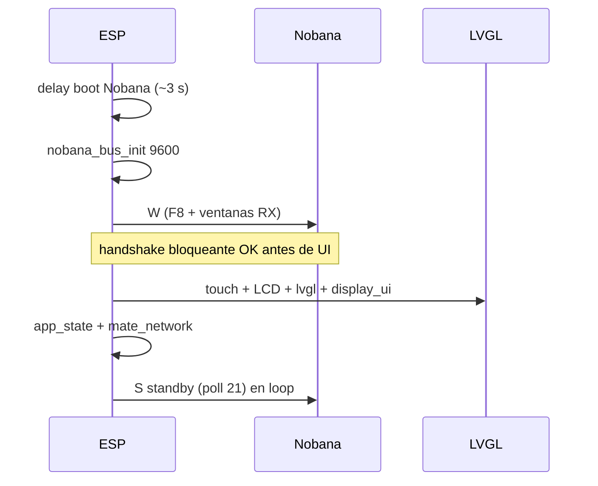
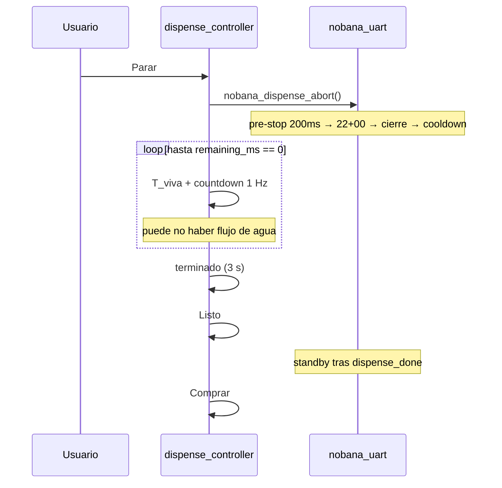

# Plan de implementación — Mate Point v0-3 (producto Waveshare + Nobana)

**Proyecto:** Mate Point — OT-00268 Etapa 3  
**Carpeta v0-3.0:** [`mate_point_v0-3/`](mate_point_v0-3/) — baseline implementado  
**Carpeta v0-3-1:** [`mate_point_v0-3-1/`](mate_point_v0-3-1/) — timer MQTT (§14)  
**Carpeta v0-3-2:** [`mate_point_v0-3-2/`](mate_point_v0-3-2/) — UI dispensado + Parar (§15)  
**Base:** [`mate_point_v0-2/`](mate_point_v0-2/) (UI + MQTT + QR) + driver [`mate_point_UART_v0-3/`](mate_point_UART_v0-3/) (Nobana validado en banco)  
**Plataforma:** Waveshare ESP32-S3-Touch-LCD-7B + TXS0108E → Nobana  
**Última actualización:** 2026-06-05  
**Estado v0-3.0:** **E2E parcial** — Test1; baseline superseded por v0-3-1  
**Estado v0-3-1:** **E2E banco OK** — Test1 2026-06-05 · [`2026-06-05-Waveshare-Mate_point-v0-3-1_Test1.md`](../tools/nobana_uart_sniffer/capturas/2026-06-05-Waveshare-Mate_point-v0-3-1_Test1.md)  
**Estado v0-3-2:** **Implementado** — fork v0-3-1; banco pendiente  
**Producto vigente (banco):** [`mate_point_v0-3-1/`](mate_point_v0-3-1/)  
**Desarrollo:** [`mate_point_v0-3-2/`](mate_point_v0-3-2/)

| Documento | Uso |
|-----------|-----|
| [`PLAN-IMPLEMENTACION.md`](PLAN-IMPLEMENTACION.md) | Índice maestro Fase 4.3 · §12 · §16 |
| [`PROTOCOLO-UART-NOBANA.md`](PROTOCOLO-UART-NOBANA.md) | Tramas, telemetría, fin manual §7.4 |
| [`PLAN-MATE-POINT-UART-v0-3.md`](PLAN-MATE-POINT-UART-v0-3.md) | POC UART (cerrada) + roadmap **`mate_point_v0-3-1`** §11 · **`mate_point_v0-3-2`** §12 |
| [`PLAN-POC-NOBANA-UART.md`](PLAN-POC-NOBANA-UART.md) | Etapa 1 + índice integración §10 |

> **Nombres:** `mate_point_UART_v0-3` = POC UART sin UI. `mate_point_v0-3` = producto v0-3.0 (baseline). `mate_point_v0-3-1` = producto con **`duration_ms`** como setpoint UART (§14). `mate_point_v0-3-2` = v0-3-1 + UI dispensado (temp, countdown, Parar) (§15).

---

## 1. Objetivo

Un solo firmware en Waveshare que:

1. Muestre la **misma UI y flujo** que v0-2 (Comprar → QR → pago → Dispensado → terminado → Listo → Comprar).
2. Mantenga **sesión Nobana** con standby **`S`** (poll `21`) en reposo y durante espera de pago.
3. Al confirmar pago (MQTT `dispense`), ejecute dispensado físico **`R`** (ciclo Coffee validado en banco).
4. Tras cada ciclo completo, permita **otra compra** (nuevo QR → nuevo pago → nuevo dispensado), con **`S`** activo de nuevo en pantalla de inicio.
5. Use el bus serial **exclusivamente** para comandos Nobana — **sin logs de firmware** en USB, UART USB ni UART Nobana.

---

## 2. Decisiones cerradas (2026-06-05)

| # | Tema | Decisión |
|---|------|----------|
| 1 | Carpeta | **`mate_point_v0-3/`** — fork de v0-2 + módulo Nobana |
| 2 | Bus serial | **Solo tráfico Nobana** (`F8` + tramas `0x68`) en UART hacia PCB. **Cero** `Serial.print` / `printf` / banners / CLI en USB CDC, UART de debug o el mismo UART Nobana |
| 3 | Validación en desarrollo | Sniffer (`tools/nobana_uart_sniffer/`), panel Nobana, UI LVGL — no monitor serie del firmware |
| 4 | Wake **`W`** | Ejecutar **antes** de inicializar LVGL / pantalla / touch |
| 5 | Orden `setup()` | Nobana bus + espera boot + handshake wake → **luego** `touch` / LCD / `lvgl_port` / `display_ui` / red |
| 6 | Standby **`S`** | Activo en **`COMPRAR`**, **`QR_SHOW`** y tras volver a inicio tras un dispensado exitoso |
| 7 | Dispensado **`R`** | Solo al entrar **`APP_DISPENSE`** (MQTT `dispense` aceptado en `QR_SHOW`) |
| 8 | Ciclos repetidos | Tras fin de **`R`** + UI Listo → **`COMPRAR`**: reactivar **`S`**; nueva orden QR → nuevo **`R`**. **No** segundo `dispense` **mientras** uno está en curso |
| 9 | Pines Waveshare | **GPIO44** RX · **GPIO43** TX (UART2 PH2.0) — igual POC UART v0-3 |
| 10 | Fin de ciclo Nobana | Sin `23` lock (igual POC 2a-WS) |
| 11 | `duration_ms` MQTT | **v0-3.0:** watchdog UI solo (§8.1, **superseded**). **v0-3-1:** setpoint dispensado total (§8.2, §14) |
| 12 | Cancelar en UI | **v0-3-2** — botón **Parar**; cierre §7.4 PROTOCOLO (**no** abort `X` v0-2 — §15.3.1) |
| 13 | Maestro / slave | **v0-3-1:** Waveshare maestro del timer y corte UART; Nobana slave; **sin** `progress` como corte (§14) |
| 14 | Fin UI **terminado** | **v0-3-1:** al fin del **stop** (cierre `22`), no al cooldown (§14.3) |

---

## 3. Hardware y Arduino IDE

| Item | Valor |
|------|--------|
| Placa | Waveshare ESP32-S3-Touch-LCD-7B |
| Flash / PSRAM | 16 MB / OPI 8 MB |
| DIP | **UART2** → PH2.0 Nobana |
| Level shifter | TXS0108E |
| ARMOR | Desconectado en banco producto |

| Cable Nobana | Waveshare |
|--------------|-----------|
| Nobana Tx → | GPIO **44** (RX) |
| Nobana Rx ← | GPIO **43** (TX) |
| GND | GND |

| Tools | Valor |
|-------|--------|
| Board | ESP32S3 Dev Module (wiki 7B) |
| **USB CDC On Boot** | **Disabled** (alineado POC UART — evitar uso casual de USB como log) |
| UART Nobana | **9600 8N1** desde reset en el UART cableado a 43/44 |

---

## 4. Bus limpio — sin logs de firmware

### 4.1 Regla

En **ningún** canal de salida del ESP32 debe haber texto ASCII de depuración del firmware:

| Canal | v0-2 (actual) | v0-3 (obligatorio) |
|-------|---------------|---------------------|
| USB CDC / `Serial` | `[boot]`, `[mqtt]`, `[app]`, … | **No inicializar para logs**; no `println` |
| UART Nobana (43/44) | N/A en v0-2 | **Solo** `F8` y frames `68 …` |
| Otro UART | — | **Prohibido** logs |

### 4.2 Implementación

- Eliminar o no portar todas las llamadas `Serial.*` de `mate_point_v0-2` (`mate_network`, `app_state`, `order_client`, `.ino`).
- `nobana_uart` único escritor del UART Nobana.
- Errores Wi‑Fi / HTTP / MQTT: reflejar en **UI** (labels footer, mensaje central) si hace falta; no en serie.
- Compilar con macros vacías si se desea mantener hooks de debug desactivados: `#define LOG(...) ((void)0)` — por defecto **off** en v0-3.

### 4.3 Verificación

- Sniffer en TX Waveshare: solo `F8` y tramas `0x68` (mismo criterio que [`2026-06-04-Waveshare-UART-v0-3_banco-validacion-OK.md`](../tools/nobana_uart_sniffer/capturas/2026-06-04-Waveshare-UART-v0-3_banco-validacion-OK.md)).
- Monitor USB conectado: **silencio** (o sin CDC).

---

## 5. Secuencia de arranque (`setup`)



| Paso | Acción |
|------|--------|
| 1 | `delay(AUTO_T_BOOT_MS)` — Nobana puede encender después del ESP |
| 2 | `nobana_bus_init()` — 9600, pines 44/43 |
| 3 | `nobana_wake_blocking()` — `F8`, ventanas RX (equivalente `W` POC; incluye `delay` post-F8 **sin** LVGL activo) |
| 4 | `standby_begin()` — preparar poll `21` |
| 5 | Inicializar touch, panel RGB, `lvgl_port_init`, `display_ui_init`, `app_state_init`, `mate_network_init` |
| 6 | `loop`: `mate_network_loop` + `app_state_tick` + `nobana_tick` |

**Motivo:** los `delay()` del wake no bloquean la tarea LVGL porque LVGL aún no existe.

---

## 6. Arquitectura de software

```
mate_point_v0-3/
├── mate_point_v0-3.ino
├── config.h
├── app_state.cpp / .h          ← máquina UI (igual v0-2)
├── display_ui.cpp / .h
├── mate_network.cpp / .h       ← sin Serial
├── order_client.cpp / .h       ← sin Serial
├── dispense_controller.cpp / .h  ← orquesta UI + MQTT + Nobana (reemplaza dispense_sim)
├── nobana_uart.cpp / .h        ← extraído de mate_point_UART_v0-3.ino (sin auto_tick)
├── qr_static_img.c, order_client, port LVGL…
└── [port Waveshare: lvgl_port, rgb_lcd, gt911, …]
```

### 6.1 API `nobana_uart` (borrador)

| Función | Uso |
|---------|-----|
| `nobana_bus_init()` | UART 9600, pines 44/43 |
| `nobana_wake_blocking()` | Una vez en `setup` |
| `nobana_tick()` | `handshake` residual (si aplica), `standby_tick`, `dispense_tick` |
| `nobana_standby_enable()` / `nobana_standby_active()` | Control **`S`** |
| `nobana_dispense_start()` | Inicia **`R`** (v0-3.0: sin parámetro de tiempo) |
| `nobana_dispense_start(uint32_t duration_ms)` | **v0-3-1:** inicia **`R`** con presupuesto MQTT (§14) |
| `nobana_dispense_busy()` | true durante ciclo R (incluye cooldown) |
| `nobana_dispense_stop_done()` | **v0-3-1:** true al fin del stop/cierre — dispara UI **terminado** |
| `nobana_dispense_done()` | true una vez al terminar cooldown (máquina lista) |
| `nobana_dispense_abort_manual()` | **P1** — §7.4 PROTOCOLO |

### 6.2 `dispense_controller`

**v0-3.0 (implementado en `mate_point_v0-3/`):**

- `dispense_on_command(order_id, duration_ms)`: UI **Dispensado** + `nobana_dispense_start()` (sin pasar tiempo a UART).
- Espera `nobana_dispense_done()` (cooldown incluido) para **terminado** → **Listo**.
- `duration_ms`: watchdog UI en `dispensing` (§8.1) — origen **Error dispensado** en Test1.

**v0-3-1 (objetivo en `mate_point_v0-3-1/`):**

- `dispense_on_command(order_id, duration_ms)`: UI **Dispensado** + `nobana_dispense_start(duration_ms)`.
- **terminado** al consumir `nobana_dispense_stop_done()` (fin stop, §14.3).
- **Listo** 3 s después de terminado; **sin watchdog** duplicado.
- `nobana_standby_enable()` y nuevo **Comprar** solo tras `nobana_dispense_done()` (cooldown completo).

---

## 7. Flujo de usuario y máquina de estados

Hereda **§14** de [`PLAN-IMPLEMENTACION.md`](PLAN-IMPLEMENTACION.md) con estos ajustes:

| Estado app | UI | Nobana | MQTT `status` |
|------------|-----|--------|---------------|
| `COMPRAR` | Botón Comprar | **`S`** activo | `idle` |
| `CREATING` | Creando orden… | **`S`** | `idle` |
| `QR_SHOW` | QR + countdown | **`S`** | `idle` |
| `DISPENSE` | **v0-3-1:** texto **Dispensado**. **v0-3-2:** **`83°`** + countdown + botón **Parar** (§15) | **`R`** activo; **`S`** pausado | `dispensing` |
| post-stop | **terminado** (**v0-3-1**) | cooldown en background | `dispensing` |
| post-terminado | **Listo** (3 s) | cooldown puede seguir | `dispensing` |
| `COMPRAR` (nuevo ciclo) | Comprar (bloqueado hasta fin cooldown **v0-3-1**) | **`S`** tras `nobana_dispense_done()` | `idle` |

> **v0-3.0:** UI **terminado** aparece junto con **Listo** al fin del cooldown (`nobana_dispense_done()`), no al fin del stop. **v0-3-1** corrige esto (§14.3).

### 7.1 Reglas MQTT / órdenes

- Procesar `dispense` **solo** en `QR_SHOW` (igual v0-2).
- Dedup por `order_id` en el **mismo** ciclo de compra.
- Tras volver a `COMPRAR`, **`last_order_id` / dedup** debe permitir un **nuevo** `order_id` (nueva compra QR).
- **Ignorar** segundo `dispense` si `DISPENSE` ya activo (sin UI error — heredado v0-2).

### 7.2 Ciclo repetido (requisito explícito)

Secuencia de aceptación multi-venta en una misma sesión de encendido:

1. Comprar → QR → pago → dispensado físico + UI completa → **Listo** → **Comprar**.
2. Verificar poll `21` (**`S`**) en pantalla inicio.
3. Repetir paso 1 con **otra** orden (nuevo `order_id`).
4. Segundo dispensado físico exitoso.

Wake **`W`** sigue siendo **una vez por boot** (salvo política futura de re-wake por timeout 12 s documentada en banco).

---

## 8. `duration_ms` (MQTT)

### 8.1 v0-3.0 — baseline (`mate_point_v0-3/`) — **superseded**

| Fuente | Valor típico |
|--------|----------------|
| Servidor | `DISPENSE_DURATION_MS` default **120000** (herencia v0-2 simulada) |
| Timer UART | Replay fijo Coffee 180 ml: `DISPENSE_T_DISPENSE_MS` 24 s, `progress ≥ 155` |
| Ciclo Nobana total | ~24 s + pre-stop + cierre + ~15 s cooldown ≈ **~45 s** |

En v0-3.0, `duration_ms` **no** controla el UART. Solo actúa como watchdog UI si Nobana sigue `busy()` al vencer — mensaje **Error dispensado** (Test1 ~30 s). Ver [`2026-06-05-Waveshare-Mate_point-v0-3_Test1.md`](../tools/nobana_uart_sniffer/capturas/2026-06-05-Waveshare-Mate_point-v0-3_Test1.md).

### 8.2 v0-3-1 — contrato vigente (`mate_point_v0-3-1/`)

| Campo | Definición |
|-------|------------|
| `duration_ms` | Tiempo **total de dispensado** contratado: fase activa (`E2`) + pre-stop + stop/cierre |
| **Fuera de `duration_ms`** | Cooldown post-cierre (~15 s) |
| Servidor | Publica tiempo según producto pagado (tope de líquido vía calibración ms); recalibrar `DISPENSE_DURATION_MS` (~**30000** ms ref. Coffee 180 ml, banco) |
| Firmware | `active_ms = duration_ms - PRESTOP_MS - CLOSE_BUDGET_MS`; **sin** watchdog duplicado |

Detalle completo: §14 y [`PLAN-MATE-POINT-UART-v0-3.md`](PLAN-MATE-POINT-UART-v0-3.md) §11.

---

## 9. Botón cancelar — implementado en v0-3-2 (§15)

| Ítem | Detalle |
|------|---------|
| UI | Botón **Parar** en pantalla dispensado (§15.2) |
| UART | Pre-stop `E2`+`b5=04` (~1,8 s) → **`22`+`b5=00` directo** (§7.4 PROTOCOLO) → cierre → cooldown |
| Post-abort | **terminado** → Listo → Comprar (igual v0-3-1; cooldown completo antes de **`S`**) |
| **No usar** | `dispense_abort()` del POC [`mate_point_UART_v0-2`](mate_point_UART_v0-2/) — ver §15.3.1 |

> **Nota:** [`mate_point_UART_v0-3`](mate_point_UART_v0-3/) **no tiene** comando `X` (ciclo 100 % automático). El abort serial **`X`** está solo en UART v0-2.

---

## 10. Tareas de implementación

| Fase | # | Tarea | Verificación |
|------|---|--------|--------------|
| Prep | 1 | Crear `mate_point_v0-3/` desde v0-2 | Compila |
| Prep | 2 | Quitar todo `Serial` del producto | USB y UART sin ASCII firmware |
| Nobana | 3 | Extraer `nobana_uart.*` desde UART v0-3 | Sin `auto_tick` |
| Nobana | 4 | Wake bloqueante **antes** de LVGL en `.ino` | Sniffer: F8 al boot, UI después |
| Nobana | 5 | `S` en COMPRAR/QR; pausar en R | Poll `21` en espera pago |
| Integ | 6 | `dispense_controller` | MQTT dispense → R |
| Integ | 7 | Fin UI atado a `nobana_dispense_done()` | v0-3.0 [x] Test1 |
| Integ | 8 | Tras Listo → `S` + Comprar | v0-3.0 [~] Test1 |
| Integ | 9 | Watchdog `duration_ms` | v0-3.0 [x] — **eliminar en v0-3-1** |
| UI | 10 | (P1) Cancelar §9 | Banco §7.4 |
| QA | 11 | E2E doble compra mismo boot | v0-3.0 [x] Test1 |
| QA | 12 | Captura sniffer E2E producto | Test1b pendiente |
| **v0-3-1** | 13–22 | Ver §14.5 | [x] Test1 2026-06-05 |

---

## 11. Criterios de aceptación

Leyenda: **[x]** validado · **[~]** parcial · **[ ]** pendiente.

### 11.1 v0-3.0 (`mate_point_v0-3/`) — baseline cerrado parcial

**UI / red**

- [x] Comprar, QR, countdown 2 min — Test1 2026-06-05.
- [~] E2E pago → **Dispensado** → terminado → Listo → Comprar — Test1: Dispensado + Listo OK; **terminado** no visto (**Error dispensado** ~30 s; watchdog vs ciclo fijo §8.1).
- [x] WiFi/MQTT en footer — Test1.
- [x] Dos ciclos Comprar→pago→dispensado en un encendido — Test1.

**Nobana**

- [~] Wake pre-LVGL; **`S`** en QR — Test1 indirecto.
- [x] MQTT `dispense` → **`R`** Coffee — Test1.
- [ ] Bus solo protocolo (sniffer) — Test1b.
- [ ] **`S`** tras cada ciclo — Test1b.

**Bus limpio**

- [ ] Sin logs firmware — Test1b.

### 11.2 v0-3-1 (`mate_point_v0-3-1/`) — **validado Test1 2026-06-05**

- [x] `duration_ms` MQTT controla corte UART — dispensado al tiempo MQTT observado.
- [~] Volumen físico coherente con `duration_ms` — OK en banco; medición ml pendiente.
- [x] UI **terminado** al fin del stop; **Listo** unos segundos después; sin **Error dispensado**.
- [x] Flujo **Comprar** tras ciclo completo (cooldown + `S`).
- [~] Sniffer TX + payload MQTT archivado — pendiente.
- [x] Servidor `DISPENSE_DURATION_MS=30000` alineado al producto.

**Fuera de alcance v0-3.1**

- Segundo `dispense` concurrente.
- Campo `volume_ml` en MQTT.
- `23` lock, tanque vacío, TLS, cancelar UI (P1) §9.

### 11.3 v0-3-2 (`mate_point_v0-3-2/`) — **implementado, superseded por v0-3-3**

- [x] Fork desde v0-3-1; `MQTT_CLIENT_ID` v03-2.
- [x] Panel dispensado: T_viva + countdown + **Parar** (1 Hz).
- [x] `nobana_dispense_abort()` ruta §7.4 (pre-stop 1,8 s → `22+00` directo).
- [x] Banco con matices — delay Parar ~2–3 s; ver análisis §15.3.
- [ ] Sniffer Parar formal.

**Superseded:** [`mate_point_v0-3-3`](mate_point_v0-3-3/) — pre-stop 200 ms + UI contrato desacoplado.

### 11.4 v0-3-3 (`mate_point_v0-3-3/`) — **validado Test1 2026-06-05**

- [x] Pre-stop manual **200 ms** → `22+00` — **funcional** en Nobana real.
- [x] Corte flujo ~**300–500 ms** tras tap **Parar** (sensorial banco).
- [x] UI: T_viva viva + countdown hasta **0:00** tras Parar; ventana sin flujo observable.
- [x] **terminado** al countdown 0; **Listo** → **Comprar**.
- [x] Sin MQTT adicional al Parar.
- [x] **Fin natural timer** (V8) — countdown 0 → terminado → Listo → Comprar.
- [x] **Segunda compra** tras Parar — OK tras esperar countdown a **0:00**.
- [~] Sniffer TX — pendiente.

Captura: [`2026-06-05-Waveshare-Mate_point-v0-3-3_Test1.md`](../tools/nobana_uart_sniffer/capturas/2026-06-05-Waveshare-Mate_point-v0-3-3_Test1.md)

**Hereda de v0-3-1:** timer MQTT, bus limpio, cooldown en background.

**Fuera de alcance v0-3-3**

- Notificar abort por MQTT al servidor.
- Campo `volume_ml`, tanque vacío en UI, TLS.

---

## 13. Registro de validación banco

| Fecha | Documento | Alcance | Resultado |
|-------|-----------|---------|-----------|
| 2026-06-04 | [`2026-06-04-Waveshare-UART-v0-3_banco-validacion-OK.md`](../tools/nobana_uart_sniffer/capturas/2026-06-04-Waveshare-UART-v0-3_banco-validacion-OK.md) | POC [`mate_point_UART_v0-3`](mate_point_UART_v0-3/) — W→S→R auto, sin UI/MQTT | **Cerrado OK** |
| 2026-06-05 | [`2026-06-05-Waveshare-Mate_point-v0-3_Test1.md`](../tools/nobana_uart_sniffer/capturas/2026-06-05-Waveshare-Mate_point-v0-3_Test1.md) | Producto [`mate_point_v0-3`](mate_point_v0-3/) — E2E pago MP + Nobana + 2.ª compra | **Parcial** |
| 2026-06-05 | [`2026-06-05-Waveshare-Mate_point-v0-3-1_Test1.md`](../tools/nobana_uart_sniffer/capturas/2026-06-05-Waveshare-Mate_point-v0-3-1_Test1.md) | Producto [`mate_point_v0-3-1`](mate_point_v0-3-1/) — timer MQTT, terminado → Listo | **OK** |
| 2026-06-05 | [`2026-06-05-Waveshare-Mate_point-v0-3-3_Test1.md`](../tools/nobana_uart_sniffer/capturas/2026-06-05-Waveshare-Mate_point-v0-3-3_Test1.md) | Producto [`mate_point_v0-3-3`](mate_point_v0-3-3/) — Parar, timer natural, 2.ª compra tras Parar | **E2E OK** |

### Validado en Test1 v0-3-3 (2026-06-05)

- **Parar** manual: corte ~**300–500 ms**; UI mantiene T_viva + countdown hasta **0:00** (ventana sin flujo).
- **Fin natural** timer MQTT: countdown → **terminado** → **Listo** → **Comprar**.
- **Segunda compra** tras Parar: funcional; requiere esperar countdown a cero antes de volver a **Comprar**.
- E2E pago sandbox + Nobana en banco; sin sniffer TX.

### Validado en Test1 v0-3-1 (2026-06-05)

- Dispensado físico durante el tiempo definido por **`duration_ms`** MQTT (`DISPENSE_DURATION_MS=30000`).
- Secuencia UI: **Dispensado** → **terminado** (fin stop) → **Listo** (~3 s) → **Comprar**.
- Sin pantalla **Error dispensado** (watchdog eliminado).
- E2E pago sandbox + Nobana en banco.

### Validado en Test1 v0-3.0 (2026-06-05)

- Wake bloqueante **antes** de LVGL (`nobana_product_init` en `setup`).
- Flujo UI v0-2: Comprar → orden/QR → pago → **Dispensado**.
- MQTT `dispense` dispara dispensado físico **R** en Nobana.
- Fin de ciclo Nobana atado a UI: **Listo** → **Comprar** (~45–50 s tras inicio R, coherente con cooldown driver).
- Segunda compra en el mismo encendido (dedup / nueva orden).
- Wi‑Fi y MQTT en footer tras arranque UI.

### Pendiente v0-3.0 (Test1b — opcional, baseline)

| # | Qué | Cómo |
|---|-----|------|
| 1 | Sniffer TX: solo `F8` + tramas `0x68` | Test1b |
| 2 | Poll `21` en Comprar y post-ciclo | Sniffer |
| 3 | USB sin ASCII | Monitor CDC off |

### Pendiente opcional (sniffer / calibración)

- Sniffer TX en E2E producto v0-3-1: archivar tramas y payload MQTT del pago.
- Medición de volumen (ml) vs `duration_ms=30000` para tabla de producto en servidor.

---

## 12. Riesgos

| Riesgo | Mitigación |
|--------|------------|
| Depurar sin Serial | Sniffer + UI + panel Nobana |
| Wake bloquea arranque si Nobana off | Timeout 12 s; UI puede mostrar error tras LVGL init |
| `delay` en wake | Solo antes de LVGL (§5) |
| Abort brusco | §9 manual PROTOCOLO |
| Dedup bloquea segunda compra | Limpiar dedup al volver a `COMPRAR` |
| `duration_ms` servidor en 120000 | Recalibrar en v0-3-1 (§14.2) |
| UI Listo antes de cooldown | Bloquear Comprar hasta `nobana_dispense_done()` (§14.3) |
| Pre-stop en cortes tempranos | Validar en banco; ruta manual §7.4 PROTOCOLO si hace falta |

---

## 14. Iteración `mate_point_v0-3-1` (timer MQTT)

**Carpeta:** [`mate_point_v0-3-1/`](mate_point_v0-3-1/) — fork de [`mate_point_v0-3/`](mate_point_v0-3/).  
**Plan hermano:** [`PLAN-MATE-POINT-UART-v0-3.md`](PLAN-MATE-POINT-UART-v0-3.md) §11 (mismo contenido, vista roadmap UART).

### 14.1 Motivación

v0-3.0 integra UI+MQTT+Nobana pero dispensa con **replay fijo** Coffee 180 ml (`progress ≥ 155`, 24 s). El servidor publica `duration_ms` con otro significado (watchdog / 120 s simulado). Test1 mostró **Error dispensado** por esa desalineación. v0-3-1 unifica: **una sola fuente de verdad temporal** en MQTT.

### 14.2 Modelo maestro / slave y `duration_ms`

| Rol | Responsabilidad |
|-----|-----------------|
| **Waveshare** | Maestro: inicia `R`, mide tiempo, envía pre-stop y stop, ejecuta cooldown |
| **Nobana** | Slave: responde polls; telemetría opcional — **no** define volumen |
| **Servidor** | `duration_ms` = tiempo total dispensado (activo + pre-stop + stop) según producto pagado |

```
active_ms = duration_ms - PRESTOP_MS - CLOSE_BUDGET_MS
```

Cooldown (~15 s) **fuera** de `duration_ms`. Sin corte por `progress ≥ 155`. Sin watchdog duplicado.

### 14.3 Fin de ciclo UI

| Evento | Momento |
|--------|---------|
| **Dispensado** | MQTT `dispense` aceptado |
| Corte UART | Al consumir presupuesto `duration_ms` |
| **terminado** | Fin fase stop/cierre (`DISPENSE_CLOSE_22_00`) — **no** cooldown |
| **Listo** | 3 s tras terminado |
| **`S`** / Comprar | Solo tras `nobana_dispense_done()` (cooldown completo) |

### 14.4 Cambios de software (resumen)

| Módulo | Cambio |
|--------|--------|
| `nobana_uart` | `nobana_dispense_start(duration_ms)`; presupuesto activo; `nobana_dispense_stop_done()` |
| `dispense_controller` | Sin watchdog; terminado en `stop_done`; bloqueo Comprar hasta cooldown |
| Servidor | `DISPENSE_DURATION_MS` calibrado (~30000 ms ref. 180 ml) |

### 14.5 Tareas

| # | Tarea | Verificación |
|---|--------|--------------|
| 1 | Fork `mate_point_v0-3-1/` | [x] |
| 2 | Pasar `duration_ms` a UART; quitar corte por `progress` | [x] Test1 |
| 3 | `stop_done` → UI terminado | [x] Test1 |
| 4 | Quitar watchdog `dispense_controller` | [x] Test1 |
| 5 | Bloquear Comprar hasta cooldown | [x] Test1 |
| 6 | Ajustar servidor `DISPENSE_DURATION_MS` | [x] 30000 |
| 7 | E2E Test1 + sniffer + volumen | [x] E2E · [ ] sniffer · [ ] ml |

---

## 15. Iteración `mate_point_v0-3-2` (UI dispensado + Parar)

**Carpeta:** [`mate_point_v0-3-2/`](mate_point_v0-3-2/) — fork de [`mate_point_v0-3-1/`](mate_point_v0-3-1/).  
**Plan hermano:** [`PLAN-MATE-POINT-UART-v0-3.md`](PLAN-MATE-POINT-UART-v0-3.md) §12.

### 15.1 Motivación

v0-3-1 muestra el texto fijo **Dispensado** durante todo el ciclo **`R`**. El operador no ve temperatura de salida ni tiempo restante, y no puede cortar el flujo desde la pantalla. v0-3-2 expone telemetría UART en UI y replica el **stop manual Coffee** documentado en banco (botón Coffee del ARMOR → equivalente **Parar** en touch).

### 15.2 Pantalla dispensado (LVGL)

Reemplazar `label_main` **Dispensado** por un **panel dedicado** visible solo en `APP_DISPENSE` / fase `DISPENSING`:

```
        ┌─────────────────────────┐
        │          83°            │  ← Montserrat 44 (= "Listo" / "terminado")
        │         0:24            │  ← Montserrat 28 (más chico)
        │    ┌─────────────┐      │
        │    │    Parar    │      │  ← 280×90, rojo, texto blanco Montserrat 44
        │    └─────────────┘      │
        │  Wifi / MQTT (footer)   │
        └─────────────────────────┘
```

| Elemento | Especificación |
|----------|----------------|
| Temperatura | Formato `"83°"` (byte 3 RX = T_viva ≈ °C). Placeholder `"—°"` hasta primer poll válido. |
| Countdown | `(start_ms + duration_ms) − now`, formato `M:SS`. Cubre activo + pre-stop + cierre; cooldown fuera. |
| Botón Parar | Mismo tamaño que **Comprar** (`280×90`). Fondo rojo, label blanco. **`LV_STATE_DISABLED` inmediato al tap.** |
| Refresh | **1 Hz** — temp y countdown; UART sigue a ~100 ms en background. |
| Post-dispense | Ocultar panel; **terminado** / **Listo** en `label_main` como v0-3-1. |

Habilitar `lv_font_montserrat_28` (u equivalente) en config LVGL solo para el label countdown.

### 15.3 Stop manual UART (ref. captura 2026-06-03)

Captura: [`2026-06-03-inicio-dispense-coffee-fin_manual.md`](../tools/nobana_uart_sniffer/capturas/2026-06-03-inicio-dispense-coffee-fin_manual.md) · norma [`PROTOCOLO-UART-NOBANA.md`](PROTOCOLO-UART-NOBANA.md) §7.4.

| Paso | Trama ARM→NOB | Notas captura |
|------|---------------|---------------|
| Dispensado activo | `68 … E2 00 00 00 00 55 …` | 17:38:01 — T_viva sube |
| Pre-stop manual | `68 … E2 00 00 **04** 00 55 …` | 17:38:15 — ~**1,8 s** (no 3,9 s del timer) |
| Stop directo | `68 … **22** 00 00 **00** 00 55 …` | 17:38:17 — **sin** paso `22+b5=04` del timer |
| Cierre NOB | NOB `b2=11`, T_viva baja | ~11,7 s polling `22+00` |
| Lock | `68 … 23 … 55 …` | Post-ciclo (cooldown producto v0-3-1 sigue sin `23`) |

**Diferencia vs timer v0-3-1:**

| | Timer | Manual (Parar) |
|--|-------|----------------|
| Pre-stop | ~3900 ms | ~**1800 ms** |
| Stop intermedio | `22+b5=04` → `22+00` | **`22+b5=00` directo** |

API propuesta: `nobana_dispense_abort()` — flag `manual_abort`; desde `DISPENSE_ACTIVE` o `PRE_STOP` activo; saltar fase `STOP_22_04`.

### 15.3.1 Relación con POC UART v0-2 / v0-3 (análisis código)

| Firmware | Comando abort | Qué hace realmente |
|----------|---------------|-------------------|
| [`mate_point_UART_v0-3`](mate_point_UART_v0-3/) | **Ninguno** | Ciclo auto W→S→R; FSM idéntica a v0-2 pero sin Serial/CLI |
| [`mate_point_UART_v0-2`](mate_point_UART_v0-2/) | **`X`** | `dispense_abort()` → `dispense_finish()` — **apaga FSM** y reanuda poll `21`; **no envía** pre-stop ni `22` |

Código v0-2 (no reutilizar en producto):

```523:526:mate_point_firmware/mate_point_UART_v0-2/mate_point_UART_v0-2.ino
static void dispense_abort(const char *reason)
{
    dispense_finish(reason, true);
}
```

Evidencia captura [`2026-06-04-Water_empty_ESP-UART-v0-2.md`](../tools/nobana_uart_sniffer/capturas/2026-06-04-Water_empty_ESP-UART-v0-2.md): tras `X` aparece `[dispense] FIN (usuario_X)` y standby `21` **sin** tramas `E2+04` ni `22+00`. El Nobana puede seguir en estado intermedio; no es equivalente al botón Coffee del ARMOR (§7.4).

**Qué sí heredar del POC UART:**

| De v0-3 / v0-3-1 | Uso v0-3-2 |
|------------------|------------|
| FSM fases `ACTIVE → PRE_STOP → CLOSE → COOLDOWN` | Base de `nobana_uart.cpp` producto |
| `dispense_enter_phase`, poll 100 ms, `b2=11` cierre | Sin cambios en fin normal |
| v0-2 `store_telemetry`: `t_live = data[3]` | Referencia para T_viva en UI |

**Implementación Parar (distinto de `X`):**

1. Tap **Parar** → `s_manual_abort = true`; deshabilitar botón UI.
2. Si `DISPENSE_ACTIVE`: entrar `PRE_STOP` de inmediato (cancelar deadline timer activo).
3. En `PRE_STOP` con `manual_abort`: timeout **1800 ms** (no 3900); al vencer → `CLOSE_22_00` enviando **`22+b5=00`** — **no** pasar por `STOP_22_04`.
4. Completar `CLOSE` + `COOLDOWN` + pulse `stop_done` como fin normal → UI **terminado**.

**Conclusión:** el plan §15.3 (ruta §7.4 + captura ARMOR 2026-06-03) **se mantiene**. No adaptar la semántica de `X` v0-2 al botón **Parar**.

- **Parar no publica MQTT** — sin `publish` extra ni cambio de contrato servidor; `status` periódico (30 s) sin alteración.
- Tras abort: misma secuencia UI v0-3-1 → **terminado** (fin stop) → **Listo** (3 s) → **Comprar** (tras cooldown).

### 15.5 Cambios de software (resumen)

| Módulo | Cambio |
|--------|--------|
| `nobana_uart` | Parsear T_viva (byte 3); guardar `start_ms` + `duration_ms`; `nobana_live_temp_c()`; `nobana_dispense_remaining_ms()`; `nobana_dispense_abort()` ruta §7.4 |
| `display_ui` | Panel dispensado; APIs temp/countdown/Parar; estilos botón rojo |
| `dispense_controller` | Tick UI 1 Hz en `DISPENSING`; callback Parar |
| `app_state` | Registrar callback; ocultar panel al salir de dispensado |
| `mate_network` | **Sin cambios** por Parar |

### 15.6 Tareas

| # | Tarea | Verificación |
|---|--------|--------------|
| 1 | Fork `mate_point_v0-3-2/` desde v0-3-1 | [ ] |
| 2 | Telemetría T_viva + APIs remaining/temp | [ ] |
| 3 | Panel UI + countdown 1 Hz | [ ] |
| 4 | Botón Parar (disabled al tap) | [ ] |
| 5 | `nobana_dispense_abort()` ruta manual §7.4 | [ ] sniffer |
| 6 | E2E: timer completo 30 s | [ ] |
| 7 | E2E: Parar ~10 s + segunda compra | [ ] |

### 15.7 Criterios de aceptación (banco v0-3-2)

| ID | Criterio |
|----|----------|
| U1 | Temperatura visible y actualizada (~1 s); sube durante dispensado |
| U2 | Countdown desde `duration_ms` hasta fin stop/cierre |
| U3 | Parar corta flujo; botón disabled al tap |
| U4 | Sniffer: Parar usa `E2+04` ~1,8 s → `22+00` (**no** `22+04`) |
| U5 | UI → terminado → Listo → Comprar (igual v0-3-1) |
| U6 | Sin publish MQTT adicional al Parar |
| U7 | Segunda compra tras parada manual |

---

## 16. `mate_point_v0-3-3` — Parar rápido + UI contrato desacoplado

**Carpeta:** [`mate_point_v0-3-3/`](mate_point_v0-3-3/) — fork de [`mate_point_v0-3-2/`](mate_point_v0-3-2/).

### 16.1 Objetivo

Dos mejoras sobre v0-3-2, validadas como **prueba de producto** (no norma ARMOR):

1. **Corte hidráulico más rápido** al apretar **Parar** — pre-stop manual acortado.
2. **UI desacoplada del ciclo UART** — pantalla dispensado (T_viva + countdown) sigue hasta `remaining_ms == 0`; recién ahí **terminado** → **Listo**.

### 16.2 Decisiones cerradas (2026-06-05)

| Tema | Decisión |
|------|----------|
| Pre-stop manual (Parar) | **`E2+b5=04` durante 200 ms** → `22+b5=00` directo (sin `22+04`) |
| Pre-stop timer (fin natural) | Sin cambio — ~3900 ms + ruta timer v0-3-1 |
| Temperatura tras Parar | **T_viva en vivo** (telemetría UART; poll `21` en cola UI si Nobana ya terminó ciclo hidráulico) |
| Trigger **terminado** | **`remaining_ms == 0`** (contrato MQTT `duration_ms`), **no** `stop_done` |
| Ventana post-Parar | Usuario puede ver countdown ~20 s **sin flujo** — comportamiento esperado en prueba |
| Bloqueo **Comprar** | **`dispense_cycle_active()`** — fase UI ≠ LISTO |
| MQTT al Parar | **Sin** publish adicional |
| Referencia ARMOR §7.4 | v0-3-3 usa pre-stop **200 ms** (no 1,8 s ARMOR); **funcional en banco**; sniffer TX pendiente |

### 16.3 UART — abort manual rápido

Basado en §7.4 (misma secuencia de tramas, distinto timeout):

| Paso | Trama | Duración v0-3-3 |
|------|-------|-----------------|
| Pre-stop | `E2+b5=04` | **200 ms** (`DISPENSE_T_PRESTOP_FAST_MS`) |
| Stop | `22+b5=00` directo | inmediato tras pre-stop |
| Cierre + cooldown | igual v0-3-1 | sin cambios |

> **Banco 2026-06-05:** pre-stop 200 ms **validado funcional** en Nobana real. Corte sensorial ~**300–500 ms** (tap → agua para). Sniffer formal pendiente.

### 16.4 UI — contrato vs hidráulico



| Reloj | Fuente | Fin |
|-------|--------|-----|
| **Hidráulico** | FSM Nobana | `22+00` + cierre + cooldown (~300–500 ms hasta corte flujo) |
| **UI contrato** | `contract_start_ms + duration_ms` | Countdown **0:00** → terminado |

El countdown UI vive en **`dispense_controller`** (no en `nobana_dispense_remaining_ms()` post-`dispense_finish`).

### 16.5 Cambios de software

| Módulo | Cambio |
|--------|--------|
| `nobana_uart` | `DISPENSE_T_PRESTOP_FAST_MS = 200`; `prestop_duration_ms()` usa fast en `manual_abort` |
| `dispense_controller` | `contract_start_ms` + `contract_duration_ms`; terminado al countdown 0; standby poll en cola UI; descartar `stop_done` |
| `display_ui` | Sin cambios |
| `mate_network` | Sin cambios por Parar |

### 16.6 Tareas

| # | Tarea | Verificación |
|---|--------|--------------|
| 1 | Fork `mate_point_v0-3-3/` desde v0-3-2 | [x] |
| 2 | Pre-stop 200 ms + abort manual | [x] banco — funcional (~300–500 ms corte) |
| 3 | UI countdown desacoplado + terminado en 0 | [x] Test1 |
| 4 | T_viva viva en cola post-Parar | [x] Test1 |
| 5 | E2E Parar temprano + fin natural + 2.ª compra | [x] Test1 |

### 16.7 Criterios de aceptación (banco v0-3-3)

| ID | Criterio | Test1 |
|----|----------|-------|
| V1 | Parar: sniffer `E2+04` ~**200 ms** → `22+00` (no `22+04`) | [ ] sniffer pendiente |
| V2 | Flujo corta antes que en v0-3-2 (~1,8 s pre-stop) | [x] ~**300–500 ms** |
| V3 | Tras Parar: UI mantiene T_viva + countdown hasta **0:00** | [x] |
| V4 | **terminado** solo cuando countdown = 0 (no al fin hidráulico) | [x] |
| V5 | Ventana sin flujo + countdown > 0 observable en prueba | [x] |
| V6 | terminado → Listo → Comprar; 2.ª compra OK | [x] tras Parar (esperar countdown 0) |
| V7 | Sin MQTT adicional al Parar | [x] |
| V8 | Fin natural (timer): misma regla UI (terminado en countdown 0) | [x] |

Captura Test1: [`2026-06-05-Waveshare-Mate_point-v0-3-3_Test1.md`](../tools/nobana_uart_sniffer/capturas/2026-06-05-Waveshare-Mate_point-v0-3-3_Test1.md)

---

## Changelog

| Fecha | Cambio |
|-------|--------|
| 2026-06-05 | Plan inicial v0-3: merge v0-2 + UART v0-3; bus sin logs; wake pre-LVGL; ciclos repetidos con S |
| 2026-06-05 | §11 criterios con estado Test1; §13 registro validación; enlace captura E2E Test1 |
| 2026-06-05 | Alineación v0-3-1: §8.1/8.2, §14 timer MQTT; fin UI en stop; sin watchdog; criterios §11.1/11.2; ref. PLAN-MATE-POINT-UART-v0-3 §11 |
| 2026-06-05 | **v0-3-1 Test1 OK** — E2E timer MQTT; terminado → Listo; captura [`2026-06-05-Waveshare-Mate_point-v0-3-1_Test1.md`](../tools/nobana_uart_sniffer/capturas/2026-06-05-Waveshare-Mate_point-v0-3-1_Test1.md) |
| 2026-06-05 | **§15 `mate_point_v0-3-2`** — UI dispensado (T_viva, countdown, Parar); stop manual §7.4; §11.3 criterios |
| 2026-06-05 | **§15.3.1** — análisis POC UART: v0-3 sin `X`; v0-2 `X` = abort blando (no §7.4); Parar ≠ `dispense_abort()` v0-2 |
| 2026-06-05 | **§16 `mate_point_v0-3-3`** — Parar pre-stop 200 ms; UI contrato desacoplado (terminado en countdown 0); T_viva viva |
| 2026-06-05 | **v0-3-3 Test1 OK** — banco Nobana; corte Parar ~300–500 ms; captura [`2026-06-05-Waveshare-Mate_point-v0-3-3_Test1.md`](../tools/nobana_uart_sniffer/capturas/2026-06-05-Waveshare-Mate_point-v0-3-3_Test1.md) |
| 2026-06-05 | **v0-3-3 Test1 E2E completo** — fin natural timer + 2.ª compra tras Parar (countdown a 0) |
