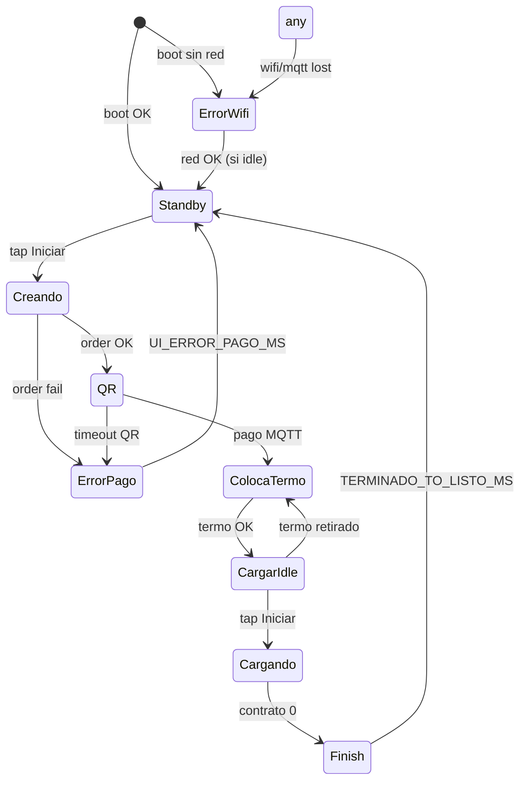

# Plan de implementación UI — Mate Point v0-4

**Proyecto:** Mate Point — OT-00268 Etapa 3  
**Carpeta objetivo:** [`mate_point_v0-4/`](mate_point_v0-4/) — fork de [`mate_point_v0-3-4/`](mate_point_v0-3-4/)  
**Alcance:** Reemplazo completo de la capa visual LVGL; **sin cambios** en lógica Nobana, MQTT, VL53L0X ni máquina de estados de negocio (heredada de v0-3-4).  
**Resolución pantalla:** 1024 × 600 (`EXAMPLE_LCD_H_RES` / `EXAMPLE_LCD_V_RES`)  
**Wireframe Figma:** [Mate Point — node 0-1](https://www.figma.com/design/TmPeOvLv6q247UMZsAD8fl/Mate-Point?node-id=0-1&t=X1uPAZ4wA0mWiR9c-1)  
**Assets exportados:** [`../UI/figma/`](../UI/figma/)  
**Última actualización:** 2026-06-18  
**Estado:** OK hardware Waveshare 2026-06-18 · iteración tipografía/layout Figma **implementada** · pendiente validación visual + Test1 banco Nobana

| Documento | Uso |
|-----------|-----|
| [`PLAN-MATE-POINT-v0-3-4.md`](PLAN-MATE-POINT-v0-3-4.md) | Base funcional validada E2E |
| [`PLAN-MATE-POINT-v0-3.md`](PLAN-MATE-POINT-v0-3.md) | Plan maestro producto v0-3 |
| [`PLAN-IMPLEMENTACION.md`](PLAN-IMPLEMENTACION.md) | Índice Fase 4 |
| [`UI-DISCREPANCIAS-v0-4.md`](UI-DISCREPANCIAS-v0-4.md) | Spec y registro iteración tipografía/layout vs Figma |

---

## 1. Objetivo

Implementar la UI del kiosk según el wireframe Figma, manteniendo el flujo funcional validado en v0-3-4:

```
Iniciar → QR → pago → Coloca termo → Cargar termo (Iniciar) → dispensado (Parar) → Listo el mate → Iniciar
```

La v0-4 es una **versión de producto orientada a UI**: misma arquitectura de firmware que v0-3-4, con `display_ui` reescrito y assets gráficos integrados.

---

## 2. Decisiones cerradas (2026-06-18)

| # | Tema | Decisión |
|---|------|----------|
| D1 | Versión | Nueva carpeta **`mate_point_v0-4`**; v0-3-4 queda congelada como referencia funcional |
| D2 | Textos UI | **Exactamente los del Figma** (§5) — no reutilizar copy de v0-3-4 ("Comprar", "Coloque el termo", etc.) |
| D3 | Botón Standby | **"Iniciar"** (Figma), no "Comprar" |
| D4 | Métrica de progreso | **Litros** (`X.X litros`), no countdown visible |
| D5 | Calibración litros | **1 litro en 120 s**; parámetro ajustable en `config.h` (§6.3) |
| D6 | Precio y producto | **Backend** vía `POST /orders/create`; **placeholder** en firmware hasta extender API (§6.4) |
| D7 | WiFi / MQTT | **Pantalla bloqueante** full-screen; **eliminar** labels footer de debug de v0-3-4 |
| D8 | Tipografía | Montserrat LVGL **20 / 32 / 36 px**; **CTA bold** custom (`ui_font_montserrat_bold_32`) — títulos/precio QR bold pendiente — ver [`UI-DISCREPANCIAS-v0-4.md`](UI-DISCREPANCIAS-v0-4.md) §2.1 / §2.6 |
| D9 | Debug VL53L0X | **Oculto** en build producción; opcional build flag `UI_DEBUG_TERMO=1` |
| D10 | Layout | Split **512 + 512** para pantallas operativas; full-screen solo Standby |
| D11 | Finish | Pantalla **"LISTO EL MATE"** unifica estados `terminado` + `Listo`; auto-retorno Standby tras `TERMINADO_TO_LISTO_MS` |
| D12 | Herencia v0-3-4 | Sin regresión: Iniciar gate, VL53L0X, auto-Parar, timeout post-pago 2 min, MQTT `dispensing` solo al Iniciar |
| D13 | Error de pago | Pantalla **Error-pago** **5 s** → Standby automático (sin botón; card informativa) |
| D14 | Timeout QR (2 min) | Pantalla **Error-pago** → Standby (misma duración §5.3) |
| D15 | Label `ESTADO` | Idle: `ESTADO: ESPERA` · dispensando: `ESTADO: CARGANDO` |
| D16 | Precio placeholder | `"$500"` — alineado a `MP_SALE_AMOUNT` / `total_amount` backend |
| D17 | Tipografía Figma | CTA **32 px** · títulos/descripción QR **36 px** · precio **32 px** · cards **20 px** · títulos Coloca/Wi-Fi naranja `#F8DCB0` + barra `#FF8028` · QR panel izq. `#001808` — implementado 2026-06-18 |

---

## 3. Paleta de colores

> **RGB565 (Waveshare):** valores elegidos para coincidencia exacta en pantalla 16-bit. R y B en múltiplos de **8**, G en múltiplos de **4**. Figma original (sRGB) quedó como referencia de diseño; esta es la paleta de implementación.

### Green

| Token | Hex | Uso |
|-------|-----|-----|
| `UI_GREEN_DARKEST` | `#001000` | Fondo principal · texto botón CTA oscuro |
| `UI_GREEN_DARK` | `#001808` | Fondo card informativa (panel derecho) |
| `UI_GREEN_ACCENT` | `#A0FC50` | Textos principales · fondo botones · detalles · valor litros |
| `UI_GREEN_LIGHT` | `#C8FCB8` | Títulos · textos secundarios |

### Orange

| Token | Hex | Uso |
|-------|-----|-----|
| `UI_ORANGE_DARK` | `#282008` | Fondo card (panel izquierdo errores / coloca termo) |
| `UI_ORANGE_SECONDARY` | `#FF8028` | Detalles · barra acento · iconos error · botón Parar |
| `UI_ORANGE_LIGHT` | `#F8DCB0` | Títulos · textos en paneles naranja |

> **Nota:** Standby Taragüi conserva el arte exportado (`full-image-ad1.png`) con su rojo/azul de marca; no se re-tintea con la paleta Green/Orange.

Definir en firmware:

```c
// ui_theme.h — RGB565-safe
#define UI_COLOR_GREEN_DARKEST    0x001000
#define UI_COLOR_GREEN_DARK       0x001808
#define UI_COLOR_GREEN_ACCENT     0xA0FC50
#define UI_COLOR_GREEN_LIGHT      0xC8FCB8
#define UI_COLOR_ORANGE_DARK      0x282008
#define UI_COLOR_ORANGE_SECONDARY 0xFF8028
#define UI_COLOR_ORANGE_LIGHT     0xF8DCB0
```

---

## 4. Inventario de assets (`UI/figma/`)

### 4.1 Pantallas completas — referencia QA (1024×600)

| Archivo | Pantalla |
|---------|----------|
| `pantallas/Pantalla Standby.png` | Standby |
| `pantallas/Pago-QR.png` | Pago QR |
| `pantallas/Coloca-termo.png` | Coloca termo |
| `pantallas/Cargar-termo-idle.png` | Cargar termo — espera Iniciar |
| `pantallas/Cargar-termo-dispensing.png` | Cargar termo — dispensando |
| `pantallas/Finish.png` | Fin de ciclo |
| `pantallas/Error-pago.png` | Error de pago |
| `pantallas/Error-wifi-mqtt.png` | Sin conectividad |
| `pantallas/error-agua-desconectada.png` | Sin agua |
| `pantallas/error-bandeja-llena.png` | Bandeja llena |

### 4.2 Layouts (1024×600)

| Archivo | Rol |
|---------|-----|
| `layout/Layout-background.png` | Fondo verde `#001000` pantalla completa |
| `layout/Layout-background-standby.png` | Plantilla standby + zona CTA |
| `layout/Layout-split.png` | Grid 50/50 Imagen \| Contenido |

### 4.3 Panel izquierdo — convertir a `lv_img_dsc_t` (512×600)

| Archivo | Pantalla |
|---------|----------|
| `imagenes/full-image-ad1.png` | Standby (1024×600 — único full-screen) |
| `imagenes/Split-image-Ad1.png` | Cargar termo |
| `imagenes/Split-image-QR.png` | Marco zona QR (opcional; QR real es dinámico) |
| `imagenes/Split-image-coloca-termo.png` | Coloca termo |
| `imagenes/Split-image-retira-termo.png` | Finish |
| `imagenes/Split-image-error-pago.png` | Error pago |
| `imagenes/Split-image-error-wifi-mqtt.png` | Error WiFi |
| `imagenes/Split-image-agua.png` | Error agua / bandeja |

### 4.4 Secciones panel derecho (512×600)

Referencia de composición; **implementar como widgets LVGL** (no PNG), salvo decisión explícita de rasterizar cards complejas:

- `secciones/Split-Contenido_Titulo.png`
- `secciones/Split-Contenido_Titulo+card.png`
- `secciones/Split-Contenido_Titulo+content+CTA.png`

---

## 5. Textos UI (copy Figma)

Todos los strings deben centralizarse en `ui_strings.h` (o equivalente) para facilitar i18n futura.

### 5.1 Flujo principal

| Pantalla | Elemento | Texto |
|----------|----------|-------|
| **Standby** | CTA | `Iniciar` |
| **Pago-QR** | Descripción producto | `{product_description}` — backend; placeholder §6.4 |
| **Pago-QR** | Precio | `{price}` — backend; placeholder §6.4 |
| **Pago-QR** | Título | `PAGA CON QR` |
| **Pago-QR** | Card | `Aceptamos Mercado Pago y todas las billeteras virtuales con interoperabilidad QR.` |
| **Coloca-termo** | Título | `COLOCA EL TERMO` |
| **Coloca-termo** | Card | `No vaciar el termo en rejilla.` |
| **Cargar-termo** | Título | `CARGAR TERMO` |
| **Cargar-termo idle** | Label estado | `ESTADO: ESPERA` |
| **Cargar-termo dispensing** | Label estado | `ESTADO: CARGANDO` |
| **Cargar-termo** | Label volumen | `{litros} litros` — dinámico, ej. `0.0 litros`, `0.7 litros` |
| **Cargar-termo** | Label temperatura | `TEMPERATURA` |
| **Cargar-termo** | Valor temperatura | `{temp}°C` — dinámico desde Nobana |
| **Cargar-termo idle** | CTA | `Iniciar` |
| **Cargar-termo dispensing** | CTA | `Parar` |
| **Finish** | Título | `LISTO EL MATE` |

### 5.2 Errores

| Pantalla | Título | Card / acción |
|----------|--------|---------------|
| **Error-pago** | `ERROR EN EL PAGO` | `Reintenta con otro medio de pago` — **5 s** → Standby (§5.3) |
| **Error-wifi-mqtt** | `WI-FI DESCONECTADO` | `Consulta al proveedor` |
| **Error-agua** | `AGUA DESCONECTADA` | `Consulta al proveedor` |
| **Error-bandeja** | `BANDEJA GOTEO LLENA` | `Consulta al proveedor` |

### 5.3 Estados transitorios y errores recuperables

| Momento | Comportamiento v0-4 |
|---------|---------------------|
| Creando orden (`APP_CREATING`) | Overlay mínimo sobre fondo verde oscuro; spinner o texto breve `...` — **no** bloquear diseño final en v0-4.0 |
| **`order_create` falla** | Pantalla **Error-pago** → tras **`UI_ERROR_PAGO_MS`** (5 s) → Standby |
| **Timeout QR** (2 min sin pago) | `order_cancel` + pantalla **Error-pago** → tras **`UI_ERROR_PAGO_MS`** → Standby |
| **Timeout post-pago** (2 min sin Iniciar) | Vuelta **silenciosa** a Standby (hereda v0-3-4); sin pantalla intermedia |

Parámetro en `config.h`:

```c
/** Duración pantalla Error-pago antes de volver a Standby (ms). */
#define UI_ERROR_PAGO_MS  5000
```

---

## 6. Datos dinámicos

### 6.1 Temperatura

- Fuente: `nobana_live_temp_c()` (existente).
- Formato: `80°C` — entero + símbolo grado.
- Si inválida: mostrar `—°C` o último valor válido (definir en implementación; preferir `—°C`).

### 6.2 Litros (progreso)

**Fórmula:**

```
litros = min(product_liters, elapsed_sec / UI_LITERS_FILL_SEC * product_liters)
```

- `elapsed_sec`: segundos desde `contract_start_ms` (solo fase `DISPENSING`).
- En idle (`READY_START`): `0.0 litros`.
- Formato display: **1 decimal** — `0.0 litros`, `0.7 litros`.
- Al Parar o fin natural: congelar último valor hasta pantalla Finish.

**Parámetros en `config.h`:**

```c
/** Segundos para llenar product_liters por completo (calibración caudal). */
#define UI_LITERS_FILL_SEC        120

/** Volumen del producto en litros — placeholder hasta backend. */
#define UI_PRODUCT_LITERS_DEFAULT 1.0f
```

Calibración futura: ajustar solo `UI_LITERS_FILL_SEC` (o agregar `UI_LITERS_PER_SEC` derivado) sin tocar layout.

### 6.3 Countdown

- **No visible** en UI v0-4.
- El contrato interno (`duration_ms`, `ui_contract_remaining_ms`) se mantiene para lógica Nobana y transición a Finish — igual que v0-3-4.

### 6.4 Precio y descripción de producto

**Objetivo:** recibir del backend en `POST /orders/create`.

Estado actual del servidor ([`servidor/src/routes/orders.js`](../servidor/src/routes/orders.js)):

```json
{
  "order_id": "...",
  "status": "created",
  "external_reference": "...",
  "total_amount": "500.00",
  "expiration_time": "PT2M",
  "device_id": "MATEPOINT001"
}
```

**v0-4 firmware — fase inicial (placeholder):**

| Campo UI | Fuente v0-4.0 | Valor placeholder |
|----------|---------------|-------------------|
| Descripción | `config.h` | `"Recarga de 1 litro"` |
| Precio | `config.h` | `"$500"` (alineado a `MP_SALE_AMOUNT` / `total_amount` del backend) |

**Extensión backend (v0-4.1 o paralelo):**

Agregar a la respuesta de `/orders/create`:

```json
{
  "product_description": "Recarga de 1 litro",
  "product_liters": 1.0,
  "price_display": "$500"
}
```

Extender `order_client` para parsear y exponer:

```c
bool order_create(..., UiProductInfo *product_out);
```

---

## 7. Pantalla bloqueante WiFi / MQTT

### 7.1 Comportamiento

| Condición | UI |
|-----------|-----|
| `!wifi_ok` | Pantalla **Error-wifi-mqtt** — bloqueante total |
| `!mqtt_ok` (WiFi OK) | Misma pantalla bloqueante |
| Ambos OK | Ocultar error; restaurar pantalla del flujo activo |

- **Eliminar** `label_wifi` y `label_mqtt` del footer (v0-3-4).
- Ninguna interacción de usuario en pantalla error (sin botón; card informativa estática).
- Polling reconexión en `mate_network_loop()` existente; al recuperar conectividad, `display_ui` vuelve al estado de app correspondiente.

### 7.2 Prioridad vs flujo de compra

La pantalla de conectividad **preempta** cualquier otra pantalla, incluido dispensado activo:

1. Si se pierde WiFi/MQTT durante dispensado → mostrar error bloqueante (Nobana continúa según hardware; MQTT status puede quedar stale — comportamiento heredado, documentar en test).
2. Al reconectar → restaurar UI según fase actual de `app_state` / `dispense_controller`.

### 7.3 Texto

Usar copy Figma §5.2: título `WI-FI DESCONECTADO`, card `Consulta al proveedor`.

> Una sola pantalla para WiFi y MQTT caído; no distinguir en UI v0-4 (simplifica diseño).

---

## 8. Mapeo estados firmware → pantallas



| Estado v0-3-4 | Pantalla v0-4 | API `display_ui` |
|---------------|---------------|------------------|
| `APP_COMPRAR` | Standby | `show_standby(true)` |
| `APP_CREATING` | Transitorio | `show_loading(true)` |
| `APP_QR_SHOW` | Pago-QR | `show_qr(...)` + product info |
| `APP_DISPENSE` / `WAIT_TERMO` | Coloca-termo | `show_coloca_termo(true)` |
| `APP_DISPENSE` / `READY_START` | Cargar-termo idle | `show_cargar_termo_idle(true)` |
| `APP_DISPENSE` / `DISPENSING` | Cargar-termo dispensing | `show_cargar_termo_dispensing(true)` |
| `TERMINADO` + `LISTO_WAIT` | Finish | `show_finish(true)` |
| Orden fail | Error-pago | `show_error(UI_ERR_PAGO)` |
| `!wifi \|\| !mqtt` | Error-wifi-mqtt | `show_error(UI_ERR_CONECTIVIDAD)` |
| Nobana tanque vacío (futuro) | Error-agua | `show_error(UI_ERR_AGUA)` |
| Bandeja llena (futuro) | Error-bandeja | `show_error(UI_ERR_BANDEJA)` |

---

## 9. Arquitectura de código propuesta

### 9.1 Estructura de archivos (`mate_point_v0-4/`)

```
mate_point_v0-4/
├── mate_point_v0-4.ino          ← fork v0-3-4; sin labels wifi/mqtt en loop
├── config.h                     ← + UI_LITERS_FILL_SEC, placeholders producto
├── app_state.cpp / .h           ← heredado; ajustar calls display_ui
├── dispense_controller.cpp      ← heredado; litros en update_dispense_ui
├── display_ui.cpp / .h          ← fachada pública (API extendida)
├── order_client.cpp / .h        ← + UiProductInfo
├── ui/
│   ├── ui_theme.h               ← colores §3, estilos LVGL
│   ├── ui_strings.h             ← copy §5
│   ├── ui_layout_split.c / .h   ← contenedor 512+512
│   ├── ui_screen_standby.c
│   ├── ui_screen_qr.c
│   ├── ui_screen_coloca_termo.c
│   ├── ui_screen_cargar_termo.c
│   ├── ui_screen_finish.c
│   ├── ui_screen_error.c
│   └── ui_assets/               ← .c generados (LVGL converter)
│       ├── img_standby_ad1.c
│       ├── img_split_ad1.c
│       └── ...
└── ... (resto heredado de v0-3-4)
```

### 9.2 Principios

1. **Una pantalla LVGL activa** (`lv_scr_load`) por estado visual — no superponer labels sueltos en `lv_scr_act()`.
2. **API pública estable** hacia `app_state` / `dispense_controller`: callbacks `iniciar`, `parar`, `comprar` renombrados internamente a `on_standby_cta` pero misma firma C.
3. **Panel derecho = widgets**; panel izquierdo = imagen estática.
4. **Sin countdown visible**; `set_dispense_countdown_sec` deprecado o no-op en v0-4.

### 9.3 Pipeline de assets

1. Export Figma → PNG RGBA (ya en `UI/figma/`).
2. [LVGL Image Converter](https://lvgl.io/tools/imageconverter): **RGB565**, color depth 16.
3. Objetivo flash assets: **≤ 4 MB** total.
4. Solo **un** bitmap 1024×600 (`full-image-ad1`); resto 512×600.

---

## 10. Layout split — especificación

```
┌──────────────────────────────────────────────────────────────┐
│                     1024 × 600                               │
├─────────────────────────┬────────────────────────────────────┤
│   Panel izq. 512×600    │   Panel der. 512×600               │
│   lv_img (asset)        │   bg: UI_GREEN_DARKEST             │
│                         │   Título: UI_GREEN_LIGHT, CAPS     │
│                         │   Barra acento: UI_GREEN_ACCENT    │
│                         │   Datos: UI_GREEN_ACCENT (litros)  │
│                         │   Card: bg UI_GREEN_DARK           │
│                         │   CTA: bg UI_GREEN_ACCENT          │
│                         │        text UI_GREEN_DARKEST       │
└─────────────────────────┴────────────────────────────────────┘
```

**Pantallas con panel izquierdo naranja** (Coloca-termo, errores): fondo izq. `UI_ORANGE_DARK`; textos izq. no aplican (solo icono).

**Botón Parar:** fondo `UI_ORANGE_SECONDARY`, texto `UI_GREEN_DARKEST` o negro según contraste en implementación.

---

## 11. Plan por fases

### Fase 0 — Setup v0-4 (0.5 día)

- [ ] Fork `mate_point_v0-3-4/` → `mate_point_v0-4/`
- [ ] Crear `ui/` skeleton + `ui_theme.h` + `ui_strings.h`
- [ ] Documentar símbolos de assets en `UI/ASSETS.md`
- [ ] Convertir PNG panel izquierdo + standby

### Fase 1 — Fundación (2 días)

- [ ] `ui_layout_split` funcional
- [ ] Estilos LVGL: título, card, CTA primario/naranja
- [ ] Screen manager (load/unload)
- [ ] Eliminar footer wifi/mqtt; implementar `show_error(UI_ERR_CONECTIVIDAD)` bloqueante

**Criterio de aceptación:** alternar Standby ↔ Error-wifi manualmente en dev; colores según §3.

### Fase 2 — Flujo principal (3 días)

| Orden | Pantalla | Integración |
|-------|----------|-------------|
| 1 | Standby | `enter_comprar()` → `show_standby` |
| 2 | Pago-QR | QR dinámico + placeholder precio/descripción |
| 3 | Coloca-termo | `WAIT_TERMO` |
| 4 | Cargar-termo | `READY_START` + `DISPENSING`; litros §6.2 |
| 5 | Finish | reemplaza "terminado"/"Listo" |

**Criterio de aceptación:** E2E banco igual v0-3-4 Test1 con UI Figma.

### Fase 3 — Errores (1 día)

- [ ] Error-pago (`order_create` fail)
- [ ] Error-agua / Error-bandeja — UI lista; trigger cuando exista señal Nobana/sensor

### Fase 4 — Backend producto (0.5–1 día, puede paralelizarse)

- [ ] Extender `POST /orders/create` con `product_description`, `product_liters`, `price_display`
- [ ] Parsear en `order_client`; remover placeholders `config.h`

### Fase 5 — QA y pulido (1–2 días)

- [ ] Screenshot diff vs PNG `UI/figma/pantallas/`
- [ ] Regresión: 2.ª compra, Parar, auto-Parar termo, timeout post-pago
- [ ] Medir flash/RAM
- [ ] Tipografía custom (fase posterior — fuera v0-4.0)

---

## 12. Estimación

| Fase | Días |
|------|------|
| 0 Setup | 0.5 |
| 1 Fundación | 2 |
| 2 Flujo principal | 3 |
| 3 Errores | 1 |
| 4 Backend | 0.5–1 |
| 5 QA | 1–2 |
| **Total** | **~8–9.5 días** |

---

## 13. Riesgos

| Riesgo | Mitigación |
|--------|------------|
| Flash insuficiente | Solo 1 PNG 1024×600; resto 512×600; RGB565; **`partitions.csv` 8 MB APP** (sketch ~6.4 MB) |
| Litros desalineados con volumen real | Parámetro `UI_LITERS_FILL_SEC`; calibración en banco |
| Error conectividad durante dispensado | Documentar; test reconexión |
| Precio placeholder desactualizado | Usar `"$500"` hasta parsear `total_amount` del backend |
| Tipografía distinta a Figma | Aceptado v0-4.0; iteración tipográfica planificada |

---

## 14. Fuera de alcance v0-4.0

- Fuentes custom exportadas desde Figma
- Animaciones de transición elaboradas (fade 200 ms opcional)
- Campo `volume_ml` MQTT
- Errores agua/bandeja con trigger hardware (solo UI preparada)
- TLS MQTT / lock Nobana `23`

---

## 15. Checklist de validación

- [ ] Standby: botón **Iniciar**, arte Taragüi full-screen
- [ ] QR: **PAGA CON QR**, precio, descripción, QR escaneable
- [ ] Coloca-termo: sensor VL53L0X sin debug visible en prod
- [ ] Cargar-termo idle: **ESTADO: ESPERA**, **0.0 litros**, temp viva, **Iniciar**
- [ ] Cargar-termo dispensing: **ESTADO: CARGANDO**, litros incrementan (120 s → 1 L), **Parar** naranja
- [ ] Finish: **LISTO EL MATE** → Standby
- [ ] WiFi/MQTT caído: pantalla bloqueante, sin footer labels
- [ ] Error pago (`order_create` fail): pantalla Figma **5 s** → Standby
- [ ] Timeout QR: Error-pago **5 s** → Standby
- [ ] Precio placeholder **$500** visible en pantalla QR
- [ ] Regresión E2E v0-3-4 Test1 completa
- [ ] 2.ª compra sin reinicio

---

## 16. Referencias

- Wireframe: [Figma Mate Point](https://www.figma.com/design/TmPeOvLv6q247UMZsAD8fl/Mate-Point?node-id=0-1&t=X1uPAZ4wA0mWiR9c-1)
- Assets: [`../UI/figma/`](../UI/figma/)
- Firmware base: [`mate_point_v0-3-4/`](mate_point_v0-3-4/)
- Test E2E referencia: [`2026-06-17-Waveshare-Mate_point-v0-3-4_Test1.md`](../tools/nobana_uart_sniffer/capturas/2026-06-17-Waveshare-Mate_point-v0-3-4_Test1.md)

---

## 17. Notas de implementación — Waveshare (2026-06-18)

Validado en hardware: UI Figma, flujo E2E, rotación **180°** para montaje dispensador.

### Arduino IDE (obligatorio)

| Tools | Valor |
|-------|--------|
| Flash Size | 16 MB |
| Partition Scheme | **Custom** → `partitions.csv` (8 MB APP) |
| PSRAM | **Enabled** |
| USB CDC On Boot | Disabled |

Sketch ~6.4 MB. Max APP 4 MB → error 156 % flash.

### Pipeline assets

1. PNG Figma → `tools/png2lvgl_rgb565.py` → `ui/ui_assets/*.c`
2. Formato: `uint8_t[]` con bytes LE por píxel RGB565 (`0xCD, 0xAB`), **no** `0xABCD`
3. Bundle: `ui_assets_bundle.c` (Arduino no compila subcarpetas)

Ver [`UI/ASSETS.md`](../../UI/ASSETS.md).

### Rotación 180°

```c
// lvgl_port.h
#define EXAMPLE_LVGL_PORT_ROTATION_DEGREE  (180)
```

| Componente | Cambio |
|------------|--------|
| `lvgl_port.h` | `LVGL_PORT_LCD_RGB_BUFFER_NUMS` → **3** |
| `rgb_lcd_port.cpp` | `num_fbs = LVGL_PORT_LCD_RGB_BUFFER_NUMS` (no hardcodear 2) |
| `lvgl_port.cpp` | Casts C++ explícitos en rutas de rotación |
| Touch GT911 | Mirror X + Y |

**Pantalla negra con rotación:** causa típica = panel inicializado con 2 FB pero lvgl_port usa `fbs[2]` para LVGL.

### Overlay conectividad

Al boot, si WiFi o MQTT no conectan → pantalla error bloqueante (`#001000`, casi negra). Comportamiento definido en §8 del plan.

### Pendiente v0-4.0

- [ ] Captura Test1 banco Nobana (equivalente v0-3-4)
- [ ] Validación visual post-iteración tipografía (screenshot diff vs Figma)
- [x] Tipografía **bold** CTA (Iniciar / Parar) — `ui_font_montserrat_bold_32`
- [ ] Tipografía **bold** títulos / precio / descripción QR (36 px y 32 px)
- [ ] Precio/descripción desde backend
- [ ] OTA (partición `storage` reservada ~8 MB)

---

## 18. Iteración tipografía y layout (2026-06-18)

Ajuste fino de la UI respecto a capturas hardware vs PNG Figma. Documentación completa: [`UI-DISCREPANCIAS-v0-4.md`](UI-DISCREPANCIAS-v0-4.md).

### Resumen implementado

| Área | Cambio |
|------|--------|
| Fuentes | CTA **bold** 32 (`ui_font_montserrat_bold_32`) · títulos 36 · cards 20 · precio QR 32 · desc QR 36 |
| QR fondos | Izq. `#001808` · der. `#001000` |
| Títulos Coloca / Wi-Fi | Naranja `#F8DCB0`, barra `#FF8028`, centrado vertical |
| Títulos QR / Finish | Verde, centrado vertical |
| Título Cargar | Verde, anclado arriba |
| Botón Parar | Ícono stop (círculo + cuadrado) |
| `lv_conf.h` | Habilitar `LV_FONT_MONTSERRAT_20`, `_32`, `_36` |

### Archivos

- `mate_point_v0-4/ui/ui_theme.h` — tokens y enums layout
- `mate_point_v0-4/display_ui.cpp` — `add_title_block()`, íconos CTA, pantallas
- `mate_point_v0-4/ui/fonts/lv_font_montserrat_bold_32.c` — fuente CTA bold (subset `IniciarParar`)
- `mate_point_v0-4/ui_assets_bundle.c` — bundle fuente + `LV_LVGL_H_INCLUDE_SIMPLE`

Detalle regeneración y troubleshooting: [`UI-DISCREPANCIAS-v0-4.md`](UI-DISCREPANCIAS-v0-4.md) §2.6.
