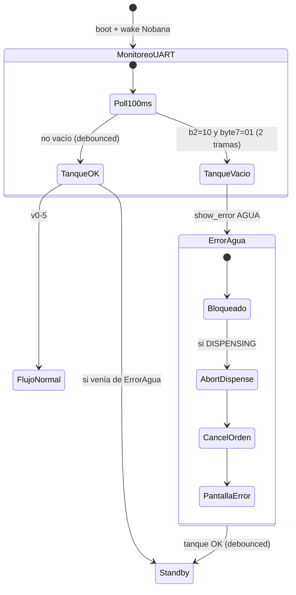

# Plan de implementación — Mate Point v0-5-1

**Proyecto:** Mate Point — OT-00268 Etapa 3  
**Carpeta:** [`mate_point_v0-5-1/`](mate_point_v0-5-1/) — fork de [`mate_point_v0-5/`](mate_point_v0-5/)  
**Base validada:** v0-5 (sensor bandeja GPIO6 + UI Figma — E2E funcional Waveshare 2026-06-24)  
**Plataforma:** Waveshare ESP32-S3-Touch-LCD-7B + Nobana UART + VL53L0X (I2C) + sensor bandeja (GPIO6)  
**Última actualización:** 2026-06-24  
**Estado:** **E2E OK** — recuperación agua validada en banco (vacío durante dispensado → relleno → Standby)

| Documento | Uso |
|-----------|-----|
| [`PLAN-MATE-POINT-v0-5.md`](PLAN-MATE-POINT-v0-5.md) | Sensor bandeja GPIO6 — patrón de integración a replicar |
| [`PLAN-MATE-POINT-v0-4-UI.md`](PLAN-MATE-POINT-v0-4-UI.md) | UI Figma; pantalla `UI_ERR_AGUA` ya implementada |
| [`PROTOCOLO-UART-NOBANA.md`](PROTOCOLO-UART-NOBANA.md) | §4.4 sensor tanque — `b2`, byte 7 |
| [`PLAN-IMPLEMENTACION.md`](PLAN-IMPLEMENTACION.md) | Índice Fase 4 |
| Captura banco | [`2026-06-04-Water_empty_ESP-UART-v0-2.md`](../tools/nobana_uart_sniffer/capturas/2026-06-04-Water_empty_ESP-UART-v0-2.md) |

---

## 1. Objetivo

Incorporar la detección de **agua desconectada / tanque vacío** reportada por el Nobana vía **UART**, con pantalla bloqueante **`AGUA DESCONECTADA`** ya prevista en v0-4.

Comportamiento resumido:

1. Monitoreo continuo sobre telemetría UART existente (`nobana_tick()`, poll ~**100 ms**).
2. Tanque **OK** → flujo normal v0-5 (incluye bandeja GPIO6).
3. Tanque **vacío** (`b2=0x10` y byte 7 = `0x01`, debounced) → pantalla bloqueante **`AGUA DESCONECTADA`**.
4. Si ocurre durante **dispensado** → **auto-Parar** Nobana + **`order_cancel`** + error (sin pantalla Finish).
5. Al restablecer suministro de agua (telemetría deja de reportar vacío) → recuperación automática a **Standby**.
6. **Nivel bajo** (`b2=0x11`, byte 7 = `0x00`) → **sin UI**; Nobana sigue permitiendo dispensar (protocolo §4.4).

> **Alcance v0-5-1:** solo señal UART tanque vacío + integración app_state/dispense. Sin cambios de UI, MQTT ni hardware adicional.

---

## 2. Decisiones cerradas (2026-06-24)

| # | Tema | Decisión |
|---|------|----------|
| D1 | Fuente de señal | UART Nobana — trama NOB→ARM de **11 bytes** |
| D2 | Condición de alarma | `b2 == 0x10` **y** byte 7 == `0x01` |
| D3 | Nivel bajo (`b2=0x11`, byte 7=`0x00`) | **Sin UI** — flujo normal; Nobana sigue dispensando |
| D4 | Debounce alarma / recuperación | **2 tramas consecutivas** (~200 ms al poll 100 ms) |
| D5 | Poll | Reutilizar `nobana_tick()`; **no** módulo GPIO ni intervalo separado |
| D6 | UI alarma | `display_ui_show_error(UI_ERR_AGUA)` — **bloqueante**, sin timeout |
| D7 | Standby / pre-flujo | Tanque vacío → error; **no** permite Iniciar ni avanzar a QR |
| D8 | Post-pago (Coloca termo / Espera Iniciar) | Error bloqueante + **`order_cancel`** + reset sesión dispensado |
| D9 | Durante dispensado | **Auto-Parar** (`nobana_dispense_abort`) + **`order_cancel`** + error — **no** Finish |
| D10 | Recuperación | Tanque OK (debounced) → **`enter_comprar()`** → Standby |
| D11 | Boot | Tras `nobana_product_init()` y primeras tramas válidas: si vacío → error bloqueante |
| D12 | Prioridad agua vs bandeja | **Primera condición detectada** define pantalla; recuperar solo cuando **ambas** OK |
| D13 | Prioridad vs Wi-Fi/MQTT | Overlay conectividad v0-4 se superpone sobre pantalla base (hereda v0-5 §5.1) |
| D14 | MQTT | Sin cambio de contrato — `idle` / `dispensing`; **no** `state: error` |
| D15 | Herencia v0-5 | Bandeja GPIO6, VL53L0X, UI Figma, litros, partición 8 MB APP |
| D16 | Asset gráfico | Compartir `img_split_image_agua` con error bandeja; títulos distintos |
| D17 | Progress UART (bytes 8–9) | **No** usar como detector de caudal (protocolo §4.4) |
| D18 | Poll en `APP_ERROR_AGUA` | `ensure_tank_monitor_poll()` en `app_state_tick()` — `nobana_standby_enable()` mientras `!nobana_dispense_busy()` (§17) |

### 2.1 Nota sobre `b2 = 0x11` en firmware actual

En [`nobana_uart.cpp`](mate_point_v0-5/nobana_uart.cpp) la constante `NOBANA_NOB_B2_CLOSE = 0x11` se usa para **fin de ciclo de dispensado** (cierre térmico), no para alarma de agua. La detección de tanque vacío **no** debe basarse solo en `b2`; siempre exigir **`0x10` + byte 7 `0x01`**. En v0-5-1 conviene **renombrar** esa constante a algo como `NOBANA_NOB_B2_CYCLE_END` para evitar confusión.

---

## 3. Modelo de señal (UART)

Ref: [`PROTOCOLO-UART-NOBANA.md`](PROTOCOLO-UART-NOBANA.md) §4.4 · captura [`2026-06-04-Water_empty_ESP-UART-v0-2.md`](../tools/nobana_uart_sniffer/capturas/2026-06-04-Water_empty_ESP-UART-v0-2.md).

| `b2` (byte 2) | Byte 7 | Significado | ¿Error UI? | ¿Dispensa? |
|---------------|--------|-------------|------------|------------|
| `0x12` | `0x00` | Normal / ciclo activo | No | Sí |
| `0x11` | `0x00` | Hay agua, **nivel bajo** | **No** (D3) | **Sí** |
| `0x10` | **`0x01`** | **Sin agua** en tanque | **Sí** → `UI_ERR_AGUA` | **No** |

**Detección en firmware (referencia):**

```c
bool nob_tank_empty_raw(const uint8_t *nob_rx_11) {
    return nob_rx_11[2] == 0x10 && nob_rx_11[7] == 0x01;
}
bool nob_tank_ok_raw(const uint8_t *nob_rx_11) {
    return !nob_tank_empty_raw(nob_rx_11);
}
```

**Escenario físico de banco (captura 2026-06-04):** corte de línea de agua → tras varios ciclos el Nobana pasa de `b2=0x11` (nivel bajo, aún dispensa) a `b2=0x10` + byte 7 `0x01` (vacío, no dispensa). El kiosco debe reaccionar solo en el segundo caso.

**Falsos positivos a evitar:**

- `b2=0x11` al **cierre térmico** post-dispensado (mismo valor que nivel bajo, pero byte 7 = `0x00`).
- Contador **progress** que puede incrementarse sin flujo real si se insiste con `E2` en vacío.

---

## 4. Flujo de usuario

### 4.1 Flujo normal (tanque siempre OK)

Sin cambios respecto a v0-5:

```
Iniciar → QR → pago → Coloca termo → Cargar termo (Iniciar) → dispensado (Parar) → Listo el mate → Iniciar
```

### 4.2 Flujo con tanque vacío

```
[cualquier estado] ──UART debounced──► b2=10 y byte7=01
    → pantalla AGUA DESCONECTADA (bloqueante)
    → si había orden activa: order_cancel
    → si DISPENSING: nobana_dispense_abort (sin Finish)

tanque OK (debounced) ──► Standby
```



### 4.3 Convivencia con error bandeja (D12)

```
Si solo bandeja llena     → UI_ERR_BANDEJA (v0-5)
Si solo tanque vacío      → UI_ERR_AGUA
Si ambos activos:
    → mantener pantalla del error que se detectó primero
    → al recuperar una condición, NO volver a Standby hasta que la otra también esté OK
    → cuando ambas OK → Standby
```

Ejemplo: bandeja llena primero → `BANDEJA GOTEO LLENA`; operador vacía bandeja pero agua sigue cortada → permanece en error (evaluar si bandeja OK pero agua vacía → cambiar a `AGUA DESCONECTADA`).

**Regla operativa propuesta para transición entre errores:**

| Estado actual | Bandeja | Agua | Pantalla |
|---------------|---------|------|----------|
| `APP_ERROR_BANDEJA` | OK | Vacía | `APP_ERROR_AGUA` |
| `APP_ERROR_AGUA` | Llena | OK | `APP_ERROR_BANDEJA` |
| Cualquier error | Ambas mal | — | Mantener pantalla actual |
| Cualquier error | Ambas OK | — | Standby |

---

## 5. Comportamiento por fase interna

| Fase / estado | Tanque vacío detectado | Recuperación (tanque OK) |
|---------------|------------------------|---------------------------|
| `APP_COMPRAR` (Standby) | Error bloqueante; bloquea Iniciar | Standby operativo |
| `APP_CREATING` | Error + cancel si orden creada | Standby |
| `APP_QR_SHOW` | Error + `order_cancel` | Standby |
| `APP_DISPENSE` / `WAIT_TERMO` | Error + `order_cancel` + reset dispensado | Standby |
| `APP_DISPENSE` / `READY_START` | Error + `order_cancel` + reset dispensado | Standby |
| `APP_DISPENSE` / `DISPENSING` | Auto-Parar + `order_cancel` + error (sin Finish) | Standby |
| `APP_ERROR_AGUA` | Permanece en error | Standby (si bandeja también OK) |
| `APP_ERROR_BANDEJA` | Transición a `APP_ERROR_AGUA` si bandeja OK y agua vacía | Según §4.3 |
| `TERMINADO` / `LISTO_WAIT` | Error + cancel si aplica | Standby |

### 5.1 Prioridad vs conectividad Wi-Fi/MQTT

- El error de agua (o bandeja) define la pantalla base (`saved_screen` en `display_ui`).
- Si además falla Wi-Fi/MQTT, el overlay de conectividad v0-4 se superpone.
- Al recuperar red, si el tanque sigue vacío, vuelve a mostrarse `UI_ERR_AGUA`.

### 5.2 Monitoreo UART en error agua (D18)

A diferencia de la bandeja (GPIO poll cada 5 s en `loop()`), el tanque se lee **solo** si el ESP hace poll Nobana (`0x21` en standby). En `APP_ERROR_AGUA` debe mantenerse ese poll activo tras el abort/cooldown UART — ver §17.

---

## 6. Máquina de estados — `app_state`

### 6.1 Estado nuevo

| Estado | Descripción |
|--------|-------------|
| `APP_ERROR_AGUA` | Pantalla bloqueante agua desconectada; sin timeout automático |

### 6.2 Handlers nuevos

| Función | Responsabilidad |
|---------|-----------------|
| `app_state_on_tank_empty()` | Transición a error; cancel orden; delegar abort si dispensando |
| `app_state_on_tank_recovered()` | Desde `APP_ERROR_AGUA` → Standby si bandeja también OK (§4.3) |

### 6.3 Guards adicionales

| Acción | Guard |
|--------|-------|
| `app_state_on_comprar_pressed()` | Rechazar si `nobana_tank_empty()` |
| `app_state_on_iniciar_pressed()` | Rechazar si `nobana_tank_empty()` |
| `app_state_on_dispense_command()` | Rechazar si `nobana_tank_empty()` |
| `app_state_tick()` / `create_pending` | Si vacío al crear orden → error |

---

## 7. Módulo `nobana_uart` — extensión tanque

No se requiere hardware ni carpeta de sensor separada (a diferencia de `drip_tray_sensor`). La lógica vive en la capa UART existente.

### 7.1 Telemetría extendida

Extender `NobanaTelemetry` en `nobana_uart.cpp`:

```c
struct NobanaTelemetry {
    bool valid;
    uint8_t b2;
    uint8_t b7;       // byte 7 — complemento vacío
    uint8_t t_live;
};
```

### 7.2 API propuesta

| Función | Responsabilidad |
|---------|-----------------|
| `nobana_tank_empty()` | Último estado estable debounced: tanque vacío |
| `nobana_tank_poll()` | Retorna transición `NONE` / `BECAME_EMPTY` / `BECAME_OK` |
| `nobana_tank_low()` | Opcional — `b2==0x11 && b7==0x00`; solo debug, sin UI |

```c
typedef enum {
    TANK_TRANSITION_NONE,
    TANK_TRANSITION_BECAME_EMPTY,
    TANK_TRANSITION_BECAME_OK,
} TankTransition;

TankTransition nobana_tank_poll();
bool nobana_tank_empty();
```

**Debounce interno (D4):** contador de tramas consecutivas con misma lectura raw; transición al llegar a **2**.

### 7.3 Constantes (`config.h`)

```c
#define WATER_TANK_EMPTY_B2           0x10
#define WATER_TANK_EMPTY_B7           0x01
#define WATER_TANK_DEBOUNCE_FRAMES    2
```

---

## 8. Cambios por módulo

| Módulo | Cambio |
|--------|--------|
| `mate_point_v0-5-1.ino` | Fork v0-5; chequeo boot; `nobana_tank_poll()` en `loop()` |
| `config.h` | Constantes §7.3; `MQTT_CLIENT_ID` → `...-v051` |
| `nobana_uart.cpp/.h` | Parse byte 7; debounce; API §7.2; renombrar `NOBANA_NOB_B2_CLOSE` |
| `app_state.cpp/.h` | `APP_ERROR_AGUA`; handlers §6.2; guards §6.3; lógica §4.3; `ensure_tank_monitor_poll()` §17 |
| `dispense_controller.cpp/.h` | `dispense_on_tank_empty()` — espejo `dispense_on_tray_full()` |
| `drip_tray_sensor` | **Sin cambios** — convivencia en `loop()` |
| `display_ui` | **Sin cambios** — `UI_ERR_AGUA` ya en v0-4 |
| `mate_network` | **Sin cambios** de contrato MQTT |
| `order_client` | **Sin cambios** — reutilizar `order_cancel()` |
| `vl53l0x_sensor` | **Sin cambios** |

### 8.1 `dispense_on_tank_empty()` — comportamiento

Espejo de `dispense_on_tray_full()` (v0-5 §8.1):

1. Si fase `DISPENSING` → `nobana_dispense_abort()` (si no abortado ya).
2. Reset inmediato a `LISTO` / limpiar `active_order_id`, timers, fases post-pago.
3. **No** transitar por `TERMINADO` ni `display_ui_show_finish()`.

### 8.2 `app_state_on_tank_empty()` — pseudoflujo

```
1. Si state == APP_ERROR_AGUA → return
2. Si state == APP_ERROR_BANDEJA → return
3. Si dispense activo → dispense_on_tank_empty()
4. Si active_order_id → order_cancel(active_order_id)
5. dispense_reset_session()
6. state = APP_ERROR_AGUA
7. display_ui_show_error(UI_ERR_AGUA)
   (no llamar nobana_standby_enable() aquí — falla si abort UART en curso)
```

### 8.3 `ensure_tank_monitor_poll()` — pseudoflujo

Llamado al inicio de `app_state_tick()`:

```
1. Si state == APP_ERROR_AGUA && !nobana_dispense_busy()
2. → nobana_standby_enable()   // idempotente; reactiva poll 0x21
```

### 8.4 `app_state_on_tank_recovered()` — pseudoflujo

```
1. Solo si state == APP_ERROR_AGUA && !nobana_tank_empty()
2. Si drip_tray_is_full() → state = APP_ERROR_BANDEJA; show_error BANDEJA; return
3. enter_comprar()
```

---

## 9. Integración en `loop()`

Orden propuesto (hereda v0-5):

```
nobana_tick()                    // parsea UART + debounce tanque interno
mate_network_loop()
nobana_tank_poll() → si transición:
    BECAME_EMPTY → app_state_on_tank_empty()
    BECAME_OK    → app_state_on_tank_recovered()
drip_tray_poll() → (sin cambios v0-5)
app_state_tick()               // incluye ensure_tank_monitor_poll() §8.3
display_ui_tick()
[wifi/mqtt labels]
delay(5)
```

En `setup()`, tras `nobana_product_init()` y ventana inicial de telemetría (~500 ms post-wake):

```
if (nobana_tank_empty()) app_state_on_tank_empty();
```

> `nobana_tank_poll()` debe ejecutarse **después** de `nobana_tick()` en cada iteración.

---

## 10. UI (heredada v0-4)

| Elemento | Valor |
|----------|--------|
| Título | `AGUA DESCONECTADA` (`UI_STR_ERROR_AGUA`) |
| Card | `Consulta al proveedor` (`UI_STR_ERROR_PROVIDER`) |
| Panel izquierdo | `img_split_image_agua` (compartido con error bandeja) |
| Estilo título | Naranja (`UI_TITLE_STYLE_ORANGE`) |
| Timeout | **Ninguno** (≠ error-pago 5 s) |
| Referencia Figma | `UI/figma/pantallas/error-agua-desconectada.png` |

---

## 11. Tareas de implementación

| # | Tarea | Verificación |
|---|--------|--------------|
| T1 | Fork `mate_point_v0-5-1/` desde v0-5 | [x] |
| T2 | `nobana_uart` — parse byte 7 en `store_telemetry_from_frame` | [x] |
| T3 | Debounce 2 tramas + `nobana_tank_empty()` / `nobana_tank_poll()` | [x] |
| T4 | Renombrar `NOBANA_NOB_B2_CLOSE` → `NOBANA_NOB_B2_CYCLE_END` | [x] |
| T5 | `config.h` — constantes §7.3 | [x] |
| T6 | `loop()` — `nobana_tank_poll()` + boot check | [x] |
| T7 | `app_state_on_tank_empty` / `on_tank_recovered` | [x] |
| T8 | Guards Comprar / Iniciar / dispense MQTT | [x] |
| T9 | `dispense_on_tank_empty` — abort sin Finish | [x] |
| T10 | Lógica convivencia agua ↔ bandeja §4.3 | [x] |
| T11 | `order_cancel` en tank empty con orden activa | [x] |
| T12 | README `mate_point_v0-5-1/` + captura Test1 formal | [ ] |
| T13 | Regresión E2E v0-5 con agua OK | [ ] |
| T14 | Poll UART activo en `APP_ERROR_AGUA` (`ensure_tank_monitor_poll`) | [x] |
| T15 | Banco: vacío en dispensado → relleno lento → Standby | [x] |

---

## 12. Criterios de aceptación (banco)

| ID | Criterio | Test1 |
|----|----------|-------|
| V1 | Tanque con agua → flujo E2E v0-5 completo sin regresión | [ ] |
| V2 | Boot con tanque vacío → `AGUA DESCONECTADA`; Iniciar inefectivo | [ ] |
| V3 | Standby → corte línea agua → error en ≤ ~300 ms (2 tramas + poll) | [ ] |
| V4 | QR activo → vacío → error + `order_cancel` | [ ] |
| V5 | Post-pago (Coloca termo / Espera Iniciar) → vacío → error + orden cancelada | [ ] |
| V6 | Dispensando → vacío → auto-Parar, orden cancelada, error — **sin** Finish | [x] |
| V7 | Restablecer agua → Standby en ≤ ~300 ms (debounced); **relleno >15 s post-abort** | [x] |
| V8 | Solo `b2=0x11` (nivel bajo) → **sin** pantalla error; dispensado permitido | [ ] |
| V9 | Post-dispensado `b2=0x11` cierre térmico → **sin** falso positivo agua | [ ] |
| V10 | Bandeja llena + agua vacía → comportamiento §4.3 (primera detectada) | [ ] |
| V11 | Recuperar una condición con la otra aún activa → no Standby hasta ambas OK | [ ] |
| V12 | 2.ª compra tras recuperación de error agua | [ ] |
| V13 | VL53L0X + GPIO6 bandeja + UART sin interferencia | [ ] |

Captura Test1 objetivo: `tools/nobana_uart_sniffer/capturas/2026-XX-XX-Waveshare-Mate_point-v0-5-1_Test1.md`

**Procedimiento banco sugerido (vacío):** replicar captura 2026-06-04 — wake → standby → dispensar con agua → corte de línea → verificar trama `68 01 10 … 01 …` → validar UI y cancelación.

---

## 13. Riesgos y mitigaciones

| Riesgo | Mitigación |
|--------|------------|
| Falso positivo por `b2=0x11` post-ciclo | Exigir `0x10` + byte 7 `0x01`; debounce 2 tramas (D4) |
| `progress` sube sin agua | No usar progress (D17) |
| Nobana bloquea dispensado pero UI no reacciona | Monitoreo en standby **y** dispensado |
| Usuario paga con nivel bajo → vacío mid-ciclo | Auto-Parar + cancel (D9) |
| Mismo ícono agua/bandeja | Títulos distintos (`AGUA DESCONECTADA` vs `BANDEJA GOTEO LLENA`) |
| `order_cancel` falla (sin red) | Mismo comportamiento que timeout QR |
| Confusión `NOBANA_NOB_B2_CLOSE` | Renombrar en v0-5-1 (§2.1) |
| Telemetría inválida al boot | Boot check tras ventana post-wake; no alarmar sin `s_telem.valid` |
| Tras abort por vacío, sin poll UART → recuperación imposible | `ensure_tank_monitor_poll()` en `APP_ERROR_AGUA` (§17) |

---

## 14. Fuera de alcance v0-5-1

- Pantalla o aviso de **nivel bajo** (`b2=0x11`)
- MQTT `state: error` o motivo de cancelación en payload
- Asset gráfico dedicado bandeja (seguir con `img_split_image_agua`)
- TLS MQTT / NVS WiFi
- Notificación push al operador
- Sensor de agua independiente del Nobana (GPIO adicional)

---

## 15. Estimación

| Fase | Días |
|------|------|
| Extensión `nobana_uart` + debounce | 0.25 |
| Integración app_state + dispense + convivencia bandeja | 0.5 |
| Banco + captura Test1 | 0.5 |
| QA regresión v0-5 | 0.25 |
| **Total** | **~1.5 días** |

---

## 16. Estructura de carpeta objetivo

```
mate_point_firmware/mate_point_v0-5-1/
├── mate_point_v0-5-1.ino
├── config.h
├── app_state.cpp / .h
├── dispense_controller.cpp / .h
├── display_ui.cpp / .h
├── drip_tray_sensor.cpp / .h          ← heredado v0-5
├── nobana_uart.cpp / .h               ← extendido §7
├── vl53l0x_sensor.cpp / .h
├── mate_network.cpp / .h
├── order_client.cpp / .h
├── ui/ …                              ← heredado v0-4
├── ui_assets_bundle.c
├── partitions.csv
└── README.md
```

---

## 17. Incidente — recuperación tras vacío en dispensado

### 17.1 Síntoma (banco, pre-fix)

Secuencia:

1. Dispensado con línea de agua cortada; tanque se vacía progresivamente.
2. Detección `b2=0x10` + byte7=`0x01` → auto-Parar, pantalla **AGUA DESCONECTADA** (correcto).
3. Reconexión de línea; tanque se llena hasta el tope.
4. **La pantalla de error no desaparecía.**

El relleno en este escenario ocurre **mucho después** del cooldown UART del abort (~15 s); no es relevante la ventana corta de poll vía `dispense_tick()`.

### 17.2 Causa raíz

| Factor | Detalle |
|--------|---------|
| Señal de recuperación | Deja de cumplirse `b2=0x10` **y** byte7=`0x01` cuando el Nobana reporta tanque con agua (`0x11`/`0x12`, byte7=`0x00`) |
| Dependencia de poll | Sin poll standby (`0x21`), no llegan tramas NOB→ESP → `tank_update_debounce()` no corre |
| Llamada fallida | `app_state_on_tank_empty()` llamaba `nobana_standby_enable()` con `s_dispense != OFF` → no operaba |
| Fin de abort | `dispense_finish()` dejaba `s_standby_active = false` sin reactivar |
| Camino normal | `dispense_controller` solo llama `nobana_standby_enable()` al terminar vía `LISTO_WAIT`; el corte por vacío salta ese camino |

### 17.3 Fix (D18)

`ensure_tank_monitor_poll()` en `app_state_tick()`:

- Condición: `state == APP_ERROR_AGUA && !nobana_dispense_busy()`
- Acción: `nobana_standby_enable()` (idempotente)
- Efecto: poll UART continuo en pantalla de error; al cambiar telemetría → `TANK_TRANSITION_BECAME_OK` → Standby

Se eliminó la llamada inefectiva a `nobana_standby_enable()` al final de `app_state_on_tank_empty()`.

### 17.4 Validación

| Paso | Resultado |
|------|-----------|
| Dispensar → vacío → error agua | OK |
| Rellenar tanque (tiempo >> 15 s) | OK |
| Vuelta automática a Standby | OK |

Pendiente: captura sniffer formal Test1 (§12); regresión completa V1–V13.

---

## Changelog

| Fecha | Cambio |
|-------|--------|
| 2026-06-24 | **Recuperación agua validada en banco** — escenario dispensado + relleno lento (§17) |
| 2026-06-24 | Fix recuperación agua: poll UART en `APP_ERROR_AGUA` vía `ensure_tank_monitor_poll()` (D18) |
| 2026-06-24 | **Implementado** en [`mate_point_v0-5-1/`](mate_point_v0-5-1/) |
| 2026-06-24 | Plan inicial v0-5-1 — error agua desconectada vía UART (`b2=0x10`, byte7=`0x01`); decisiones D1–D17; patrón espejo v0-5 bandeja |
