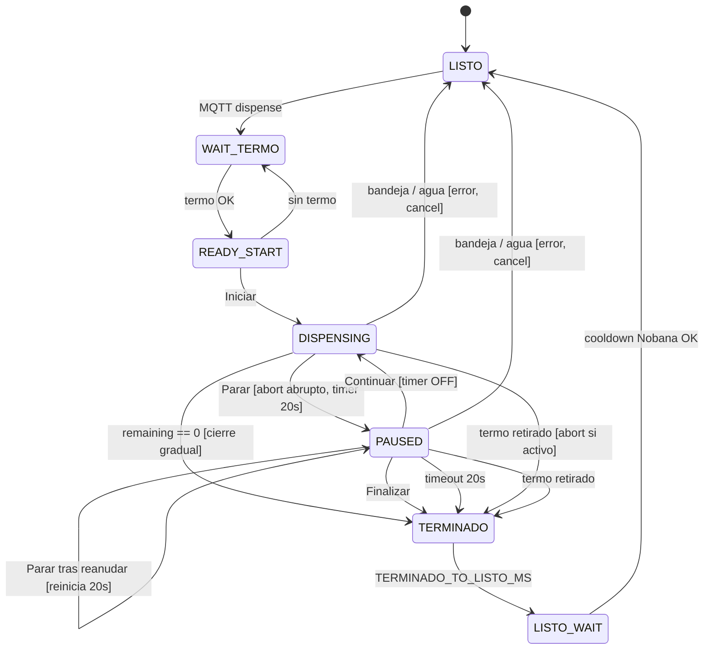

# Plan de implementación — Mate Point v0-5-2

**Proyecto:** Mate Point — OT-00268 Etapa 3  
**Carpeta:** [`mate_point_v0-5-2/`](mate_point_v0-5-2/) — fork de [`mate_point_v0-5-1/`](mate_point_v0-5-1/)  
**Base validada:** v0-5-1 (bandeja GPIO6 + error agua UART + UI Figma — E2E banco 2026-06-24)  
**Plataforma:** Waveshare ESP32-S3-Touch-LCD-7B + Nobana UART + VL53L0X (I2C) + sensor bandeja (GPIO6)  
**Última actualización:** 2026-06-24  
**Estado:** **Implementado** — pendiente validación banco (Test1)

| Documento | Uso |
|-----------|-----|
| [`PLAN-MATE-POINT-v0-5-1.md`](PLAN-MATE-POINT-v0-5-1.md) | Base inmediata — agua UART, bandeja, `ensure_tank_monitor_poll()` |
| [`PLAN-MATE-POINT-v0-4-UI.md`](PLAN-MATE-POINT-v0-4-UI.md) | UI Figma; pantallas Cargar termo |
| [`PLAN-MATE-POINT-v0-3-4.md`](PLAN-MATE-POINT-v0-3-4.md) | Gate Iniciar, VL53L0X, timer post-pago |
| [`PROTOCOLO-UART-NOBANA.md`](PROTOCOLO-UART-NOBANA.md) | Stop manual §7.4; pre-stop 200 ms vs cierre gradual |
| [`PLAN-IMPLEMENTACION.md`](PLAN-IMPLEMENTACION.md) | Índice Fase 4 |
| Figma pausa | [`UI/figma/pantallas/Cargar-termo-pause.png`](../UI/figma/pantallas/Cargar-termo-pause.png) |
| Figma dispensando | [`UI/figma/pantallas/Cargar-termo-dispensing.png`](../UI/figma/pantallas/Cargar-termo-dispensing.png) |

---

## 1. Objetivo

Incorporar **pausa y reanudación** durante **Cargar termo**, de modo que el usuario pueda detener el dispensado sin perder el presupuesto de tiempo contratado y, si lo desea, **continuar** hasta completar la carga o **finalizar** antes.

Comportamiento resumido:

1. El **`duration_ms`** recibido por MQTT es el **tiempo total** que el usuario puede dispensar (presupuesto de contrato).
2. Al apretar **Parar**, el presupuesto (mostrado como **litros** en UI) **se congela** — entra en fase **pausada**.
3. En pausa: dos botones — **Continuar** (verde) y **Finalizar** (naranja), según Figma.
4. Al pausar arranca un timer de **20 s**; si no reanuda, se **cierra la sesión** (Finish → Standby).
5. Cada nueva pausa (incluso tras reanudar) **reinicia** los 20 s desde cero.
6. Durante el dispensado activo solo se muestra el botón **Parar** (un CTA).
7. **Parar** usa ciclo UART **corto** (200 ms + `22+00`); cooldown de pausa **5 s** (`PAUSE_COOLDOWN_MS`). Fin automático mantiene cooldown **15 s**.

> **Alcance v0-5-2:** lógica de presupuesto pausable, fase `PAUSED`, UI dos botones, integración `app_state` / `dispense_controller`. **Sin** cambios de protocolo MQTT, hardware ni API servidor (`order_complete` fuera de alcance).

---

## 2. Decisiones cerradas (2026-06-24)

| # | Tema | Decisión |
|---|------|----------|
| D1 | Presupuesto | `duration_ms` MQTT = tiempo **total** dispensable; se consume solo en fase `DISPENSING` |
| D2 | Litros UI | Proporcionales a `dispensed_ms` (no reloj de pared); **congelados** en `PAUSED` |
| D3 | Parar | Entra en `PAUSED`; **no** cierra la sesión ni cancela la orden |
| D4 | Parada física al Parar | **`nobana_dispense_abort_pause()`** — pre-stop **200 ms**, `22+00` directo, cooldown pausa **5 s** |
| D5 | Fin por presupuesto agotado | Cierre **gradual** (`22+04` + cierre + cooldown **15 s**); **sin** `abort_pause` |
| D6 | Reanudar | Tras cierre + cooldown pausa: `nobana_standby_enable()` + `nobana_dispense_start(remaining_ms)` |
| D7 | Timer pausa | **20 s** (`PAUSE_DECISION_TIMEOUT_MS`); al expirar → Finish → Standby |
| D8 | Reinicio timer pausa | Cada entrada a `PAUSED` **reinicia** los 20 s; al **Continuar** se **cancela** |
| D9 | UI dispensando | Solo botón **Parar** (naranja) — `Cargar-termo-dispensing.png` |
| D10 | UI pausado | Tras Parar: solo **Finalizar** durante cooldown Nobana; luego **Continuar** (verde) + **Finalizar** (naranja) — `Cargar-termo-pause.png`; `ESTADO: ESPERA` |
| D11 | Finalizar | Cierre voluntario de sesión → Finish → Standby; **sin** `order_cancel` |
| D12 | Timeout 20 s en pausa | Igual que Finalizar — Finish → Standby; **sin** `order_cancel` |
| D13 | Presupuesto agotado | Finish → Standby; **sin** `order_cancel` (pago ya capturado) |
| D14 | Retiro de termo | **Cierre de sesión** (Finish) — **no** pausa recuperable; si aún dispensa → abort abrupto antes |
| D15 | Bandeja llena | Hereda v0-5-1: abort + **`order_cancel`** + `UI_ERR_BANDEJA` — **sin** Finish |
| D16 | Tanque vacío | Hereda v0-5-1: abort + **`order_cancel`** + `UI_ERR_AGUA` — **sin** Finish |
| D17 | MQTT `state` | `dispensing` en `DISPENSING`, `PAUSED`, `TERMINADO` y `LISTO_WAIT` |
| D18 | Múltiples pausas | Permitidas; `dispensed_ms` acumula segmentos; `remaining_ms` nunca negativo |
| D19 | Continuar en pausa | **Oculto** mientras Nobana **busy** (cierre ~2 s + cooldown pausa 5 s); **visible** con `!busy && standby_active` (~7 s post-Parar) |
| D20 | Countdown 20 s en UI | **No** visible en v0-5-2 (Figma no lo muestra) |
| D21 | Herencia v0-5-1 | Bandeja, agua UART, VL53L0X, post-pago 2 min, partición 8 MB APP |
| D22 | `order_complete` HTTP | **Fuera de alcance** — cierre exitoso es flujo local (igual que v0-5-1) |

### 2.1 Cambio respecto a v0-5 / v0-5-1

En v0-5 (D16) el retiro de termo hacía **auto-Parar** dejando el contrato UI corriendo. En v0-5-2 el retiro de termo **cierra la sesión** (equivalente a Finalizar con lo dispensado hasta ese momento).

---

## 3. Modelo de presupuesto

### 3.1 Variables

| Variable | Descripción |
|----------|-------------|
| `contract_duration_ms` | Presupuesto total (`duration_ms` MQTT), fijado al pulsar **Iniciar** |
| `dispensed_ms` | Tiempo de flujo ya consumido (suma de segmentos activos) |
| `segment_start_ms` | `millis()` al entrar en `DISPENSING` o al reanudar |
| `remaining_ms` | `contract_duration_ms - dispensed_ms` |
| `pause_deadline_ms` | `millis() + 20000` al entrar en `PAUSED`; `0` si no aplica |

### 3.2 Litros

```c
float ui_liters_from_dispensed_ms(uint32_t dispensed_ms) {
    const float sec = dispensed_ms / 1000.0f;
    float liters = sec / (float)UI_LITERS_FILL_SEC * UI_PRODUCT_LITERS_DEFAULT;
    if (liters > UI_PRODUCT_LITERS_DEFAULT) liters = UI_PRODUCT_LITERS_DEFAULT;
    return liters;
}
```

Reemplaza el cálculo actual basado en `now - contract_start_ms`.

### 3.3 Actualización de `dispensed_ms`

- En `DISPENSING`: al salir de la fase (pausa, fin, error) → `dispensed_ms += (now - segment_start_ms)`.
- En `PAUSED`: `dispensed_ms` **no** incrementa.
- Al **Continuar**: `segment_start_ms = now`; no resetear `dispensed_ms`.

### 3.4 Dos timers — no confundir

| Timer | Inicio | Duración | Visible UI | Al expirar |
|-------|--------|----------|------------|------------|
| **Post-pago** | MQTT `dispense` | 120 s fijos | No | `order_cancel` → Comprar |
| **Presupuesto dispensado** | Tap **Iniciar** | `duration_ms` MQTT | Litros | Finish (cierre gradual Nobana) |
| **Decisión en pausa** | Cada **Parar** | **20 s** | No (D20) | Finish → Standby |

---

## 4. Rutas Nobana — pausa vs fin de sesión

Ref: [`nobana_uart.cpp`](mate_point_v0-5-2/nobana_uart.cpp) — `nobana_dispense_abort_pause()` vs fin natural.

| Evento | API | Pre-stop | `22+04` | Cierre | Cooldown |
|--------|-----|----------|---------|--------|----------|
| **Parar** (pausa) | `nobana_dispense_abort_pause()` | 200 ms | No | `22+00` | **5 s** (`PAUSE_COOLDOWN_MS`) |
| **Fin automático** | (timer interno) | ~3900 ms | Sí | `22+00` | **15 s** |
| Retiro termo / Finalizar / errores | `nobana_dispense_abort()` | 200 ms | No | `22+00` | **15 s** |
| **Continuar** | `nobana_dispense_start(remaining_ms)` | — | — | — | — |

Secuencia **pausa** (Parar):

```
DISPENSING → PRE_STOP 200ms → CLOSE_22_00 (~2s) → COOLDOWN 5s → OFF + standby
    → usuario puede Continuar (nuevo R con remaining_ms)
```

Secuencia **fin automático** (presupuesto agotado):

```
DISPENSING → PRE_STOP ~3,9s → 22+04 → CLOSE → COOLDOWN 15s → Finish
```

> **Reanudar:** el Nobana no tiene pausa nativa. Pausar = abort corto + cooldown pausa 5 s. Reanudar = `standby_enable()` + nuevo `start(remaining_ms)`.

---

## 5. Flujo de usuario

### 5.1 Flujo feliz con pausa

```
Iniciar → QR → pago → Coloca termo → Cargar termo (Iniciar)
    → dispensando [solo Parar]
        ├─ Parar → pausado (timer 20 s)
        │     ├─ ~7 s cooldown: solo Finalizar visible
        │     ├─ tras cooldown: Continuar + Finalizar
        │     ├─ Continuar → dispensando (timer 20 s OFF)
        │     ├─ Finalizar → Listo el mate → Standby
        │     └─ 20 s sin acción → Listo el mate → Standby
        └─ presupuesto agotado → Listo el mate → Standby
```

### 5.2 Flujo con múltiples pausas

```
Dispensar → Parar (t=0, deadline 20 s)
  → Continuar (t=8 s, timer cancelado)
  → Parar (t=15 s, deadline NUEVO t=35 s)
  → Continuar → … → presupuesto agotado → Finish
```

### 5.3 Cierre de sesión — causas

| Causa | Pantalla | `order_cancel` |
|-------|----------|----------------|
| Presupuesto agotado | Finish | No |
| Pausa > 20 s | Finish | No |
| **Finalizar** | Finish | No |
| Retiro de termo | Finish | No |
| Bandeja llena | `BANDEJA GOTEO LLENA` | Sí |
| Tanque vacío | `AGUA DESCONECTADA` | Sí |
| Timeout post-pago (sin Iniciar) | Comprar | Sí |



---

## 6. UI — modos Cargar termo

| Modo | `ESTADO` | Botones | Figma |
|------|----------|---------|-------|
| Idle (post-Iniciar pendiente) | `ESPERA` | **Iniciar** (verde) | `Cargar-termo-idle.png` |
| Dispensando | `CARGANDO` | solo **Parar** (naranja) | `Cargar-termo-dispensing.png` |
| Pausado — cooldown Nobana | `ESPERA` | solo **Finalizar** (naranja) | `Cargar-termo-pause.png` (parcial) |
| Pausado — listo | `ESPERA` | **Continuar** (verde) + **Finalizar** (naranja) | `Cargar-termo-pause.png` |

### 6.1 API `display_ui` propuesta

```c
typedef void (*display_ui_continuar_cb_t)(void);
typedef void (*display_ui_finalizar_cb_t)(void);

void display_ui_set_continuar_callback(display_ui_continuar_cb_t cb);
void display_ui_set_finalizar_callback(display_ui_finalizar_cb_t cb);

void display_ui_show_cargar_dispensing(bool visible);  // un CTA: Parar
void display_ui_show_cargar_paused(bool visible);      // modo pausa (Finalizar; Continuar según cooldown)
void display_ui_set_continuar_visible(bool visible);   // false durante cooldown Nobana; true ~7 s post-Parar
```

### 6.2 Strings nuevos (`ui_strings.h`)

```c
#define UI_STR_CONTINUAR  "Continuar"
#define UI_STR_FINALIZAR  "Finalizar"
```

Regenerar `lv_font_montserrat_bold_32.c` con símbolos `IniciarPararContinuarFinalizar`.

### 6.3 Layout dos botones

- Reutilizar `add_cta_button_at()` existente.
- **Finalizar**: naranja (`UI_COLOR_ORANGE_SECONDARY`), ícono stop; posición fija inferior (`bottom_y = -48`).
- **Continuar**: verde (`UI_COLOR_GREEN_ACCENT`), flecha →; posición superior (`bottom_y = -136`).
- Durante cooldown Nobana: `lv_obj_add_flag(HIDDEN)` en Continuar; Finalizar no se mueve.
- Al terminar cooldown: `display_ui_set_continuar_visible(true)` revela Continuar sin reacomodar Finalizar.

---

## 7. Máquina de estados — `dispense_controller`

### 7.1 Fases

| Fase | UI | Nobana | MQTT | Poll VL53L0X |
|------|-----|--------|------|--------------|
| `LISTO` | Standby | `S` | `idle` | No |
| `WAIT_TERMO` | Coloca termo | `S` | `idle` | Sí |
| `READY_START` | Iniciar | `S` | `idle` | Sí |
| `DISPENSING` | Parar | `R` activo | `dispensing` | Sí |
| **`PAUSED`** | Finalizar (+ Continuar tras cooldown) | cooldown / off | `dispensing` | Sí |
| `TERMINADO` | Finish | cooldown | `dispensing` | No |
| `LISTO_WAIT` | Finish | cooldown | `dispensing` | No |

### 7.2 Handlers nuevos / modificados

| Función | Responsabilidad |
|---------|-----------------|
| `dispense_on_parar_pressed()` | Acumular segmento; abort abrupto; `phase = PAUSED`; UI pausa; `pause_deadline_ms` |
| `dispense_on_continuar_pressed()` | Guard `remaining > 0`, termo presente, `!busy`, bandeja/agua OK; `start(remaining)`; `PAUSED → DISPENSING` |
| `dispense_on_finalizar_pressed()` | `enter_finalize()` desde `PAUSED` |
| `dispense_tick()` — `PAUSED` | Timeout 20 s; retiro termo → finalize; refresh litros congelados |
| `dispense_tick()` — `DISPENSING` | Acumular UI; si `remaining == 0` → `TERMINADO` (sin abort); retiro termo → finalize |

### 7.3 `enter_finalize()` — pseudoflujo

```
1. Si phase == DISPENSING:
     dispensed_ms += (now - segment_start_ms)
     nobana_dispense_abort()   // solo si flujo aún activo y no ya en cierre
2. pause_deadline_ms = 0
3. phase = TERMINADO
4. phase_end_ms = now + TERMINADO_TO_LISTO_MS
5. display_ui_show_finish(true)
```

Usado por: Finalizar, timeout 20 s, retiro de termo.

### 7.4 Transiciones sensor (cambio vs v0-5-1)

| Evento | v0-5-1 | v0-5-2 |
|--------|--------|--------|
| Termo retirado en `DISPENSING` | `dispense_on_parar_pressed()` | `enter_finalize()` |
| Termo retirado en `PAUSED` | — | `enter_finalize()` |
| Termo retirado en `READY_START` | `WAIT_TERMO` | Sin cambio |

---

## 8. Máquina de estados — `app_state`

Cambios mínimos sobre v0-5-1:

| Función | Cambio |
|---------|--------|
| `app_state_on_continuar_pressed()` | **Nuevo** — guard bandeja/agua; `dispense_on_continuar_pressed()` |
| `app_state_on_finalizar_pressed()` | **Nuevo** — `dispense_on_finalizar_pressed()` |
| `app_state_on_parar_pressed()` | Sin cambio de firma — delega a pausa |
| `app_state_tick()` | Sin cambio salvo que `dispense_cycle_active()` siga true en `PAUSED` |

Guards **Continuar** / **Iniciar**:

- Rechazar si `drip_tray_is_full()` o `nobana_tank_empty()`.

---

## 9. Cambios por módulo

| Módulo | Cambio |
|--------|--------|
| `mate_point_v0-5-2.ino` | Fork v0-5-1; callbacks Continuar / Finalizar |
| `config.h` | `PAUSE_DECISION_TIMEOUT_MS 20000`; `MQTT_CLIENT_ID` → `...-v052` |
| `dispense_controller.cpp/.h` | Fase `PAUSED`; presupuesto `dispensed_ms`; handlers §7.2 |
| `display_ui.cpp/.h` | Modo pausa dos CTAs; §6 |
| `app_state.cpp/.h` | Handlers §8 |
| `ui/ui_strings.h` | `UI_STR_CONTINUAR`, `UI_STR_FINALIZAR` |
| `ui/fonts/lv_font_montserrat_bold_32.c` | Regenerar con nuevos strings |
| `nobana_uart.cpp/.h` | `nobana_dispense_abort_pause()`; `s_cooldown_ms`; `PAUSE_COOLDOWN_MS` |
| `drip_tray_sensor` | Sin cambios |
| `mate_network` | Sin cambios de contrato MQTT |
| `order_client` | Sin cambios |

---

## 10. Integración en `loop()`

Sin cambios respecto a v0-5-1:

```
nobana_tick()
mate_network_loop()          // incluye dispense_tick()
nobana_tank_poll()
drip_tray_poll()
app_state_tick()
display_ui_tick()
```

---

## 11. Tareas de implementación

| # | Tarea | Verificación |
|---|--------|--------------|
| T1 | Fork `mate_point_v0-5-2/` desde v0-5-1 | Carpeta + `MQTT_CLIENT_ID` v052 |
| T2 | `config.h` — `PAUSE_DECISION_TIMEOUT_MS` | Compila |
| T3 | `dispense_controller` — variables presupuesto | Log: litros = f(dispensed_ms) |
| T4 | Fase `PAUSED` + `dispense_on_parar_pressed` | Parar congela litros |
| T5 | `dispense_on_continuar_pressed` + `remaining_ms` | Segundo segmento Nobana OK |
| T6 | `dispense_on_finalizar_pressed` + timeout 20 s | Finish → Standby |
| T7 | Fin por presupuesto sin abort manual | Sniffer: ruta gradual (`22+04`) |
| T8 | Retiro termo → finalize (no pausa) | Finish, no dos botones |
| T9 | `display_ui_show_cargar_paused` — dos CTAs | Captura vs Figma pausa |
| T10 | Dispensando — solo Parar | Captura vs Figma dispensing |
| T11 | `set_continuar_visible` tras cooldown pausa 5 s | Continuar aparece ~7 s post-Parar; Finalizar siempre visible |
| T12 | Fuente bold Continuar / Finalizar | Texto legible en hardware |
| T13 | `app_state` handlers + `.ino` callbacks | Tap responde |
| T14 | Regresión bandeja / agua en `DISPENSING` y `PAUSED` | Error + cancel |
| T15 | Regresión post-pago, Coloca termo, Iniciar | Sin regresión v0-5-1 |
| T16 | README `mate_point_v0-5-2/` + captura Test1 | Doc + sniffer |

---

## 12. Criterios de aceptación (banco)

| ID | Criterio | Ref |
|----|----------|-----|
| P1 | Dispensar 5 s → Parar — litros congelan; `ESTADO: ESPERA`; dos botones | D3, D10 |
| P2 | Pausado → Continuar visible tras cooldown pausa (~7 s) — Nobana reanuda | D4, D6, D19 |
| P3 | Pausar + reanudar 3 veces — `dispensed_ms` total ≤ `duration_ms` | D18 |
| P4 | Pausar → esperar 20 s — Finish automático → Standby | D7 |
| P5 | Pausar → Finalizar — Finish inmediato → Standby | D11 |
| P6 | Agotar `duration_ms` con pausas intermedias — Finish al tope | D5, D13 |
| P7 | Parar — corte de agua rápido (abort 200 ms) | D4 |
| P8 | Agotar presupuesto sin pausar — cierre gradual Nobana | D5 |
| P9 | UI dispensando — **solo** Parar visible | D9 |
| P10 | UI pausado — cooldown: solo Finalizar; luego Continuar + Finalizar; sin Parar | D10, D19 |
| P11 | Pausar 18 s → Continuar → Pausar — segundo timer 20 s desde cero | D8 |
| P12 | Retiro termo dispensando — Finish (no pausa recuperable) | D14 |
| P13 | Bandeja llena en pausa — error + `order_cancel` | D15 |
| P14 | Tanque vacío en pausa — error + `order_cancel` | D16 |
| P15 | Flujo E2E v0-5-1 sin pausa — sin regresión | D21 |
| P16 | 2.ª compra tras ciclo con pausa | — |

Captura Test1 objetivo: `tools/nobana_uart_sniffer/capturas/2026-XX-XX-Waveshare-Mate_point-v0-5-2_Test1.md`

**Procedimiento banco sugerido (pausa):**

1. Pago → Iniciar → dispensar ~5 s → Parar.
2. Verificar litros congelados y dos botones.
3. Esperar fin cooldown (~15 s) → Continuar.
4. Completar hasta Finish o Finalizar.
5. Repetir con doble pausa (P11).
6. Captura UART: comparar tramas Parar (200 ms) vs fin natural.

---

## 13. Riesgos y mitigaciones

| Riesgo | Mitigación |
|--------|------------|
| 20 s vs cooldown pausa ~7 s | Timer 20 s cubre cierre + cooldown 5 s + margen decisión (~8 s libres) |
| `nobana_dispense_start` sin standby | `nobana_standby_enable()` en tick `PAUSED` y en `resume_dispensing()` |
| Litros desincronizados del flujo real | Igual que v0-4: proxy lineal por tiempo, no caudalímetro |
| Regresión agua/bandeja | Reutilizar handlers v0-5-1 sin cambios |
| Fuente sin glifos | Regenerar font con todos los CTA strings |

---

## 14. Fuera de alcance v0-5-2

- Countdown visible de 20 s en UI
- `POST /orders/complete` o notificación servidor de cierre parcial
- MQTT `state: paused` (se mantiene `dispensing`)
- Pausa sin detener Nobana (protocolo no lo soporta)
- Cambios en servidor `duration_ms`

---

## 15. Estimación

| Fase | Días |
|------|------|
| Fork + lógica presupuesto / fase `PAUSED` | 1.0 |
| UI dos botones + fuente | 0.5 |
| Banco + captura UART Test1 | 1.0 |
| QA regresión v0-5-1 | 0.25 |
| **Total** | **~2.75 días** |

---

## 16. Estructura de carpeta objetivo

```
mate_point_firmware/mate_point_v0-5-2/
├── mate_point_v0-5-2.ino
├── config.h
├── app_state.cpp / .h
├── dispense_controller.cpp / .h
├── display_ui.cpp / .h
├── drip_tray_sensor.cpp / .h          ← heredado v0-5-1
├── nobana_uart.cpp / .h               ← heredado v0-5-1
├── vl53l0x_sensor.cpp / .h
├── mate_network.cpp / .h
├── order_client.cpp / .h
├── ui/
│   ├── ui_strings.h                   ← +Continuar, +Finalizar
│   └── fonts/lv_font_montserrat_bold_32.c
├── ui_assets_bundle.c
├── partitions.csv
└── README.md
```

---

## Changelog

| Fecha | Cambio |
|-------|--------|
| 2026-06-24 | **UI pausa:** Continuar oculto durante cooldown; solo Finalizar; `set_continuar_visible` |
| 2026-06-24 | **Fix pausa:** `abort_pause` + cooldown 5 s; `standby_enable` antes de reanudar |
| 2026-06-24 | **Implementado** en [`mate_point_v0-5-2/`](mate_point_v0-5-2/) — pendiente Test1 banco |
| 2026-06-24 | Plan inicial v0-5-2 — pausa/reanudar, presupuesto congelado, timer 20 s reiniciable, Parar abrupto vs fin gradual |
