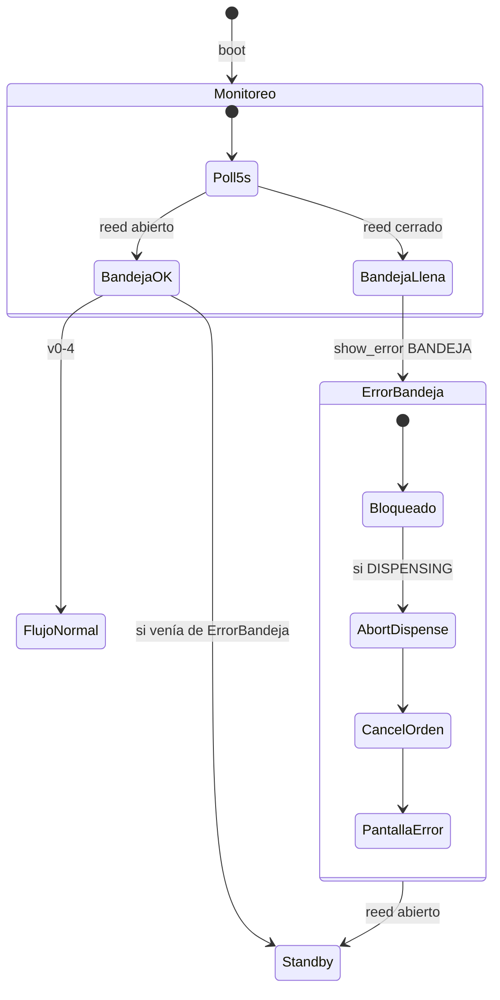

# Plan de implementación — Mate Point v0-5

**Proyecto:** Mate Point — OT-00268 Etapa 3  
**Carpeta:** [`mate_point_v0-5/`](mate_point_v0-5/) — fork de [`mate_point_v0-4/`](mate_point_v0-4/)  
**Base validada:** v0-4 (UI Figma + flujo v0-3-4 — E2E funcional Waveshare 2026-06-18)  
**Plataforma:** Waveshare ESP32-S3-Touch-LCD-7B + Nobana UART + VL53L0X (I2C) + sensor bandeja (GPIO6)  
**Última actualización:** 2026-06-24  
**Estado:** **E2E OK** — Test1 banco 2026-06-24 · [`2026-06-24-Waveshare-Mate_point-v0-5_Test1.md`](../tools/nobana_uart_sniffer/capturas/2026-06-24-Waveshare-Mate_point-v0-5_Test1.md)

| Documento | Uso |
|-----------|-----|
| [`PLAN-MATE-POINT-v0-4-UI.md`](PLAN-MATE-POINT-v0-4-UI.md) | UI Figma; pantalla `UI_ERR_BANDEJA` ya implementada |
| [`PLAN-MATE-POINT-v0-3-4.md`](PLAN-MATE-POINT-v0-3-4.md) | Patrón módulo sensor + integración `dispense_controller` |
| [`PLAN-IMPLEMENTACION.md`](PLAN-IMPLEMENTACION.md) | Índice Fase 4 |
| [`arquitectura-hardware.md`](../arquitectura-hardware.md) | GP6, cableado reed §3.4 · esquema [`docs/hardware/sensor-bandeja-reed-gpio6.png`](../docs/hardware/sensor-bandeja-reed-gpio6.png) |
| [`PROTOCOLO-UART-NOBANA.md`](PROTOCOLO-UART-NOBANA.md) | Stop manual §7.4, pre-stop 200 ms (reutilizado en auto-Parar) |

---

## 1. Objetivo

Incorporar el **sensor de nivel de bandeja de goteo** (flotante con **reed switch NO**) en GPIO6, con monitoreo continuo y pantalla de error bloqueante ya prevista en v0-4.

Comportamiento resumido:

1. Poll cada **5 s** en todo momento.
2. Bandeja **segura** (reed abierto, flotante abajo) → flujo normal v0-4.
3. Bandeja **llena** (reed cerrado, flotante arriba) → pantalla bloqueante **`BANDEJA GOTEO LLENA`**.
4. Si ocurre durante **dispensado** → **auto-Parar** Nobana + **`order_cancel`** + error (sin pantalla Finish).
5. Al vaciar la bandeja (reed abierto) → recuperación automática a **Standby**.

> **Alcance v0-5:** solo sensor de bandeja (GPIO). El error **agua desconectada** vía UART Nobana (`UI_ERR_AGUA`) queda para un hito posterior.

---

## 2. Decisiones cerradas (2026-06-24)

| # | Tema | Decisión |
|---|------|----------|
| D1 | Sensor | Flotante con **reed switch normalmente abierto (NO)** |
| D2 | Estado seguro | Flotante **abajo** → circuito **abierto** → nivel de bandeja OK |
| D3 | Estado alarma | Flotante **arriba** → reed **cerrado** → bandeja **llena** |
| D4 | Pin | **GPIO6** (`GPIO_NUM_6`) — conector PH2.0 GPIO del Waveshare |
| D5 | Cableado | Pull-up **10 kΩ** de **3V3** al nodo **GPIO6**; reed NO entre nodo y **GND** (esquema validado 2026-06-24) |
| D6 | Modo GPIO firmware | `INPUT` — pull-up **externo** 10 kΩ (no depender del pull-up interno) |
| D7 | Nivel GPIO bandeja llena | Reed cerrado (imán activo) → **LOW** |
| D8 | Nivel GPIO bandeja segura | Reed abierto → **HIGH** (3,3 V vía 10 kΩ) |
| D9 | Poll | **Continuo**, intervalo **5000 ms** (`DRIP_TRAY_POLL_MS`) |
| D10 | Debounce | Una lectura por ciclo de poll (el intervalo de 5 s actúa como filtro) |
| D11 | UI alarma | `display_ui_show_error(UI_ERR_BANDEJA)` — **bloqueante**, sin timeout |
| D12 | Standby / pre-flujo | Bandeja llena → error; **no** permite Iniciar ni avanzar a QR |
| D13 | Post-pago (Coloca termo / Espera Iniciar) | Error bloqueante + **`order_cancel`** + reset sesión dispensado |
| D14 | Durante dispensado | **Auto-Parar** (`nobana_dispense_abort`) + **`order_cancel`** + error — **no** Finish |
| D15 | Recuperación | Reed abierto (bandeja vacía) → **`enter_comprar()`** → Standby |
| D16 | Diferencia vs auto-Parar termo | Retiro de termo: Parar sin cancelar orden, sigue contrato UI. Bandeja llena: **cancela orden** y corta a error |
| D17 | MQTT | Sin cambio de contrato — mantener `idle` / `dispensing`; **no** `state: error` en v0-5 |
| D18 | Herencia v0-4 | UI Figma, VL53L0X, litros, WiFi/MQTT bloqueante, rotación 180°, partición 8 MB APP |

---

## 3. Modelo eléctrico

Esquema validado en prototipo: [`docs/hardware/sensor-bandeja-reed-gpio6.png`](../docs/hardware/sensor-bandeja-reed-gpio6.png). Detalle en [`arquitectura-hardware.md`](../arquitectura-hardware.md) §3.4.

```
3V3 ──[10 kΩ]──┬── GPIO6 (GP6)     ← nodo leído por firmware
               │
               └── reed NO ── GND
```

| Condición física | Reed | GPIO6 |
|------------------|------|-------|
| Bandeja segura (flotante bajo) | Abierto | **HIGH** (3,3 V vía 10 kΩ) |
| Bandeja llena (flotante alto, imán cierra reed) | Cerrado | **LOW** (derivado a GND) |

**Lectura firmware:** `digitalRead(GPIO_NUM_6) == LOW` → `tray_full = true`.

**Banco H1 (opcional):** confirmar niveles con multímetro en el nodo GPIO6. El cableado del esquema ya fija la polaridad esperada.

---

## 4. Flujo de usuario

### 4.1 Flujo normal (bandeja siempre segura)

Sin cambios respecto a v0-4:

```
Iniciar → QR → pago → Coloca termo → Cargar termo (Iniciar) → dispensado (Parar) → Listo el mate → Iniciar
```

### 4.2 Flujo con bandeja llena

```
[cualquier estado] ──poll 5s──► reed cerrado
    → pantalla BANDEJA GOTEO LLENA (bloqueante)
    → si había orden activa: order_cancel
    → si DISPENSING: nobana_dispense_abort (sin Finish)

reed abierto (bandeja vacía) ──poll 5s──► Standby
```



---

## 5. Comportamiento por fase interna

| Fase / estado | Bandeja llena detectada | Recuperación (bandeja vacía) |
|---------------|-------------------------|------------------------------|
| `APP_COMPRAR` (Standby) | Error bloqueante; bloquea Iniciar | Standby operativo |
| `APP_CREATING` | Error + cancel si orden creada | Standby |
| `APP_QR_SHOW` | Error + `order_cancel` | Standby |
| `APP_DISPENSE` / `WAIT_TERMO` | Error + `order_cancel` + reset dispensado | Standby |
| `APP_DISPENSE` / `READY_START` | Error + `order_cancel` + reset dispensado | Standby |
| `APP_DISPENSE` / `DISPENSING` | Auto-Parar + `order_cancel` + error (sin Finish) | Standby |
| `APP_ERROR_BANDEJA` | Permanece en error | Standby |
| `TERMINADO` / `LISTO_WAIT` | Error + cancel si aplica | Standby |

### 5.1 Prioridad vs conectividad Wi-Fi/MQTT

- Error bandeja define la pantalla base (`saved_screen` en `display_ui`).
- Si además falla Wi-Fi/MQTT, el overlay de conectividad v0-4 se superpone (comportamiento existente).
- Al recuperar red, si la bandeja sigue llena, vuelve a mostrarse `UI_ERR_BANDEJA`.

---

## 6. Máquina de estados — `app_state`

### 6.1 Estado nuevo

| Estado | Descripción |
|--------|-------------|
| `APP_ERROR_BANDEJA` | Pantalla bloqueante bandeja llena; sin timeout automático |

### 6.2 Handlers nuevos

| Función | Responsabilidad |
|---------|-----------------|
| `app_state_on_tray_full()` | Transición a error; cancel orden; delegar abort si dispensando |
| `app_state_on_tray_recovered()` | Solo desde `APP_ERROR_BANDEJA` → `enter_comprar()` |

### 6.3 Guards adicionales

| Acción | Guard |
|--------|-------|
| `app_state_on_comprar_pressed()` | Rechazar si `drip_tray_is_full()` |
| `app_state_on_iniciar_pressed()` | Rechazar si `drip_tray_is_full()` (vía `dispense_on_iniciar_pressed`) |

---

## 7. Módulo `drip_tray_sensor`

### 7.1 Hardware

| Ítem | Valor |
|------|--------|
| Pin | **GPIO6** — PH2.0 GPIO (3V3, GND, GP6) |
| Tipo | Reed switch **NO** en flotante (imán cierra al subir) |
| Pull-up | **10 kΩ** externo entre **3V3** y GPIO6 |
| Modo firmware | `pinMode(DRIP_TRAY_GPIO, INPUT)` — el pull-up es externo |
| Bus | Ninguno — GPIO dedicado; sin conflicto I2C/UART |

Ref: [`arquitectura-hardware.md`](../arquitectura-hardware.md) §3.4 · [`docs/hardware/sensor-bandeja-reed-gpio6.png`](../docs/hardware/sensor-bandeja-reed-gpio6.png)

### 7.2 API propuesta

| Archivo | Responsabilidad |
|---------|-----------------|
| `drip_tray_sensor.cpp` / `.h` | Init, poll 5 s, estado estable `tray_full` |

```c
typedef struct {
    bool init_ok;
    bool tray_full;   // true = reed cerrado = alarma
} DripTraySample;

bool drip_tray_init();
bool drip_tray_poll(DripTraySample *out);  // no-op si < DRIP_TRAY_POLL_MS
bool drip_tray_is_full();                  // último estado estable
```

- `drip_tray_init()` en `setup()` — puede ir antes o después de `vl53l0x_init()`.
- `drip_tray_poll()` en `loop()` — retorna si hubo lectura nueva en este ciclo.

### 7.3 Constantes (`config.h`)

```c
#define DRIP_TRAY_GPIO              GPIO_NUM_6
#define DRIP_TRAY_POLL_MS           5000
#define DRIP_TRAY_FULL_LEVEL        LOW    // reed cerrado → GPIO derivado a GND
```

Init propuesto:

```c
pinMode(DRIP_TRAY_GPIO, INPUT);  // pull-up 10 kΩ externo en hardware
```

---

## 8. Cambios por módulo

| Módulo | Cambio |
|--------|--------|
| `mate_point_v0-5.ino` | Fork; `drip_tray_init()`; `drip_tray_poll()` + transiciones en `loop()` |
| `config.h` | Constantes §7.3; `MQTT_CLIENT_ID` → `...-v05` |
| `drip_tray_sensor.cpp/.h` | **Nuevo** |
| `app_state.cpp/.h` | `APP_ERROR_BANDEJA`; handlers §6.2; guards §6.3 |
| `dispense_controller.cpp/.h` | `dispense_on_tray_full()` — abort forzado, salto de TERMINADO/Finish |
| `display_ui` | **Sin cambios** — `UI_ERR_BANDEJA` ya implementado en v0-4 |
| `mate_network` | **Sin cambios** de contrato MQTT |
| `nobana_uart` | **Sin cambios** — reutilizar `nobana_dispense_abort()` |
| `order_client` | **Sin cambios** — reutilizar `order_cancel()` |
| `vl53l0x_sensor` | **Sin cambios** |

### 8.1 `dispense_on_tray_full()` — comportamiento

Distinto de `dispense_on_parar_pressed()`:

1. Si fase `DISPENSING` → `nobana_dispense_abort()` (si no abortado ya).
2. Reset inmediato a `LISTO` / limpiar `active_order_id`, timers, fases post-pago.
3. **No** transitar por `TERMINADO` ni `display_ui_show_finish()`.
4. Señal a `app_state` para mostrar error y cancelar orden HTTP.

### 8.1 `app_state_on_tray_full()` — pseudoflujo

```
1. Si state == APP_ERROR_BANDEJA → return
2. Si dispense activo → dispense_on_tray_full()
3. Si active_order_id → order_cancel(active_order_id)
4. dispense_reset_session()
5. state = APP_ERROR_BANDEJA
6. display_ui_show_error(UI_ERR_BANDEJA)
7. nobana_standby_enable() si aplica
```

### 8.2 `app_state_on_tray_recovered()`

```
1. Solo si state == APP_ERROR_BANDEJA && !drip_tray_is_full()
2. enter_comprar()
```

---

## 9. Integración en `loop()`

Orden propuesto (hereda v0-4):

```
nobana_tick()
mate_network_loop()
drip_tray_poll() → si transición:
    OK → LLENA: app_state_on_tray_full()
    LLENA → OK: app_state_on_tray_recovered()
app_state_tick()
display_ui_tick()
[wifi/mqtt labels]
delay(5)
```

La detección de transición puede vivir en el módulo sensor (guardar `prev_full`) o en un thin wrapper en `.ino`.

---

## 10. UI (heredada v0-4)

| Elemento | Valor |
|----------|--------|
| Título | `BANDEJA GOTEO LLENA` (`UI_STR_ERROR_BANDEJA`) |
| Card | `Consulta al proveedor` (`UI_STR_ERROR_PROVIDER`) |
| Panel izquierdo | `img_split_image_agua` (compartido con error agua) |
| Estilo título | Naranja (`UI_TITLE_STYLE_ORANGE`) |
| Timeout | **Ninguno** (≠ error-pago 5 s) |
| Referencia Figma | `UI/figma/pantallas/error-bandeja-llena.png` |

---

## 11. Tareas de implementación

| # | Tarea | Verificación |
|---|--------|--------------|
| T1 | Fork `mate_point_v0-5/` desde v0-4 | [x] |
| T2 | Cableado según esquema §3 — pull-up 10 kΩ + reed @ GPIO6 | [`sensor-bandeja-reed-gpio6.png`](../docs/hardware/sensor-bandeja-reed-gpio6.png) |
| T3 | `drip_tray_sensor` — init `INPUT` + poll 5 s | [x] código |
| T4 | `config.h` — constantes §7.3 | [x] |
| T5 | `loop()` — detección transiciones | [x] |
| T6 | `app_state_on_tray_full` / `on_tray_recovered` | [x] |
| T7 | Guard `on_comprar_pressed` si bandeja llena | [x] |
| T8 | Guard `on_iniciar_pressed` si bandeja llena | [x] |
| T9 | `dispense_on_tray_full` — abort sin Finish | [x] |
| T10 | `order_cancel` en tray full con orden activa | [x] |
| T11 | `arquitectura-hardware.md` §3.4 alineado con esquema | **Hecho** 2026-06-24 |
| T12 | README `mate_point_v0-5/` + captura Test1 | [x] |
| T13 | Regresión E2E v0-4 con bandeja vacía | [x] Test1 |

---

## 12. Criterios de aceptación (banco)

| ID | Criterio | Test1 |
|----|----------|-------|
| V1 | Bandeja vacía → flujo E2E v0-4 completo sin regresión | [x] |
| V2 | Bandeja llena en Standby → `BANDEJA GOTEO LLENA`; botón Iniciar inefectivo | [x] |
| V3 | Bandeja llena en post-pago (Coloca termo / Espera Iniciar) → error + orden cancelada | [x] |
| V4 | Bandeja llena durante dispensado → agua para (auto-Parar), orden cancelada, error — **sin** Finish | [x] |
| V5 | Vaciar bandeja → Standby en ≤ 5 s (próximo poll) | [x] |
| V6 | Flotante cerca del umbral — sin falsos positivos en observación ≥ 30 s | [x] |
| V7 | VL53L0X + GPIO6 + touch GT911 simultáneos sin interferencia | [x] |
| V8 | 2.ª compra tras recuperación de error bandeja | [x] |

Captura Test1: [`2026-06-24-Waveshare-Mate_point-v0-5_Test1.md`](../tools/nobana_uart_sniffer/capturas/2026-06-24-Waveshare-Mate_point-v0-5_Test1.md)

---

## 13. Riesgos y mitigaciones

| Riesgo | Mitigación |
|--------|------------|
| GPIO6 mal cableado / lógica invertida | H1 en banco; `DRIP_TRAY_FULL_LEVEL` parametrizable |
| Pull-up interno insuficiente | Pull-up **externo 10 kΩ** a 3V3 (montaje validado) |
| Falsos positivos por vibración del flotante | Poll 5 s; revalidar en banco |
| Confusión con error agua (mismo ícono) | Títulos distintos; hito UART agua separado |
| `order_cancel` falla (sin red) | Mismo comportamiento que timeout QR — error UI igual |
| Latencia hasta 5 s para detectar llenado | Aceptado por producto (D7) |

---

## 14. Fuera de alcance v0-5

- Error **agua desconectada** (`UI_ERR_AGUA`) vía UART Nobana (`b2=0x10`, byte7=`0x01`) — ver [`PLAN-MATE-POINT-v0-5-1.md`](PLAN-MATE-POINT-v0-5-1.md)
- MQTT `state: error` o motivo de cancelación en payload
- Asset gráfico dedicado bandeja (seguir con `img_split_image_agua`)
- TLS MQTT / NVS WiFi
- Notificación push al operador

---

## 15. Estimación

| Fase | Días |
|------|------|
| Driver GPIO + poll | 0.25 |
| Integración app_state + dispense + cancel | 0.5 |
| Banco + captura Test1 | 0.5 |
| **Total** | **~1 día** |

---

## 16. Estructura de carpeta objetivo

```
mate_point_firmware/mate_point_v0-5/
├── mate_point_v0-5.ino
├── config.h
├── app_state.cpp / .h
├── dispense_controller.cpp / .h
├── display_ui.cpp / .h
├── drip_tray_sensor.cpp / .h          ← nuevo
├── vl53l0x_sensor.cpp / .h
├── nobana_uart.cpp / .h
├── mate_network.cpp / .h
├── order_client.cpp / .h
├── ui/ …                              ← heredado v0-4
├── ui_assets_bundle.c
├── partitions.csv
└── README.md
```

---

## Changelog

| Fecha | Cambio |
|-------|--------|
| 2026-06-24 | **v0-5 Test1 E2E OK** — captura [`2026-06-24-Waveshare-Mate_point-v0-5_Test1.md`](../tools/nobana_uart_sniffer/capturas/2026-06-24-Waveshare-Mate_point-v0-5_Test1.md) |
| 2026-06-24 | **Implementado** en [`mate_point_v0-5/`](mate_point_v0-5/) |
| 2026-06-24 | Cableado validado — pull-up **10 kΩ** 3V3→GPIO6, reed NO→GND; esquema `docs/hardware/sensor-bandeja-reed-gpio6.png`; firmware `INPUT` (no `INPUT_PULLUP`) |
| 2026-06-24 | Plan inicial v0-5 — sensor bandeja reed NO @ GPIO6, poll 5 s, error bloqueante, auto-Parar + cancel orden, recuperación Standby |
