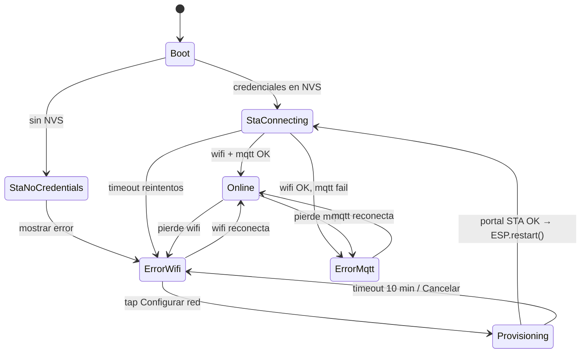

# Plan de implementación — Mate Point v0-6

**Proyecto:** Mate Point — OT-00268 Etapa 3  
**Carpeta:** [`mate_point_v0-6/`](mate_point_v0-6/) — fork de [`mate_point_v0-5-2/`](mate_point_v0-5-2/)  
**Base validada:** v0-5-2 (pausa/reanudar Cargar termo + bandeja + agua UART + UI Figma)  
**Plataforma:** Waveshare ESP32-S3-Touch-LCD-7B + Nobana UART + VL53L0X (I2C) + sensor bandeja (GPIO6)  
**Última actualización:** 2026-06-25  
**Estado:** **E2E OK hardware** (2026-06-25) — provisioning Wi-Fi + portal web validados en campo

| Documento | Uso |
|-----------|-----|
| [`PLAN-MATE-POINT-v0-5-2.md`](PLAN-MATE-POINT-v0-5-2.md) | Base inmediata — pausa, presupuesto, UI Cargar termo |
| [`PLAN-MATE-POINT-v0-4-UI.md`](PLAN-MATE-POINT-v0-4-UI.md) | Layout split, CTA, colores |
| [`arquitectura-mate-point.md`](../arquitectura-mate-point.md) | §3 Wi-Fi — **supersedido en v0-6** (sin USB/serie) |
| Figma error Wi-Fi | [`UI/figma/pantallas/Error-wifi.png`](../UI/figma/pantallas/Error-wifi.png) |
| Figma error MQTT | [`UI/figma/pantallas/Error-mqtt.png`](../UI/figma/pantallas/Error-mqtt.png) |
| Figma provisioning | [`UI/figma/pantallas/Configurar red.png`](../UI/figma/pantallas/Configurar%20red.png) |

---

## 1. Objetivo

Permitir que el **dueño del local** configure la red Wi-Fi del Mate Point **desde la pantalla táctil**, sin laptop ni USB, usando **SoftAP + portal web** accesible desde el celular.

Comportamiento resumido:

1. Las credenciales Wi-Fi se guardan en **NVS** (no en `config.h`).
2. El broker MQTT permanece **fijo en firmware** (`config.h`).
3. Se separan dos pantallas de conectividad: **Error Wi-Fi** (accionable) y **Error servidor/MQTT** (informativa).
4. En error Wi-Fi, el CTA **"Configurar red"** inicia el modo provisioning.
5. El ESP32 crea un AP temporal; el dueño conecta el celular y completa un formulario web.
6. Tras conexión exitosa a la red del local, se persisten credenciales y el equipo vuelve al flujo normal.

> **Alcance v0-6:** provisioning Wi-Fi (NVS + SoftAP + portal), UI error Wi-Fi/MQTT separadas, pantalla de instrucciones durante provisioning. **Sin** configuración USB/serie, **sin** cambio de broker MQTT, **sin** cambios de protocolo Nobana ni API servidor.

---

## 2. Decisiones cerradas (2026-06-25)

| # | Tema | Decisión |
|---|------|----------|
| D1 | Operador | **Dueño del local** — UX en español simple, sin jerga técnica |
| D2 | MQTT | Broker, puerto y `DEVICE_ID` **fijos** en `config.h`; no configurables por portal |
| D3 | Celular | **Sí** — teclado del teléfono para contraseña Wi-Fi |
| D4 | USB / serie | **No** — sin comando `wifi`, sin monitor serie para configuración; USB CDC sigue deshabilitado |
| D5 | Persistencia Wi-Fi | Namespace NVS `mate_cfg`, claves `wifi_ssid` / `wifi_pass`; escribir **solo** tras asociación STA exitosa |
| D6 | Credenciales en código | **Eliminar** `WIFI_SSID` / `WIFI_PASSWORD` de `config.h` de producción; sin fallback hardcoded en campo |
| D7 | Pantallas error | **Dos pantallas** según Figma: `Error-wifi.png` y `Error-mqtt.png` (reemplazan `Error-wifi-mqtt.png` unificada) |
| D8 | Error Wi-Fi — CTA | Botón naranja **"Configurar red"** (`UI_STR_CONFIGURAR_RED`) — único CTA activo |
| D9 | Error MQTT — card | Card inferior **"Consulta al proveedor"** — sin botón de acción (el dueño no puede reconfigurar el broker) |
| D10 | Prioridad overlay | Hardware (agua/bandeja) > **Wi-Fi** > **MQTT** > flujo normal |
| D11 | Wi-Fi caído + MQTT caído | Mostrar **solo** pantalla Error Wi-Fi (sin MQTT hasta tener red) |
| D12 | Modo provisioning | SoftAP abierto `MatePoint-{suffix}`; portal HTTP en `192.168.4.1`; DNS captive redirect |
| D13 | Suffix AP | Últimos 4 caracteres hex del MAC Wi-Fi STA (ej. `MatePoint-A3F2`) — único en locales con varios equipos |
| D14 | Timeout provisioning | **10 min** sin completar → cerrar AP, volver a Error Wi-Fi |
| D15 | Reintentos STA en arranque | Cada **15 s**, hasta **5** intentos; luego pantalla Error Wi-Fi (no provisioning automático) |
| D16 | Cambio de red | Siempre disponible vía **"Configurar red"** en Error Wi-Fi (sobrescribe NVS tras validar nueva red) |
| D17 | Durante provisioning | Nobana en **standby**; **no** iniciar compra ni dispensado; LVGL activo con pantalla de instrucciones |
| D18 | Sesión activa + pierde Wi-Fi | Pantalla Error Wi-Fi preempta UI (igual que v0-5-2); si había dispensado → abort según reglas v0-5-2 |
| D19 | Portal — redes | Listar scan 2.4 GHz; SSID manual opcional para redes ocultas |
| D20 | Portal — validación | POST credenciales → intento STA (timeout **20 s**) → éxito: guardar NVS + mensaje web + **`ESP.restart()`**; fallo: mensaje en web, **no** tocar NVS previo |
| D21 | Herencia v0-5-2 | Pausa/reanudar, bandeja, agua UART, VL53L0X, UI Figma, partición 8 MB APP |
| D22 | `order_complete` HTTP | **Fuera de alcance** |
| D23 | Éxito provisioning — criterio | **Solo Wi-Fi STA OK** guarda NVS; **no** exigir MQTT conectado (responsabilidad servidor = proveedor) |
| D24 | Acceso a configurar red | **Solo** desde pantalla Error Wi-Fi (sin menú oculto en Standby) |
| D25 | Migración v0-5-2 → v0-6 | NVS vacío al flashear; reprovisionar en campo — **aceptado** |
| D26 | Broker MQTT | **`broker.hivemq.com:1883`** (POC actual) — fijo en `config.h`, sin cambio en v0-6 |
| D27 | Pantalla provisioning | Según Figma [`Configurar red.png`](../UI/figma/pantallas/Configurar%20red.png) — card con instrucciones + CTA **Cancelar** |
| D28 | Cancelar provisioning | CTA **Cancelar** obligatorio → apaga AP → vuelve a Error Wi-Fi |
| D29 | Post-provisioning | Tras guardar NVS → **`ESP.restart()`** completo antes de operar |
| D30 | Wi-Fi cae en dispensado | Hereda abort v0-5-2 (sin reglas nuevas de `order_cancel` por Wi-Fi) |

### 2.1 Cambio respecto a v0-5-2

| Aspecto | v0-5-2 | v0-6 |
|---------|--------|------|
| Credenciales Wi-Fi | Hardcoded `config.h` | NVS |
| Pantalla conectividad | Una (`Error-wifi-mqtt.png`) | Dos (`Error-wifi` / `Error-mqtt`) |
| Interacción en error | Card estática "Consulta al proveedor" | CTA "Configurar red" en error Wi-Fi |
| Configuración | Re-flash o editar código | SoftAP + portal web |

### 2.2 Supersedido

- [`arquitectura-mate-point.md`](../arquitectura-mate-point.md) §3 (comando serie `wifi` + USB) queda **obsoleto** para producto v0-6+. Mantener como referencia histórica POC.

---

## 3. Arquitectura de red

### 3.1 Módulos nuevos

```
mate_network.cpp          ← orquestador (STA, MQTT, estados)
wifi_config.cpp / .h      ← NVS read/write, credenciales
wifi_portal.cpp / .h      ← SoftAP, WebServer, DNSServer, HTML
wifi_portal_html.h        ← HTML/CSS/JS en PROGMEM (o SPIFFS opcional)
```

### 3.2 Estados de red



### 3.3 Modos WiFi del ESP32

| Fase | Modo | Descripción |
|------|------|-------------|
| Normal | `WIFI_STA` | Conectado a red del local |
| Provisioning | `WIFI_AP_STA` | AP para celular + STA para probar credenciales recibidas |
| Tras éxito portal | `WIFI_STA` | AP apagado |

### 3.4 NVS

| Clave | Tipo | Max | Notas |
|-------|------|-----|-------|
| `wifi_ssid` | string | 32 | SSID estándar 802.11 |
| `wifi_pass` | string | 64 | WPA2-PSK; vacío = red abierta |

```c
bool wifi_config_load(char *ssid, size_t ssid_len, char *pass, size_t pass_len);
bool wifi_config_save(const char *ssid, const char *pass);
bool wifi_config_has_credentials();
void wifi_config_clear();  // solo dev / factory reset futuro
```

- Partición NVS existente (`0x6000` en `partitions.csv`) — suficiente.
- **No** usar SPIFFS para credenciales (solo HTML opcional).

### 3.5 MQTT (sin cambios funcionales)

Permanece en `config.h`:

```c
#define MQTT_HOST "broker.hivemq.com"
#define MQTT_PORT 1883
#define MQTT_CLIENT_ID "mate-" DEVICE_ID "-esp32-v060"
```

Flujo: Wi-Fi OK → `connect_mqtt()` como hoy en `mate_network_loop()`. Fallo MQTT → pantalla Error servidor (D9); el dueño contacta al proveedor — **no** bloquea el guardado de credenciales Wi-Fi en provisioning (D23).

---

## 4. Portal web (SoftAP)

### 4.1 Parámetros AP

| Parámetro | Valor |
|-----------|-------|
| SSID | `MatePoint-XXXX` (D13) |
| Password AP | **Abierto** (sin clave) — simplifica UX dueño del local |
| IP AP | `192.168.4.1` |
| Puerto HTTP | `80` |
| DNS | Captive — `*` → `192.168.4.1` |

> **Nota seguridad:** AP abierto solo durante provisioning (máx. 10 min). Aceptable para instalación en local; el portal no expone datos de pagos.

### 4.2 Páginas

| Ruta | Método | Contenido |
|------|--------|-----------|
| `/` | GET | Formulario: lista de redes (scan), campo password, botón **Conectar** |
| `/connect` | POST | `ssid` + `password` → intento STA |
| `/status` | GET | JSON `{ "state": "connecting"|"ok"|"fail", "message": "..." }` — polling JS |
| `/scan` | GET | JSON array de `{ "ssid", "rssi", "secure" }` — refresh manual |

### 4.3 Flujo portal (dueño del local)

```
1. Tap "Configurar red" en pantalla del Mate Point
2. Pantalla instrucciones (§5.3) muestra nombre del AP
3. En el celular: Ajustes → Wi-Fi → conectar "MatePoint-XXXX"
4. Abrir navegador (captive portal suele abrirse solo; si no: http://192.168.4.1)
5. Elegir red del local (2.4 GHz) + ingresar contraseña
6. "Conectar" → esperar (~20 s)
7. Éxito STA: mensaje "¡Listo! El Mate Point se reiniciará."
   → guardar NVS → cerrar AP → **`ESP.restart()`** (D29)
8. Fallo STA: "No pudimos conectar. Revisá la contraseña e intentá de nuevo."
   → NVS anterior intacto; AP sigue activo para reintentar
9. Tap **Cancelar** en pantalla LVGL → apaga AP → Error Wi-Fi (D28)
```

### 4.4 Copy portal (español)

| Elemento | Texto |
|----------|-------|
| Título | Configurar Wi-Fi — Mate Point |
| Subtítulo | Elegí la red de tu local |
| Campo red | Red Wi-Fi |
| Campo clave | Contraseña |
| Botón | Conectar |
| Éxito | ¡Conectado! Ya podés cerrar esta página. |
| Error | No se pudo conectar. Verificá que sea red 2.4 GHz y la contraseña sea correcta. |
| Red oculta | Ingresar nombre de red manualmente |

### 4.5 Implementación técnica

- **WebServer** (Arduino `WebServer` o `ESPAsyncWebServer` — preferir `WebServer` por simplicidad y menor RAM).
- **DNSServer** en `loop` de provisioning para captive portal.
- HTML embebido en **PROGMEM** (`wifi_portal_html.h`) — evita montar SPIFFS en v0-6.
- Scan: `WiFi.scanNetworks()` antes de servir `/` y en `/scan`.
- Durante intento STA: responder `/status` con progreso.

### 4.6 Limitaciones conocidas

| Limitación | Mitigación |
|------------|------------|
| iOS no abre captive automáticamente | Instrucciones en pantalla LVGL: "Si no se abre solo, ingresá **192.168.4.1**" |
| Redes 5 GHz no visibles | Texto de ayuda en portal |
| Caracteres especiales en password | UTF-8 en formulario; probar en QA |
| Varios Mate Point en el mismo local | Suffix MAC en SSID del AP (D13) |

---

## 5. UI LVGL

### 5.1 Pantalla Error Wi-Fi

**Referencia:** [`Error-wifi.png`](../UI/figma/pantallas/Error-wifi.png)

| Elemento | Spec |
|----------|------|
| Layout | Split 512+512 — imagen izq. `img_split_image_error_wifi_mqtt` (reutilizar asset) |
| Título | `WI-FI DESCONECTADO` — naranja, `UI_TITLE_STYLE_ORANGE` |
| CTA | **"Configurar red"** — naranja `#FF8028`, texto `#001000`, `UI_FONT_CTA`, flecha |
| Card inferior | **Eliminar** "Consulta al proveedor" |
| Fantasma "Continuar" en Figma | **No implementar** — artefacto de diseño; solo un CTA activo |

### 5.2 Pantalla Error MQTT / servidor

**Referencia:** [`Error-mqtt.png`](../UI/figma/pantallas/Error-mqtt.png)

| Elemento | Spec |
|----------|------|
| Layout | Split — misma imagen izquierda |
| Título | `ERROR EN SERVIDOR` — `UI_STR_ERROR_SERVIDOR` |
| Card inferior | `Consulta al proveedor` — `UI_STR_ERROR_PROVIDER` |
| CTA | **Ninguno** — informativa; reconexión automática en background |

### 5.3 Pantalla Provisioning

**Referencia:** [`Configurar red.png`](../UI/figma/pantallas/Configurar%20red.png)

Pantalla mientras el AP está activo. Misma imagen izquierda que error Wi-Fi.

| Elemento | Spec |
|----------|------|
| Título | `CONFIGURAR RED` — `UI_TITLE_STYLE_ORANGE`, `UI_TITLE_LAYOUT_CENTER_V` |
| Card inferior | Fondo `UI_COLOR_ORANGE_DARK`, texto `UI_COLOR_ORANGE_LIGHT`, `UI_FONT_CARD` |
| Línea 1 (bold en card) | `Desde tu celular:` |
| Línea 2 | `Busca la red wifi: MatePoint-XXXX` — SSID AP dinámico (`UI_STR_PROV_CARD_WIFI_FMT`) |
| Línea 3 | `Abri en el navegador 192.168.4.1` |
| Línea 4 | `Configura la red wifi` |
| CTA | **Cancelar** — naranja `#FF8028`, texto `#001000`, **sin** flecha (Figma) |
| Countdown | **No** visible (timeout 10 min solo interno) |

### 5.4 Strings nuevos (`ui_strings.h`)

```c
#define UI_STR_ERROR_SERVIDOR         "ERROR EN SERVIDOR"
#define UI_STR_CONFIGURAR_RED         "Configurar red"
#define UI_STR_PROV_TITLE             "CONFIGURAR RED"
#define UI_STR_PROV_CARD_HEADER       "Desde tu celular:"
#define UI_STR_PROV_CARD_WIFI_FMT     "Busca la red wifi: %s"
#define UI_STR_PROV_CARD_BROWSER      "Abri en el navegador 192.168.4.1"
#define UI_STR_PROV_CARD_CONFIGURE    "Configura la red wifi"
#define UI_STR_PROV_CANCEL            "Cancelar"
```

> Copy de la card según Figma (incluye "Abri" sin tilde).

### 5.5 Cambios `display_ui`

| Cambio | Detalle |
|--------|---------|
| `scr_connectivity` → split | `scr_error_wifi`, `scr_error_mqtt`, `scr_provisioning` |
| `update_connectivity_overlay()` | Lógica D10–D11: `!wifi` → wifi screen; `wifi && !mqtt` → mqtt screen |
| Callback nuevo | `display_ui_set_configurar_red_callback()`, `display_ui_set_provisioning_cancel_callback()` |
| `display_ui_show_provisioning(const char *ap_ssid)` | Card con SSID AP dinámico según Figma |
| Eliminar | Uso unificado `UI_STR_ERROR_WIFI` + card proveedor en pantalla wifi |

### 5.6 Prioridad de pantallas bloqueantes

```
1. UI_ERR_AGUA / UI_ERR_BANDEJA  (hardware — show_error existente)
2. scr_error_wifi                (!wifi_ok)
3. scr_error_mqtt                (wifi_ok && !mqtt_ok)
4. scr_provisioning              (solo si usuario inició provisioning; preempta error wifi mientras dura)
5. Flujo normal app_state
```

---

## 6. Integración firmware

### 6.1 `mate_network` — API extendida

```c
typedef enum {
    NET_STATE_ONLINE,
    NET_STATE_WIFI_DOWN,
    NET_STATE_MQTT_DOWN,
    NET_STATE_PROVISIONING,
} NetState;

void mate_network_init();
void mate_network_loop();
NetState mate_network_state();
bool mate_network_wifi_ok();
bool mate_network_mqtt_ok();

void mate_network_start_provisioning();  // desde callback UI
void mate_network_stop_provisioning();   // timeout / cancelar
bool mate_network_is_provisioning();
```

### 6.2 Secuencia `mate_network_init()`

```
1. wifi_config_load() → si hay credenciales, WiFi.begin(ssid, pass)
2. Si no hay credenciales → estado WIFI_DOWN (sin reintentos infinitos a red inexistente)
3. mqtt.setServer(...) — sin conectar hasta Wi-Fi OK
```

### 6.3 Loop principal (`.ino`)

```c
// Simplificado
mate_network_loop();
display_ui_set_wifi(mate_network_wifi_ok());
display_ui_set_mqtt(mate_network_mqtt_ok());
// display_ui_tick() resuelve overlays según estado + provisioning flag
```

Callback:

```c
display_ui_set_configurar_red_callback([]() {
    mate_network_start_provisioning();
});
```

### 6.4 `mate_network_loop()` durante provisioning

```
- DNSServer.processNextRequest()
- WebServer.handleClient()
- Chequear timeout 10 min
- Si portal reportó éxito STA → `wifi_config_save()`, stop AP, **`ESP.restart()`** (D29)
- MQTT **no** es requisito para guardar NVS (D23)
- Cancelar desde UI → `mate_network_stop_provisioning()` → Error Wi-Fi (D28)
- nobana_tick() y dispense siguen en main loop — sin nueva compra si overlay activo
```

---

## 7. Arranque y casos borde

| Caso | Comportamiento |
|------|----------------|
| Primera instalación (NVS vacío) | Error Wi-Fi → dueño configura |
| NVS con red válida | Conecta en <30 s → Standby |
| Cambio de router / password | Error Wi-Fi tras reintentos → "Configurar red" |
| Wi-Fi OK, broker caído | Error servidor — card proveedor; reintento MQTT cada 5 s |
| Provisioning interrumpido (celular se va) | Timeout 10 min → Error Wi-Fi |
| POST con password incorrecta | Mensaje en web; NVS **no** se sobrescribe |
| POST con red correcta | NVS actualizado; si había red anterior, se reemplaza |
| Dispensado activo + cae Wi-Fi | Overlay Error Wi-Fi; **abort heredado v0-5-2** (D30) |
| Tap Configurar durante dispensado | **No** posible — overlay Error Wi-Fi preempta antes |
| Flashear v0-6 sobre v0-5-2 | NVS Wi-Fi vacío → Error Wi-Fi → reprovisionar (D25) |
| Provisioning OK + MQTT caído tras reboot | Wi-Fi OK → pantalla Error servidor; credenciales NVS ya guardadas (D23) |

---

## 8. Tareas de implementación

| ID | Tarea | Criterio |
|----|-------|----------|
| T1 | Fork `mate_point_v0-6/` desde v0-5-2 | Carpeta + `MQTT_CLIENT_ID` v060 |
| T2 | `wifi_config.cpp` — NVS load/save/has | Unit manual: guardar/leer en banco |
| T3 | Quitar `WIFI_SSID`/`WIFI_PASSWORD` de `config.h` | Compila; sin credenciales embebidas |
| T4 | `wifi_portal.cpp` — SoftAP + DNS + WebServer | Celular ve portal en 192.168.4.1 |
| T5 | HTML portal en PROGMEM — scan + form + status | Conectar red de prueba desde celular |
| T6 | `mate_network` — estados + init desde NVS | Boot con NVS → conecta sin portal |
| T7 | `mate_network_start/stop_provisioning` | AP on/off; timeout 10 min |
| T8 | `display_ui` — `scr_error_wifi` + CTA | Match `Error-wifi.png` |
| T9 | `display_ui` — `scr_error_mqtt` | Match `Error-mqtt.png` |
| T10 | `display_ui` — `scr_provisioning` | Match `Configurar red.png` + SSID dinámico |
| T11 | `update_connectivity_overlay` — prioridad D10 | Wi-Fi vs MQTT correcto |
| T12 | Callbacks Configurar / Cancelar en `.ino` | Tap → provisioning / stop AP |
| T12b | `ESP.restart()` tras NVS save exitoso | Boot limpio post-provisioning |
| T13 | `ui_strings.h` — strings §5.4 | Textos en hardware |
| T14 | Regresión v0-5-2 — pausa, bandeja, agua, E2E | Sin regresión funcional |
| T15 | README `mate_point_v0-6/` + guía dueño del local | Procedimiento instalación |
| T16 | Actualizar `PLAN-IMPLEMENTACION.md` índice | Referencia v0-6 |

---

## 9. Criterios de aceptación (banco)

| ID | Criterio | Ref |
|----|----------|-----|
| W1 | NVS vacío al boot → pantalla Error Wi-Fi con CTA visible | D6, D8 |
| W2 | Tap "Configurar red" → AP visible en celular como `MatePoint-XXXX` | D12, D13 |
| W3 | Portal: elegir red 2.4 GHz + password → conexión OK → NVS guardado | D5, D20 |
| W4 | Tras éxito STA → `ESP.restart()` → Standby si wifi + mqtt OK | D23, D29 |
| W4b | Provisioning OK con MQTT caído → Error servidor post-reboot (no re-provisionar) | D23 |
| W5 | Password incorrecta → mensaje error web; NVS previo intacto | D20 |
| W6 | Reboot → conecta automático con credenciales NVS | D5 |
| W7 | Wi-Fi OK, broker apagado/simulado → pantalla Error servidor, **sin** CTA Configurar | D2, D9 |
| W8 | Recuperar MQTT → vuelve a Standby sin intervención | — |
| W9 | Timeout provisioning 10 min → Error Wi-Fi, AP apagado | D14 |
| W10 | iOS y Android — portal accesible (captive o IP manual) | §4.6 |
| W11 | Dos equipos simultáneos — SSIDs AP distintos | D13 |
| W12 | Cambiar de red vía portal — nueva NVS, conexión OK | D16 |
| W13 | Regresión pausa/reanudar v0-5-2 | D21 |
| W14 | Regresión bandeja / agua | D21 |
| W15 | E2E compra completa tras provisioning | — |
| W16 | Tap Cancelar en provisioning → AP apagado → Error Wi-Fi | D28 |
| W17 | Pantalla provisioning match Figma `Configurar red.png` | D27 |

**Procedimiento banco sugerido (provisioning):**

1. Flashear v0-6 con NVS limpio (`esptool erase_region` o primera vez).
2. Verificar Error Wi-Fi al boot.
3. Tap Configurar red → conectar celular → portal → red de laboratorio.
4. Verificar Standby + MQTT conectado.
5. Reiniciar — conexión automática sin portal.
6. Simular MQTT down (firewall) — Error servidor.
7. Simular Wi-Fi down — Error Wi-Fi; reconfigurar otra red.

---

## 9.1 Validación hardware (2026-06-25)

| ID | Criterio | Resultado |
|----|----------|-----------|
| W1 | NVS vacío → Error Wi-Fi + CTA | **OK** |
| W2 | AP `MatePoint-XXXX` en celular | **OK** |
| W3 | Portal → STA OK → NVS | **OK** |
| W4 | `ESP.restart()` → Standby | **OK** |
| W5 | Password incorrecta → NVS intacto | **OK** |
| W6 | Reboot → auto-conexión NVS | **OK** |
| W7 | MQTT caído → Error servidor sin CTA Configurar | **OK** |
| W16 | Cancelar → Error Wi-Fi | **OK** |
| W17 | UI provisioning vs Figma | **OK** |

**Iteraciones UI/portal (misma sesión):**

| Cambio | Motivo |
|--------|--------|
| Fuente CTA Latin-1 completa | Glifos faltantes en "Configurar red" |
| Portal: header Mate Point; sin red oculta | UX dueño del local |
| Provisioning: título `TOP`, card centrada | Título oculto por overlap `CENTER_V` |

Regresión v0-5-2 (pausa, bandeja, agua): sin reportes en esta sesión.

---

## 10. Riesgos y mitigaciones

| Riesgo | Mitigación |
|--------|------------|
| RAM con WebServer + LVGL + WiFi AP_STA | HTML minimal en PROGMEM; probar heap al boot; `WiFi.setSleep(false)` si hace falta |
| Captive portal no abre en iOS | Instrucciones LVGL con IP explícita |
| Dueño elige red 5 GHz | Copy de ayuda; scan no la muestra si el router separa bandas |
| AP abierto — vecino configura por error | Suffix MAC + timeout corto; equipo en error, no dispensando |
| Credenciales NVS corruptas | `wifi_config_has_credentials` + validación longitud; fallback Error Wi-Fi |
| Regresión overlay durante pausa | Test W13 con pérdida Wi-Fi en `PAUSED` |

---

## 11. Fuera de alcance v0-6

- Configuración USB / monitor serie / comando `wifi`
- Configuración MQTT/broker por portal
- WPA2 en el SoftAP del Mate Point
- App móvil nativa
- BLE provisioning
- Factory reset físico (GPIO) — versión futura
- TLS MQTT
- Teclado Wi-Fi en pantalla táctil del equipo
- OTA firmware

---

## 12. Estimación

| Fase | Días |
|------|------|
| Fork + NVS + `mate_network` estados | 1.0 |
| SoftAP + portal web + HTML | 2.0 |
| UI 3 pantallas + integración callbacks | 1.0 |
| QA banco (Android + iOS + regresión v0-5-2) | 1.5 |
| README + guía dueño del local | 0.5 |
| **Total** | **~6 días** |

---

## 13. Estructura de carpeta objetivo

```
mate_point_firmware/mate_point_v0-6/
├── mate_point_v0-6.ino
├── config.h                          ← sin WIFI_SSID/PASS; MQTT fijo
├── app_state.cpp / .h
├── dispense_controller.cpp / .h
├── display_ui.cpp / .h
├── drip_tray_sensor.cpp / .h
├── nobana_uart.cpp / .h
├── vl53l0x_sensor.cpp / .h
├── mate_network.cpp / .h             ← extendido
├── wifi_config.cpp / .h              ← nuevo
├── wifi_portal.cpp / .h              ← nuevo
├── wifi_portal_html.h                ← nuevo (PROGMEM)
├── order_client.cpp / .h
├── ui/
│   ├── ui_strings.h                  ← +error servidor, configurar red, provisioning
│   └── fonts/lv_font_montserrat_bold_32.c
├── ui_assets_bundle.c
├── partitions.csv
└── README.md                         ← guía instalación dueño del local
```

---

## 14. Guía rápida — dueño del local (README)

Texto objetivo para incluir en README del firmware:

> **Si el Mate Point muestra "WI-FI DESCONECTADO":**
> 1. Tocá **Configurar red**.
> 2. En la pantalla siguiente, anotá el nombre de la red **MatePoint-XXXX**.
> 3. En tu celular, conectate a esa red Wi-Fi.
> 4. Abrí el navegador en **192.168.4.1** (si no se abre solo).
> 5. Elegí la red Wi-Fi de tu local (2.4 GHz), ingresá la contraseña y tocá **Conectar**.
> 6. El equipo se reiniciará solo cuando la conexión sea correcta.
> 7. Para salir sin configurar, tocá **Cancelar**.
>
> Si ves **"ERROR EN SERVIDOR"**, tu Wi-Fi está bien — contactá al proveedor del servicio.

---

## Changelog

| Fecha | Cambio |
|-------|--------|
| 2026-06-25 | **E2E OK hardware** — provisioning, portal, NVS, reinicio; iteraciones fuente + UI + portal |
| 2026-06-25 | **Implementado** en [`mate_point_v0-6/`](mate_point_v0-6/) |
| 2026-06-25 | Decisiones D23–D30: NVS solo con Wi-Fi OK, sin menú Standby, HiveMQ fijo, Figma Configurar red, Cancelar obligatorio, `ESP.restart()`, abort heredado |
| 2026-06-25 | Plan inicial v0-6 — SoftAP + portal web, NVS, pantallas Error-wifi / Error-mqtt, decisiones dueño del local |
