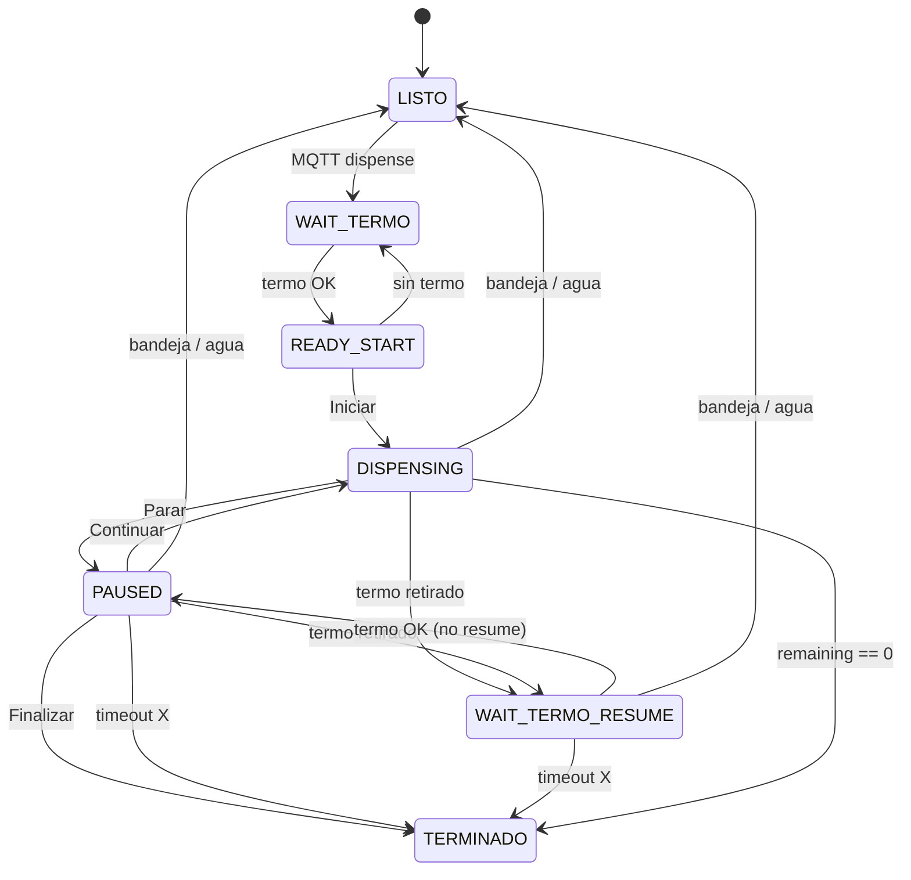

# Plan de implementación — Mate Point v0-9

**Proyecto:** Mate Point — OT-00268 Etapa 3  
**Carpeta firmware:** [`mate_point_v0-9/`](mate_point_v0-9/) — fork de [`mate_point_v0-7/`](mate_point_v0-7/) *(v0-8 flota queda para el final)*  
**Servidor:** Railway `servidor/` — oferta + `pause_timeout_ms` (mismo deploy)  
**Base validada:** v0-7 (VL6180 — OK hardware 2026-09-08) · pausa v0-5-2 · Wi-Fi NVS v0-6  
**Plataforma:** Waveshare ESP32-S3-Touch-LCD-7B + Nobana UART + ToF termo + MQTT  
**Última actualización:** 2026-09-08  
**Estado:** **Implementado** — QA banco pendiente (A1–A16, P-B1, P-B2)

| Documento | Uso |
|-----------|-----|
| [`PLAN-MATE-POINT-v0-6.md`](PLAN-MATE-POINT-v0-6.md) | Producto actual |
| [`PLAN-MATE-POINT-v0-5-2.md`](PLAN-MATE-POINT-v0-5-2.md) | Pausa / Continuar / Finalizar / timer 20 s — **D14 se revierte** |
| [`PLAN-MATE-POINT-v0-4-UI.md`](PLAN-MATE-POINT-v0-4-UI.md) | Precio/descripción QR — extensión backend §6.4 (nunca hecha) |
| [`PLAN-MATE-POINT-v0-7.md`](PLAN-MATE-POINT-v0-7.md) | VL6180 — **cerrado** 2026-09-08; ToF de la base |
| [`PLAN-MATE-POINT-v0-8.md`](PLAN-MATE-POINT-v0-8.md) | Flota N máquinas — **ortogonal**; precio/duración siguen globales |
| [`servidor-mate-point.md`](../servidor-mate-point.md) | `MP_SALE_AMOUNT`, `DISPENSE_DURATION_MS`, MQTT `command` |

---

## 1. Objetivo

Cuatro ajustes de producto sobre v0-6, para que la oferta y la sesión de carga se comporten como el cliente las percibe, **sin reflash** en cada cambio comercial (salvo el umbral 80 °C, que queda en firmware).

1. **Temperatura en Cargar termo:** si `T_viva < 80` °C, mostrar **80 °C**; si no, temperatura real. Ocultar el ramp-up que desconcierta.
2. **Litros en UI:** `120000 ms = 1 L`. El volumen mostrado (y el tope de sesión) sale de `duration_ms` del servidor, no de un tope fijo de 1,0 L en `config.h`.
3. **Oferta en pantalla QR:** nombre (`Recarga de 1 litro`) y precio (`$500`) vienen del servidor. Ajuste comercial = env Railway, no firmware.
4. **Retiro de termo durante la carga:** misma parada UART que **Parar**; UI **COLOCA EL TERMO**; al reponer el termo, pantalla de pausa con botones; el usuario **toca Continuar** (no auto-reanuda). Si pasan **X s** de sesión abierta, Finish → Standby. **X lo define el servidor.**

> **Alcance v0-9:** clamp UI de temperatura, fórmula de litros, parseo de oferta en `/orders/create`, campo MQTT `pause_timeout_ms`, fase `WAIT_TERMO_RESUME`. **Sin** caudalímetro, **sin** QR dinámico, **sin** `order_complete`, **sin** cambiar Figma ni Nobana más allá de reutilizar `abort_pause`.

---

## 2. Decisiones cerradas (2026-09-02)

| # | Tema | Decisión |
|---|------|----------|
| D1 | Base firmware | Fork **v0-7** (VL6180). v0-8 (flota) se deja para el final |
| D2 | `MQTT_CLIENT_ID` | Sufijo **`v090`** |
| D3 | Clamp temperatura | **Solo UI.** No altera UART, setpoint Nobana ni `status` MQTT |
| D4 | Cuándo aplicar el piso 80 °C | Pantallas **Cargar termo** con telemetría válida: `DISPENSING` y `PAUSED`. **No** en `READY_START` (Iniciar, aún no sale agua). **No** en Coloca termo (esa UI no muestra temp) |
| D5 | Lectura inválida | Seguir mostrando `—°C` |
| D6 | Umbral | **80** constante en firmware (`UI_TEMP_DISPLAY_MIN_C`). No viene del servidor en v0-9 |
| D7 | Litros UI | `litros = dispensed_ms / 120000`; tope de sesión = `duration_ms / 120000` (no cap fijo 1,0 L) |
| D8 | Constante | `UI_MS_PER_LITER 120000` — reemplaza `UI_LITERS_FILL_SEC` + `UI_PRODUCT_LITERS_DEFAULT` |
| D9 | Dispensado físico | Sigue siendo `duration_ms` MQTT (ya desde v0-3-1). v0-9 solo alinea la **cifra en pantalla** al mismo contrato |
| D10 | Calibración 1 L | Convención de producto: **120 s de flujo = 1 L en UI**. Si el litro físico no coincide, se ajusta `DISPENSE_DURATION_MS` en Railway (o se mide y se documenta). No hay caudalímetro |
| D11 | Nombre + precio UI | Solo pantalla **Paga con QR**. Standby no muestra oferta (igual v0-4) |
| D12 | Transporte oferta | `POST /orders/create` — campos `product_description` y `price_display`. Firmware los aplica **antes** de mostrar el QR |
| D13 | Fuente comercial | Env servidor: `PRODUCT_DESCRIPTION`, `MP_SALE_AMOUNT` → `price_display`. Mismo `PRODUCT_DESCRIPTION` en `items[].title` de Mercado Pago |
| D14 | Fallback firmware | Si el create no trae los campos, placeholders `config.h` (`Recarga de 1 litro` / `$500`) |
| D15 | Retiro termo en `DISPENSING` | **Pausa** (`nobana_dispense_abort_pause()`), **no** Finalize — **revierte v0-5-2 D14** |
| D16 | UI con termo afuera (sesión ya iniciada) | Pantalla existente **COLOCA EL TERMO**. Sin Continuar / Finalizar / Parar |
| D17 | Al reponer el termo | Pasar a UI **pausa** (Finalizar; Continuar según cooldown Nobana, igual v0-5-2 D19) |
| D18 | Reanudar | **Solo tap Continuar.** Prohibido auto-`resume` al detectar termo |
| D19 | Parar con termo puesto | Sin cambio: va directo a UI pausa (no pasa por Coloca termo) |
| D20 | Termo afuera en `PAUSED` | Volver a COLOCA EL TERMO; presupuesto sigue congelado |
| D21 | Timer X | Una sola deadline de **sesión abierta** desde que se sale de `DISPENSING` (Parar **o** retiro). Corre en Coloca termo **y** en UI pausa. Al Continuar se cancela. Al **nueva** pausa (tras haber reanudado) se **reinicia** (hereda v0-5-2 D8) |
| D22 | Sacar/poner termo en la misma interrupción | **No** reinicia X (evita alargar la sesión levantando el termo) |
| D23 | Cierre por X | Igual que timeout de pausa hoy: Finish → Standby; **sin** `order_cancel` |
| D24 | Finalizar | Solo visible en UI pausa (termo puesto). En COLOCA EL TERMO no hay CTA; el cierre voluntario es reponer + Finalizar, o esperar X |
| D25 | Transporte X | MQTT `command`: `pause_timeout_ms`. Env servidor `PAUSE_TIMEOUT_MS`. Firmware fallback `PAUSE_DECISION_TIMEOUT_MS` (20000) si el campo falta o es 0 |
| D26 | MQTT `state` | Sigue `dispensing` en `DISPENSING`, `PAUSED`, `WAIT_TERMO_RESUME`, `TERMINADO`, `LISTO_WAIT` |
| D27 | Post-pago `WAIT_TERMO` | **Sin cambio** — es el gate de Iniciar (timer `POST_PAY_TIMEOUT_MS` + `order_cancel`). No mezclar con `WAIT_TERMO_RESUME` |
| D28 | Bandeja / tanque | Hereda v0-5-1: abort + `order_cancel` + error UI; aplica también en `WAIT_TERMO_RESUME` |
| D29 | v0-7 / v0-8 | No dependen de v0-9. ToF y flota se implementan en sus hitos |

### 2.1 Pendiente de banco (no cerrar en código hasta probar)

| ID | Tema | Qué hacer en v0-9.0 | Qué ajustar después si hace falta |
|----|------|---------------------|-----------------------------------|
| **P-B1** | X muy corto vs cooldown UART (~7 s: cierre ~2 s + `PAUSE_COOLDOWN_MS` 5 s) | Valor inicial servidor **20000** (igual que hoy). Documentar en QA: Continuar no está disponible hasta `!busy && standby` | Subir `PAUSE_TIMEOUT_MS` o el piso mínimo si X &lt; cooldown deja inalcanzable Continuar |
| **P-B2** | Vapor / ToF falso “sin termo” | Debounce actual (`TERMO_DEBOUNCE_COUNT` 2, `TERMO_POLL_MS` 300). Un falso negativo **pausa** (Coloca termo), no cierra la sesión | Subir debounce/umbral, o esperar v0-7 VL6180, si hay parpadeo en carga |

No inventar histéresis extra ni piso de X en firmware hasta tener captura de banco.

### 2.2 Cambio respecto a v0-6 / v0-5-2

| Aspecto | v0-6 (hoy) | v0-9 |
|---------|------------|------|
| Temp Cargar termo | `T_viva` cruda | Piso 80 °C en UI si `T_viva < 80` |
| Litros UI | `sec/120 × 1.0`, **tope 1,0 L** | `ms/120000`, tope = `duration_ms/120000` |
| QR desc / precio | `config.h` | Servidor (`/orders/create`); placeholder de fallback |
| Item MP | `"Agua caliente"` hardcode | `PRODUCT_DESCRIPTION` |
| Termo afuera en carga | Finish → Standby | Pausa UART + COLOCA EL TERMO |
| Termo vuelve | — (sesión ya cerrada) | UI pausa; **Continuar** manual |
| Timer pausa | 20 s en firmware | `pause_timeout_ms` MQTT; fallback 20 s |

---

## 3. 1 — Piso de temperatura (UI)

### 3.1 Comportamiento

```
si !nobana_live_temp_c → "—°C"
si temp_c < UI_TEMP_DISPLAY_MIN_C (80) → mostrar 80
si no → mostrar temp_c
```

Aplicar en `refresh_temp_ui()` (o en `display_ui_set_dispense_temp_c` con un flag de fase). El Nobana sigue calentando con su receta Coffee.

### 3.2 Qué no hacer

- No clampear en Serial / logs de debug (útiles para P-B2 y heater).
- No publicar 80 °C falso en MQTT `status` si más adelante se agrega telemetría (fuera de v0-9).

---

## 4. 2 — Litros a partir de `duration_ms`

### 4.1 Fórmula

```c
#define UI_MS_PER_LITER 120000u

static float ui_liters_from_dispensed_ms(uint32_t ms)
{
    float liters = (float)ms / (float)UI_MS_PER_LITER;
    const float cap = (contract_duration_ms > 0)
        ? ((float)contract_duration_ms / (float)UI_MS_PER_LITER)
        : liters;
    if (liters > cap) liters = cap;
    return liters;
}
```

Quitar `UI_LITERS_FILL_SEC` y `UI_PRODUCT_LITERS_DEFAULT`.

Ejemplos (contrato MQTT):

| `duration_ms` | Tope UI | A 30 s de flujo |
|---------------|---------|-----------------|
| 120000 | 1,0 L | 0,3 L |
| 60000 | 0,5 L | 0,3 L |
| 180000 | 1,5 L | 0,3 L |
| 30000 (env banco histórico) | 0,3 L | 0,3 L (tope) |

El presupuesto (`dispensed_ms` / `remaining_ms`) **no cambia**: sigue siendo tiempo. Solo cambia el mapeo a litros.

### 4.2 Servidor / ops

Railway ya publica **`DISPENSE_DURATION_MS=120000`**. `.env.example` queda alineado a 1 L. Si ops baja el env a 30000, la UI dirá 0,3 L y la bomba cortará a 30 s.

v0-9 no “adivina” litros: si ops deja 30000, la UI dirá 0,3 L y la bomba cortará a 30 s. Eso es correcto respecto a D7–D10.

---

## 5. 3 — Oferta desde el servidor

Standby no muestra precio. El único lugar es **Paga con QR**, y `display_ui_set_product_info()` ya existe. Hoy `app_state` pisa con placeholders al crear la orden.

### 5.1 `POST /orders/create` — respuesta ampliada

```json
{
  "order_id": "ORD…",
  "status": "created",
  "external_reference": "mate-…",
  "total_amount": "500.00",
  "product_description": "Recarga de 1 litro",
  "price_display": "$500",
  "expiration_time": "PT2M",
  "device_id": "MATEPOINT001"
}
```

| Campo | Origen |
|-------|--------|
| `product_description` | `process.env.PRODUCT_DESCRIPTION \|\| 'Recarga de 1 litro'` |
| `price_display` | Derivado de `MP_SALE_AMOUNT` (si `*.00` → `"$500"`; si no, dos decimales `"$500.50"`) |
| `total_amount` | Ya existe; debe coincidir con el monto cobrado |

`createStaticQrOrder`: `items[].title` y `description` de la orden MP usan el mismo `PRODUCT_DESCRIPTION` (deja de estar hardcodeado `"Agua caliente"`).

No hace falta `GET /offer`: el texto se necesita al mostrar el QR, justo después del create.

### 5.2 Firmware

Extender `order_create(..., char *desc, size_t, char *price, size_t)` (o struct). Tras HTTP 201:

1. Parsear `product_description` / `price_display` (fallback placeholders).
2. `display_ui_set_product_info(desc, price)`.
3. Mostrar QR.

Fuente LVGL ya incluye Latin-1 (tildes). El label QR tiene ancho **440 px** / 36 px: copy corto tipo “Recarga de 1 litro”. Nombres muy largos pueden envolver; no recortar glifos en v0-9.

### 5.3 Env servidor

```
PRODUCT_DESCRIPTION=Recarga de 1 litro
MP_SALE_AMOUNT=500.00
DISPENSE_DURATION_MS=120000
PAUSE_TIMEOUT_MS=20000
```

Cambio de oferta = editar Railway + redeploy. **Sin reflash.** Firmware v0-6 ignorará los campos extra (compat). Solo v0-9 los muestra.

---

## 6. 4 — Retiro de termo = pausa (UX cerrada)

### 6.1 Flujo de usuario

```
Cargar termo (dispensando, CTA Parar)
  ├─ Parar (termo puesto)
  │     → UI pausa (Finalizar; Continuar tras cooldown)
  │         ├─ Continuar → dispensando
  │         ├─ Finalizar → LISTO EL MATE → Standby
  │         ├─ timeout X → LISTO EL MATE → Standby
  │         └─ saca el termo → COLOCA EL TERMO ──┐
  └─ saca el termo                                │
        → abort_pause (igual Parar)               │
        → COLOCA EL TERMO  <──────────────────────┘
              ├─ timeout X → LISTO EL MATE → Standby
              └─ pone el termo
                    → UI pausa (botones)
                          └─ debe tocar Continuar (NO auto)
```

### 6.2 Fase nueva `WAIT_TERMO_RESUME`

No reutilizar `WAIT_TERMO` (post-pago / Iniciar).

| Fase | UI | Nobana | MQTT | Timer |
|------|-----|--------|------|-------|
| `WAIT_TERMO` | Coloca termo | Standby | `idle` | `POST_PAY_TIMEOUT_MS` → cancel orden |
| `DISPENSING` | Cargar + Parar | Flujo | `dispensing` | presupuesto |
| **`WAIT_TERMO_RESUME`** | Coloca termo | cooldown / off (pausa) | `dispensing` | **X** (`pause_deadline_ms`) |
| `PAUSED` | Cargar pausa + CTAs | cooldown / off | `dispensing` | **mismo X** |

### 6.3 Transiciones ToF (cambio vs v0-5-2)

| Evento | v0-5-2 / v0-6 | v0-9 |
|--------|----------------|------|
| Termo retirado en `DISPENSING` | `enter_finalize()` | `enter_paused_uart()` + fase `WAIT_TERMO_RESUME` |
| Termo retirado en `PAUSED` | `enter_finalize()` | `WAIT_TERMO_RESUME` (UART ya parado; no re-abortar) |
| Termo presente en `WAIT_TERMO_RESUME` (debounce OK) | — | `PAUSED` (UI botones). **No** llamar `resume_dispensing()` |
| Termo retirado en `READY_START` | `WAIT_TERMO` | Sin cambio |

Al entrar a `WAIT_TERMO_RESUME` desde `DISPENSING`: `accumulate_dispensed_ms` + `nobana_dispense_abort_pause()` (misma ruta UART que Parar). Cancelar `continuar_pending`.

Al entrar a `PAUSED` desde `WAIT_TERMO_RESUME`: `display_ui_show_cargar_paused`; litros congelados; Continuar visible solo si `!busy && standby && remaining > 0` (D19 v0-5-2). El usuario **todavía** tiene que tocar Continuar.

### 6.4 Timer X

```
pause_deadline_ms = now + pause_timeout_ms   // al salir de DISPENSING
```

| Evento | ¿Reinicia X? |
|--------|----------------|
| Parar | Sí (nueva interrupción) |
| Retiro termo desde `DISPENSING` | Sí (si no había deadline; es la interrupción) |
| `PAUSED` ↔ `WAIT_TERMO_RESUME` | **No** (D22) |
| Continuar | Cancela (`pause_deadline_ms = 0`) |
| Nueva pausa tras reanudar | Sí (D21 / v0-5-2 D8) |

Si `pause_timeout_ms` MQTT falta o es 0 → `PAUSE_DECISION_TIMEOUT_MS` (20000).

### 6.5 MQTT `command`

```json
{
  "cmd": "dispense",
  "duration_ms": 120000,
  "pause_timeout_ms": 20000,
  "order_id": "ORD…",
  "external_reference": "mate-…",
  "ts": 1748369220000
}
```

Cadena: `mqtt.js` `publishDispense` → `mate_network.cpp` parse → `app_state_on_dispense_command` → `dispense_on_command(..., duration_ms, pause_timeout_ms)`.

Firmware v0-6 ignora el campo extra. Packet MQTT actual cabe en 512 bytes.

---

## 7. Máquina de estados (dispense)



`dispense_cycle_active()` / `dispense_mqtt_state()`: incluir `WAIT_TERMO_RESUME` como ciclo activo / `dispensing`.

`dispense_on_continuar_pressed()`: solo si `phase == PAUSED` (no hay botón en Coloca termo). Guard termo presente se mantiene.

---

## 8. Cambios por módulo

### 8.1 Firmware (`mate_point_v0-9/`)

| Módulo | Cambio |
|--------|--------|
| `mate_point_v0-9.ino` | Fork; `MQTT_CLIENT_ID` v090 |
| `config.h` | `UI_TEMP_DISPLAY_MIN_C 80`; `UI_MS_PER_LITER 120000`; quitar fill-sec / 1,0 L; placeholders oferta como fallback; `PAUSE_DECISION_TIMEOUT_MS` queda como fallback |
| `dispense_controller` | Clamp temp; fórmula litros; `pause_timeout_ms`; fase `WAIT_TERMO_RESUME`; ToF D15–D22; **no** auto-resume |
| `display_ui` | Reutilizar `show_coloca_termo` / `show_cargar_paused`. Sin pantalla nueva |
| `app_state` | Create → `set_product_info` desde respuesta; `on_dispense_command` pasa `pause_timeout_ms` |
| `order_client` | Parse `product_description`, `price_display` |
| `mate_network` | Leer `pause_timeout_ms` del JSON |
| `nobana_uart` | Sin API nueva (`abort_pause` ya existe) |
| ToF / bandeja / Wi-Fi | Sin cambio de contrato |

Debug Coloca termo (`UI_DEBUG_TERMO`): visible en `WAIT_TERMO` (calibración). En `WAIT_TERMO_RESUME` **oculto** en build producto; opcional encenderlo en banco para P-B2.

### 8.2 Servidor

| Archivo | Cambio |
|---------|--------|
| `servidor/.env.example` | `PRODUCT_DESCRIPTION`; `PAUSE_TIMEOUT_MS=20000`; comentar que 1 L de producto ⇒ `DISPENSE_DURATION_MS=120000` |
| `servidor/src/routes/orders.js` | Respuesta create + campos oferta |
| `servidor/src/services/mercadopago.js` | `title` / `description` desde `PRODUCT_DESCRIPTION` |
| `servidor/src/services/mqtt.js` | `pause_timeout_ms: Number(process.env.PAUSE_TIMEOUT_MS \|\| 20000)` en el payload |

Sin endpoint nuevo. Sin base de datos.

---

## 9. Tareas de implementación

| ID | Área | Tarea | Criterio |
|----|------|-------|----------|
| T1 | FW | Fork `mate_point_v0-9/` desde v0-6 (o v0-7) | Carpeta + `MQTT_CLIENT_ID` v090 |
| T2 | FW | Clamp 80 °C en Cargar termo (`DISPENSING`/`PAUSED`) | Banco: arranque frío muestra 80, luego sube si `T_viva ≥ 80` |
| T3 | FW | Fórmula litros D7; quitar tope 1,0 L | MQTT 60 s → tope 0,5 L; 120 s → 1,0 L |
| T4 | SV | Env `PRODUCT_DESCRIPTION`; MP item title; `price_display` en create | Postman create muestra ambos campos |
| T5 | FW | `order_client` + `app_state` aplican oferta al QR | QR muestra texto servidor, no `config.h` |
| T6 | SV | `pause_timeout_ms` en `publishDispense` | `mosquitto_sub` ve el campo |
| T7 | FW | Parse MQTT → `dispense_on_command` | Fallback 20 s si falta |
| T8 | FW | Fase `WAIT_TERMO_RESUME`; retiro en `DISPENSING` → pausa UART + Coloca termo | Agua corta; no Finish |
| T9 | FW | Termo vuelve → UI pausa; Continuar **no** dispara solo | Hay que tocar Continuar |
| T10 | FW | Termo afuera en `PAUSED` → Coloca termo; X no se reinicia | Reloj único |
| T11 | FW | Timeout X en ambas fases → Finish | Igual P4 v0-5-2 |
| T12 | FW | Parar con termo puesto = UI pausa directa (regresión) | D19 |
| T13 | QA | P-B1: medir ventana Continuar vs X=20 s | Anotar en captura; no cambiar X salvo evidencia |
| T14 | QA | P-B2: vapor durante carga | Anotar falsos Coloca termo |
| T15 | QA | Regresión: bandeja, agua, post-pago, 2.ª compra, Wi-Fi | Hereda v0-6 |
| T16 | Ops | Railway: `DISPENSE_DURATION_MS=120000` si el SKU es 1 L | Alineado a D10 |
| T17 | Doc | README sketch + este plan en índices al implementar | — |

Sketch: [`mate_point_v0-9/`](mate_point_v0-9/). Servidor: `PRODUCT_DESCRIPTION`, `PAUSE_TIMEOUT_MS`, oferta en create, `pause_timeout_ms` en MQTT.

---

## 10. Criterios de aceptación (banco)

| ID | Criterio | Ref |
|----|----------|-----|
| A1 | Dispensando, `T_viva` 40–79 → UI **80 °C**; ≥ 80 → valor real; sin telem → `—°C` | D3–D5 |
| A2 | Iniciar (`READY_START`) no muestra piso 80 si el tanque está frío (temp cruda o `—`) | D4 |
| A3 | `duration_ms=120000` → litros van 0,0 → 1,0; no se quedan en 1,0 antes de tiempo | D7 |
| A4 | `duration_ms=60000` → tope **0,5 L** (hoy v0-6 seguiría cap 1,0 y se vería mal) | D7 |
| A5 | Create → QR muestra `product_description` y `price_display` del servidor | D12 |
| A6 | Cambiar `MP_SALE_AMOUNT` + `PRODUCT_DESCRIPTION` en Railway **sin flash** → siguiente QR actualizado | D13 |
| A7 | Item de la orden MP usa el mismo nombre | D13 |
| A8 | Sacar termo en carga → agua para (abort pausa) → **COLOCA EL TERMO**, no LISTO EL MATE | D15, D16 |
| A9 | Poner termo → UI pausa con Finalizar; Continuar según cooldown; **sin** flujo hasta tap Continuar | D17, D18 |
| A10 | Parar con termo puesto → UI pausa (no Coloca termo) | D19 |
| A11 | En pausa, sacar termo → Coloca termo; reponer → botones otra vez; X **no** se resetea | D20, D22 |
| A12 | Esperar X (default 20 s) en Coloca termo o en pausa → Finish → Standby | D21, D23 |
| A13 | Continuar → dispensa `remaining_ms`; litros no saltan atrás | v0-5-2 D18 |
| A14 | Bandeja / agua en `WAIT_TERMO_RESUME` → error + cancel | D28 |
| A15 | Post-pago sin Iniciar: Coloca termo sigue cancelando a los 120 s | D27 |
| A16 | E2E v0-6 sin sacar termo (pago → Iniciar → 1 L o Parar/Continuar) | — |

Captura Test1 objetivo: `tools/nobana_uart_sniffer/capturas/2026-XX-XX-Waveshare-Mate_point-v0-9_Test1.md`

**Procedimiento banco sugerido**

1. Create Postman: ver oferta en JSON; pagar → QR en máquina con el mismo copy.
2. Iniciar con tanque no a régimen: temp UI 80 °C; Serial muestra `T_viva` real.
3. MQTT 120000: llenar hasta 1,0 L / Finish.
4. MQTT 60000 (prueba): tope 0,5 L.
5. Dispensar ~5 s → sacar termo → Coloca termo → reponer → botones → Continuar → completa.
6. Dispensar → Parar → (termo sigue) Continuar (regresión pausa).
7. Dispensar → sacar termo → esperar X → Finish.
8. P-B1 / P-B2: anotar tiempos Continuar y falsos ToF; **no** retocar debounce/X en el mismo commit salvo fallo bloqueante.

---

## 11. Riesgos y mitigaciones

| Riesgo | Mitigación |
|--------|------------|
| Heater fallido: UI dice 80 °C y el agua está fría | Aceptado (D3). Diagnóstico por Serial / banco, no por UI cliente |
| Railway sigue en `DISPENSE_DURATION_MS=30000` | T16; UI mostrará 0,3 L — coherente, no es 1 L |
| Copy QR más largo que 440 px | D13: textos cortos; no subset extra de fuente |
| Firmware viejo + servidor nuevo | Campos extra ignorados; placeholders locales |
| X ≤ cooldown UART → Continuar inalcanzable | **P-B1** — default 20 s; ajustar env tras medición |
| Vapor → Coloca termo a mitad de carga | **P-B2** — debounce actual; peor caso es pausa recuperable, no Finish |
| Doble abort al sacar termo ya en pausa | D20: si UART ya off, no llamar `abort_pause` otra vez |
| Confundir `WAIT_TERMO` post-pago con resume | Fases distintas (D27); timers distintos |

---

## 12. Fuera de alcance v0-9

- Auto-reanudar al detectar termo (cerrado: D18)
- CTA Finalizar sobre COLOCA EL TERMO
- Countdown visible de X en UI (Figma no lo tiene)
- `GET /catalog` / MQTT retained de oferta (create alcanza)
- Precio o `duration_ms` distintos por máquina (v0-8 D12)
- Caudalímetro / ml reales Nobana
- `POST /orders/complete`
- MQTT `state: paused`
- Clamp 80 °C configurable por servidor
- VL6180 (v0-7) y flota POS (v0-8)
- Regenerar fuentes salvo que un copy nuevo lo exija

---

## 13. Estimación

| Fase | Días |
|------|------|
| Fork + clamp temp + fórmula litros | 0.5 |
| Servidor oferta + `pause_timeout_ms` + firmware QR/MQTT | 1.0 |
| `WAIT_TERMO_RESUME` + ToF + Continuar manual | 1.5 |
| QA banco (A1–A16 + P-B1/P-B2) + captura | 1.5 |
| Docs / env Railway 1 L | 0.5 |
| **Total** | **~5 días** |

Orden de implementación: **T2 → T3 → T4–T5 → T6–T12 → T13–T16**.

---

## 14. Estructura objetivo (cuando se implemente)

```
mate_point_firmware/mate_point_v0-9/
├── mate_point_v0-9.ino          ← MQTT_CLIENT_ID v090
├── config.h                     ← UI_TEMP_DISPLAY_MIN_C; UI_MS_PER_LITER
├── dispense_controller.cpp / .h ← WAIT_TERMO_RESUME; litros; clamp
├── order_client.cpp / .h        ← parse oferta
├── mate_network.cpp             ← pause_timeout_ms
├── app_state.cpp                ← set_product_info desde create
└── … (resto igual base v0-6 / v0-7)

servidor/
├── .env.example                 ← PRODUCT_DESCRIPTION, PAUSE_TIMEOUT_MS
├── src/routes/orders.js
├── src/services/mercadopago.js
└── src/services/mqtt.js
```

---

## Changelog

| Fecha | Cambio |
|-------|--------|
| 2026-09-08 | Implementado desde v0-7 — `mate_point_v0-9/` + servidor oferta/`pause_timeout_ms`. Railway `DISPENSE_DURATION_MS=120000`. QA banco pendiente |
| 2026-09-02 | Plan inicial v0-9 — piso 80 °C UI; litros = ms/120000; oferta create; retiro termo → Coloca termo → pausa → Continuar manual; X vía MQTT. P-B1 y P-B2 abiertos a banco |
