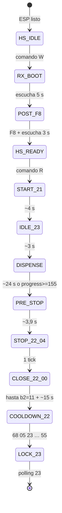
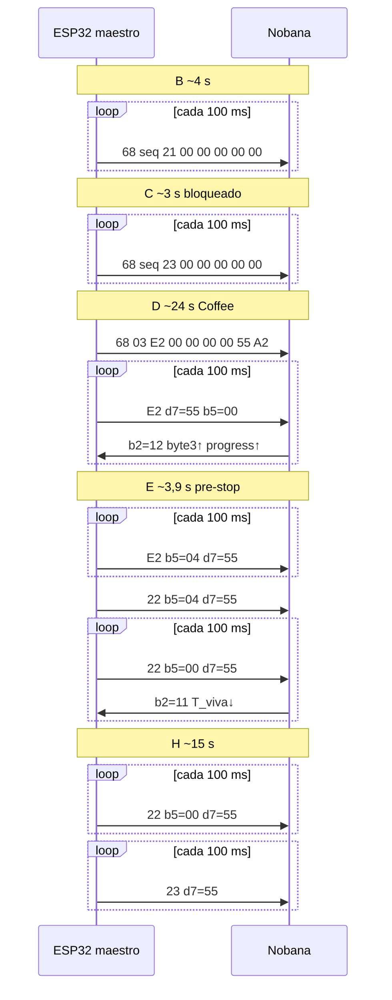

# POC UART Nobana — Etapa 1 replay ARMOR (ESP32 → producto Waveshare)

**Proyecto:** Mate Point — OT-00268 Etapa 3  
**Objetivo:** validar comunicación **maestro** con el PCB Nobana, luego integrar el driver en **`mate_point_v0-2`**.  
**Última actualización:** 2026-06-04  
**Estado:** **Etapa 1 cerrada en banco** — [`mate_point_UART_v0-1/`](mate_point_UART_v0-1/) — replay §4 validado (capturas ESP 2026-06-04)

### Jerarquía documental

| Nivel | Documento | Este POC |
|-------|-----------|----------|
| 1 — Maestro | [`PLAN-IMPLEMENTACION.md`](PLAN-IMPLEMENTACION.md) | Estado global y §16 índice UART |
| 2 — POC UART | **Este archivo** | Procedimiento banco, FSM replay, criterios §8 |
| 3 — Protocolo | [`PROTOCOLO-UART-NOBANA.md`](PROTOCOLO-UART-NOBANA.md) | **Única fuente de verdad** de tramas y semántica |

| Documento | Contenido |
|-----------|-----------|
| [`PROTOCOLO-UART-NOBANA.md`](PROTOCOLO-UART-NOBANA.md) | Tramas, flujos §7, **§7.6–7.7** validación ESP, §4.4 tanque |
| [`PLAN-MATE-POINT-UART-v0-2.md`](PLAN-MATE-POINT-UART-v0-2.md) | Etapa 2a-ESP — kiosco manual (ESP32 Dev) |
| [`PLAN-MATE-POINT-UART-v0-3.md`](PLAN-MATE-POINT-UART-v0-3.md) | Etapa 2a-WS — ciclo auto Waveshare (1×/boot) |
| **Captura ref. (ARMOR)** | [`2026-06-03-inicio-dispense-coffee-fin.md`](../tools/nobana_uart_sniffer/capturas/2026-06-03-inicio-dispense-coffee-fin.md) |
| **Capturas POC ESP (validación)** | [`2026-06-04-…_ESP-UART_Wake_manual.md`](../tools/nobana_uart_sniffer/capturas/2026-06-04-inicio-dispense-coffee-fin_ESP-UART_Wake_manual.md) (procedimiento **`W`→`R`**) · [`2026-06-04-…_ESP-UART.md`](../tools/nobana_uart_sniffer/capturas/2026-06-04-inicio-dispense-coffee-fin_ESP-UART.md) |
| **Captura Waveshare v0-3 (banco OK)** | [`2026-06-04-Waveshare-UART-v0-3_banco-validacion-OK.md`](../tools/nobana_uart_sniffer/capturas/2026-06-04-Waveshare-UART-v0-3_banco-validacion-OK.md) |
| Otras capturas | `inicio-fin`, `…_manual` — Etapa 1b |
| [`tools/nobana_uart_sniffer/`](../tools/nobana_uart_sniffer/) | Sniffer y cableado |

---

## 1. Enfoque en dos etapas

| Etapa | Plataforma | Alcance | Salida |
|-------|-----------|---------|--------|
| **1 — POC UART** | ESP32 + TXS0108E · [`mate_point_UART_v0-1/`](mate_point_UART_v0-1/) | **Replay** captura ref. (ON → Coffee 180 ml timer → bloqueado) | **Cerrada** 2026-06-04 |
| **2a-ESP — Kiosco** | ESP32 · [`mate_point_UART_v0-2/`](mate_point_UART_v0-2/) | `W`/`S`/`R` manual sin lock `23` | [`PLAN-MATE-POINT-UART-v0-2.md`](PLAN-MATE-POINT-UART-v0-2.md) |
| **2a-WS — Waveshare auto** | Waveshare · [`mate_point_UART_v0-3/`](mate_point_UART_v0-3/) | Ciclo auto `W→S→R`, **1×/boot** — **cerrado banco 2026-06-04** | [`PLAN-MATE-POINT-UART-v0-3.md`](PLAN-MATE-POINT-UART-v0-3.md) · [captura OK](../tools/nobana_uart_sniffer/capturas/2026-06-04-Waveshare-UART-v0-3_banco-validacion-OK.md) |
| **2b — Producto** | Waveshare [`mate_point_v0-2/`](mate_point_v0-2/) | MQTT + UI Comprar/QR + driver | Fases 4.4–4.10 |

**Decisión Etapa 1 (2026-06-03):** el ESP32 **sustituye al ARMOR** en el bus (ARMOR desconectado) y ejecuta el **mismo guion UART** que el panel en la captura ref., no un subconjunto suelto de tramas.

---

## 2. Objetivo Etapa 1 — captura ref.

### 2.1 Escenario UI (captura)

| Paso | Observación panel |
|------|-------------------|
| ON | Módulo desbloqueado ~25 °C, **2 chimes** |
| Elegir Coffee | **1 chime**; tras unos segundos empieza dispensado |
| Dispensando | Display **85 °C** |
| Fin | **END** + **1 chime**; vuelve bloqueado |
| Lock final | **1 chime** (POC ESP 2026-06-04, §PROTOCOLO 7.7) |

Preset **180 ml** (RAM del ARMOR; **no** va por UART). Detalle chimes: [`PROTOCOLO-UART-NOBANA.md`](PROTOCOLO-UART-NOBANA.md) §7.7.

### 2.2 Objetivo técnico POC

Reproducir en el Nobana la **misma secuencia de tramas ARM→NOB** y leer telemetría NOB→ARM equivalente, con:

- Polling **~100 ms** entre envíos (como en el log).
- **`seq` constante por fase** en el polling; sube al cambiar comando/fase (`01`+`21`, `02`+`23`, `03`+`E2`, … `05`+`23` al final). **No** incrementar `seq` en cada poll (validado ESP 2026-06-04).
- Wake **`F8`** solo con comando **`W`**; replay **`R`** ejecuta fases **B→I** sin repetir `F8`.
- Duraciones por fase tomadas del log (§4.2); disparo de pre-stop/fin por **tiempo** o por **progress ≥ 155** (`0x9B`), como en la ref.

### 2.3 Fuera de alcance Etapa 1 (Etapa 1b — ver §9)

| Tema | Captura |
|------|---------|
| Fin manual (botón Coffee) | `…_fin_manual.md` |
| Solo apagado | `inicio-fin.md` |
| Otros volúmenes / bebidas | Sin captura ref. |
| Comando `D<ms>` libre | Etapa 1b o tras validar replay `R` |

---

## 3. Hardware y pines

Misma asignación que [`nobana_uart_sniffer.ino`](../tools/nobana_uart_sniffer/nobana_uart_sniffer.ino) en el cable **Nobana Tx** (escucha NOB→ARM en sniffer; RX en POC maestro). El cable **Nobana Rx** (B2→A2) pasa a **TX** del ESP32 con ARMOR desconectado.

| Cable Nobana | TXS0108E | Sniffer (escucha) | ESP32 POC (maestro) |
|--------------|----------|-------------------|---------------------|
| **Tx** | B1 → A1 | **GPIO25** — `Serial2` RX (NOB→…) | **GPIO25** — `Serial2` RX |
| **Rx** | B2 → A2 | **GPIO17** — `Serial1` RX (ARM→…) | **GPIO17** — `Serial2` TX |
| **G** | GND | GND | GND |

```c
#define PIN_NOB_RX  25   // igual que sniffer: Nobana Tx → ESP RX
#define PIN_NOB_TX  17   // Nobana Rx ← ESP TX (en sniffer GPIO17 era ARM→NOB)
Serial2.begin(9600, SERIAL_8N1, PIN_NOB_RX, PIN_NOB_TX);
#define NOBANA_POLL_MS  100
```

**ARMOR desconectado** del conector de 4 pines. No usar `Serial1` ni pines dummy **4/5** del sniffer en el POC.

Basura UART al encender (líneas 22–30 de la captura) la genera el Nobana/panel; el ESP **no** debe emitirla — solo ignorar RX no-`0x68` hasta estabilizar (§4.1 fase A).

Referencia firmware: [`mate_point_UART_v0-1.ino`](mate_point_UART_v0-1/mate_point_UART_v0-1.ino) ya define **25/17**.

---

## 4. Guion UART — replay captura ref.

Referencia: [`2026-06-03-inicio-dispense-coffee-fin.md`](../tools/nobana_uart_sniffer/capturas/2026-06-03-inicio-dispense-coffee-fin.md) (log 13:01:38 → 13:02:35).  
Análisis normativo: [`PROTOCOLO-UART-NOBANA.md`](PROTOCOLO-UART-NOBANA.md) §7.1–7.3 · §9.2 (`F8`).

### 4.1 Fases (máquina de estados — guion operativo POC)



| Fase | `cmd` | `b5` | `d7` | Duración ref. | Trama tipo (seq ej.) | PROTOCOLO |
|------|-------|------|------|---------------|----------------------|-----------|
| **A** `RX_BOOT` | — | — | — | **5 s** (comando **`W`**) | Ignorar RX: `WARN trunc`, ráfagas `00…`; log `NOB->ESP` | §7.1 · §9.3 |
| **A′** `POST_F8` | — | *(1 B)* | — | **F8** + **3 s** escucha | **`F8`** ESP→NOB — §4.1.1; luego `[wake] LISTO` | §9.2 |
| **B** `START_21` | `0x21` | `00` | `00` | **~4,0 s** (43,2→47,0) | `68 01 21 00 00 00 00 00 8A` | §7.1 |
| **C** `IDLE_23` | `0x23` | `00` | `00` | **~3,0 s** (47,0→50,0) | `68 02 23 00 00 00 00 00 8D` | §7.2 |
| **D** `DISPENSE` | `0xE2` | `00` | `0x55` | **~24 s** (50,0→14,0) | `68 03 E2 00 00 00 00 55 A2` | §7.3 |
| **E** `PRE_STOP` | `0xE2` | `04` | `0x55` | **~3,9 s** (14,0→17,9) | `68 03 E2 00 00 04 00 55 A6` | §7.3 |
| **F** `STOP_22_04` | `0x22` | `04` | `0x55` | **1×** (~100 ms) | `68 03 22 00 00 04 00 55 E6` | §7.3 |
| **G** `CLOSE_22_00` | `0x22` | `00` | `0x55` | **≥2 s** o hasta `b2=11` | `68 03 22 00 00 00 00 55 E2` | §7.3 |
| **H** `COOLDOWN_22` | `0x22` | `00` | `0x55` | **~15 s** (18,1→33,5) | `68 04 22 …` (seq sube) | §7.3 |
| **I** `LOCK_23` | `0x23` | `00` | `0x55` | continuo | `68 05 23 00 00 00 00 55 E5` | §7.3 |

#### 4.1.1 Byte `0xF8` — wake del maestro

Norma completa, tablas de capturas y parser: [`PROTOCOLO-UART-NOBANA.md`](PROTOCOLO-UART-NOBANA.md) **§9.2**.

En el POC: comando **`W`** ejecuta fases **A + A′**; **`R`** inicia en **B** sin repetir `F8`. Tras `F8`, la ventana de 3 s puede mostrar solo `00` (sin `0x68`); **`R`** igualmente completó el ciclo si Nobana ya estaba ON (2026-06-04). Procedimiento: Nobana ON → **`W`** → revisar log → **`R`**.

**Notas del log:**

- Tras **B**, primera respuesta NOB estable: `68 01 12 29 14 …` (T_viva `0x29`, fase `14`).
- En **D**, progress pasa `00 00` → `00 06` (~3 s) y sube **+7…+11**/tick; antes del pre-stop: `00 94` / `00 9B` (148–155).
- En **E**, byte 4 NOB pasa a **`15`** (`… 12 54 15 …`).
- En **G**, NOB cierre: `b2=11`, T_viva baja (`4C`→`36` en ref.).
- **F** es un solo frame `22`+`04`; no repetir como en mantenimiento `E2`.

### 4.2 Constantes de tiempo (defaults replay)

Valores extraídos del log; ajustar ±200 ms en banco si hace falta.

```c
#define REPLAY_T_START_21_MS    4000   // fase B
#define REPLAY_T_IDLE_23_MS     3000   // fase C
#define REPLAY_T_DISPENSE_MS   24000   // fase D (alternativa: hasta progress >= 155)
#define REPLAY_T_PRESTOP_MS      3900   // fase E
#define REPLAY_T_CLOSE_MIN_MS    2000   // fase G mínimo
#define REPLAY_T_COOLDOWN_MS    15000   // fase H
#define REPLAY_PROGRESS_STOP    155     // 0x009B — último progress antes pre-stop en ref.
```

**Fin de fase D:** usar **ambos** criterios en firmware — disparar **E** cuando `progress >= 155` **o** al cumplir `REPLAY_T_DISPENSE_MS` (lo que ocurra primero en banco con agua).

### 4.3 Secuencia temporal (log ref.)



### 4.4 Telemetría a registrar (Monitor Serie 115200)

En cada trama NOB→ESP válida (11 B, `0x68`, checksum OK):

| Campo | Esperado en ref. |
|-------|------------------|
| T objetivo | `85` (Coffee, `d7=0x55`) |
| T actual | byte 3: `29`→`54` en **D**; baja en **G** |
| Fase | `14` en **D**; `15` en **E**–**G** |
| Progress | 0 → … → **≥155** antes de **E** |
| `b2` | `12` activo; **`11`** en cierre **G** |
| Fase FSM | `START_21` … `LOCK_23` |

Verbose `V`: imprimir `ESP->NOB` / `NOB->ESP` HEX como el sniffer.

### 4.5 Firmware

[`mate_point_UART_v0-1.ino`](mate_point_UART_v0-1/mate_point_UART_v0-1.ino) implementa wake (**`W`**) + replay (**`R`**) §4.1. **Validado en banco** 2026-06-04 — §8 y capturas ESP.

---

## 5. Arquitectura software Etapa 1

```
mate_point_firmware/mate_point_UART_v0-1/
└── mate_point_UART_v0-1.ino   ← replay_capture_ref() + serial_cli

tools/nobana_uart_sniffer/capturas/
├── 2026-06-03-inicio-dispense-coffee-fin.md              ← especificación ARMOR
├── 2026-06-04-inicio-dispense-coffee-fin_ESP-UART_Wake_manual.md  ← validación ESP (W→R)
└── 2026-06-04-inicio-dispense-coffee-fin_ESP-UART.md     ← validación ESP
```

| Módulo | Función |
|--------|---------|
| `nobana_frame` | `build_tx_9()`, checksum, `parse_rx_11()`, `progress_be()` |
| `nobana_bus` | `Serial2`, `poll_rx()`, gap 35 ms |
| `replay_ref_fsm` | Fases A–I §4.1; timers §4.2 |
| `serial_cli` | Comandos §6 |

---

## 6. Comandos Monitor Serie (Etapa 1)

| Comando | Acción |
|---------|--------|
| `?` / `h` | Ayuda |
| **`W`** | **Wake manual:** escucha 5 s → **`F8`** → log RX 3 s → `[wake] LISTO` |
| **`R`** | **Replay** captura ref. (§4.1 **B→I**). Tras `[wake] LISTO`. No reenvía `F8`. |
| `B9600` | Baud bus (default 9600); requiere **`W`** de nuevo |
| `V` | Verbose HEX |
| `I` | Estado FSM + última telemetría |
| `X` | Abortar replay |
| `S` | Detener replay en fase actual *(debug)* |

**Reservados (Etapa 1b):** `D<ms>`, `T`, `M`, `U`.

**Secuencia banco:** Nobana OFF → ESP on → Monitor 115200 → Nobana ON → **`W`** → **`R`**.

Al pulsar **`R`**: `seq=1` en fase B; **`seq` fijo** en cada fase durante el polling; ejecutar B→I sin intervención.

---

## 7. Orden de implementación — Etapa 1

| # | Tarea | Verificación |
|---|--------|--------------|
| 1 | Cableado §3; ARMOR off | — |
| 2 | `nobana_frame` + `poll_rx` 11 B | `T_act`, `progress` parseados |
| 3 | FSM fases **B**–**C** (`21` ~4 s → `23` ~3 s) | Serial: mismos `cmd` que log 13:01:43–50 |
| 4 | Fase **D** `E2`+`55`, fin por progress≥155 o 24 s | Progress sube; T_viva → ~84 |
| 5 | Fases **E**–**G** (pre-stop → `22`+04 → `22`+00, ver `b2=11`) | HEX como 13:02:14–18 |
| 6 | Fases **H**–**I** (cooldown `22`, luego `23`+`55`) | `68 05 23 … 55` ~13:02:33 |
| 7 | Comandos **`W`** + **`R`** + log §4.4 | Una pasada completa en banco con agua |
| 8 | Capturas ESP **2026-06-04** en `capturas/` | Comparar telemetría con ref. §7.3 |

### Etapa 2 — ver §10

Port del driver a Etapa **2a** (UART kiosco) y **2b** (`mate_point_v0-2` Waveshare) — sin cambiar tramas validadas en Etapa 1.

---

## 8. Criterios de aceptación — Etapa 1

**Cerrada 2026-06-04** con capturas ESP (banco con agua, wake manual recomendado).

| ID | Criterio | Estado | Evidencia |
|----|----------|--------|-----------|
| A′ | **`F8`** TX vía **`W`** antes del primer `0x68` en replay | [x] | [`2026-06-04-…_Wake_manual.md`](../tools/nobana_uart_sniffer/capturas/2026-06-04-inicio-dispense-coffee-fin_ESP-UART_Wake_manual.md) — `ESP->NOB F8` |
| B | Polling `21` ~4 s; NOB `12 xx 14` | [x] | `START_21`, `T_act`, `b2=0x12`, `fase=0x14` |
| C | Polling `23` ~3 s; idle | [x] | `IDLE_23` ~3 s |
| D | `E2`+`55` ~24 s; T_viva → ~85 °C; progress sube | [x] | `T_act` 56→85; `progress` 0→153+ |
| E | `E2`+`b5=04` ~3,9 s | [x] | `PRE_STOP` en log |
| E′ | byte 4 NOB → `15` | [~] | En ESP log suele quedar `14`; hidráulica OK |
| F–G | `22`+`04` → `22`+`00`; `b2=11`; T_viva baja | [x] | `b2=0x11` en `CLOSE` |
| H–I | cooldown ~15 s; `23`+`d7=55` | [x] | `COOLDOWN_22`, `LOCK_23` `seq=5` |
| — | Dispensado ~180 ml ref. | [x] | Observable en ambas capturas 2026-06-04 |
| — | Chimes alineados §7.7 | [x] | 3 inicio + fin + lock |
| — | Capturas archivadas | [x] | Wake_manual + ESP-UART |

Referencia cruzada: [`PROTOCOLO-UART-NOBANA.md`](PROTOCOLO-UART-NOBANA.md) §7.6–7.7 · ARMOR ref. [`2026-06-03-inicio-dispense-coffee-fin.md`](../tools/nobana_uart_sniffer/capturas/2026-06-03-inicio-dispense-coffee-fin.md).

---

## 9. Riesgos y pendientes

| Riesgo | Mitigación |
|--------|------------|
| Wake sin trama `0x68` tras `F8` | Nobana **ON** antes de **`W`**; repetir **`W`**; **`R`** tras `[wake] LISTO` (§7.6) |
| Tiempos / `progress` vs ref. ARMOR | Criterio hidráulico + telemetría; fin D por timer 24 s aceptado en banco ESP |
| `seq` por poll (incorrecto) | Firmware v0-1: **seq fijo por fase** — resuelto 2026-06-04 |
| Solo Coffee 180 ml timer validado | Manual / otros ml: **Etapa 1b** |

**Pendiente explícito (no bloquea Etapa 1 si `R` cumple §8):**

- Replay [`…_fin_manual.md`](../tools/nobana_uart_sniffer/capturas/2026-06-03-inicio-dispense-coffee-fin_manual.md)
- Presets 250 / 750 ml, otras bebidas
- Omitir `F8` en POC (efecto en Nobana) — prueba A/B en banco
- Pruebas **tanque vacío / nivel bajo** en banco — [`PROTOCOLO-UART-NOBANA.md`](PROTOCOLO-UART-NOBANA.md) §4.4 · captura [`2026-06-04-Water_empty_ESP-UART-v0-2.md`](../tools/nobana_uart_sniffer/capturas/2026-06-04-Water_empty_ESP-UART-v0-2.md)

---

## 10. Etapa 2 — Integración (resumen)

| Sub-etapa | Destino | Plan | Notas |
|-----------|---------|------|-------|
| **2a-ESP** | [`mate_point_UART_v0-2/`](mate_point_UART_v0-2/) | [`PLAN-MATE-POINT-UART-v0-2.md`](PLAN-MATE-POINT-UART-v0-2.md) | Kiosco manual: `W` → `S` → `R` (ESP32 Dev) |
| **2a-WS** | [`mate_point_UART_v0-3/`](mate_point_UART_v0-3/) | [`PLAN-MATE-POINT-UART-v0-3.md`](PLAN-MATE-POINT-UART-v0-3.md) | **Cerrada** 2026-06-04 — Waveshare auto 1×/boot; GPIO **44/43**; [validación OK](../tools/nobana_uart_sniffer/capturas/2026-06-04-Waveshare-UART-v0-3_banco-validacion-OK.md) |
| **2b** | [`mate_point_v0-2/`](mate_point_v0-2/) Waveshare | [`PLAN-IMPLEMENTACION.md`](PLAN-IMPLEMENTACION.md) §16 | UI + MQTT; **port driver** (próximo) |

---

## 11. Decisiones cerradas

| # | Decisión |
|---|----------|
| 1 | Etapa 1 = **replay exacto** de `2026-06-03-inicio-dispense-coffee-fin.md` |
| 2 | ESP sustituye ARMOR; pines **25 RX / 17 TX** (igual sniffer en Nobana Tx) |
| 3 | Wake **`W`** + replay **`R`**; `D`/`T`/`M` pasan a Etapa 1b |
| 4 | Fin dispensado = timer ref. (**progress ≥ 155** + pre-stop **~3,9 s** + `22`+04→00→`23`) |
| 5 | Otras capturas 2026-06-03 **no** son criterio de cierre de Etapa 1 |
| 6 | Etapa 1 **cerrada** 2026-06-04 — capturas ESP en `capturas/` |

---

## Changelog

| Fecha | Cambio |
|-------|--------|
| 2026-06-03 | Documento inicial |
| 2026-06-03 | Alineación capturas 2026-06-03; `E2`/`22`/`23` |
| 2026-06-03 | **Etapa 1 acotada a replay** `inicio-dispense-coffee-fin.md`: §4 guion A–I, tiempos, `R`, criterios §8; manual/otros fuera de alcance |
| 2026-06-04 | **Etapa 1 cerrada:** validación banco ESP (capturas 2026-06-04); wake manual **`W`**; §8 criterios [x]; PROTOCOLO §7.6–7.7 |
| 2026-06-04 | §10: Etapa **2a-WS** [`mate_point_UART_v0-3`](mate_point_UART_v0-3/) ciclo auto Waveshare |
| 2026-06-04 | **2a-WS banco OK** — captura [`2026-06-04-Waveshare-UART-v0-3_banco-validacion-OK.md`](../tools/nobana_uart_sniffer/capturas/2026-06-04-Waveshare-UART-v0-3_banco-validacion-OK.md) |
| 2026-06-04 | Jerarquía documental; §10 Etapa 2a/2b; §4.1.1 acortado → PROTOCOLO §9.2; §9 tanque vacío |
| 2026-06-03 | §4.1.1: `0xF8` = wake maestro (ARM→NOB), no basura; fase A′ en replay ESP |
