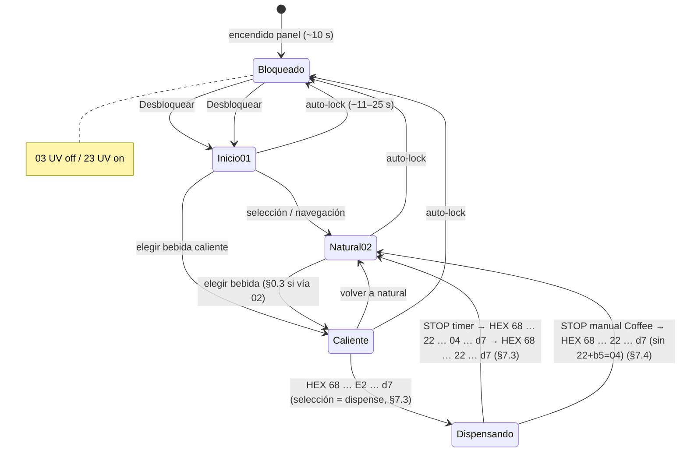
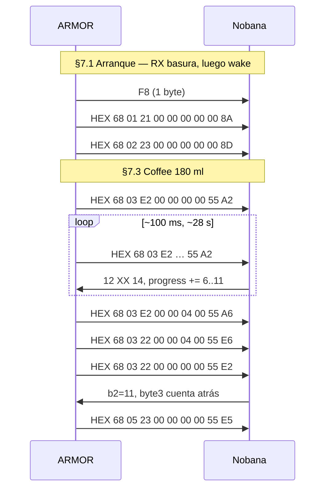
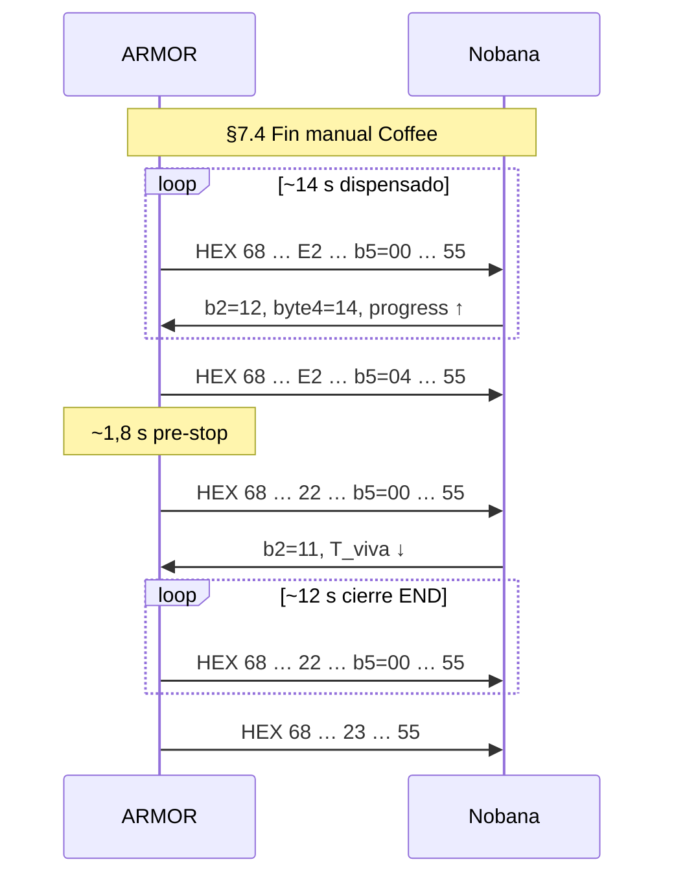

# Protocolo UART Nobana — Relevamiento R1–R3

Documento de referencia del protocolo observado entre panel ARMOR (BF7612DM28) y PCB Nobana.

**Estado:** relevamiento ARM **2026-06-03** · **POC ESP32 maestro validado 2026-06-04** (§7.6)  
**Fuente:** capturas con [`tools/nobana_uart_sniffer/`](../tools/nobana_uart_sniffer/) — ARMOR en paralelo (jun-03) y ESP32 [`mate_point_UART_v0-1`](mate_point_UART_v0-1/) sustituyendo ARMOR (jun-04).

| Captura | Archivo | Escenario |
|---------|---------|-----------|
| Arranque + OFF | [`2026-06-03-inicio-fin.md`](../tools/nobana_uart_sniffer/capturas/2026-06-03-inicio-fin.md) | ON → idle bloqueado → OFF |
| Coffee 180 ml (timer) | [`2026-06-03-inicio-dispense-coffee-fin.md`](../tools/nobana_uart_sniffer/capturas/2026-06-03-inicio-dispense-coffee-fin.md) | ON → Coffee → ciclo completo → bloqueado |
| Coffee 180 ml (manual) | [`2026-06-03-inicio-dispense-coffee-fin_manual.md`](../tools/nobana_uart_sniffer/capturas/2026-06-03-inicio-dispense-coffee-fin_manual.md) | Igual, corte con **botón Coffee** |
| **POC ESP — wake manual** | [`2026-06-04-inicio-dispense-coffee-fin_ESP-UART_Wake_manual.md`](../tools/nobana_uart_sniffer/capturas/2026-06-04-inicio-dispense-coffee-fin_ESP-UART_Wake_manual.md) | ESP maestro: **`W`** → **`R`** → Coffee 180 ml timer → bloqueado |
| **POC ESP** | [`2026-06-04-inicio-dispense-coffee-fin_ESP-UART.md`](../tools/nobana_uart_sniffer/capturas/2026-06-04-inicio-dispense-coffee-fin_ESP-UART.md) | Misma secuencia UART; procedimiento wake anterior |
| **POC ESP — tanque vacío** | [`2026-06-04-Water_empty_ESP-UART-v0-2.md`](../tools/nobana_uart_sniffer/capturas/2026-06-04-Water_empty_ESP-UART-v0-2.md) | Sin agua en tanque; niveles **`b2`** / byte 7 (§4.4) |

| Documento relacionado | Contenido |
|-----------------------|-----------|
| [`PLAN-IMPLEMENTACION.md`](PLAN-IMPLEMENTACION.md) | Plan firmware |
| [`plan-de-implementacion.md`](../plan-de-implementacion.md) | Plan general, prerrequisito R1–R3 |
| [`tools/nobana_uart_sniffer/README.md`](../tools/nobana_uart_sniffer/README.md) | Sniffer y cableado |

---

## 0. Patrones validados vs pendientes (2026-06-03)

Las tres capturas del **2026-06-03** (tabla superior) son la **única referencia UART** de este documento. Patrones de relevamientos **2026-06-01/02** que las contradecían (stop `02`+`d7=19`, fin Coffee con `C2` sin `E2`, fase NOB `13`, puente `22`→`E2`) fueron **eliminados**; lo no observado aún figura en §0.3.

### 0.1 Validado en las 3 capturas

| # | Patrón | Evidencia |
|---|--------|-----------|
| V1 | **9600 8N1**, TTL 5 V; polling ARM **~100 ms** | Las tres capturas |
| V2 | Tramas **9 B** (ARM→NOB) / **11 B** (NOB→ARM), header **`0x68`**, checksum mod 256 | §3 |
| V3 | **Arranque:** RX basura (`00…`, `trunc`) → **wake `F8`** (ARM→NOB, 1×) → `68 01 21 …` → `68 02 23 …` | §7.1, §9.2 — las 3 capturas |
| V4 | **`cmd + 0x20`** = misma función con **UV care** (`01`→`21`, `02`→`22`, `03`→`23`, `C2`→`E2`) | §5.1 |
| V5 | **Bloqueado:** `03`/`23`; display 888 apagado; `d7` puede ser `00` o última bebida | §7.1–7.2 |
| V6 | **Apagado:** `00`, `WARN trunc` con `FF`, sin tramas `0x68` estables | §7.5 |
| V7 | NOB idle: **`b2=12`**, byte 4 **`14`**, progress **`00 00`**; byte 3 = **T_viva** (≠ 25 °C del display) | §4.1 |
| V8 | **`d7`** en ARM = consigna de bebida; **no** es la T_viva (byte 3 NOB) | §4.1, §5.2 |
| V9 | **Ml no viajan por UART**; preset solo en RAM del ARMOR; bus usa **`b5`** como flag | §5.3 |

### 0.2 Validado en Coffee 180 ml (timer + manual)

| # | Patrón | Timer (`inicio-dispense-coffee-fin`) | Manual (`…_manual`) |
|---|--------|--------------------------------------|---------------------|
| V10 | Inicio dispensado = **`E2` + `d7=55` + `b5=00`** (sin `b5=04` al elegir Coffee) | 13:01:50 `68 03 E2 … A2` | 17:38:01 `68 04 E2 … A3` |
| V11 | Mantenimiento: polling **`E2`**, **`d7=55`**; NOB sube byte 3 y progress (bytes 8–9, **uint16 BE**) | ~28 s | ~14 s (corte antes) |
| V12 | **Pre-stop:** sigue **`cmd=E2`**, solo **`b5` pasa a `04`**, **`d7` sin cambio** | `… E2 00 00 04 00 55 A6` ~3,9 s | `… E2 00 00 04 00 55 A8` ~1,8 s |
| V13 | Cierre ARM: **`22` + `b5=00` + `d7=55`** en polling | Tras paso V14 | **Directo** tras V12 (§7.4) |
| V14 | STOP intermedio timer: **`22` + `b5=04` + `d7=55`** | `68 03 22 00 00 04 00 55 E6` | **No observado** en manual |
| V15 | NOB al parar: **`b2=11`**, T_viva baja, progress → 0 | 13:02:18 | 17:38:17 |
| V16 | Post-ciclo: **`23` + `d7=55`** (última bebida) | `68 05 23 … E5` | `68 06 23 … E6` |

### 0.2.1 Validado en POC ESP32 maestro (2026-06-04)

Capturas [`2026-06-04-inicio-dispense-coffee-fin_ESP-UART_Wake_manual.md`](../tools/nobana_uart_sniffer/capturas/2026-06-04-inicio-dispense-coffee-fin_ESP-UART_Wake_manual.md) y [`2026-06-04-inicio-dispense-coffee-fin_ESP-UART.md`](../tools/nobana_uart_sniffer/capturas/2026-06-04-inicio-dispense-coffee-fin_ESP-UART.md). Firmware [`mate_point_UART_v0-1`](mate_point_UART_v0-1/). Detalle §7.6.

| # | Patrón | Evidencia ESP |
|---|--------|----------------|
| V17 | ESP sustituye ARMOR; pines **GPIO25 RX / GPIO17 TX**; polling **~100 ms** | Ambas capturas 2026-06-04 |
| V18 | **`seq` constante por fase** en polling (`01`+`21`, `02`+`23`, `03`+`E2`, …); sube solo al cambiar fase/comando | Log `[replay] fase=… seq=N` |
| V19 | Ciclo Coffee timer completo: **B→I** §7.3; `FIN (ciclo_completo)`; dispensado hidráulico OK | Wake manual + replay `R` |
| V20 | Wake **`F8`** vía comando **`W`** (manual); **`R`** no reenvía `F8` | §7.6; §9.2 actualizado POC |
| V21 | Feedback **chime** alineado con ref. ARMOR (§7.7) | 3 + 1 + 1 en ciclo exitoso |

### 0.2.2 Validado — sensor de nivel de tanque (2026-06-04)

Captura [`2026-06-04-Water_empty_ESP-UART-v0-2.md`](../tools/nobana_uart_sniffer/capturas/2026-06-04-Water_empty_ESP-UART-v0-2.md). Semántica confirmada en banco (correlación sensor físico ↔ UART). Detalle §4.4.

| # | Patrón | Política Nobana | UART NOB→ARM (típico) |
|---|--------|-----------------|----------------------|
| V22 | **Nivel bajo** — hay agua en tanque | **Sigue permitiendo** dispensar | **`b2=0x11`**, byte 7 = `00` |
| V23 | **Tanque vacío** — sensor sin agua | **No permite** dispensar (UI/bloqueo interno) | **`b2=0x10`**, byte 7 = **`0x01`** |
| V24 | En vacío, **`progress` puede subir** si el maestro fuerza `E2` | Flujo hidráulico ausente; no usar progress como detector de agua | §4.4 |

> **`b2=0x11`** también aparece en **cierre térmico** tras STOP (`§4.3`, capturas jun-03): mismo byte, contexto distinto (fin de ciclo vs aviso de nivel bajo en standby). Priorizar **byte 7** y repetición en poll `21`/`23` para discriminar vacío (§4.4).

### 0.3 Pendiente de captura (2026-06-03)

Escenarios **no contradichos** por las tres capturas actuales, pero **aún sin log** bajo sniffer + agua en circuito:

| Tema | Notas |
|------|--------|
| Coffee **250 / 450 / 750 / 999 ml** (timer y fin manual) | Duraciones históricas en §8 — repetir captura |
| **Milk**, **Tea**, **Honey** | Bebidas y `d7` distintos |
| Navegación **volumen** / confirmar preset en UI | `b5=04` fuera del ciclo Coffee ya validado |
| **Agua natural** (`02`/`22`) y dispense **25 °C** genérico | Sin captura 2026-06-03 |
| **Lock manual**, **Cooling** | §11 |
| Umbrales exactos del sensor (mm / % tanque) vs `b2` | §4.4 — UART validado; calibración física pendiente |
| ¿Nobana **requiere** `F8` antes del primer `0x68`? | Sin captura A/B sin `F8` — §9.2 |

---

## 1. Resumen ejecutivo

| Tema | Hallazgo |
|------|----------|
| Física | 9600 bps, 8N1, 5V TTL; polling ARM ~100 ms |
| Wake arranque | Byte **`0xF8`**, **1×**, **ARM→NOB**, antes del primer `0x68` (§9.2) — no es basura RX |
| Tramas | ARM→NOB **9 B**, NOB→ARM **11 B**, header `0x68`, checksum mod 256 |
| Rol ARM | Emula el panel; envía consigna (`cmd`, `d7`, `b5`) |
| Rol NOB | Telemetría: temperatura viva (byte 3), fase (byte 4), progress (bytes 8–9) |
| Volumen (ml) | **No codificado en UART** — preset en RAM del ARMOR; bus solo lleva flag `b5=0x04` |
| Corte de dispensado | **Timer** o **botón Coffee** en ARMOR; Nobana no decide ml (§7.3–7.4) |
| Flujo Coffee timer (validado) | `E2`+`55` → pre-stop `E2`+`b5=04` → `22`+`b5=04` → `22`+`b5=00` → `23`+`55` (§7.3) |
| Flujo Coffee fin manual (validado) | `E2`+`55` → pre-stop `E2`+`b5=04` → **`22`+`b5=00`** (sin `22`+`b5=04`) → `23`+`55` (§7.4) |
| Patrones de banco | Solo §**0** y §**7** (tres capturas 2026-06-03) |
| UV | `cmd + 0x20` = misma función con UV care activo (§5.1) |
| Progress | uint16 BE en bytes 8–9; +7…+11 por tick (~1 s); **no es ml** |
| Nivel tanque | **`b2=11`** = agua baja (aún dispensa); **`b2=10` + byte7=`01`** = vacío (no dispensa) | §4.4 |

---

## 2. Capa física

| Parámetro | Valor |
|-----------|-------|
| Baudrate | **9600** bps |
| Formato | **8N1** |
| Nivel lógico | **5V TTL** (idle ~4,74 V) |
| Adaptador relevamiento | TXS0108E (VCCA 3,3 V, VCCB 5 V, **OE = 3,3 V**) |
| Polling ARM | ~**100 ms** — bus siempre activo |

### Cableado sniffer

| Cable Nobana | TXS0108E | ESP32 NodeMCU |
|--------------|----------|---------------|
| **Tx** (Nobana TX) | B1 → A1 | GPIO16 (Serial2 RX) — **NOB→ARM** |
| **Rx** (ARMOR TX) | B2 → A2 | GPIO17 (Serial1 RX) — **ARM→NOB** |
| **G** | GND | GND común |
| **5V** | VCCB | — |
| ESP32 3,3 V | VCCA + OE | — |

---

## 3. Formato de tramas y checksum

### 3.1 Checksum

El **último byte** es la suma aritmética (mod 256) de todos los bytes anteriores.

```c
uint8_t checksum = 0;
for (size_t i = 0; i < len - 1; i++) checksum += frame[i];
```

### 3.2 ARM → NOB (9 bytes)

```
Offset:  0    1     2     3    4    5    6    7     8
        +----+-----+-----+----+----+----+----+-----+-----+
        | 68 | seq | cmd | b3 | b4 | b5 | b6 | d7  | chk |
        +----+-----+-----+----+----+----+----+-----+-----+
```

| Campo | Descripción |
|-------|-------------|
| `0x68` | Header fijo |
| `seq` | Identificador de **fase / comando** en el log ref.; **constante** mientras se repite el mismo `cmd` en polling (~100 ms) y **sube** al pasar a la siguiente fase (`01`→`21`, `02`→`23`, `03`→`E2`, …). Validado en POC ESP §7.6 (**no** incrementar `seq` en cada poll) |
| `cmd` | Modo de agua / bloqueo (§5) |
| `b3`–`b6` | Payload; ver §5.3 (`b5`) |
| `d7` | Consigna de temperatura / bebida (§5.2) |
| `chk` | Checksum |

**Ejemplo — Coffee 85°C, inicio dispensado (captura 2026-06-03, UV on):**

```
13:01:50.035  ARM→NOB  HEX: 68 03 E2 00 00 00 00 55 A2
              byte 2 = E2 (caliente + UV), byte 7 = 55 (85 °C consigna)
```

### 3.3 NOB → ARM (11 bytes)

```
Offset:  0    1     2     3    4    5    6    7    8    9    10
        +----+-----+-----+----+----+----+----+----+----+----+-----+
        | 68 | seq | b2  | b3 | b4 | b5 | b6 | b7 | b8 | b9 | chk |
        +----+-----+-----+----+----+----+----+----+----+----+-----+
                                              MSB  LSB
```

| Campo | Idle | Dispensando / activo |
|-------|------|----------------------|
| Byte 2 (`b2`) | `0x12` normal | `0x12` activo; `0x11` nivel bajo o cierre (§4.3–4.4); `0x10` tanque vacío (§4.4) |
| Bytes 3–4 | `XX 14` (fase); luego `15` en fin timer | byte 3 ≈ °C viva; byte 4 = fase (§4.3) |
| Bytes 5–7 | `0x00` | `0x00`; byte 7 = `0x01` si tanque vacío (§4.4) |
| Bytes 8–9 | `0x0000` | Contador **uint16 BE** (§4.2) |
| Byte 10 | checksum | checksum |

---

## 4. Campos NOB → ARM

### 4.1 Temperatura viva — byte 3

Distinto de **`d7`** (consigna ARM). El Nobana reporta la **temperatura actual del circuito** en byte 3 (valor hex ≈ °C en banco).

| | Dirección | Campo | Rol |
|--|-----------|-------|-----|
| Consigna | ARM → NOB | `d7` | Temperatura **objetivo** de la bebida |
| Medición | NOB → ARM | byte 3 | Temperatura **viva** del circuito |

**Comportamiento observado (capturas 2026-06-03):**

- byte 3 **tiende hacia `d7`** según la inercia térmica del circuito.
- Si T_viva < T_consigna → byte 3 **sube** hacia `d7`.
- Si T_viva > T_consigna → byte 3 **baja** hacia `d7`.

| Situación | `d7` | byte 3 (log) | Evolución |
|-----------|------|--------------|-----------|
| Arranque idle | `00` en ARM | `2C` (`inicio-fin`, 12:55:53) / `29` (`dispense`, 13:01:44) | Fase `14`, progress `00 00` |
| Coffee 180 ml, inicio | `55` | `29` (13:01:50) | Sube `29`→`2A`→…→`54` (13:02:14) hacia consigna |
| Coffee 180 ml, cierre NOB | `55` en ARM | `4C`→`36` (13:02:18–20, `b2=11`) | Cuenta atrás tras STOP |
| Idle post-ciclo | `55` en ARM | `3A` (13:02:33, `cmd=23`) | Bloqueado, fase `15` |

### 4.2 Contador de progreso — bytes 8–9

Entero **uint16 big-endian**; incremento **+7 a +11** por tick (~1 s); en logs largos domina **+11 (`0x0B`)**.

```c
uint16_t progress = ((uint16_t)frame[8] << 8) | frame[9];
```

| Par (byte8, byte9) | Valor | Contexto (log 2026-06-03 Coffee 180 ml) |
|--------------------|-------|----------------------------------------|
| `00 00` | 0 | Inicio ciclo — `NOB→ARM HEX: 68 03 12 29 14 00 00 00 00 00 BA` (13:01:50) |
| `00 06` | 6 | Primer incremento — `… 00 00 06 C0` (13:01:53) |
| `00 0D` | 13 | — `… 00 00 0D CE` (13:01:54) |
| `00 94` | 148 | Pre-STOP — `… 00 00 94 78` (13:02:12) |
| `00 9B` | 155 | Con `b5=04` en ARM — `… 00 00 9B 7F` (13:02:13–14) |
| `00 00` | 0 | Cierre NOB `b2=11` — `… 00 00 00 DD` (13:02:18) |

Otros presets / bebidas: pendiente §0.3.

> **No es ml en el bus.** Offset inicial variable (`0`, `6`, `7`, `13`…). El MSB (`00`/`01`/`02`) es parte del contador, no una “fase” independiente. El ARMOR corta por **timer interno** (§6).

### 4.3 Bytes 3–4 — fase de operación

Patrón **`12 XX YY`** en capturas 2026-06-03 (Coffee 180 ml, agua en circuito):

| Fase | byte 4 (`YY`) | byte 3 | Ejemplo log |
|------|---------------|--------|-------------|
| Idle / precalent. (ARM `21`/`23`) | `14` | T_viva en reposo | `NOB→ARM HEX: 68 02 12 29 14 00 00 00 00 00 B9` (13:01:47) |
| Ciclo caliente (ARM `E2`) | `14` | T_viva → hacia `d7` | `… 68 03 12 2C 14 …` → `… 12 54 14 …` (13:01:50–13:02:14) |
| Transición fin de ciclo | `15` | Cerca de `d7` | `… 68 03 12 54 15 …` (13:02:14, antes del STOP) |
| Cierre telemetría | `15` | Cuenta atrás | `b2=11`: `… 68 03 11 4C 15 …` (13:02:18) — ver también §4.4 (`b2=11` = nivel bajo) |
| Idle post-ciclo (`23`) | `15` | Resto térmico | `… 68 05 12 3A 15 …` (13:02:33) |

> En capturas **2026-06-03** **no apareció byte 4 = `13`** en dispensado; dominó **`14`**. El paso a **`15`** se vio en el fin **por timer** (§7.3); en fin **manual** Coffee el corte llegó con byte 4 aún en **`14`** (§7.4).

### 4.4 Sensor de nivel de tanque — `b2` y byte 7

El Nobana reporta el estado del **sensor de agua en el tanque** en el byte 2 de la trama NOB→ARM. El byte 7 complementa el caso **sin agua**. Validado en banco y captura [`2026-06-04-Water_empty_ESP-UART-v0-2.md`](../tools/nobana_uart_sniffer/capturas/2026-06-04-Water_empty_ESP-UART-v0-2.md) (§0.2.2 V22–V24).

| `b2` | Byte 7 | Sensor / tanque | ¿Dispensa? | Ejemplo HEX (extracto) |
|------|--------|-----------------|------------|-------------------------|
| **`0x12`** | `00` | Normal (nivel OK o telemetría de ciclo activo) | Sí | `… 12 29 14 00 00 00 00 00 …` |
| **`0x11`** | `00` | **Hay agua, nivel bajo** | **Sí** — Nobana **sigue** permitiendo dispensar | `68 01 11 37 14 00 00 00 00 00 C5` (standby poll `21`, T_viva ~55 °C) |
| **`0x10`** | **`0x01`** | **Sin agua** en tanque | **No** — Nobana **bloquea** dispensado (UI / lógica interna) | `68 01 10 58 14 00 00 01 00 00 E6` |

**Detección sugerida en el maestro (ESP / kiosco):**

```c
bool nob_tank_empty(const uint8_t *nob_rx_11) {
    return nob_rx_11[2] == 0x10 && nob_rx_11[7] == 0x01;
}
bool nob_tank_low(const uint8_t *nob_rx_11) {
    return nob_rx_11[2] == 0x11 && nob_rx_11[7] == 0x00;
}
```

**Notas de la captura water-empty:**

- Tras un ciclo Coffee con agua residual, el poll standby `21` puede fijar **`b2=11`** (nivel bajo) antes del vacío definitivo.
- Con tanque vacío, la trama **`10` / `01`** se repite en cada respuesta al poll aunque el maestro envíe `E2` — el Nobana **no** habilita flujo; el contador **progress** (bytes 8–9) **puede incrementarse** si se insiste con `R` sin agua (**no** usar progress como proxy de caudal).
- En vacío, byte 4 puede permanecer en **`14`** (no pasa a `15`); la alarma de nivel **no** se codifica solo con la fase byte 4.

**Solapamiento con cierre de ciclo (jun-03):** en STOP/cooldown también se vio `b2=11` con T_viva bajando (V15). Ese contexto es **fin térmico de dispensado**; el mismo valor `11` en **standby** con byte 7 = `00` indica **aviso de nivel bajo** con dispensado aún permitido. Si tras varios intentos de `E2` sin caudal aparece **`10`+`01`**, tratar como **vacío** y no reintentar dispensado hasta rellenar tanque.

---

## 5. Campos ARM → NOB

### 5.1 Campo `cmd` — modo de agua, UV y bloqueo

El byte **`cmd`** combina **modo de agua / UI** y **UV care**: variante **`cmd + 0x20`** = misma función con UV activo.

| Base | + UV (`+0x20`) | Modo |
|------|----------------|------|
| **`0x01`** | **`0x21`** | **Inicio** — agua natural (tras Desbloquear) |
| **`0x02`** | **`0x22`** | **Agua natural** (± UV) |
| **`0xC2`** | **`0xE2`** | **Agua caliente** — bebida en `d7` (± UV) |
| **`0x03`** | **`0x23`** | **Bloqueado** — display 888 apagado (± UV) |

**No confundir:**

- `02`/`22` = agua natural, **no** bloqueo.
- `03`/`23` = bloqueado; `+0x20` solo indica UV, no otro tipo de lock.
- `d7` conserva a menudo la **última bebida** también en `01`/`02`/`03`.

#### Bloqueado (`0x03` / `0x23`)

| Aspecto | Comportamiento |
|---------|----------------|
| Display 888 | Apagado |
| Botones visibles | UV care, Desbloquear |
| `d7` | `0x19`, `0x00`, o temp de última bebida |

| `cmd` | UV care |
|-------|---------|
| `0x03` | Off |
| `0x23` | On |

**Cuándo se observa (capturas 2026-06-03):**

- Tras encendido: breve `HEX: 68 01 21 00 00 00 00 00 8A`, luego `HEX: 68 02 23 00 00 00 00 00 8D` (§7.1)
- Idle previo a bebida: `HEX: 68 02 23 …` / `NOB→ARM … 12 29 14 …` (§7.2)
- Post-dispense Coffee 180 ml: `HEX: 68 05 23 00 00 00 00 55 E5` (13:02:33)

**Lock manual:** *(pendiente — captura con `M`)*

#### Inicio (`0x01` / `0x21`)

Tras encendido, **antes** del estado bloqueado estable (captura `2026-06-03-inicio-fin.md`):

```
12:55:52.237  ARM→NOB  HEX: 68 01 21 00 00 00 00 00 8A
12:55:53.064  NOB→ARM  HEX: 68 01 12 2C 14 00 00 00 00 00 BB
```

Misma secuencia al inicio de `2026-06-03-inicio-dispense-coffee-fin.md` (`12 29 14` en byte 3).

#### Agua natural (`0x02` / `0x22`)

Modo agua a temperatura ambiente / 25 °C (± UV). **Sin captura 2026-06-03** en este documento (§0.3).

#### Agua caliente (`0xC2` / `0xE2`)

Selección Coffee 180 ml (captura `2026-06-03-inicio-dispense-coffee-fin.md`) — **inicio inmediato del ciclo**, sin `b5=04` previo:

```
13:01:50.035  ARM→NOB  HEX: 68 03 E2 00 00 00 00 55 A2
13:01:50.035  NOB→ARM  HEX: 68 03 12 29 14 00 00 00 00 00 BA
```

El ARMOR mantiene la misma trama `E2` + `d7=55` en polling ~100 ms hasta el STOP (§7.3).

### 5.2 Campo `d7` — consigna de temperatura

Temperatura **objetivo** declarada por el ARMOR (**no** es la lectura viva; esa va en byte 3 NOB).

| `d7` | °C | Bebida / uso |
|------|-----|--------------|
| `0x19` | 25 | Agua a 25°C *(sin captura 2026-06-03)* |
| `0x55` | 85 | Coffee |
| `0x5D` | 93 | Tea *(panel puede indicar 100°C)* |
| `0x2D` | 45 | Milk |
| `0x41` | 65 | Honey |

`d7` aparece también en `01`/`02`/`03` como **última bebida seleccionada**, no solo en modo caliente.

### 5.3 Campo `b5` — flag de volumen (no ml)

#### Confirmación: no hay codificación UART del preset ml

Los **mililitros no viajan por UART**. En capturas **2026-06-03** (Coffee 180 ml):

| Observación | Evidencia |
|-------------|-----------|
| Inicio de dispensado | `HEX: 68 … E2 00 00 **00** 00 55 …` — **sin** `b5=04` al elegir Coffee (§7.3–7.4) |
| Pre-stop / fin | `b5` pasa a **`04`** solo en pre-stop y (timer) STOP `22`+`04`; no codifica ml |
| Preset activo | El ARMOR guarda ml en **RAM interna**; el bus solo lleva **`b5=0x04`** como flag genérico |

Navegación 250 vs 750 ml y otros presets: **pendiente** §0.3.

**Conclusión:** `b5=0x04` = *“volumen confirmado / preset activo en RAM del ARMOR”*, **no** índice ni codificación de ml.

| Momento | Trama (validado 2026-06-03) | Hora log |
|---------|----------------------------|----------|
| Inicio dispensado (selección Coffee) | `HEX: 68 03 E2 00 00 00 00 55 A2` — **sin** `b5=04` | 13:01:50 (timer) |
| Pre-STOP (aún `E2`, `b5=04`) | `HEX: 68 03 E2 00 00 04 00 55 A6` | desde 13:02:14 (timer) |
| STOP timer | `HEX: 68 03 22 00 00 04 00 55 E6` | 13:02:17 |
| Cierre | `HEX: 68 03 22 00 00 00 00 55 E2` | 13:02:18 |
| Pre-STOP manual | `HEX: 68 05 E2 00 00 04 00 55 A8` | 17:38:15 (manual) |
| STOP manual (sin `22`+`04`) | `HEX: 68 05 22 00 00 00 00 55 E4` | 17:38:17 (manual) |
| Post-ciclo / bloqueado | `HEX: 68 05 23 … 55 E5` / `68 06 23 … 55 E6` | 13:02:33 / 17:38:29 |

Confirmar volumen / otros presets: §0.3.

El corte por cantidad lo ejecuta el **timer del ARMOR**, no el Nobana.

---

## 6. Máquina de estados



| Evento | Secuencia UART (2026-06-03) | UI panel |
|--------|-------------------------------|----------|
| Encendido | RX ruido → **`F8`** → `HEX: 68 01 21 …` → `HEX: 68 02 23 …` (§7.1) | Desbloqueado ~25 °C, chime ×2 |
| Idle bloqueado | `HEX: 68 02 23 …` (§7.2) | Bloqueado / espera |
| Elegir Coffee 180 ml | `HEX: 68 03 E2 00 00 00 00 55 A2` (§7.3) | Coffee, chime; luego 85 °C en display |
| Fin dispensado (timer) | `… 22 … 04 … 55` → `… 22 … 55` → `… 23 … 55` (§7.3) | END, chime |
| Fin dispensado (botón Coffee) | `E2`+`04` → `22`+`00` → `23`+`55` (§7.4) | END ~3 s tras botón, chime |
| Bloqueo final post-ciclo | `HEX: 68 05 23 … 55` (§7.3, §7.6) | **1 chime** (POC ESP 2026-06-04) |
| Wake `F8` solo | `ARM→NOB len=1 F8` (§9.2) | **Sin chime** |
| Apagado | ceros / `trunc` (sin `F8` observado) (§7.5) | OFF |
| Confirmar volumen / navegar | §0.3 | — |

---

## 7. Flujos observados — capturas 2026-06-03

Patrones comunes: §**0**. Preset **180 ml** solo en RAM del ARMOR; el bus no codifica ml (§5.3).



### 7.1 Arranque (encendido)

Fase **A** — basura RX (§9.3). Fase **A′** — wake **`F8`** (§9.2). Luego protocolo `0x68`:

| Hora (log) | Dir. | Evento | Tratamiento |
|------------|------|--------|-------------|
| 12:55:51 / 13:01:38 | NOB→ARM | `WARN trunc` len=128, `HEX: 00 … 00` | Ignorar (parser) |
| 12:55:51 / 13:01:38 | NOB→ARM | `FRAME len=2 HEX: 00 00` | Ignorar |
| 12:55:51 / 13:01:38 | ARM→NOB | Bloque largo de `0x00` (125–126 B) | Ruido línea / boot; no replicar en POC salvo prueba |
| 13:01:41 | ARM→NOB | `FRAME len=4 HEX: 00 00 00 00` *(solo coffee)* | Idem |
| 13:01:42 | ARM→NOB / NOB→ARM | `len=82` / `len=89` de `0x00` *(solo coffee)* | Idem |
| 12:55:52 / 13:01:43 | ARM→NOB | **`FRAME len=1 HEX: F8`** | **Wake maestro** — §9.2 |
| 12:55:52 / 13:01:43 | ARM→NOB | `HEX: 68 01 21 00 00 00 00 00 8A` | Protocolo (~150–200 ms tras `F8`) |
| 12:55:53 / 13:01:44 | NOB→ARM | `HEX: 68 01 12 2C 14 …` / `HEX: 68 01 12 29 14 00 00 00 00 00 B8` | Telemetría válida |
| 12:55:56 / 13:01:47 | ARM→NOB | `HEX: 68 02 23 00 00 00 00 00 8D` | Bloqueado + UV |
| 12:55:56 / 13:01:47 | NOB→ARM | `HEX: 68 02 12 2C 14 …` / `HEX: 68 02 12 29 14 00 00 00 00 00 B9` | Idle bloqueado |

Secuencia estable tras encendido: **`F8` (1×)** → **`21` (~4 s en coffee-fin)** → **`23` (bloqueado + UV)**. En ARM, `d7=00` en `21`/`23`; en NOB, byte 3 ≈ `29`–`2C` (41–44 °C), byte 4 = `14`.

#### 7.1.1 Byte `0xF8` — resumen (detalle §9.2)

| Pregunta | Respuesta (capturas 2026-06-03) |
|----------|----------------------------------|
| ¿Quién lo envía? | Siempre **ARM→NOB** (panel ARMOR; en POC el **maestro ESP**) |
| ¿Cuántas veces? | **Una** por encendido, antes del primer `0x68` |
| ¿Nobana responde solo a `F8`? | **No** — primera trama NOB `0x68` durante polling `21` |
| ¿Aparece al apagar? | **No** en `inicio-fin` (§7.5) |
| ¿Es `0x55` de sync estándar? | **No** — wake propio; protocolo útil sigue en **`0x68`** |

### 7.2 Idle bloqueado (previo a Coffee)

Polling hasta selección de bebida (captura coffee, **~7 s** con `23`):

```
13:01:47.018  ARM→NOB  HEX: 68 02 23 00 00 00 00 00 8D
13:01:47.018  NOB→ARM  HEX: 68 02 12 29 14 00 00 00 00 00 B9
```

### 7.3 Coffee 180 ml — selección, dispensado y fin por timer

**Captura:** [`2026-06-03-inicio-dispense-coffee-fin.md`](../tools/nobana_uart_sniffer/capturas/2026-06-03-inicio-dispense-coffee-fin.md)

**UI observada:** chime al elegir Coffee; display **85 °C**; al terminar **END** + chime. Volumen **180 ml** por defecto en panel (no aparece en UART).

#### Inicio (selección = arranque de ciclo)

```
13:01:50.035  ARM→NOB  HEX: 68 03 E2 00 00 00 00 55 A2
13:01:50.035  NOB→ARM  HEX: 68 03 12 29 14 00 00 00 00 00 BA
```

#### Mantenimiento (~28 s, 13:01:50 → 13:02:17)

| Hora | ARM→NOB | NOB→ARM (extracto) |
|------|---------|-------------------|
| 13:01:53 | `HEX: 68 03 E2 00 00 00 00 55 A2` | `… 12 29 14 … 00 06` (progress=6) |
| 13:01:54 | idem | `… 12 2E 14 … 00 0D` (progress=13) |
| 13:02:12 | idem | `… 12 53 14 … 00 94` (progress=148) |
| 13:02:14 | `HEX: 68 03 E2 00 00 04 00 55 A6` | `… 12 54 15 …` (byte 4 → `15`) |

Durante todo el ciclo activo el ARMOR repite **`E2`** con **`d7=55`**. El Nobana incrementa byte 3 hacia `54` y el contador bytes 8–9 (§4.2).

#### Fin por timer ARMOR

| Paso | Hora | ARM→NOB | NOB→ARM |
|------|------|---------|---------|
| 1 — STOP | 13:02:17.956 | `HEX: 68 03 22 00 00 04 00 55 E6` | `HEX: 68 03 12 4D 15 00 00 00 00 B8 97` |
| 2 — Cierre | 13:02:18.086 | `HEX: 68 03 22 00 00 00 00 55 E2` | `HEX: 68 03 11 4C 15 00 00 00 00 00 DD` (`b2=11`) |
| 3 — Enfriamiento | 13:02:18–20 | `HEX: 68 03 22 … 55 E2` / luego `68 04 22 …` | `11` + byte 3 `4C`→`36` |
| 4 — Bloqueado | 13:02:33.488 | `HEX: 68 05 23 00 00 00 00 55 E5` | `HEX: 68 05 12 3A 15 00 00 00 00 00 CE` |

El STOP usa **`cmd=22`** (agua natural + UV) con **`b5=04`**, no la misma trama `E2` del mantenimiento. El cierre siguiente lleva **`b5=00`** y mismo **`d7=55`**.

#### Pre-stop (`E2` + `b5=04`) — común timer y manual

Antes del STOP, el ARMOR mantiene **`cmd=E2`** y **`d7=55`** y solo eleva **`b5` de `00` a `04`**. La duración del pre-stop depende del modo:

| Modo | Duración ~ | Captura |
|------|------------|---------|
| Timer (ciclo completo ~28 s) | **~3,9 s** | `inicio-dispense-coffee-fin`, 13:02:14 → 13:02:17 |
| Manual (botón Coffee) | **~1,8 s** | `…_manual`, 17:38:15 → 17:38:17 |

### 7.4 Coffee — fin manual

**Captura:** [`2026-06-03-inicio-dispense-coffee-fin_manual.md`](../tools/nobana_uart_sniffer/capturas/2026-06-03-inicio-dispense-coffee-fin_manual.md) (log verbose, sniffer sin dedup).

**UI observada:** igual que §7.3 hasta dispensar; al pulsar **Coffee** de nuevo el dispensado cesa en **~3 s** (1 chime); pantalla **END**; luego bloqueo.

#### Arranque y selección (igual §0.1 / §7.1–7.2)

Misma secuencia que las otras capturas 2026-06-03, con una variante extra antes de Coffee:

| Hora | ARM→NOB | Notas |
|------|---------|--------|
| 17:37:53.349 | `HEX: 68 01 21 00 00 00 00 00 8A` | Inicio + UV |
| 17:37:57.160 | `HEX: 68 02 23 00 00 00 00 00 8D` | Bloqueado |
| 17:37:59.575 | `HEX: 68 03 21 00 00 00 00 00 8C` | Pulso **desbloqueo** (~2,4 s) |
| 17:38:01.784 | `HEX: 68 04 E2 00 00 00 00 55 A3` | Inicio Coffee — **sin** puente `22` previo |

NOB en idle: `HEX: 68 01 12 38 14 …` (T_viva **0x38**, fase **14**).

#### Dispensado activo (~14 s)

```
17:38:01.784  ARM→NOB  HEX: 68 04 E2 00 00 00 00 55 A3
17:38:05.062  NOB→ARM  HEX: 68 04 12 38 14 00 00 00 00 06 D0   ← progress=6
17:38:15.015  NOB→ARM  HEX: 68 04 12 53 14 00 00 00 00 4E 33   ← progress≈78
```

Polling **`E2` + `b5=00` + `d7=55`** hasta el pre-stop. Progress máximo observado **~93** (`00 5D`), frente a **~155** en fin por timer (§7.3).

#### Pre-stop y STOP (botón Coffee)

| Paso | Hora | ARM→NOB | NOB→ARM |
|------|------|---------|---------|
| Pre-stop | 17:38:15.574 | `HEX: 68 05 E2 00 00 **04** 00 55 A8` | `… 12 53 14 … 4E 34` |
| **STOP / cierre** | 17:38:17.417 | `HEX: 68 05 **22** 00 00 **00** 00 55 E4` | `… 12 54 14 …` (aún `b2=12`) |
| Telemetría cierre | 17:38:17.550 | (sigue `22`+`00`) | `HEX: 68 05 **11** 53 14 00 00 00 00 00 E5` |

**Diferencia clave respecto al timer (§7.3):**

| Fase | Timer | Manual (esta captura) |
|------|-------|------------------------|
| Tras `E2`+`b5=04` | `HEX: 68 03 **22** 00 00 **04** 00 55 E6` | **No aparece** `22`+`b5=04` |
| Cierre | `22`+`b5=00` | `22`+`b5=00` (**directo** tras pre-stop) |
| `d7` al parar | `55` | `55` — **no** `0x19` |

#### Cierre en pantalla END y bloqueo

Tras el primer `22`+`00`, el ARMOR repite la misma trama **~11,7 s** (17:38:17 → 17:38:29) mientras NOB mantiene `b2=11` y T_viva baja; luego vuelve `b2=12` con progress en 0.

```
17:38:29.138  ARM→NOB  HEX: 68 06 23 00 00 00 00 55 E6
17:38:29.138  NOB→ARM  HEX: 68 06 12 49 14 00 00 00 00 00 DD
```

`d7=55` se conserva en bloqueo (última bebida Coffee).



### 7.5 Apagado (corte de alimentación)

Captura `2026-06-03-inicio-fin.md`, tras idle en `23`:

```
12:56:03.500  NOB→ARM  FRAME len=1  HEX: 00
12:56:05.987  ARM→NOB  WARN trunc (incluye FF en payload)
12:56:06.020  ARM→NOB  FRAME len=2  HEX: 00 00
12:56:10.579  ARM→NOB  FRAME len=4  HEX: 00 00 00 00
```

### 7.6 POC ESP32 como maestro UART (2026-06-04)

**Firmware:** [`mate_point_UART_v0-1/mate_point_UART_v0-1.ino`](mate_point_UART_v0-1/mate_point_UART_v0-1.ino)  
**Plan banco:** [`PLAN-POC-NOBANA-UART.md`](PLAN-POC-NOBANA-UART.md) §8  
**Capturas de validación:**

| Archivo | Procedimiento wake | Resultado |
|---------|-------------------|-----------|
| [`2026-06-04-inicio-dispense-coffee-fin_ESP-UART_Wake_manual.md`](../tools/nobana_uart_sniffer/capturas/2026-06-04-inicio-dispense-coffee-fin_ESP-UART_Wake_manual.md) | **`W`** manual → **`R`** | **Referencia operativa** |
| [`2026-06-04-inicio-dispense-coffee-fin_ESP-UART.md`](../tools/nobana_uart_sniffer/capturas/2026-06-04-inicio-dispense-coffee-fin_ESP-UART.md) | Wake en arranque (firmware anterior) | Ciclo UART OK; mismo guion B→I |

#### Procedimiento banco (wake manual, recomendado)

1. Nobana **OFF** → flashear/conectar ESP32 → Monitor Serie **115200** (esperar `[ready]`).
2. Nobana **ON** → comando **`W`**: escucha bus **5 s** → **`F8`** (1 B, log TX) → escucha **3 s** (log `NOB->ESP`).
3. Tras **`[wake] LISTO`** → comando **`R`**: replay **B→I** sin repetir `F8`.
4. Verificar log: fases `START_21` … `LOCK_23`, `[replay] FIN (ciclo_completo)`, dispensado y corte en panel.

#### Secuencia UART observada (log ESP, wake manual)

| Paso | Hora / fase log | UART / telemetría | UI (observado) |
|------|-----------------|-------------------|----------------|
| Wake | `W` → `RX_BOOT` → `POST_F8` | `F8`; RX puede ser solo `00…` (sin `0x68` aún) | Sin chime |
| Replay B | `START_21` `seq=1` ~4 s | `68 01 21 …` polling | **2 chimes** (desbloqueo) |
| Replay C | `IDLE_23` `seq=2` ~3 s | `68 02 23 …` polling | Silencio |
| Replay D | `DISPENSE` `seq=3` ~24 s | `68 03 E2 … 55`; `T_act` 56→**85** °C; `progress` 0→**153** | **1 chime** (Coffee); luego dispensado |
| Replay E–G | `PRE_STOP` → `STOP_22_04` → `CLOSE` | `E2`+`b5=04`; `22`+`04`; `22`+`00`; **`b2=11`** | **1 chime** (fin / END) |
| Replay H | `COOLDOWN_22` `seq=4` ~15 s | `22`+`00`; `T_act` baja; `b2` vuelve a `12` | — |
| Replay I | `LOCK_23` `seq=5` ~3 s | `68 05 23 … 55` | **1 chime** (bloqueo) |
| Fin | `[replay] FIN (ciclo_completo)` | — | Módulo bloqueado |

**Duración replay** (primera telemetría `START_21` → `FIN`): ~**55 s** en captura wake manual.

**Notas respecto a la ref. ARMOR (2026-06-03):**

| Tema | Ref. ARMOR | POC ESP 2026-06-04 |
|------|------------|---------------------|
| `progress` antes de pre-stop | ≥ **155** (`0x9B`) en fase D | A veces **timer 24 s** con `progress` **135–153** en D; ≥155 puede aparecer en **E** |
| Byte 4 NOB (`fase`) | Pasa a **`15`** en fin timer | Suele permanecer **`14`** en log Serial; hidráulica OK |
| Respuesta a solo `F8` | Primera `0x68` durante `21` | Tras `W`, ventana post-`F8` puede ser solo `00` — no impide `R` si Nobana ya está ON |

#### Criterio de éxito (ambas capturas 2026-06-04)

- [x] ESP **sin ARMOR** ejecuta guion §7.3 (Coffee 180 ml timer).
- [x] Dispensado hidráulico comparable a ref.; cierre con `b2=0x11`.
- [x] `seq` por fase como ref. (`1`…`5` en log firmware).
- [x] Comandos **`W`** + **`R`** y log archivado en `capturas/`.

### 7.7 Feedback acústico (chime) — correlación UART / UI

El Nobana emite **chimes en transiciones de modo**, no por cada trama de polling (~100 ms). En ciclo Coffee timer **exitoso** (ref. ARMOR §2.1 y POC ESP §7.6):

| # | Cuándo (UI) | Fase / comando maestro | ¿Chime? |
|---|-------------|------------------------|---------|
| — | Wake solo `F8` | A′ — 1× `F8` | **No** |
| 1–2 | Desbloqueo / inicio | B — `0x21` ~4 s (`seq=1`) | **Sí ×2** |
| — | Idle bloqueado | C — `0x23` ~3 s (`seq=2`) | **No** |
| 3 | Elegir Coffee | D — primer `0xE2` + `d7=0x55` (`seq=3`) | **Sí ×1** |
| — | Dispensando (~24 s) | D — polling `E2` + `55` | **No** |
| 4 | Fin dispensado / END | E → F → G — `E2`+`04`, `22`+`04`, `22`+`00`, `b2→11` | **Sí ×1** |
| — | Cooldown (~15 s) | H — `22`+`00` | **No** (salvo percepción unida al corte) |
| 5 | Bloqueo final | I — `0x23` + `d7=0x55` (`seq=5`) | **Sí ×1** |

**Total típico en ciclo OK:** **5 chimes** (o **3** al inicio si los dos primeros se perciben como grupo + 1 + 1).

**Polling sin chime:** repetir la **misma** trama (`68 01 21 …`, `68 03 E2 … 55`, etc.) con el **mismo `seq`** no produce beeps adicionales — condición necesaria para el POC (§0.2.1 V18).

---

## 8. Observaciones empíricas — timer ARMOR

Duraciones con **agua en circuito**. Solo las filas **2026-06-03** están alineadas con el UART documentado (§7); el resto es referencia de banco **pendiente de nueva captura** (§0.3).

| Preset UI | Bebida | Duración ~ | Progress al STOP | UART / captura |
|-----------|--------|------------|------------------|----------------|
| **180 ml** | Coffee | **~28 s** | **`0x009B` (155)** | Validado — §7.3 (ARMOR) |
| **180 ml** | Coffee | **~24 s** activo D | **135–161** (timer o E) | Validado — §7.6 (ESP POC) |
| **180 ml** | Coffee (manual) | **~14 s** activo | **~93** (`00 5D`) | Validado — §7.4 |
| 250 ml | Coffee | ~33 s *(hist.)* | ~227 *(hist.)* | Pendiente §0.3 |
| 450 ml | Coffee | ? | ? | Pendiente §0.3 |
| 750 ml | Coffee | ~97 s *(hist.)* | ~730 *(hist.)* | Pendiente §0.3 |
| 999 ml | Coffee | ? | ? | Pendiente §0.3 |
| — | Milk 45°C | ~31 s *(hist.)* | ~185 *(hist.)* | Pendiente §0.3 |

> Capturas sin agua en circuito **no son referencia** para calibración (Apéndice A).

---

## 9. Casos especiales

### 9.1 Stop manual (botón Coffee)

Único stop manual documentado: **§7.4** — pre-stop `E2`+`b5=04` → **`22`+`b5=00`** con **`d7=55`** (sin `22`+`b5=04` del timer). No usar otros patrones de stop hasta nueva captura (§0.3).

### 9.2 Byte `0xF8` — wake del maestro al encender

**No confundir** con la basura de línea (`0x00`, `trunc`). En las **tres** capturas 2026-06-03, tras estabilizar el ruido de encendido y **antes** del primer frame `0x68`, el **maestro** envía exactamente **un byte**:

```
ARM→NOB  FRAME len=1  HEX: F8
```

| Captura | Hora log | Δ hasta `68 01 21 …` |
|---------|----------|----------------------|
| `inicio-fin` | 12:55:52,070 | ~167 ms |
| `inicio-dispense-coffee-fin` | 13:01:43,029 | ~167 ms |
| `…_fin_manual` | 17:37:53,151 | ~198 ms |

**Interpretación (validada por repetición, no por ACK dedicado):**

| Rol | Tratamiento |
|-----|-------------|
| **Sniffer / log** | Mostrar como frame de **1 B**; no mezclar con `WARN trunc` de ceros |
| **Parser RX (ESP)** | Si llega `F8` en NOB→ARM: **ignorar** (no observado en capturas) |
| **Maestro (ARMOR / ESP POC)** | Tras ignorar basura RX, **emitir `0xF8` una vez** (en POC: comando **`W`**, §7.6), esperar ~150–200 ms, luego **`68 01 21 …`** en replay **`R`** — ver [`PLAN-POC-NOBANA-UART.md`](PLAN-POC-NOBANA-UART.md) |
| **Checksum / `seq`** | **No aplica** — no es trama de 9 B con header `0x68` |

**No confirmado:** que el Nobana **rechace** el bus si se omite `F8` (falta captura sin ese byte). En banco: probar replay con y sin `F8` antes de cerrar POC.

**No usar `F8`:** en dispensado, idle, stop ni apagado — solo en **secuencia de encendido** documentada en §7.1.

### 9.3 Arranque y apagado — basura RX (ignorar en parser)

Tramas **sin** header `0x68` y longitud ≠ 9/11: **no** son protocolo Nobana; descartar al ensamblar.

Al **encender**, ejemplos (antes de `F8` y del primer `0x68`):

```
12:55:51.539  NOB→ARM  WARN trunc len=128  HEX: 00 … 00
12:55:51.571  NOB→ARM  FRAME len=2       HEX: 00 00
12:55:51.571  ARM→NOB  FRAME len=125     HEX: 00 … 00
```

Variante adicional en captura coffee: `ARM→NOB len=82`, `NOB→ARM len=89` de ceros (13:01:42).

Al **apagar** (`2026-06-03-inicio-fin.md`) — **sin** `F8` observado:

```
12:56:03.500  NOB→ARM  FRAME len=1   HEX: 00
12:56:05.987  ARM→NOB  WARN trunc (payload con FF)
12:56:06.020  ARM→NOB  FRAME len=2   HEX: 00 00
```

**Protocolo válido:** header **`0x68`**, longitudes **9** (ARM→NOB) u **11** (NOB→ARM). El byte **`0xF8`** queda **fuera** de esa regla (§9.2).

### 9.4 Botón multifunción panel

Correlación UART desde capturas **2026-06-03** — usar **`M texto`** en sniffer para el resto (§0.3).

| Contexto | Acción | UART |
|----------|--------|------|
| Bloqueado | Desbloquear | → `01`/`21` *(pulso `21` también en manual §7.4)* |
| Operativo | Elegir Coffee (180 ml) | `HEX: 68 … E2 00 00 00 00 55 …` — dispensa al mismo tiempo (§7.3–7.4) |
| Dispensando | Stop Coffee (botón Coffee) | `E2`+`04` → `22`+`00`, `d7=55` (§7.4) |
| Fin ciclo | Auto-lock | → `03`/`23`, `d7` = última bebida (§7.3–7.4) |
| Operativo | Agua natural, otros volúmenes, lock manual | §0.3 |

---

## 10. Tabla de tramas de referencia

### 10.1 Capturas 2026-06-03 — **validadas** (§0, §7)

| Acción | Dir. | Trama HEX | Hora (log) | Captura |
|--------|------|-----------|------------|---------|
| Arranque — wake | ARM→NOB | `F8` (1 B) | 12:55:52 / 13:01:43 / 17:37:53 | las 3 |
| Arranque — inicio UV | ARM→NOB | `68 01 21 00 00 00 00 00 8A` | 12:55:52 / 13:01:43 / 17:37:53 | las 3 |
| Arranque — bloqueado UV | ARM→NOB | `68 02 23 00 00 00 00 00 8D` | 12:55:56 / 13:01:47 / 17:37:57 | las 3 |
| Desbloqueo previo Coffee | ARM→NOB | `68 03 21 00 00 00 00 00 8C` | 17:37:59 | manual |
| Idle NOB | NOB→ARM | `68 02 12 29 14 00 00 00 00 00 B9` | 13:01:47 | timer |
| Coffee — inicio | ARM→NOB | `68 03 E2 00 00 00 00 55 A2` | 13:01:50 | timer |
| Coffee — inicio | ARM→NOB | `68 04 E2 00 00 00 00 55 A3` | 17:38:01 | manual |
| Coffee — progress=6 | NOB→ARM | `68 04 12 38 14 00 00 00 00 06 D0` | 17:38:05 | manual |
| Coffee — pre-STOP `b5=04` | ARM→NOB | `68 03 E2 00 00 04 00 55 A6` | 13:02:14 | timer |
| Coffee — pre-STOP manual | ARM→NOB | `68 05 E2 00 00 04 00 55 A8` | 17:38:15 | manual |
| Coffee — STOP timer | ARM→NOB | `68 03 22 00 00 04 00 55 E6` | 13:02:17 | timer |
| Coffee — STOP manual | ARM→NOB | `68 05 22 00 00 00 00 55 E4` | 17:38:17 | manual |
| Coffee — cierre | ARM→NOB | `68 03 22 00 00 00 00 55 E2` | 13:02:18 | timer |
| Coffee — NOB cierre | NOB→ARM | `68 05 11 53 14 00 00 00 00 00 E5` | 17:38:17 | manual |
| Post-ciclo bloqueado | ARM→NOB | `68 05 23 00 00 00 00 55 E5` | 13:02:33 | timer |
| Post-ciclo bloqueado | ARM→NOB | `68 06 23 00 00 00 00 55 E6` | 17:38:29 | manual |
| Nivel bajo (sensor con agua) | NOB→ARM | `68 01 11 37 14 00 00 00 00 00 C5` | 14:02:31 | water-empty |
| Tanque vacío (sin agua) | NOB→ARM | `68 01 10 58 14 00 00 01 00 00 E6` | 14:03:43 | water-empty |

---

> Tramas de relevamientos **2026-06-01/02** (p. ej. stop `02`+`d7=19`, fin Coffee con `C2` sin `E2`, NOB byte 4 = `13`) **no figuran** en este documento: contradicen las capturas **2026-06-03**. Revalidar con sniffer antes de volver a documentar (§0.3).

---

## 11. Pendientes de relevamiento

| Item | Prioridad |
|------|-----------|
| Capturar Coffee **250 / 450 / 750 / 999 ml** (timer + manual) | Alta |
| **Lock manual:** trama UART (marcar `M`) | Alta |
| Captura **Milk** / **Tea** / **Honey** con agua en circuito | Media |
| Navegación volumen y **agua natural** (`02`/`22`) | Media |
| Correlación **`d7`** con display 888 | Media |
| Comandos **Cooling** | Media |
| Calibración física sensor vs umbrales `11` / `10`+`01` | Baja — UART en §4.4 |

---

## Apéndice A — Histórico R1–R3

Interpretaciones del relevamiento temprano **corregidas** en junio 2026:

| Antiguo (incorrecto) | Corrección |
|----------------------|------------|
| `0x21` = desbloqueado | `0x01`/`0x21` = inicio — agua natural |
| `0x22` = standby 25°C | `0x02`/`0x22` = agua natural (± UV) |
| `0x23` = bloqueado UI | `0x03`/`0x23` = bloqueado (± UV) |
| `0xE2` = “modo UI bebida” | `0xC2`/`0xE2` = agua caliente (bebida en `d7`) |

Relevamientos **2026-06-01/02** que contradijeron las capturas **2026-06-03** (stop `02`+`d7=19`, fin Coffee solo `C2`, fase NOB `13`, cierres con `02` en lugar de `22`+UV) fueron **retirados** del cuerpo del documento. Capturas **sin agua en circuito** tampoco son referencia para calibración.

---

## Apéndice B — Herramienta de captura

Sketch: [`tools/nobana_uart_sniffer/nobana_uart_sniffer.ino`](../tools/nobana_uart_sniffer/nobana_uart_sniffer.ino)

| Comando | Acción |
|---------|--------|
| `B9600` | Fijar baudrate |
| `M texto` | Marca manual en log (resetea dedup) |
| `V` | Verbose — todas las FRAME vs solo cambios |
| `S` / `T` | Scan baud / test tráfico |

Por defecto imprime **FRAME solo si cambia** cmd/datos (ignora `seq` y checksum).

---

## Changelog

| Fecha | Cambio |
|-------|--------|
| 2026-06-04 | **§4.4** sensor tanque: `b2=11` nivel bajo (dispensa OK), `b2=10`+byte7=`01` vacío (no dispensa); captura water-empty; §0.2.2 V22–V24; §10.1 |
| 2026-06-04 | **§7.6–7.7** validación POC ESP32 (capturas 2026-06-04); §0.2.1 V17–V21; `seq` por fase §3.2; chimes y wake manual `W` |
| 2026-06-03 | §9.2 `0xF8` = wake maestro (ARM→NOB, 1× al encender); §9.3 basura RX; quitado `F8` de apagado; §7.1.1 y tabla §10.1 |
| 2026-06-03 | Limpieza: eliminados patrones jun-01/02 que contradicen capturas 2026-06-03 (§10.2, stop `02`+`19`, `C2`-only, NOB `13`, puente `22`→`E2`) |
| 2026-06-03 | §0 validado vs pendiente; §7.4 Coffee fin manual; §7.5 apagado; pre-stop `E2`+`b5=04`; timer `22`+`b5=04`→`22`+`b5=00` |
| 2026-06-02 | Reorganización documento; referencia = capturas junio con agua; §5.3 confirma ausencia de codificación ml en UART |
| 2026-06-02 | `d7` consigna vs byte 3 T_viva; Coffee 250/750 ml + Milk con agua |
| 2026-06-01 | Relevamiento temprano modos `cmd` *(stop `02`+`19` retirado en limpieza 2026-06-03)* |
| 2026-05-29 | Documento inicial — 9600 8N1, tramas 9/11 B, checksum, progress uint16 BE, flag `b5=0x04` |
