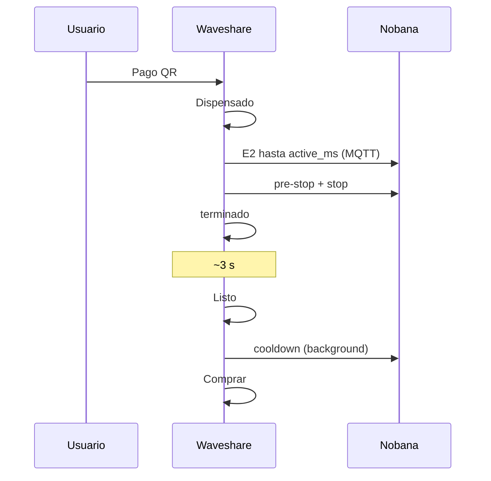

# Captura banco — Mate Point producto v0-3-1 + Nobana (Test1 E2E)

## Metadatos

| Campo | Valor |
|-------|--------|
| **Fecha** | 2026-06-05 |
| **Firmware** | [`mate_point_v0-3-1.ino`](../../../mate_point_firmware/mate_point_v0-3-1/mate_point_v0-3-1.ino) |
| **Placa** | Waveshare ESP32-S3-Touch-LCD-7B |
| **Nobana** | PCB con agua, ARMOR desconectado |
| **Level shifter** | TXS0108E 3.3 V ↔ 5 V |
| **DIP** | **UART2** (PH2.0 → GPIO43/44 @ 9600) |
| **Cableado** | Nobana Tx → GPIO44 · Nobana Rx ← GPIO43 · GND común |
| **Sniffer** | No usado en esta sesión |
| **Pago** | Mercado Pago sandbox (QR real) |
| **Servidor** | `DISPENSE_DURATION_MS=30000` |
| **Resultado** | **E2E OK** — dispensado según `duration_ms` MQTT; UI **terminado** → **Listo**; sin **Error dispensado** |

## Objetivo

Validar [`mate_point_v0-3-1`](../../../mate_point_firmware/mate_point_v0-3-1/): Waveshare **maestro** del timer UART; `duration_ms` MQTT como setpoint de dispensado (activo + pre-stop + stop); UI **terminado** al fin del stop; **Listo** tras breve espera; cooldown en background. Ver [`PLAN-MATE-POINT-v0-3.md`](../../../mate_point_firmware/PLAN-MATE-POINT-v0-3.md) §11.2 y §14.

## Resultado observable (banco)

- Arranque habitual: wake pre-LVGL, **Comprar**, Wi‑Fi/MQTT en footer.
- **Comprar** → orden → QR → pago Mercado Pago sandbox.
- Tras pago: pantalla **Dispensado** e inicio de flujo físico en Nobana.
- Dispensado durante el tiempo definido por **`duration_ms`** en MQTT (~30 s contrato servidor).
- Corte de flujo en Nobana coherente con fin del presupuesto MQTT (pre-stop + stop).
- Pantalla **terminado** al finalizar el stop — **sin** **Error dispensado**.
- Tras unos segundos (~3 s, `TERMINADO_TO_LISTO_MS`): pantalla **Listo**.
- Posteriormente vuelve a **Comprar** (cooldown Nobana en background antes de permitir nuevo ciclo).

## Secuencia UI validada

| Paso | UI | Nobana |
|------|-----|--------|
| 1 | **Dispensado** | `R` activo (`E2`) |
| 2 | (sin cambio) | pre-stop → stop/cierre |
| 3 | **terminado** | inicio cooldown |
| 4 | **Listo** (~3 s después) | cooldown en curso |
| 5 | **Comprar** | fin cooldown → **`S`** |

## Criterios de aceptación (PLAN v0-3 §11.2)

| ID | Criterio | Test1 |
|----|----------|-------|
| T1 | `duration_ms` MQTT controla corte UART | [x] observado — tiempo coherente con MQTT |
| T2 | Volumen físico vs `duration_ms` calibrado | [~] coherente en banco; medición ml pendiente |
| T3 | UI **terminado** al fin del stop | [x] |
| T4 | UI **Listo** tras terminado; sin **Error dispensado** | [x] |
| T5 | Comprar tras cooldown; multi-compra | [x] flujo completo OK en sesión |
| T6 | Sniffer TX solo protocolo | [ ] pendiente |

## Evidencia UART (sniffer)

No registrada. Validación por UI, chimes Nobana y flujo físico. Próximo paso opcional: sniffer en TX para archivar tramas y payload MQTT exacto.

## Comparación con v0-3.0 Test1

| Aspecto | v0-3 Test1 | v0-3-1 Test1 |
|---------|------------|--------------|
| Timer dispensado | Replay fijo ~180 ml | **`duration_ms` MQTT** |
| Pantalla fin ciclo | **Error dispensado** ~30 s | **terminado** |
| **Listo** | Tras error + cooldown | ~3 s tras **terminado** |
| Watchdog | Disparaba en paralelo | Eliminado |

## Conclusión

**Test1 v0-3-1 (2026-06-05) cierra el objetivo de producto con timer MQTT:** dispensado físico alineado al contrato servidor, secuencia UI **Dispensado → terminado → Listo → Comprar** sin errores de watchdog. Pendiente formal: sniffer TX y medición de volumen para calibración fina de `DISPENSE_DURATION_MS`.
