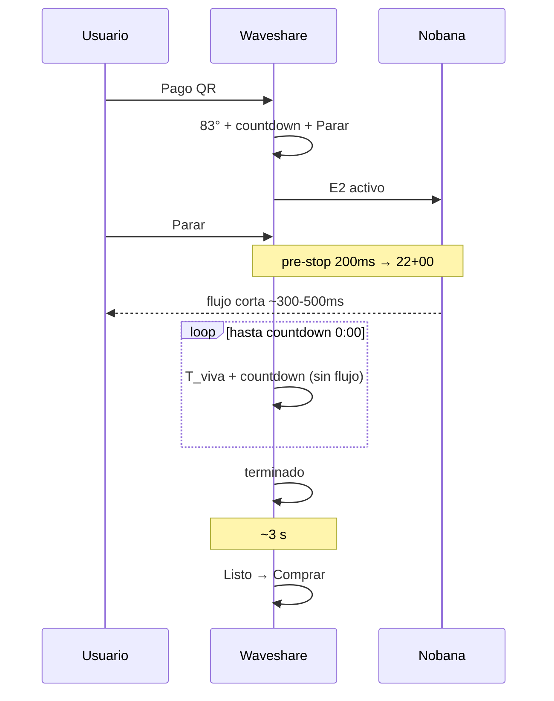

# Captura banco — Mate Point producto v0-3-3 + Nobana (Test1)

## Metadatos

| Campo | Valor |
|-------|--------|
| **Fecha** | 2026-06-05 |
| **Firmware** | [`mate_point_v0-3-3.ino`](../../../mate_point_firmware/mate_point_v0-3-3/mate_point_v0-3-3.ino) |
| **Placa** | Waveshare ESP32-S3-Touch-LCD-7B |
| **Nobana** | PCB con agua, ARMOR desconectado |
| **Level shifter** | TXS0108E 3.3 V ↔ 5 V |
| **DIP** | **UART2** (PH2.0 → GPIO43/44 @ 9600) |
| **Cableado** | Nobana Tx → GPIO44 · Nobana Rx ← GPIO43 · GND común |
| **Sniffer** | No usado en esta sesión |
| **Pago** | Mercado Pago sandbox (QR real) |
| **Servidor** | `DISPENSE_DURATION_MS=30000` |
| **Resultado** | **E2E OK** — Parar ~300–500 ms; fin natural timer; **2.ª compra tras Parar** |

## Objetivo

Validar [`mate_point_v0-3-3`](../../../mate_point_firmware/mate_point_v0-3-3/): pre-stop manual **200 ms** → `22+00`; corte hidráulico rápido; UI contrato hasta **0:00**; **terminado** → **Listo** → **Comprar**; **fin natural timer**; **segunda compra** tras Parar manual. Ver [`PLAN-MATE-POINT-v0-3.md`](../../../mate_point_firmware/PLAN-MATE-POINT-v0-3.md) §16.

## Resultado observable (banco)

- Arranque habitual: wake pre-LVGL, **Comprar**, Wi‑Fi/MQTT en footer.
- **Comprar** → orden → QR → pago Mercado Pago sandbox.
- Tras pago: pantalla **`83°` + countdown + Parar**; inicio de flujo físico en Nobana.
- **Parar** manual: botón disabled al tap; **corte de flujo en ~300–500 ms** (apreciación sensorial en banco).
- Tras Parar: pantalla **mantiene T_viva y countdown** hasta llegar a **0:00** (ventana sin flujo de agua — comportamiento esperado en prueba).
- Al **0:00**: pantalla **terminado** → tras ~3 s **Listo** → **Comprar**.
- Ciclo completo **funcional** con Nobana conectado; sin bloqueos ni errores de UI observados.
- **Segunda compra** tras Parar manual: OK — hubo que **esperar countdown a 0:00** → **terminado** → **Listo** → vuelve **Comprar**; segundo ciclo (QR → pago → dispensado) sin reinicio.
- **Fin natural** (sin Parar): dispensado hasta countdown **0:00** → **terminado** → **Listo** → **Comprar** — comportamiento correcto.

## Secuencia UI validada (Parar manual)

| Paso | UI | Nobana / flujo |
|------|-----|----------------|
| 1 | **83°** + countdown + **Parar** | `E2` activo |
| 2 | Botón **Parar** disabled | pre-stop 200 ms → `22+00` |
| 3 | Countdown sigue; T_viva viva | **Flujo cortado ~300–500 ms** tras tap |
| 4 | Countdown → **0:00** (sin agua) | cierre + cooldown en background |
| 5 | **terminado** | — |
| 6 | **Listo** (~3 s) | cooldown |
| 7 | **Comprar** | standby |
| 8 | **Comprar** (2.ª compra) | nuevo ciclo E2E OK |

## Secuencia UI validada (fin natural timer)

| Paso | UI | Nobana / flujo |
|------|-----|----------------|
| 1 | **83°** + countdown + **Parar** | `E2` activo hasta presupuesto MQTT |
| 2 | Countdown → **0:00** (flujo activo hasta corte UART) | pre-stop timer → stop/cierre |
| 3 | **terminado** | cooldown en background |
| 4 | **Listo** (~3 s) | cooldown |
| 5 | **Comprar** | standby |

## Criterios de aceptación (PLAN v0-3 §16.7)

| ID | Criterio | Test1 |
|----|----------|-------|
| V1 | Sniffer `E2+04` ~200 ms → `22+00` | [ ] pendiente — validación sensorial OK |
| V2 | Flujo corta antes que v0-3-2 (~1,8 s) | [x] ~**300–500 ms** observado |
| V3 | Tras Parar: T_viva + countdown hasta **0:00** | [x] |
| V4 | **terminado** solo cuando countdown = 0 | [x] |
| V5 | Ventana sin flujo + countdown > 0 | [x] observable en prueba |
| V6 | terminado → Listo → Comprar; **2.ª compra** tras Parar | [x] — esperar countdown 0 antes de **Comprar** |
| V7 | Sin MQTT adicional al Parar | [x] por diseño |
| V8 | Fin natural (timer): terminado en countdown 0 | [x] |

## Evidencia UART (sniffer)

No registrada. Validación por UI, chimes Nobana, flujo físico y tiempo de corte sensorial (~300–500 ms). Próximo paso opcional: sniffer para archivar tramas `E2+04` ~200 ms → `22+00`.

## Notas

- Delay de corte **~300–500 ms** (tap → agua para): incluye pre-stop 200 ms firmware + respuesta Nobana + percepción hidráulica. **Aceptable para producto** en esta iteración.
- Pre-stop 200 ms **funciona** en banco con Nobana real — no reproduce tiempos ARMOR (1,8 s) pero cierra ciclo correctamente.
- Comparación v0-3-2: corte percibido **~4–6× más rápido** que pre-stop 1,8 s + cierre.

## Conclusión

**Test1 v0-3-3 (2026-06-05) cierra E2E en banco con Nobana:** Parar rápido (~300–500 ms), UI desacoplada (countdown hasta 0:00, T_viva viva), fin natural timer, **segunda compra tras Parar** (esperando countdown a cero). Pendiente formal: sniffer TX (V1).
