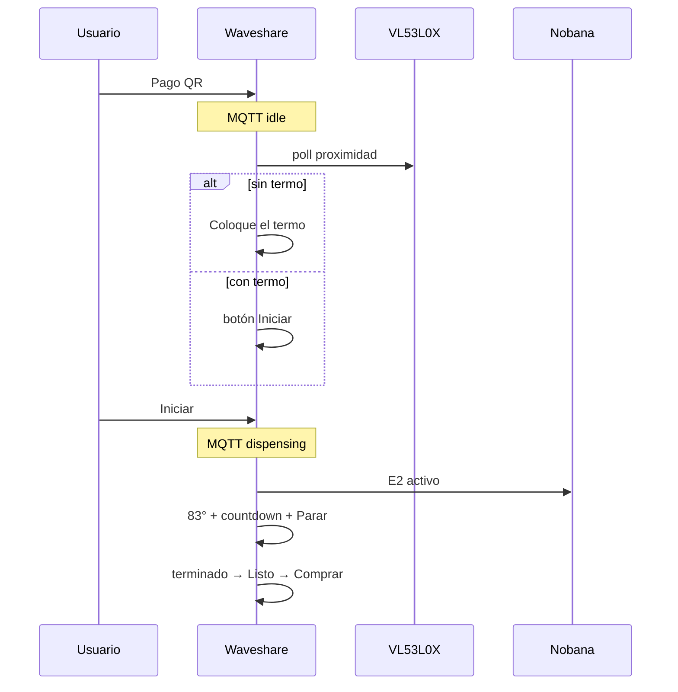

# Captura banco — Mate Point producto v0-3-4 + Nobana + VL53L0X (Test1)

## Metadatos

| Campo | Valor |
|-------|--------|
| **Fecha** | 2026-06-17 |
| **Firmware** | [`mate_point_v0-3-4.ino`](../../../mate_point_firmware/mate_point_v0-3-4/mate_point_v0-3-4.ino) |
| **Placa** | Waveshare ESP32-S3-Touch-LCD-7B |
| **Nobana** | PCB con agua, ARMOR desconectado |
| **Sensor** | VL53L0X @ I2C **0x29** (PH2.0, GPIO8/9) |
| **Level shifter** | TXS0108E 3.3 V ↔ 5 V |
| **DIP** | **UART2** (PH2.0 → GPIO43/44 @ 9600) |
| **Cableado** | Nobana Tx → GPIO44 · Nobana Rx ← GPIO43 · GND común |
| **Sniffer** | No usado en esta sesión |
| **Pago** | Mercado Pago sandbox (QR real) |
| **Servidor** | `DISPENSE_DURATION_MS=30000` |
| **Calibración sensor** | `TERMO_OFFSET_MM=85` · `TERMO_PRESENT_MAX_MM=15` (dist. corregida) |
| **Resultado** | **E2E OK** — gate termo + Iniciar + dispensado v0-3-3 |

## Objetivo

Validar [`mate_point_v0-3-4`](../../../mate_point_firmware/mate_point_v0-3-4/): VL53L0X + pantallas post-pago (**Coloque el termo** / **Iniciar**), MQTT `dispensing` solo al pulsar **Iniciar**, auto-Parar por retiro de termo, timeout post-pago 2 min, y regresión del ciclo dispensado v0-3-3. Ver [`PLAN-MATE-POINT-v0-3-4.md`](../../../mate_point_firmware/PLAN-MATE-POINT-v0-3-4.md).

## Calibración VL53L0X

Mediciones en banco mostraron offset lineal **~+85 mm** (lectura cruda ≈ real + 85). Solución aplicada:

```
dist_corregida = max(0, raw − 85)
termo_presente = dist_corregida < 15
```

| Real (ref.) | Raw ~ | Corr. |
|-------------|-------|-------|
| 0 mm | ~84 | ~0 |
| 100 mm | ~180–200 | ~95–115 |
| 500 mm | ~600 | ~515 |

## Resultado observable (banco)

- Arranque habitual: wake pre-LVGL, **Comprar**, Wi‑Fi/MQTT en footer; VL53L0X init OK.
- **Comprar** → orden → QR → pago Mercado Pago sandbox.
- Tras pago **sin termo**: pantalla **Coloque el termo**; MQTT permanece **`idle`**; no hay flujo de agua.
- **Colocar termo**: transición automática a botón azul **Iniciar** (polling + debounce 2 lecturas).
- **Retirar termo** en pantalla Iniciar: vuelve a **Coloque el termo** automáticamente.
- **Iniciar** con termo presente: **`83°` + countdown + Parar**; flujo Nobana; MQTT **`dispensing`** desde este momento; countdown arranca al tap (no al pago).
- **Retirar termo** durante dispensado: **auto-Parar** — mismo efecto que botón rojo; corte de flujo observable; UI sigue contrato v0-3-3 hasta **0:00** → **terminado** → **Listo** → **Comprar**.
- **Parar** manual y **fin natural** timer: sin regresión respecto v0-3-3.
- **Segunda compra** tras ciclo completo: OK.
- Pantalla debug en **Coloque el termo**: muestra raw, corregida y estado (usada para calibrar offset 85 mm).

## Secuencia UI validada (flujo nominal)



| Paso | UI | Sensor / Nobana / MQTT |
|------|-----|-------------------------|
| 1 | Pago QR | MQTT **`idle`** |
| 2 | **Coloque el termo** o **Iniciar** | Poll VL53L0X; offset 85 mm |
| 3 | Tap **Iniciar** | MQTT **`dispensing`** |
| 4 | **83°** + countdown + **Parar** | `E2` activo |
| 5 | **terminado** → **Listo** | cooldown |
| 6 | **Comprar** | standby **`S`** |

## Criterios de aceptación (PLAN v0-3-4 §11)

| ID | Criterio | Test1 |
|----|----------|-------|
| V1 | Pago sin termo → “Coloque el termo”; MQTT `idle` | [x] |
| V2 | Colocar termo → Iniciar automático | [x] |
| V3 | Retirar termo en Iniciar → “Coloque el termo” | [x] |
| V4 | Iniciar → flujo + countdown desde Iniciar | [x] |
| V5 | MQTT `dispensing` solo tras Iniciar | [x] |
| V6 | Retirar termo dispensando → auto-Parar | [x] |
| V7 | Parar manual — sin regresión v0-3-3 | [x] |
| V8 | Countdown 0 → terminado → Listo → Comprar | [x] |
| V9 | Timeout 2 min post-pago | [ ] no ejecutado en Test1 |
| V10 | 2.ª compra tras ciclo completo | [x] |
| V11 | Touch + I2C con VL53L0X conectado | [x] |
| V12 | Fallo sensor → “sin termo” | [ ] no ejecutado en Test1 |

## Evidencia UART (sniffer)

No registrada. Validación por UI, flujo físico Nobana, lecturas VL53L0X en pantalla debug y comportamiento MQTT.

## Notas

- Offset **85 mm** fijado en `config.h` tras mediciones en banco (raw ≈ real + 85 en corto alcance).
- Umbral producto: **15 mm** sobre distancia **corregida** (`TERMO_PRESENT_MAX_MM`).
- Hereda v0-3-3: pre-stop Parar **200 ms**, terminado al countdown **0:00**, T_viva viva post-Parar.

## Conclusión

**Test1 v0-3-4 (2026-06-17) cierra E2E en banco:** gate termo VL53L0X, botón **Iniciar**, MQTT diferido, auto-Parar por retiro de termo, calibración offset 85 mm, y ciclo dispensado sin regresión v0-3-3. Pendiente opcional: V9 timeout post-pago, V12 fallo sensor, sniffer UART.
