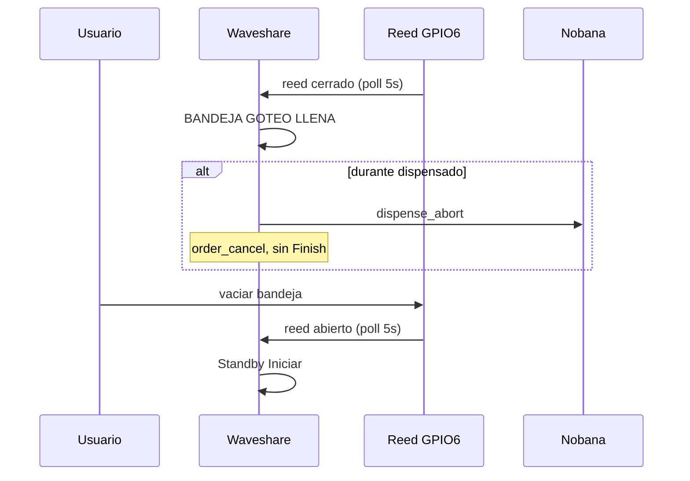

# Captura banco — Mate Point producto v0-5 + sensor bandeja GPIO6 (Test1)

## Metadatos

| Campo | Valor |
|-------|--------|
| **Fecha** | 2026-06-24 |
| **Firmware** | [`mate_point_v0-5.ino`](../../../mate_point_firmware/mate_point_v0-5/mate_point_v0-5.ino) |
| **Placa** | Waveshare ESP32-S3-Touch-LCD-7B |
| **Nobana** | PCB con agua, ARMOR desconectado |
| **Sensor termo** | VL53L0X @ I2C **0x29** (PH2.0, GPIO8/9) |
| **Sensor bandeja** | Reed **NO** en flotante @ **GPIO6** (PH2.0 GPIO) |
| **Cableado bandeja** | 3V3 → **10 kΩ** → GPIO6 ← reed → GND — ver [`sensor-bandeja-reed-gpio6.png`](../../../docs/hardware/sensor-bandeja-reed-gpio6.png) |
| **Level shifter** | TXS0108E 3.3 V ↔ 5 V |
| **DIP** | **UART2** (PH2.0 → GPIO43/44 @ 9600) |
| **Sniffer** | No usado en esta sesión |
| **Pago** | Mercado Pago sandbox (QR real) |
| **Poll bandeja** | `DRIP_TRAY_POLL_MS = 5000` |
| **Resultado** | **E2E OK** — sensor bandeja + flujo v0-4 sin regresión |

## Objetivo

Validar [`mate_point_v0-5`](../../../mate_point_firmware/mate_point_v0-5/): monitoreo continuo de bandeja de goteo (reed NO @ GPIO6), pantalla bloqueante **`BANDEJA GOTEO LLENA`**, auto-Parar + `order_cancel` si llena durante dispensado, recuperación automática a Standby al vaciar, y regresión del flujo UI v0-4 con bandeja segura. Ver [`PLAN-MATE-POINT-v0-5.md`](../../../mate_point_firmware/PLAN-MATE-POINT-v0-5.md).

## Modelo eléctrico validado

| Condición | Reed | GPIO6 | Firmware |
|-----------|------|-------|----------|
| Bandeja segura (flotante abajo) | Abierto | **HIGH** | `tray_full = false` |
| Bandeja llena (flotante arriba) | Cerrado | **LOW** | `tray_full = true` |

## Resultado observable (banco)

### Flujo nominal (bandeja vacía) — regresión v0-4

- Arranque: Standby **Iniciar**, UI Figma, Wi‑Fi/MQTT operativos.
- Flujo completo: **Iniciar** → QR → pago → **Coloca el termo** → **Cargar termo** → **Iniciar** → dispensado (**litros** + **Parar**) → **Listo el mate** → Standby.
- Sin regresión respecto a v0-4 con bandeja en estado seguro.

### Sensor bandeja — casos de error

- **Standby con bandeja llena:** pantalla **`BANDEJA GOTEO LLENA`** bloqueante; botón **Iniciar** sin efecto.
- **Post-pago** (Coloca termo / espera Iniciar) **con bandeja llena:** error bloqueante; orden cancelada; no inicia Nobana.
- **Durante dispensado** con bandeja que se llena: **auto-Parar** (corte de agua); **sin** pantalla Finish; error bandeja; orden cancelada.
- **Recuperación:** al vaciar bandeja (reed abierto), vuelta automática a **Standby** en el próximo ciclo de poll (≤ 5 s).

### Coexistencia sensores

- VL53L0X (termo), touch GT911 e I2C sin interferencia observable con GPIO6 activo.

## Secuencia validada — bandeja llena

| Paso | UI | Sensor / Nobana |
|------|-----|-----------------|
| 1 | Standby o flujo activo | Poll GPIO6 cada 5 s |
| 2 | **BANDEJA GOTEO LLENA** | Reed cerrado → LOW |
| 3 | (si dispensando) corte agua | `nobana_dispense_abort` |
| 4 | Error bloqueante | `order_cancel` |
| 5 | **Standby** tras vaciar | Reed abierto → HIGH |

## Criterios de aceptación (PLAN v0-5 §12)

| ID | Criterio | Test1 |
|----|----------|-------|
| V1 | Bandeja vacía → flujo E2E v0-4 sin regresión | [x] |
| V2 | Bandeja llena en Standby → error; Iniciar inefectivo | [x] |
| V3 | Bandeja llena post-pago → error + orden cancelada | [x] |
| V4 | Bandeja llena dispensando → auto-Parar + cancel + error (sin Finish) | [x] |
| V5 | Vaciar bandeja → Standby ≤ 5 s | [x] |
| V6 | Sin falsos positivos en observación operativa | [x] |
| V7 | VL53L0X + GPIO6 + touch simultáneos | [x] |
| V8 | 2.ª compra tras recuperación de error bandeja | [x] |

## Evidencia

Validación por observación en banco: UI Figma, comportamiento del flotante/reed, corte de dispensado Nobana y recuperación a Standby. Sin captura UART (sensor digital independiente del bus Nobana).

## Conclusión

**Test1 v0-5 (2026-06-24) cierra E2E en banco:** sensor de bandeja reed NO @ GPIO6 operativo según plan; error bloqueante, auto-Parar + cancelación de orden en dispensado, recuperación automática, y flujo v0-4 sin regresión con bandeja segura.
